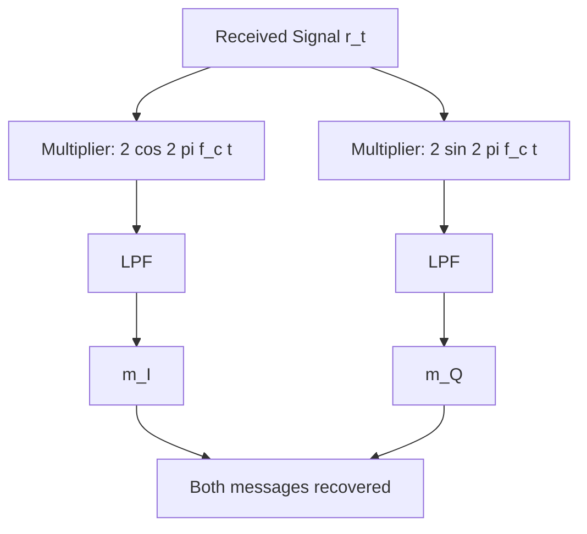

# Topic 3: The Mathematics of Orthogonality – Why QAM Works

## Introduction: Transmitting Two Signals Simultaneously

**The Challenge:** Can we send two independent messages on the same frequency without interference?

**The Answer:** Yes—using **Quadrature Amplitude Modulation (QAM)**. The key is mathematical **orthogonality** between sine and cosine functions.

This section proves from first principles why $\sin$ and $\cos$ are orthogonal, then builds QAM from this foundation.

---

## Part A: The Orthogonality Concept from Physics

### What Does "Orthogonal" Mean?

In linear algebra, two vectors are **orthogonal** if their **dot product (inner product) is zero**.

For functions, the continuous inner product is defined as:

$$\langle f(t), g(t) \rangle = \int_T f(t) \cdot g(t) \, dt$$

where the integral is over a period $T$.

**Two functions are orthogonal if:**
$$\langle f(t), g(t) \rangle = 0$$

### Physical Intuition

Imagine two perpendicular arrows in 2D:
- Arrow A points North: (0, 1)
- Arrow B points East: (1, 0)

Their dot product: $(0)(1) + (1)(0) = 0$ ✓ (orthogonal)

If they shared any component, the dot product would be non-zero, indicating overlap or interference.

---

## Part B: Proving Sine-Cosine Orthogonality

### The Mathematical Proof

Consider $\sin(2\pi f t)$ and $\cos(2\pi f t)$ over one period $T = \frac{1}{f}$.

The inner product is:

$$\langle \sin(2\pi f t), \cos(2\pi f t) \rangle = \int_0^T \sin(2\pi f t) \cos(2\pi f t) \, dt$$

### Method 1: Product-to-Sum Identity

Using the trigonometric identity:
$$\sin(x) \cos(x) = \frac{1}{2}\sin(2x)$$

$$\int_0^T \sin(2\pi f t) \cos(2\pi f t) \, dt = \frac{1}{2} \int_0^T \sin(4\pi f t) \, dt$$

Integrating:
$$= \frac{1}{2} \left[ -\frac{\cos(4\pi f t)}{4\pi f} \right]_0^T$$

At $t = T = \frac{1}{f}$:
$$\cos(4\pi f \cdot \frac{1}{f}) = \cos(4\pi) = 1$$

At $t = 0$:
$$\cos(0) = 1$$

$$= \frac{1}{2} \left[ -\frac{1}{4\pi f} - \left(-\frac{1}{4\pi f}\right) \right] = \frac{1}{2} \cdot 0 = \boxed{0}$$

**Result:** The inner product is exactly zero. ✓

### Method 2: Complex Exponential Proof (Elegant)

Using Euler's formula:
$$\cos(\omega t) = \frac{e^{j\omega t} + e^{-j\omega t}}{2}, \quad \sin(\omega t) = \frac{e^{j\omega t} - e^{-j\omega t}}{2j}$$

The orthogonality follows from the orthogonality of exponential basis functions, which is a **fundamental property** in signal analysis.

---

## Part C: Why Orthogonality Prevents Interference

### The Interference Problem

If two signals occupy the **same frequency band** and are not orthogonal, they interfere:

$$r(t) = s_1(t) + s_2(t)$$

The received power is:
$$P_r = \int_T |r(t)|^2 \, dt = \int_T [s_1(t) + s_2(t)]^2 \, dt$$

Expanding:
$$= \int_T s_1^2(t) \, dt + \int_T s_2^2(t) \, dt + 2\int_T s_1(t) s_2(t) \, dt$$

$$= P_1 + P_2 + 2 \langle s_1, s_2 \rangle$$

**Key observation:** If $\langle s_1, s_2 \rangle \neq 0$, there's a **cross-term** that couples the two signals.

### With Orthogonality

If $s_1 \perp s_2$ (orthogonal):
$$\langle s_1, s_2 \rangle = 0$$

$$P_r = P_1 + P_2$$

**The signals add independently!** No interference term. Each signal can be recovered separately.

---

## Part D: QAM Architecture – Two Signals on One Frequency
Read this [[ QAM - gpt]]
### Basic QAM Signal

We transmit two independent messages, $m_I(t)$ (In-phase) and $m_Q(t)$ (Quadrature), using sine and cosine:

$$s_{\text{QAM}}(t) = m_I(t) \cos(2\pi f_c t) + m_Q(t) \sin(2\pi f_c t)$$

**Key:** Each message modulates an orthogonal basis function:
- $m_I(t)$ modulates $\cos(2\pi f_c t)$
- $m_Q(t)$ modulates $\sin(2\pi f_c t)$

### Frequency Domain Interpretation

The spectrum contains:
1. **In-phase (I) component:** $M_I(f)$ shifted to $\pm f_c$ via $\cos$
2. **Quadrature (Q) component:** $M_Q(f)$ shifted to $\pm f_c$ via $\sin$

**Both occupy the same frequency range** but don't interfere due to orthogonality!

See the [[QAM constellation diagram](graphs/03_qam_constellation.png)] for visual representation:
![[03_qam_constellations.png]]

*Figure — QAM Constellations (accessibility description):* A 2×2 panel showing QAM constellations. Top-left: BPSK (2‑QAM) — two points on the I axis at ±1 (Q≈0). Top-right: QPSK (4‑QAM) — four points located in each quadrant (±1, ±1) with 2‑bit labels. Bottom-left: 16‑QAM — a 4×4 grid of red points at amplitude levels ±1 and ±3. Bottom-right: 64‑QAM — an 8×8 green lattice of points at amplitude levels ±1, ±3, ±5, ±7. Each subplot has I (in‑phase) on the x‑axis and Q (quadrature) on the y‑axis, centered at the origin.

<!-- alt: QAM Constellations — BPSK (two points on I axis), QPSK (four quadrant points labeled), 16‑QAM (4×4 grid), 64‑QAM (8×8 grid); axes labeled I and Q. -->
Both I and Q occupy the same frequency band $[f_c - B, f_c + B]$ simultaneously without interference, enabled by orthogonal carriers.

---

## Part E: Mathematical Proof of Separation (Recovery)

### Receiver Architecture

At the receiver, we have the composite signal:

$$r(t) = m_I(t) \cos(2\pi f_c t) + m_Q(t) \sin(2\pi f_c t) + n(t)$$

where $n(t)$ is noise.

### Recovering the I-Component

Multiply the received signal by $2\cos(2\pi f_c t)$:

$$r(t) \cdot 2\cos(2\pi f_c t) = 2m_I(t) \cos^2(2\pi f_c t) + 2m_Q(t) \sin(2\pi f_c t) \cos(2\pi f_c t) + \cdots$$

Using the identities:
$$\cos^2(x) = \frac{1}{2}[1 + \cos(2x)]$$
$$\sin(x) \cos(x) = \frac{1}{2}\sin(2x)$$

$$= m_I(t)[1 + \cos(4\pi f_c t)] + m_Q(t) \sin(4\pi f_c t) + \cdots$$

**After low-pass filtering** (removing terms at $2f_c$):

$$m_I(t)$$

**We recovered $m_I(t)$ perfectly!** The $m_Q(t)$ term vanished due to the orthogonality integral (its contribution averaged to zero).

### Recovering the Q-Component

Similarly, multiply by $2\sin(2\pi f_c t)$:

$$r(t) \cdot 2\sin(2\pi f_c t) = 2m_I(t) \cos(2\pi f_c t) \sin(2\pi f_c t) + 2m_Q(t) \sin^2(2\pi f_c t) + \cdots$$

Using $\sin^2(x) = \frac{1}{2}[1 - \cos(2x)]$ and $\cos(x) \sin(x) = \frac{1}{2}\sin(2x)$:

$$= m_I(t) \sin(4\pi f_c t) + m_Q(t)[1 - \cos(4\pi f_c t)] + \cdots$$

**After low-pass filtering:**

$$m_Q(t)$$

**We recovered $m_Q(t)$ perfectly!**

---

## Part F: QAM Demodulation Block Diagram

**Key principle:** Orthogonal multipliers ($\cos$ and $\sin$) ensure zero cross-talk.

---

## Part G: Energy Consideration (Why Orthogonality Minimizes Interference)

### Energy Conservation in QAM

The total transmitted energy over one symbol period $T_s$ is:

$$E_{\text{total}} = \int_0^{T_s} |s_{\text{QAM}}(t)|^2 \, dt$$

Expanding:
$$= \int_0^{T_s} [m_I(t) \cos(2\pi f_c t) + m_Q(t) \sin(2\pi f_c t)]^2 \, dt$$

$$= \int_0^{T_s} m_I^2(t) \cos^2(2\pi f_c t) \, dt + \int_0^{T_s} m_Q^2(t) \sin^2(2\pi f_c t) \, dt + 2\int_0^{T_s} m_I(t) m_Q(t) \cos(2\pi f_c t) \sin(2\pi f_c t) \, dt$$

The cross term:
$$2\int_0^{T_s} m_I(t) m_Q(t) \cos(2\pi f_c t) \sin(2\pi f_c t) \, dt = 2 \langle m_I m_Q, \cos \sin \rangle$$

With the orthogonality of $\cos$ and $\sin$, this vanishes:

$$E_{\text{total}} = \int_0^{T_s} m_I^2(t) \cdot \frac{1}{2} \, dt + \int_0^{T_s} m_Q^2(t) \cdot \frac{1}{2} \, dt + 0$$

$$= \frac{1}{2}(E_I + E_Q)$$

**No energy is "wasted" on cross-coupling.** The total energy is simply the sum of the I and Q components.

---

## Part H: Graphical Representation – The Constellation Diagram

### What Is a Constellation?

QAM signals are typically discrete (for digital communications). Each transmission consists of:
- An I-axis amplitude: $I \in \{0, \pm 1, \pm 2, \ldots\}$ (in units of signal levels)
- A Q-axis amplitude: $Q \in \{0, \pm 1, \pm 2, \ldots\}$

**A constellation diagram** plots all possible $(I, Q)$ points.

![[graphs/03_qam_constellations.png]]

### Orthogonality in the Constellation

The I-axis is orthogonal to the Q-axis. This ensures:
- **Symbols on the I-axis** don't interfere with **symbols on the Q-axis**
- Each axis can be demodulated independently
- **Maximum distance** between symbols (for a given transmitted power) → better noise immunity

---

## Part I: Bandwidth Efficiency of QAM

### Traditional DSB-SC (One Message)

To send one message $m(t)$ with bandwidth $B$:
- Modulated bandwidth: $2B$
- Information rate: 1 symbol/unit time

### QAM (Two Independent Messages)

To send two messages $m_I(t)$ and $m_Q(t)$, each with bandwidth $B$:
- Modulated bandwidth: Still $2B$ (no expansion!)
- Information rate: 2 symbols/unit time

**Spectral efficiency:**
$$\eta = \frac{\text{Information bits}}{\text{Bandwidth} \times \text{Time}} = \frac{2 \, \text{bits/symbol}}{2B} = \frac{1}{B} \text{ bits/Hz/symbol}$$

For 16-QAM:
$$\eta = \frac{4 \, \text{bits/symbol}}{2B} = \frac{2}{B} \text{ bits/Hz}$$

**QAM doubles or quadruples the spectral efficiency compared to DSB-SC, at no additional bandwidth cost.**

---

## Part J: Why Orthogonality Works – Signal Space Perspective

### Signal Space Geometry

In signal space, the basis functions $\{\cos(2\pi f_c t), \sin(2\pi f_c t)\}$ form an **orthonormal basis** (up to normalization).

Any QAM signal can be represented as a **2D vector** in this basis:

$$s_{\text{QAM}}(t) = \begin{bmatrix} m_I(t) \\ m_Q(t) \end{bmatrix} \cdot \begin{bmatrix} \cos(2\pi f_c t) \\ \sin(2\pi f_c t) \end{bmatrix}$$

This is analogous to specifying a point in the Cartesian plane:
- I-component = x-coordinate
- Q-component = y-coordinate

**Orthogonal basis functions ensure:**
- No ambiguity in decomposition
- Unique recovery of each component
- Minimal cross-interference

![[graphs/04_orthogonality.png]]

## Part K: Common Pitfalls (Exam Critical!)

### ⚠️ Pitfall 1: Confusing Orthogonality with Isolation

**Wrong:** "Orthogonal signals have zero power."
**Correct:** "Orthogonal signals have zero **cross-product** but each can have non-zero power."

Example: $\sin(x)$ and $\cos(x)$ each carry power ($\int \sin^2(x) \, dx \neq 0$), but $\int \sin(x) \cos(x) \, dx = 0$.

### ⚠️ Pitfall 2: Forgetting the Scaling Factor

When recovering the I-component, the multiplier must be $2\cos(2\pi f_c t)$, **not** $\cos(2\pi f_c t)$.

Missing the factor of 2 causes a 50% amplitude loss (3 dB loss in power).

### ⚠️ Pitfall 3: Assuming Any Pair Is Orthogonal

**Wrong:** "Any sine and cosine are orthogonal."
**Correct:** "$\sin(2\pi f t)$ and $\cos(2\pi f t)$ are orthogonal **at the same frequency**."

If frequencies differ, they are not orthogonal. This is why QAM requires **exact frequency alignment**.

### ⚠️ Pitfall 4: Not Recognizing Orthogonality in QAM

Many students treat QAM as "just two modulations" without appreciating the **orthogonal decomposition** principle. This makes it harder to understand why QAM doesn't interfere with itself.

### ⚠️ Pitfall 5: Confusing Orthogonal Messages with Orthogonal Carriers

**Important distinction:**
- **Orthogonal carriers:** $\cos(2\pi f_c t) \perp \sin(2\pi f_c t)$ (orthogonal at same frequency)
- **Orthogonal messages:** $m_I(t) \perp m_Q(t)$ (not necessarily required for QAM, but allowed)

QAM works because the **carriers are orthogonal**, not because the messages are.

---

## Part L: Generalization – OFDM (Bonus)

### Multiple Orthogonal Carriers

QAM uses two orthogonal carriers. Modern communications (**OFDM**) uses many:

$$s(t) = \sum_{k=0}^{N-1} m_k(t) \cos(2\pi f_k t + \phi_k)$$

where $f_k$ are spaced such that different subcarriers are orthogonal.

**Key:** By spacing carriers at $\Delta f = 1/T_s$ (where $T_s$ is symbol period), hundreds of carriers can fit in the same bandwidth without interference.

This principle—**orthogonality**—extends beyond QAM to all modern wireless communications.

---

## Part M: Numerical Example – 4-QAM Demodulation

### Setup

**Transmitted signal:**
$$s(t) = \cos(2\pi \times 10^6 \cdot t) + 0.5 \sin(2\pi \times 10^6 \cdot t)$$

(I-component = 1, Q-component = 0.5)

**Received (noise-free):**
$$r(t) = s(t)$$

### Demodulation

**Recover I-component:**
$$y_I(t) = r(t) \cdot 2\cos(2\pi \times 10^6 \cdot t)$$
$$= [\cos(\omega t) + 0.5 \sin(\omega t)] \cdot 2\cos(\omega t)$$
$$= 2\cos^2(\omega t) + \sin(\omega t) \cos(\omega t)$$
$$= 1 + \cos(2\omega t) + \frac{1}{2}\sin(2\omega t)$$

**After low-pass filter** (removes $\cos(2\omega t)$ and $\sin(2\omega t)$):
$$m_I = 1 \checkmark$$

**Recover Q-component:**
$$y_Q(t) = r(t) \cdot 2\sin(2\pi \times 10^6 \cdot t)$$
$$= [\cos(\omega t) + 0.5 \sin(\omega t)] \cdot 2\sin(\omega t)$$
$$= 2\cos(\omega t) \sin(\omega t) + \sin^2(\omega t)$$
$$= \sin(2\omega t) + \frac{1}{2}[1 - \cos(2\omega t)]$$

**After low-pass filter:**
$$m_Q = 0.5 \checkmark$$

Both messages perfectly recovered due to orthogonality!

---

## Part N: Summary Table – QAM vs. DSB-SC

| Aspect | DSB-SC | QAM |
|--------|--------|-----|
| **Signals transmitted** | 1 message, $m(t)$ | 2 messages, $m_I(t)$ and $m_Q(t)$ |
| **Bandwidth** | $2B$ | $2B$ (same!) |
| **Spectral efficiency** | 1 bit/symbol | 2+ bits/symbol |
| **Orthogonality** | N/A | I ⊥ Q (via carriers) |
| **Demodulator** | 1 multiplier + LPF | 2 multipliers + 2 LPFs |
| **Cross-interference** | N/A | Zero (due to orthogonality) |
| **Complexity** | Low | Medium |
| **Real-world** | Professional radio | WiFi, LTE, 5G, modern digital |

---

## Conclusion

**Orthogonality is the principle underlying modern communications.**

The mathematical beauty of QAM:
- **Two independent signals** share the same frequency band
- **Zero interference** due to $\langle \cos, \sin \rangle = 0$
- **Double the spectral efficiency** at the cost of minimal additional complexity

From the first principle—$\int_0^T \sin(2\pi f t) \cos(2\pi f t) \, dt = 0$—we build a demodulation strategy that perfectly recovers two entangled signals.

This principle generalizes to OFDM (many orthogonal subcarriers) and underpins WiFi, LTE, and 5G.

---

## Next Steps
- Exploring **SSB (Single Sideband)** and the **Hilbert Transform**
- Understanding **bandwidth efficiency** trade-offs
- Studying **Phase Locked Loops (PLL)** for frequency sync
