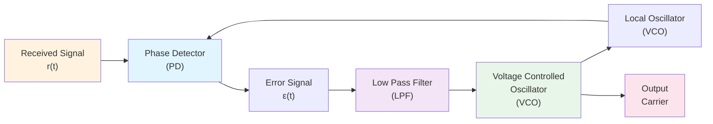
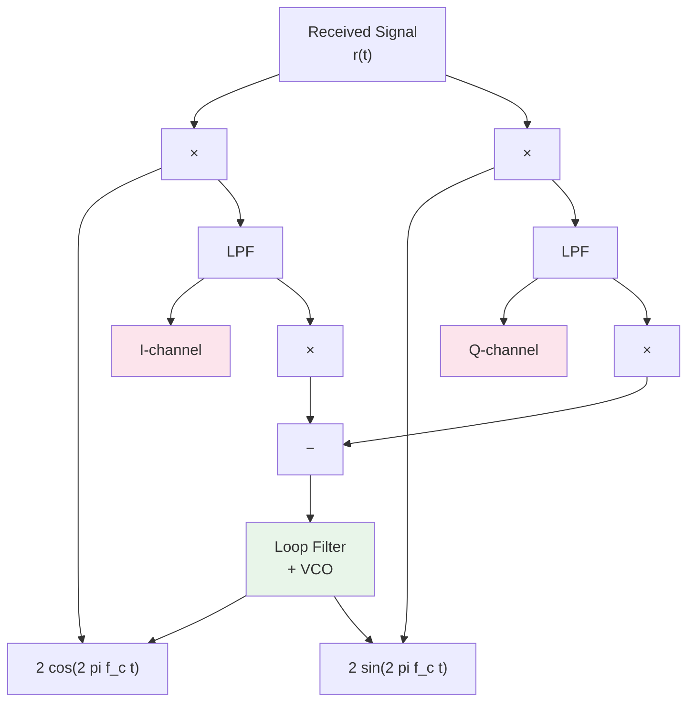

# Topic 5: The Phase Locked Loop (PLL) – Automatic Frequency and Phase Tracking

## Introduction: The Synchronization Problem

Coherent detection (DSB-SC, SSB, QAM) requires the receiver's **local oscillator to be phase and frequency synchronized** with the received carrier.

**The Challenge:** The received signal is corrupted and noise-contaminated. How can we automatically track and lock onto the carrier phase?

**The Answer:** The **Phase Locked Loop (PLL)**—one of the most elegant feedback systems in communications engineering.

---

## Part A: The Synchronization Requirement

### Why Coherent Detection Needs Sync

For DSB-SC recovery:

$$r(t) = m(t) \cos(2\pi f_c t + \phi_c) + n(t)$$

where $\phi_c$ is the carrier phase (unknown to receiver).

**Multiplying by local oscillator:**

$$r(t) \cdot 2\cos(2\pi f_c t + \phi_{\text{local}}) = m(t) \cos(\phi_c - \phi_{\text{local}}) + \text{other terms}$$

**After filtering, recovered signal:**

$$m_{\text{received}} \approx m(t) \cos(\Delta\phi)$$

where $\Delta\phi = \phi_c - \phi_{\text{local}}$ is the **phase error**.

### The Sync Performance

- $\Delta\phi = 0°$ (perfect sync): Full signal recovery ✓
- $\Delta\phi = 30°$: Signal reduced by $\cos(30°) = 0.866$ (~1.2 dB loss)
- $\Delta\phi = 45°$: Signal reduced by $\cos(45°) = 0.707$ (~3 dB loss)
- $\Delta\phi = 90°$: Signal loss is complete ($\cos(90°) = 0$) ✗

**Problem:** Even small phase errors cause significant degradation.

---

## Part B: The PLL Architecture – Three Core Components

A PLL consists of three essential blocks:

### Component 1: Phase Detector (PD)

**Function:** Compares the phase of the received signal with the VCO signal and outputs an error voltage.

**Mathematical operation:** Multiply and filter (similar to coherent demodulation).

$$\varepsilon(t) = r(t) \cdot \text{VCO}(t)$$

where VCO(t) is the feedback oscillator.

**Output:** Error voltage $\varepsilon(t) \propto \sin(\Delta\phi)$ at the instantaneous phase difference.

### Component 2: Low Pass Filter (LPF)

**Function:** Smooths the error signal and rejects high-frequency noise.

**Effect:** Converts rapid phase fluctuations into a slowly-varying **control voltage** $v_c(t)$.

**Transfer function:** Typically first-order or second-order:

$$V_c(f) = H_{\text{LPF}}(f) \cdot \varepsilon(f)$$

### Component 3: Voltage Controlled Oscillator (VCO)

**Function:** Generates an oscillator whose frequency depends on the input control voltage.

**Relationship:**
$$f_{\text{VCO}} = f_0 + K_v \cdot v_c(t)$$

where:
- $f_0$ = free-running center frequency
- $K_v$ = VCO sensitivity (Hz/Volt)
- $v_c(t)$ = control voltage from LPF

![[graphs/06_pll_dynamics.png]]

---

## Part C: Mathematical Analysis – The Phase Error Dynamics

### Phase Error Definition

Let:
- $\phi_r(t) = 2\pi f_c t + \phi_c$ = received carrier phase
- $\phi_{\text{VCO}}(t) = 2\pi f_0 t + \theta(t)$ = VCO phase

The **instantaneous phase error:**
$$\Delta\phi(t) = \phi_r(t) - \phi_{\text{VCO}}(t) = 2\pi(f_c - f_0) t + \phi_c - \theta(t)$$

### Phase Detector Output

Multiplying received signal by VCO output:

$$\varepsilon(t) = K_d \sin(\Delta\phi(t))$$

where $K_d$ is the phase detector gain.

For small phase error (linear approximation):
$$\sin(\Delta\phi) \approx \Delta\phi$$

$$\varepsilon(t) \approx K_d \Delta\phi(t)$$

### VCO Dynamics

The VCO frequency equals the derivative of its phase:

$$\frac{d\theta(t)}{dt} = 2\pi K_v \cdot v_c(t)$$

where $v_c(t)$ is the LPF output:

$$v_c(t) = H_{\text{LPF}}[K_d \Delta\phi(t)]$$

---

## Part D: PLL State Space Model (Advanced)

### Simplified Second-Order PLL

Assume LPF is a simple integrator (or has integral component):

$$\frac{d\theta(t)}{dt} = 2\pi K_v \cdot K_d \Delta\phi(t)$$

Defining the phase error $e(t) = \Delta\phi(t)$:

$$\frac{de(t)}{dt} = 2\pi(f_c - f_0) + \frac{d}{dt}[\phi_c - \theta(t)]$$

$$= 2\pi \Delta f + \frac{de(t)}{dt} - 2\pi K_v K_d e(t)$$

Rearranging:
$$\frac{d^2 e(t)}{dt^2} + 2\pi K_v K_d \frac{de(t)}{dt} = 0$$

This is a **second-order differential equation** describing the PLL dynamics.

---

## Part E: Lock and Pull-In Behavior

### Lock Range

The PLL can only "see" phase errors within a limited range. If $|\Delta\phi| > \pi$, the phase detector output flips sign, and the loop becomes unstable.

**Lock range:** $|\Delta\phi| < \pi$ (or ±180°)

### Pull-In (Acquisition Phase)

When the PLL is first turned on with $f_c \neq f_0$ (frequency misalignment):

1. **Initial state:** Phase error is large; $\sin(\Delta\phi)$ oscillates rapidly.
2. **Error signal:** LPF removes high-frequency oscillations, producing average control voltage.
3. **VCO response:** Frequency gradually shifts toward $f_c$.
4. **Phase convergence:** Once close enough, the loop enters **tracking mode**.

**Time to lock:** Depends on loop bandwidth and initial frequency error.

### Tracking Phase (Steady State)

Once locked, the PLL maintains $\phi_c \approx \phi_{\text{local}}$ automatically.

**Residual phase error:** Due to noise and frequency drift, typically < ±10° for well-designed loops.

---

## Part F: Frequency and Phase Error Trade-offs

### Frequency Offset Tracking

If the received carrier has **frequency drift** $\Delta f = f_c - f_0 \neq 0$:

The PLL must generate a **control voltage** to continuously adjust VCO frequency:

$$v_c(t) = \frac{\Delta f}{K_v}$$

**For constant frequency offset:** The phase error eventually becomes **constant** (not zero), not linearly increasing.

### Phase Tracking with Noise

In the presence of AWGN, the phase error becomes noisy:

$$e(t) = e_0 + n_e(t)$$

where $n_e(t)$ is filtered noise.

**SNR consideration:** The LPF bandwidth determines the noise floor:
- **Narrow LPF:** Removes more noise but slower tracking (larger lock time).
- **Wide LPF:** Faster tracking but more residual phase noise.

**Design trade-off:** Bandwidth vs. noise immunity.

---

## Part G: PLL Types and Topologies

### Type 1 PLL (Proportional)

**LPF:** Simple gain $K_p$ (proportional controller).

$$v_c(t) = K_p \cdot \varepsilon(t)$$

**Characteristics:**
- **Steady-state error:** Non-zero for constant frequency offset
- **Fast response:** Quick transients
- **Stability:** Can oscillate (second-order system)

### Type 2 PLL (Proportional-Integral)

**LPF:** Proportional + Integral (PI controller).

$$v_c(t) = K_p \varepsilon(t) + K_i \int \varepsilon(\tau) d\tau$$

**Characteristics:**
- **Steady-state error:** Zero (integral term eliminates constant offset)
- **Response:** Slower but eliminates bias
- **Stability:** Better with proper tuning

### Type 3 and Beyond

Higher-order controllers enable better disturbance rejection and noise immunity at the cost of added complexity.

---

## Part H: The Phase Detector – Detailed Analysis

### Multiplier-Based Phase Detector

$$\varepsilon(t) = [A_r \cos(2\pi f_c t + \phi_c) + n(t)] \cdot [A_v \cos(2\pi f_0 t + \theta(t))]$$

Product:
$$= \frac{A_r A_v}{2} \cos[2\pi(f_c - f_0)t + \phi_c - \theta(t)] + \frac{A_r A_v}{2} \cos[2\pi(f_c + f_0)t + \phi_c + \theta(t)] + \text{noise}$$

**After LPF (removing $2f_c$ term):**

$$\varepsilon(t) = \frac{A_r A_v}{2} \cos(\Delta\phi(t))$$

With small $\Delta\phi$:
$$\varepsilon(t) \approx \frac{A_r A_v}{2} [1 - \frac{(\Delta\phi)^2}{2}]$$

For modulation tracking (small error), the linearized model:
$$\varepsilon(t) \approx K_d \sin(\Delta\phi) \approx K_d \Delta\phi$$

---

## Part I: VCO Characteristics

### Frequency-Voltage Relationship

**Ideal VCO:**
$$f_{\text{VCO}}(v) = f_0 + K_v \cdot v$$

**Non-ideal VCO:**
$$f_{\text{VCO}}(v) = f_0 + K_v \cdot v + K_v^{(2)} \cdot v^2 + \cdots$$

(Second-order and higher-order terms cause non-linearity.)

### VCO Tuning Range

Practical VCOs have limited tuning range:
$$f_{\text{VCO}} \in [f_{\min}, f_{\max}]$$

Example: Voltage tuning from 0V to +5V
- $f_0$ at 2.5V (mid-range) = 100 MHz
- $K_v = 10$ MHz/V
- **Range:** 75 MHz to 125 MHz

---

## Part J: PLL Lock Detection and Acquisition

### Acquisition Process Step-by-Step

The PLL exhibits characteristic behavior during lock acquisition. See the comprehensive PLL dynamics visualization below:

![[graphs/07_pll_dynamics.png]]

**Key phases:**
- Initial large phase oscillations as the loop attempts frequency alignment
- Gradual dampening as error signal converges
- Settling into locked state with residual small phase ripple

### Lock Detector Circuit

To confirm the PLL is locked:

1. **Phase error amplitude:** Check if $|\Delta\phi| < \Delta\phi_{\text{threshold}}$
2. **Error variance:** Check if $\sigma_e^2 < \sigma_{\text{threshold}}^2$
3. **Frequency offset:** Check if $|\Delta f| < \Delta f_{\text{threshold}}$

**Output:** Binary flag (Locked = 1, Unlocked = 0)

---

## Part K: Practical Example – AM Radio PLL

### Setup

**Received AM signal:**
$$r(t) = [A + m(t)] \cos(2\pi f_c t + \phi_c)$$

**Receiver:**
- Target frequency: $f_c = 1$ MHz (AM band)
- VCO center frequency: $f_0 = 1.055$ MHz (intermediate frequency)
- VCO sensitivity: $K_v = 100$ kHz/V

### Initial State (Tuning)

User tunes to 1 MHz:

**Frequency error:**
$$\Delta f = 1,000,000 - 1,055,000 = -55,000 \text{ Hz}$$

**Phase error rate:**
$$\frac{d(\Delta\phi)}{dt} = 2\pi \Delta f = -345,575 \text{ rad/s}$$

Phase error increases rapidly (wrapping around $\pm\pi$ periodically).

### PLL Correction

Phase detector senses the mismatch and outputs oscillating error signal.

LPF averages this, producing control voltage:

$$v_c \approx \frac{\Delta f}{K_v} = \frac{-55,000}{100,000} = -0.55 \text{ V}$$

**VCO response:**
$$f_{\text{VCO}} = 1,055,000 + 100,000 \times (-0.55) = 1,000,000 \text{ Hz}$$

**After ~100 ms:** PLL is locked to received carrier. ✓

---

## Part L: Advanced Topic – Costas Loop (QAM PLL)

### Receiver Architecture

At the receiver, we have the composite signal:

$$r(t) = m_I(t) \cos(2\pi f_c t) + m_Q(t) \sin(2\pi f_c t) + n(t)$$

A simple PLL using a multiplier phase detector fails because both $\cos$ and $\sin$ components contribute, creating ambiguity.

### Costas Loop Solution

**Architecture:**

**Key:** Use the **cross-multiplied I and Q outputs** to generate the phase error:

$$\varepsilon(t) = I(t) \cdot Q'(t) - Q(t) \cdot I'(t)$$

where $I'$ and $Q'$ are filtered versions of $I$ and $Q$.

This generates the same phase detector characteristic $\sin(\Delta\phi)$ but works for QAM signals.

---

## Part M: Common Pitfalls (Exam Critical!)

### ⚠️ Pitfall 1: Confusing PLL Lock with Perfect Synchronization

**Wrong:** "When locked, phase error is exactly zero."
**Correct:** When locked, phase error is **small and bounded** (typically ±10° or less depending on noise).

Noise always causes residual phase jitter.

### ⚠️ Pitfall 2: Assuming PLL Bandwidth Should Be Wide

**Wrong:** "Wider loop bandwidth is always better."
**Correct:** Trade-off exists:
- **Wide bandwidth:** Fast acquisition, more noise
- **Narrow bandwidth:** Slow acquisition, low phase noise

### ⚠️ Pitfall 3: Forgetting the VCO Needs Tuning

**Common mistake:** "PLL automatically locks to any frequency."
**Reality:** VCO must be **pre-tuned** to within the lock range (±$\pi$/$T$ for observation time $T$).

If VCO is off by 10 MHz and lock range is only 1 MHz, the PLL cannot acquire lock.

### ⚠️ Pitfall 4: Misunderstanding the Phase Detector Output

**Wrong:** Phase detector output is the recovered message $m(t)$.
**Correct:** Phase detector output is an **error signal** $\propto \sin(\Delta\phi)$, filtered and used to adjust VCO, not the message.

To recover the message, a separate coherent demodulator is needed using the locked VCO.

### ⚠️ Pitfall 5: Ignoring the $2\pi$ Factor

When calculating VCO frequency adjustment:

$$f_{\text{VCO}} = f_0 + K_v \cdot v_c$$

Remember:
- $f$ is in Hz (cycles/second)
- $K_v$ is in Hz/Volt
- Phase derivatives use $2\pi$ factors

Forgetting the $2\pi$ often leads to incorrect calculations (off by factor of $2\pi$).

---

## Part N: PLL Performance Metrics

### Lock Time

**Definition:** Time for phase error to decay within a lock threshold.

**Typical values:** 1–100 ms depending on loop bandwidth.

### Phase Error (Steady State)

After lock, residual phase error due to noise:
$$\sigma_e \approx \sqrt{\frac{N_0}{2P_s}} \quad (\text{for small errors})$$

where:
- $N_0$ = noise power spectral density
- $P_s$ = signal power
- Bandwidth factor included in loop filter design

### Frequency Tracking Capability

Maximum **frequency rate of change** the PLL can track:

$$\left|\frac{df}{dt}\right|_{\max} = K_v K_d \cdot \frac{B^2}{\pi}$$

where $B$ is the loop bandwidth.

---

## Part O: Numerical Example – Frequency Synthesizer

### Application: Tuning to Different Stations

**Specification:**
- **Band:** FM radio (88–108 MHz)
- **Channel spacing:** 200 kHz
- **VCO center:** 98 MHz, $K_v = 500$ kHz/V
- **Loop bandwidth:** 10 kHz

### Tuning to 105.6 MHz

**Error:**
$$\Delta f = 105,600,000 - 98,000,000 = 7,600,000 \text{ Hz}$$

**Control voltage needed:**
$$v_c = \frac{\Delta f}{K_v} = \frac{7,600,000}{500,000} = 15.2 \text{ V}$$

**Problem:** This requires tuning voltage way outside typical range (0–5V).

**Solution:** Use a **mixer + PLL** (intermediate frequency conversion):
- Mix input to intermediate frequency (e.g., 10.7 MHz for FM)
- Use PLL to lock to IF
- This is how real radios work!

---

## Part P: Summary Table – PLL Parameters

| Parameter | Symbol | Unit | Typical Range |
|-----------|--------|------|----------------|
| Center frequency | $f_0$ | Hz | MHz–GHz |
| VCO sensitivity | $K_v$ | Hz/V | 10 kHz/V – 10 MHz/V |
| Phase detector gain | $K_d$ | V/rad | 0.1–1.0 |
| Loop bandwidth | $B_L$ | Hz | 1 kHz – 1 MHz |
| Lock range | $\Delta f_L$ | Hz | $\pm K_v V_{\max}$ |
| Lock time | $t_L$ | s | 1 ms – 100 ms |
| Residual phase error | $\sigma_e$ | rad | 0.01–0.1 |

---

## Conclusion

**The Phase Locked Loop is a feedback masterpiece:**

1. **Phase Detector** measures the error between received and local oscillator.
2. **Low Pass Filter** removes noise and smooths the error.
3. **VCO** continuously adjusts frequency to minimize error.
4. **Feedback** loop automatically locks and tracks the carrier.

**Key advantages:**
- Automatic synchronization (no manual tuning needed)
- Robust to frequency drift
- Enables coherent detection of DSB-SC, SSB, QAM
- Fundamental building block of modern receiver design

**Key trade-offs:**
- Acquisition time vs. phase noise immunity
- Loop bandwidth must be carefully designed
- Requires initial frequency pre-tuning

The PLL bridges the gap between theoretical coherent detection and practical receiver implementation. Without PLLs, modern digital communications (WiFi, LTE, 5G) would be impossible.

---

## Next Steps
- **Digital PLLs:** Discrete-time PLLs in digital receivers
- **Frequency Synthesizers:** Using PLLs for precise frequency generation
- **Doppler Tracking:** PLLs in satellite and mobile communications
- **Advanced Loop Designs:** Higher-order loops for better performance
