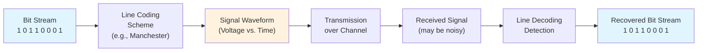

# Line Coding Basics

## Definition

**Line coding** is the process of converting a stream of binary data (bits) into a sequence of **voltage pulses** suitable for transmission over a **physical channel** (wire, fiber, air).

Formally:
$$\text{Bit stream} \xrightarrow{\text{Line Coding}} \text{Voltage signal}$$

**Example Input:** `1 0 1 1 0 0 0 1`  
**Example Output:** A voltage waveform (the shape depends on which line coding scheme you use)

## Why Line Coding Matters

Transmitting raw bits directly (without encoding) causes problems:

### Problem 1: No Synchronization Information
![[line_coding_visualization.png]]
```
Direct transmission (unencoded):
Bit stream: 1 0 0 0 0 0 0 1


Without transitions, the receiver's clock drifts!
The receiver sees a constant 0 V and loses track of bit boundaries.
```

**Explanation:**  
The bit stream `1 0 0 0 0 0 0 1` consists of one "1", followed by seven "0"s, then another "1". In unipolar NRZ (Non-Return-to-Zero) encoding:  
- Bit "1" maps to high voltage (+V).  
- Bit "0" maps to 0V.  

The resulting waveform has a voltage pulse at the start (for the first "1"), stays flat at 0V for seven bit periods (the seven "0"s), and has another pulse at the end (for the last "1").  

The issue: During the seven consecutive "0"s, there's no change in voltage (no "transitions"). The receiver uses these transitions to synchronize its clock and know where each bit starts/ends. Without them, the clock "drifts" and loses track of timing, making it impossible to correctly decode the bits.

### Problem 2: DC Component Issues

Long sequences of the same bit produce nearly constant voltage:
- **AC-coupled channels** (capacitors block DC) will distort this
- The receiver **loses baseline reference**
- Long "idle" periods look identical to "data" periods

**Explanation:**  
A "DC component" refers to the average (mean) voltage level of a signal over time. In unipolar NRZ encoding:  
- Many "1"s create a positive average voltage (DC bias toward +V).  
- Many "0"s create a zero average voltage.  

**AC-coupled channels** use capacitors at the input to block steady (DC) voltages and pass only changing (AC) signals. This prevents DC interference but causes problems with constant signals:  
- During long runs of the same bit (e.g., seven "0"s in the example), the voltage is constant at 0V.  
- The capacitor charges/discharges based on the signal, but with no changes, it can't maintain the correct level.  
- Result: The signal gets distorted – amplitudes decrease, and the waveform shifts.  

**Baseline wandering** occurs because the receiver's voltage reference (baseline) drifts without transitions to reset it. The receiver compares incoming voltage to a threshold (e.g., midway between 0V and +V), but a constant signal makes this threshold unreliable.  

**Idle vs. data confusion:** A long "idle" period (no data, constant voltage) looks identical to a long run of "0"s. The receiver can't tell if silence means "no transmission" or "a stream of zeros," leading to decoding errors.  

Good line coding ensures the signal has zero average voltage (balanced) and frequent transitions to avoid these issues.

**Big Picture:**  
Imagine sending data like a light signal: "on" for 1, "off" for 0. But the channel has a filter that blocks steady lights and lets only flickering ones through.  

- **Who uses AC-coupled channels?** Hardware engineers designing communication systems, such as:  
  - Ethernet networks (cables in computers).  
  - Telephone lines (old-school phone systems).  
  - Wireless radios or audio equipment.  
  - Any system where steady voltages could cause interference or damage.  

- **At what point in the pipeline?** Primarily during **Step 4: Transmission over Channel**. The channel's hardware (e.g., capacitors in the receiver circuit) filters the signal as it travels. This distortion shows up in **Step 5: Received Signal**, making decoding in **Step 6** harder.  

- **Why do they use it?** To remove unwanted steady voltages (DC) that can:  
  - Cause wires to heat up or corrode.  
  - Interfere with other signals (e.g., power line hum).  
  - Make amplifiers unstable (drift over time).  
  - In short: DC is "noise" in AC-focused systems, so blocking it keeps things clean.  

- **How does it work?** Channels use **capacitors** (electronic components that store charge like tiny batteries).  
  - **For steady signals (DC):** Capacitor blocks them – no flow, signal dies out.  
  - **For changing signals (AC):** Capacitor charges/discharges, letting the signal pass.  
  - **Example:** Long run of 0s = steady 0V. Capacitor sees no change, so it "ignores" the signal, weakening it.  

- **What happens next? (The full problem chain):**  
  1. Signal gets distorted (weaker, shifted levels).  
  2. Receiver's "baseline" (reference voltage) drifts – like eyes adjusting to darkness, making thresholds wrong.  
  3. Can't tell idle (silence) from data (zeros) – e.g., "Is this no call or a long pause in speech?"  
  4. Decoding fails: Wrong bits recovered, errors in data.  
  5. In extreme cases, the receiver loses sync entirely.  

- **Real-world impact:** In Ethernet, this could cause packet loss. In phones, garbled calls.  

- **How line coding fixes it:** Schemes like Manchester or AMI ensure:  
  - Zero average voltage (balanced +V and -V).  
  - Frequent transitions (changes every bit).  
  - Result: Signal looks "AC" to the channel, passes through undistorted, and receiver stays synced.  

Without this, data transmission over real channels would be unreliable – that's why line coding is essential!

### Problem 3: Bandwidth Inefficiency

The voltage transitions in raw binary contain very low frequencies (when bits don't change often). Some channels can't transmit these low frequencies efficiently.

## What Line Coding Solves

Good line coding schemes ensure:

1. **Frequent transitions** — so the receiver can stay synchronized
2. **Balanced signal** — equal amounts of positive and negative voltage (no DC component)
3. **Spectral efficiency** — efficient use of available bandwidth
4. **Error detection capability** — optional, but some schemes help identify errors
5. **Adequate signal power** — the signal transitions in a way that's detectable at the receiver

## The General Encoding Process



## Line Coding as a Signal Design Problem

At its core, line coding is about **signal design**:

Given:
- A bit stream to transmit
- Constraints (channel bandwidth, AC vs. DC coupling, noise levels)

Find:
- A mapping from bits to voltage levels
- Ensure transitions occur frequently enough
- Minimize bandwidth
- Maximize robustness to noise and errors

Different line coding schemes make different trade-offs among these goals.

## The Basic Mapping

Every line coding scheme defines a **mapping rule**:

$$\text{Rule: } 0 \to \text{voltage pattern 1}$$
$$1 \to \text{voltage pattern 2}$$

**Example (Unipolar NRZ):**
- Bit 0 → voltage = 0 V (for the entire bit period)
- Bit 1 → voltage = +V (for the entire bit period)

**Example (Manchester):**
- Bit 0 → +V for first half of bit period, 0 V for second half
- Bit 1 → 0 V for first half, +V for second half

The beauty of Manchester: **every bit has a transition**, so the receiver always has a timing edge to lock onto.

## Encoding vs. Decoding

- **Encoding:** Sender converts bits into physical signals using a line coding rule.
    
- **Decoding:** Receiver samples the noisy received signal and decides which bits were sent using threshold and timing recovery.

## Key Terminology (Precise)

| Term | Definition |
|------|-----------|
| **Data element** | A single bit (0 or 1) in the data stream |
| **Signal element** | The voltage waveform representing one or more data elements |
| **Bit rate** | Number of data elements per second (bps) |
| **Baud rate** | Number of signal elements per second (symbols/s) |
| **Line code** | The specific mapping rule (e.g., Manchester, AMI) |

These are discussed in detail in [[03-Data-Elements-vs-Signal-Elements|Data Elements vs. Signal Elements]].

## Line Coding ≠ Encryption

**Important distinction:** Line coding is *not* encryption. The original bit stream can be recovered perfectly from the signal (in the absence of noise). The purpose is signal design, not secrecy.

## Related Concepts

- [[01-Digital-Signal-Fundamentals|Digital Signal Fundamentals]] — The physical signals we're encoding
- [[03-Data-Elements-vs-Signal-Elements|Data Elements vs. Signal Elements]] — Precise terminology
- [[05-Data-Rate-and-Signal-Rate|Data Rate and Signal Rate]] — How bit rate relates to bandwidth
- [[06-Baseline-Wandering|Baseline Wandering]] — Why synchronization is critical
- [[08-Self-Synchronization|Self-Synchronization]] — How good codes maintain timing
