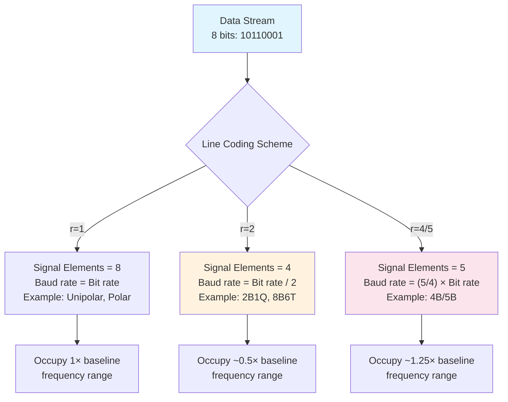

# Data Elements vs. Signal Elements

This is the most critical distinction in line coding. If you confuse these, all bandwidth calculations will be wrong.

## Definitions

### Data Element

A **data element** is a single **bit** in the original information stream.

Each data element is either **0** or **1**.

### Signal Element

A **signal element** is a voltage waveform that occupies a specific **time interval** on the transmission channel.

The shape, duration, and voltage levels of a signal element are determined by the **line coding scheme**.

## The Fundamental Relationship

```
1 data element = 1 bit

1 signal element = r bits

where r = ratio of data elements to signal elements
```

**If $r = 1$:** Each bit is represented by exactly one signal element. Bit rate = Baud rate.

**If $r > 1$:** Multiple bits are grouped and represented by one signal element. Baud rate < Bit rate. (More efficient!)

**If $r < 1$:** Each bit is spread across multiple signal elements. Baud rate > Bit rate. (Less efficient, but sometimes necessary for robustness.)

## Concrete Examples

### Example 1: Unipolar NRZ (r = 1)

![[line_coding_nrz_example.png]]
**Explanation (NRZ, r = 1):**

- The bit stream has 8 bits → these are the **data elements**.
    
- In NRZ line coding, each bit is represented by a constant voltage level for the entire bit duration (T_b).
    
    - Example rule: `1 → +V`, `0 → 0V` (or −V, depending on variant).
        
- Therefore, **each data element maps to exactly one signal element**, and each signal element lasts exactly one bit period (T_b).
    
- So:
    
    - Number of data elements = 8
        
    - Number of signal elements = 8
        
    - Ratio ( r = \frac{\text{data elements}}{\text{signal elements}} = 1 )
        
- Because (r = 1), **bit rate = baud rate** for this scheme.
    
- Limitation: long runs of identical bits cause no signal transitions, making **clock synchronization difficult** at the receiver.

### Example 2: Manchester Coding (r = 0.5, but more complex)

![[line_coding_manchester_example.png]]


**Explanation (Manchester, r = 0.5):**

- Bit stream: `1 0 1 0` → 4 **data elements**.
    
- Manchester encoding rule:
    
    - `1` → high voltage in first half of bit, low in second half.
        
    - `0` → low voltage in first half, high in second half.
        
- Each bit period is split into **two signal elements**, each lasting half a bit period.
    
- Total signal elements = 8 → **r = data elements / signal elements = 4 / 8 = 0.5**.
    
- Built-in transitions in every bit help **clock synchronization**, but increase **bandwidth requirements** compared to NRZ.


## Visual Comparison



## Why This Matters for Exams and Practice

### Bandwidth Calculation

The **bandwidth required** is NOT determined by the bit rate alone. It depends on the **baud rate** (and the complexity of the signal shape).

$$\text{Approximate BW} \approx \text{Baud rate} = \frac{\text{Bit rate}}{r}$$

If you use the wrong r value, your bandwidth calculation will be completely wrong.

### Speed vs. Efficiency Trade-off

- **r > 1 (multilevel):** You send more bits per symbol. Faster data rate for the same bandwidth. But harder to detect (noise is a bigger problem).
- **r < 1 (block coding):** You send fewer bits per symbol. Slower symbol rate. But you gain redundancy for error detection/correction.

### Example Calculation

**Scenario:** You have a channel with maximum bandwidth of 1 kHz. What bit rate can you achieve?

**Using Unipolar (r = 1):**
$$\text{Baud rate} \leq 1000 \text{ baud} = 1000 \text{ symbols/s}$$
$$\text{Bit rate} = 1000 \times 1 = 1000 \text{ bps}$$

**Using 2B1Q (r = 2):**
$$\text{Baud rate} \leq 1000 \text{ baud}$$
$$\text{Bit rate} = 1000 \times 2 = 2000 \text{ bps}$$

By encoding 2 bits per symbol, you doubled your data rate on the same channel!

## Key Formulas

Let:
- $N_d$ = number of data elements (bits)
- $N_s$ = number of signal elements (symbols)
- $f_b$ = bit rate (bps)
- $f_s$ = symbol rate / baud rate (symbols/s)
- $r$ = ratio = $N_d / N_s$

Then:
$$r = \frac{N_d}{N_s}$$

$$f_s = \frac{f_b}{r}$$

$$\text{Bit period: } T_b = \frac{1}{f_b}$$

$$\text{Symbol period: } T_s = \frac{1}{f_s} = \frac{r}{f_b} = r \times T_b$$

## Related Concepts

- [[02-Line-Coding-Basics|Line Coding Basics]] — Purpose of encoding
- [[04-The-r-Factor|The r Factor]] — Detailed mathematical treatment
- [[05-Data-Rate-and-Signal-Rate|Data Rate and Signal Rate]] — Bandwidth implications
- [[09-Bandwidth-Efficiency|Bandwidth Efficiency]] — How to compare schemes
