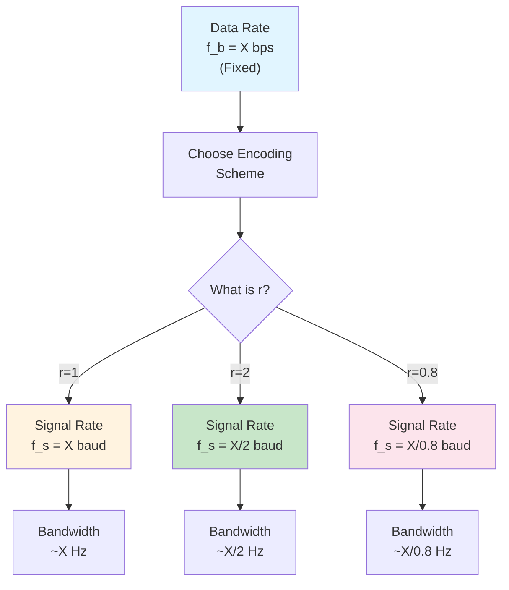

# Data Rate and Signal Rate

These two concepts are constantly confused. Master this section and you've solved half your bandwidth problems.

## Definitions (Precise)

### Data Rate (Bit Rate)

**Data rate** is the number of **data bits** transmitted per second.

$$f_b = \text{Data rate} = \frac{\text{Number of bits}}{1 \text{ second}} \quad [\text{bps}]$$

This is determined by:
- **The source:** How fast is the original data being generated?
- **The application:** What's the required throughput?

Data rate is **independent** of the encoding scheme. Whether you use Manchester, AMI, or 2B1Q, the data rate doesn't change — only how you represent it electrically.

### Signal Rate (Baud Rate)

**Signal rate** (also called **baud rate** or **symbol rate**) is the number of **signal elements** (symbols) transmitted per second.

$$f_s = \text{Signal rate} = \frac{\text{Number of symbols}}{1 \text{ second}} \quad [\text{baud or symbols/s}]$$

This is determined by:
- **The line code:** Manchester vs. AMI produce different signal rates for the same data rate
- **The channel:** The channel's bandwidth limits how fast signals can change

## The Relationship

They are related through the **r factor** (from [[04-The-r-Factor|The r Factor]]):

$$f_s = \frac{f_b}{r}$$

where:
$$r = \frac{\text{Number of data bits per signal element}}{\text{1}} = \frac{N_d}{N_s}$$

## Interpreting the Relationship

| Case | r | Relationship | Meaning |
|------|---|--------------|---------|
| **r = 1** | $f_s = f_b$ | Data rate = Signal rate | Each bit is one symbol |
| **r > 1** | $f_s < f_b$ | Signal rate < Data rate | Multiple bits packed into one symbol (efficient!) |
| **r < 1** | $f_s > f_b$ | Signal rate > Data rate | Fewer bits per symbol (redundant bits added) |

## Why This Matters: Bandwidth

The **bandwidth required** is **NOT** determined by data rate. It's determined by **signal rate**.

More precisely:

$$\text{Bandwidth} \propto f_s = \frac{f_b}{r}$$

**Example:** If you have a channel with max bandwidth 1 kHz:

| Scheme | r | Max Signal Rate | Max Data Rate |
|--------|---|-----------------|---|
| Manchester (r=1) | 1 | 1000 baud | 1000 bps |
| 2B1Q (r=2) | 2 | 1000 baud | **2000 bps** |
| 4B/5B (r=0.8) | 0.8 | 1000 baud | 800 bps |

**Same bandwidth, different data rates!** This is why multilevel codes (r > 1) are popular for high-speed transmission.

## Concrete Example: Tracing the Relationship

### Setup
- **Data source:** 8000 bps (8 kilobits per second)
- **Application:** Telephony (standard rate)
- **Chosen encoding:** 2B1Q (r = 2)

### Step 1: Data Rate is Fixed
$$f_b = 8000 \text{ bps}$$

This doesn't change with the line code choice.

### Step 2: Calculate Signal Rate
$$f_s = \frac{f_b}{r} = \frac{8000}{2} = 4000 \text{ baud}$$

The signal changes 4000 times per second.

### Step 3: Bandwidth Needed
If the signal elements are simple (e.g., four voltage levels, each held for the symbol duration):
$$\text{Rough BW} \approx f_s = 4000 \text{ Hz} = 4 \text{ kHz}$$

### Step 4: Compare with Other Schemes

**Using Manchester (r = 1, but with transitions):**
$$f_s = \frac{8000}{1} = 8000 \text{ baud}$$
$$\text{Manchester BW} \approx 2 \times f_s = 16 \text{ kHz}$$
(Manchester has a built-in transition, doubling the effective bandwidth)

**Conclusion:** 2B1Q needs 4 kHz, Manchester needs 16 kHz. That's why DSL uses multilevel codes!

## Signal Rate Calculation in Practice

### For r = 1 schemes (Unipolar, Polar, RZ, Manchester, Bipolar)

$$f_s = f_b$$

### For r > 1 schemes (Multilevel)

Bits are grouped into blocks. If each block has $r$ bits and is transmitted as one symbol:

$$f_s = \frac{f_b}{r}$$

**Example: 2B1Q** (r = 2)
- Every 2 bits become 1 symbol
- If bit rate = 2000 bps, then symbol rate = 1000 baud

**Example: 4D-PAM5** (r = 4)
- Every 4 bits become 1 symbol  
- If bit rate = 4000 bps, then symbol rate = 1000 baud

### For r < 1 schemes (Block Coding)

Bits are encoded with redundancy. If you encode $N$ bits into $M$ symbols:

$$r = \frac{N}{M}$$
$$f_s = \frac{f_b}{r} = \frac{f_b \times M}{N}$$

**Example: 4B/5B** (4 bits → 5 symbols, r = 0.8)
- If bit rate = 1000 bps, then symbol rate = 1000 / 0.8 = 1250 baud

## Key Time Periods

These are often confused. Learn to distinguish them:

| Period | Formula | Meaning |
|--------|---------|---------|
| **Bit period** $T_b$ | $T_b = \frac{1}{f_b}$ | Duration of one bit in the data stream |
| **Symbol period** $T_s$ | $T_s = \frac{1}{f_s}$ | Duration of one signal element on the channel |

**Relationship:**
$$T_s = \frac{T_b}{r}$$

### Example Calculation

**Given:** Bit rate = 1000 bps, r = 2

**Find:** $T_b$ and $T_s$

$$T_b = \frac{1}{1000} = 1 \text{ ms}$$
$$f_s = \frac{1000}{2} = 500 \text{ baud}$$
$$T_s = \frac{1}{500} = 2 \text{ ms}$$

Notice: Each symbol (signal element) lasts twice as long as each bit. That's because each symbol carries 2 bits (r = 2).

## Exam-Critical Formulas to Memorize

$$\boxed{f_s = \frac{f_b}{r}}$$

$$\boxed{T_s = r \times T_b}$$

$$\boxed{\text{Bandwidth} \approx f_s}$$ (for basic line codes)

$$\boxed{\text{Number of symbols in time } t = f_s \times t = \frac{f_b \times t}{r}}$$

$$\boxed{\text{Number of bits in time } t = f_b \times t}$$

## Common Mistakes (Don't Make These!)

❌ **Mistake 1:** Assuming data rate = signal rate for all codes.  
✓ **Correct:** Only true when r = 1. For multilevel (r > 1), signal rate is lower.

❌ **Mistake 2:** Calculating bandwidth using bit rate directly.  
✓ **Correct:** Use signal rate (baud rate) to estimate bandwidth.

❌ **Mistake 3:** Confusing the symbol period with bit period.  
✓ **Correct:** $T_s = r \times T_b$ always.

❌ **Mistake 4:** Saying "Manchester takes twice the bandwidth." (Imprecise!)  
✓ **Correct:** "Manchester has the same signal rate as NRZ (r = 1 for both), but the built-in transition increases actual bandwidth by roughly a factor of 2."

## Visual Summary

## Related Concepts

- [[03-Data-Elements-vs-Signal-Elements|Data Elements vs. Signal Elements]] — Foundational definitions
- [[04-The-r-Factor|The r Factor]] — How r is calculated
- [[01-Digital-Signal-Fundamentals|Digital Signal Fundamentals]] — Bandwidth and frequency content
- [[09-Bandwidth-Efficiency|Bandwidth Efficiency]] — Comparing schemes
