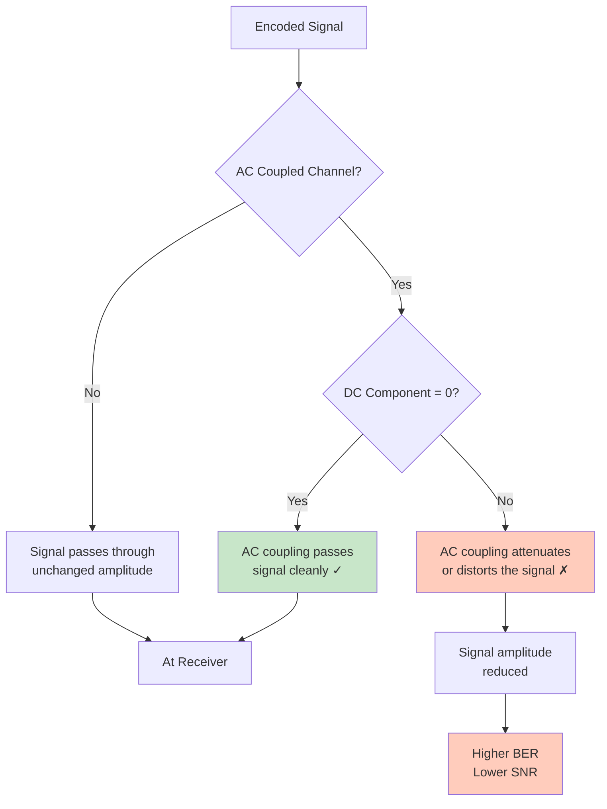

# DC Component

A **DC component** in the signal is a constant (non-zero) voltage offset. It's harmful for several reasons and is a key evaluation criterion for line codes.

## Definition: Formal

The **DC component** of a signal $s(t)$ is its **average voltage over time**:

$$V_{DC} = \frac{1}{T} \int_0^T s(t) \, dt$$

For a **periodic** bit pattern, compute the average over one complete cycle.

**A "DC-free" signal has $V_{DC} = 0$ V (on average).**

## Why DC Components Are Bad

### Problem 1: AC-Coupled Channels Block DC

Most transmission channels use **AC coupling** (capacitors) to block DC:

```
Data ---[Encoder]---[AC Coupling]---[Receiver]---[Decoder]---Data
                     (blocks DC,
                      passes AC only)
```

**What happens:**
- If the encoded signal has a DC component, the AC coupling capacitor will attenuate it
- The receiver sees a signal with **reduced amplitude**
- The signal-to-noise ratio (SNR) decreases
- Bit error rate (BER) increases

### Problem 2: Power Wastage

A non-zero average voltage consumes DC power:

```
Transmitted signal: (average 0V)    ~Efficient power use
Transmitted signal: (average +3V)   ~Wastes power, burns heat
```

In battery-powered or power-sensitive systems, DC components waste precious power.

### Problem 3: Cable and Equipment Issues

Long cables or transformers can be damaged by sustained DC current:
- DC current causes heating (resistive loss)
- Transformers (which couple signals between stages) block DC anyway
- Equipment expecting "balanced" signals fails with DC offset

### Problem 4: Baseline Drift (Connection to [[06-Baseline-Wandering|Baseline Wandering]])

A signal with significant DC offset will exhibit baseline wandering because:
- The capacitor tries to block the DC part
- The output voltage oscillates around a shifting baseline
- Synchronization circuits lose lock

## Quantifying the DC Component

For a **bit stream**, calculate the DC component by:

1. **Encode the entire pattern** to its voltage waveform
2. **Calculate the average voltage** over the entire bit sequence
3. **Check if it's zero (or close to zero)**

### Example 1: Unipolar NRZ with Data `10110001`

```
Bit:        1     0     1     1     0     0     0     1
Voltage: [+V]  [0V]  [+V]  [+V]  [0V]  [0V]  [0V]  [+V]

Count: 4 bits at +V, 4 bits at 0V

Average voltage = (4×V + 4×0) / 8 = V/2

DC component = V/2 (not zero!)
```

**Verdict:** Unipolar NRZ always has DC component ≥ 0. Bad for AC-coupled channels.

### Example 2: Polar NRZ-L with Same Data `10110001`

Using the convention:
- Bit 1 → +V
- Bit 0 → -V

```
Bit:        1     0     1     1     0     0     0     1
Voltage: [+V]  [-V]  [+V]  [+V]  [-V]  [-V]  [-V]  [+V]

Count: 4 bits at +V, 4 bits at -V

Average voltage = (4×V - 4×V) / 8 = 0V

DC component = 0 (exactly!)
```

**Verdict:** Polar NRZ-L is DC-free (for balanced data).

**Caveat:** This assumes equal number of 0s and 1s. For patterns with more 1s than 0s, DC ≠ 0.

### Example 3: Manchester Coding with `1 0 1 0`

Manchester rule:
- Bit 0: +V then -V (high-to-low transition)
- Bit 1: -V then +V (low-to-high transition)

```
Bit:     1        0        1        0
         |        |        |        |
+V  |    _        _        _        _
    |   | |      | |      | |      | |
0   |_  | |_    | |_    | |_    | |
    |   |_|      |_|      |_|      |_|
-V  |

Each bit lasts one bit period.
In the first half: either +V or -V
In the second half: the opposite

For a complete cycle of any N bits, the +V and -V portions are equal.

Average = 0V
```

**Verdict:** Manchester is always DC-free. (This is one of its major advantages.)

## Visualizing DC Component



## DC-Free vs. DC-Balanced

There are two related concepts:

### DC-Free
A signal is **DC-free** if its average voltage is zero (or negligible).

$$V_{DC} \approx 0$$

Examples: Manchester, Polar NRZ-L (with balanced data), AMI

### DC-Balanced
A signal is **DC-balanced** if the number of +V symbols equals the number of -V symbols **within each coding unit** (like each byte or each codeword).

Examples: Block codes (4B/5B, 8B/10B) are designed to be DC-balanced by construction.

**Relationship:** DC-balanced → DC-free, but not always vice versa.

## Evaluation Table: Which Schemes are DC-Free?

| Scheme | DC-Free? | Notes |
|--------|----------|-------|
| **Unipolar NRZ** | ❌ No | Always ≥ 0 (depends on data) |
| **Polar NRZ-L** | ✅ Yes* | Only if data is balanced (50% 0s, 50% 1s) |
| **Polar NRZ-I** | ✅ Yes* | Only if data is balanced |
| **Polar RZ** | ❌ No | DC > 0 always |
| **Manchester** | ✅ Yes | Always DC-free, regardless of data |
| **Diff. Manchester** | ✅ Yes | Always DC-free, regardless of data |
| **AMI** | ✅ Yes* | Only if data is balanced |
| **Pseudoternary** | ✅ Yes* | Only if data is balanced |
| **4B/5B** | ✅ Yes | Codewords are DC-balanced by design |
| **8B/10B** | ✅ Yes | Codewords are DC-balanced by design |
| **2B1Q** | ❌ No | Depends on data |
| **B8ZS/HDB3** | ✅ Yes | Balanced by design |

*Note: Marked with * are only DC-free if the data itself is balanced (equal 0s and 1s). Random data may have unequal 0s and 1s, causing DC component.

## Practical Implications

### If you have an AC-coupled channel:
→ **Must use a DC-free code** (Manchester, 4B/5B, etc.)

Example: Ethernet 10Base-T uses Manchester (DC-free).

### If you have a power budget constraint:
→ **Minimize DC component** (use symmetric codes)

Example: DSL modems use coding techniques to minimize DC power.

### If you're designing from scratch:
→ **Always assume AC coupling** (it's the industry standard)

This narrows your choices to:
- Manchester/Diff. Manchester
- AMI (with balanced data)
- Block codes (4B/5B, 8B/10B)
- Scrambled codes (B8ZS, HDB3)

**Avoid:**
- Unipolar NRZ
- Polar RZ (unless you can handle DC)

## Exam Question Example

**Q:** A line code produces the following voltage sequence for the bit pattern `11110000`: [+V, +V, +V, +V, 0, 0, 0, 0]. Will this code work over an AC-coupled channel?

**A:**

*Calculate DC component:*
$$V_{DC} = \frac{4×V + 4×0}{8} = \frac{V}{2}$$

*Verdict:* **No, it will not work well.** The code has a DC component of V/2, which means:
1. The AC-coupling capacitor will attenuate the signal
2. The receiver will see reduced amplitude
3. Bit errors will increase

*Solution:* Use a code that produces equal +V and 0V (or +V and -V) for any bit pattern, such as Manchester or a balanced code.

## Related Concepts

- [[01-Digital-Signal-Fundamentals|Digital Signal Fundamentals]] — AC-coupled channels
- [[02-Line-Coding-Basics|Line Coding Basics]] — Why line coding is needed
- [[06-Baseline-Wandering|Baseline Wandering]] — Related issue with no DC-free property
- [[08-Self-Synchronization|Self-Synchronization]] — Another evaluation criterion
- [[14-Manchester-Coding|Manchester Coding]] — An excellent DC-free solution
- [[22-Block-Coding|Block Coding]] — Another solution via redundancy
- [[26-B8ZS-HDB3|B8ZS and HDB3]] — Practical scrambling for DC-free signals
