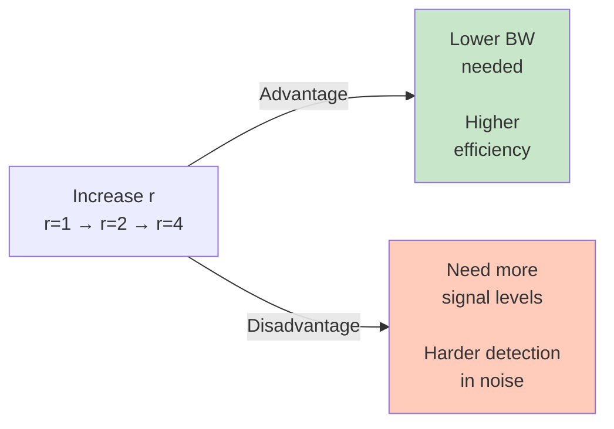
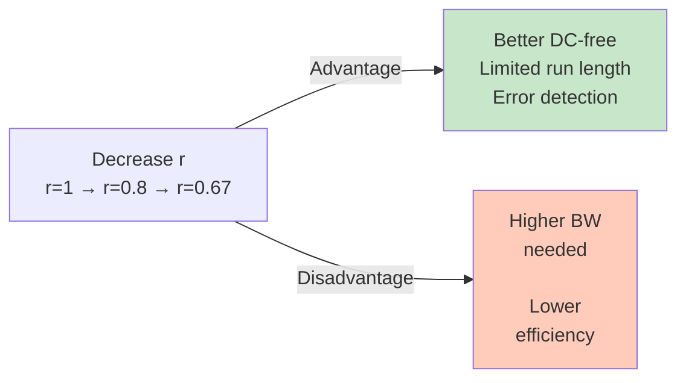

# Bandwidth Efficiency

**Bandwidth efficiency** (or **spectral efficiency**) measures how effectively a line code uses the available bandwidth. It's the fundamental trade-off metric comparing different schemes.

## Definition

Bandwidth efficiency is typically expressed as:

$$\eta = \frac{\text{Data rate (bps)}}{\text{Bandwidth required (Hz)}}$$

Units: **bits per second per Hz** or **bps/Hz**

**Higher η means better efficiency.**

Alternatively:
$$\eta = \frac{f_b}{\text{Bandwidth}} = \frac{f_b}{f_s \times k}$$

where $k$ is a factor that depends on the signal shape (k ≈ 1 for NRZ, k ≈ 2 for signals with mid-bit transitions).

## Bandwidth Requirement for Different Schemes

The **bandwidth** required depends on:

1. **Signal rate (baud rate):** $f_s = f_b / r$
2. **Signal shape:** How abrupt the transitions are (affects spectrum)

### For Simple Level Signals (like NRZ)

The required bandwidth is roughly:
$$\text{BW} \approx f_s = \frac{f_b}{r}$$

(The exact value depends on channel characteristics, but proportionality holds.)

### For Signals with Transitions (like Manchester, RZ)

The built-in transitions create higher frequency components:
$$\text{BW} \approx 2 \times f_s = 2 \times \frac{f_b}{r}$$

(Rough approximation; exact spectrum depends on transition shape.)

## Comparing Schemes by Efficiency

### Scenario: Fixed Data Rate

**Given:** Bit rate = 1000 bps (fixed)

| Scheme | r | Signal Rate | Approx. BW | Relative Efficiency |
|--------|---|-------------|------------|---------------------|
| **Unipolar NRZ** | 1 | 1000 baud | 1000 Hz | 1 bps/Hz |
| **Polar NRZ-L** | 1 | 1000 baud | 1000 Hz | 1 bps/Hz |
| **Manchester** | 1 | 1000 baud | 2000 Hz | 0.5 bps/Hz |
| **2B1Q** | 2 | 500 baud | 500 Hz | 2 bps/Hz |
| **4D-PAM5** | 4 | 250 baud | 250 Hz | 4 bps/Hz |
| **4B/5B** | 0.8 | 1250 baud | 1250 Hz | 0.8 bps/Hz |
| **8B/10B** | 0.8 | 1250 baud | 1250 Hz | 0.8 bps/Hz |

**Ranking (best to worst):**
1. 4D-PAM5 (4 bps/Hz) — Most efficient
2. 2B1Q (2 bps/Hz) — Very efficient
3. Unipolar/Polar NRZ (1 bps/Hz) — Standard reference
4. 4B/5B, 8B/10B (0.8 bps/Hz) — Sacrifice efficiency for robustness
5. Manchester (0.5 bps/Hz) — Least efficient

## Efficiency Trade-offs

### Multilevel (r > 1): Gain Efficiency, Lose Robustness



**Example:** 4D-PAM5 for Gigabit Ethernet
- Uses 5 voltage levels (hard to distinguish)
- Achieves 4 bps/Hz
- Requires carefully designed equalizers and error correction

### Block Coding (r < 1): Gain Robustness, Lose Efficiency



**Example:** 8B/10B for high-speed links (10 Gbps+)
- Uses only 2 voltage levels (easy to detect)
- Adds 2 bits redundancy per byte (r = 0.8)
- Codewords chosen to guarantee DC-balance and run-length limits
- Requires 25% more bandwidth than raw 8B encoding

## Practical Snapshot: Choosing for Your Application

### If bandwidth is **abundant** (e.g., fiber optic, short-range):
→ Use **Manchester or block codes**
- Example: Ethernet 10Base-T (legacy) uses Manchester
- Advantage: Simple, self-synchronizing, robust
- Trade-off: Lower efficiency is acceptable

### If bandwidth is **limited** (e.g., long-distance, expensive spectrum):
→ Use **multilevel codes**
- Example: DSL uses 2B1Q or 4D-PAM5
- Advantage: High efficiency (2-4 bps/Hz)
- Trade-off: Complex receiver, sensitive to noise, needs equalization

### If you need **both** robustness and good efficiency:
→ Use **block codes with DC-balance and error detection**
- Example: Ethernet 4B/5B (100Base-TX) or 8B/10B (Gigabit+)
- Advantage: Only slightly lower efficiency (0.8 bps/Hz) than simple NRZ
- Trade-off: Overhead of redundancy, complexity of mapping

## Detailed Example: DSL vs. Ethernet

### DSL (Digital Subscriber Line): Maximizes Efficiency

```
Channel: Twisted pair (limited BW ~1 MHz)
Goal: Send 56 kbps over voice-grade line

Using 2B1Q (r = 2):
f_b = 56 kbps
f_s = 28 kbaud
BW ≈ 28 kHz

Efficiency = 56 kbps / 28 kHz = 2 bps/Hz ✓

Using simple Polar NRZ (r = 1):
f_b = 56 kbps
f_s = 56 kbaud
BW ≈ 56 kHz

Efficiency = 56 kbps / 56 kHz = 1 bps/Hz

Conclusion: 2B1Q is twice as efficient!
```

### Ethernet 10Base-T: Prioritizes Robustness

```
Channel: Twisted pair (limited BW ~5 MHz)
Goal: Send 10 Mbps reliably over office distance

Using Manchester (r = 1):
f_b = 10 Mbps
f_s = 10 Mbaud
BW ≈ 20 MHz (due to transitions)

Efficiency = 10 Mbps / 20 MHz = 0.5 bps/Hz

Advantage: Self-synchronizing, DC-free, simple.
In practice, this works well because:
- Channel has plenty of bandwidth (twisted pair ~5-10 MHz available)
- Self-sync and DC-free properties are critical for long runs
- Simplicity reduces cost
```

### Ethernet Gigabit: Balances Both

```
Channel: Fiber or Cat-6 (very high BW)
Goal: Send 1 Gbps (or higher) at low cost

Using 4D-PAM5 with 8B/10B pre-coding:
Net data rate: 1 Gbps
Line rate: 1.25 Gbaud (25% overhead)
Efficient packing of data

Efficiency ≈ 0.8 bps/Hz (due to 8B/10B overhead)

Advantage: Good efficiency without sacrificing DC-balance and error detection.
```

## Mathematical Relationship to Noise

Bandwidth efficiency connects to **Shannon Capacity**:

$$C = B \log_2(1 + \text{SNR})$$

where:
- $C$ = channel capacity (bps)
- $B$ = bandwidth (Hz)
- $\text{SNR}$ = signal-to-noise ratio

For a fixed SNR:
$$\text{Maximum data rate} = C = B \log_2(1 + \text{SNR})$$

**Implication:** You can send more data by:
1. **Increasing bandwidth** (use multilevel codes, r > 1)
2. **Improving SNR** (add error correction, reduce noise)

But there's a limit: you can't exceed Shannon's theoretical maximum for a given channel.

## Exam Formulas

$$\boxed{\eta = \frac{f_b}{B}}$$

$$\boxed{\text{For NRZ-like signals: } B \approx f_s = \frac{f_b}{r}}$$

$$\boxed{\text{For transition-heavy signals: } B \approx 2f_s = \frac{2f_b}{r}}$$

$$\boxed{f_s = \frac{f_b}{r}}$$

## Common Exam Questions

**Q1:** Unipolar NRZ and 2B1Q both send 1000 bps over a channel with 1 kHz bandwidth. Which works better?

**A1:**
- Unipolar NRZ: f_s = 1000 baud, BW ≈ 1000 Hz, fits exactly (works!)
- 2B1Q: f_s = 500 baud, BW ≈ 500 Hz, uses only half bandwidth (works better + room to spare)

2B1Q is better. Efficiency = 2 bps/Hz vs. 1 bps/Hz.

**Q2:** If Manchester requires 2 MHz of bandwidth for a 1 Mbps signal, what's the efficiency?

**A2:**
$$\eta = \frac{1 \text{ Mbps}}{2 \text{ MHz}} = 0.5 \text{ bps/Hz}$$

**Q3:** 4B/5B adds one redundant bit per group. If we transmit 10,000 4B groups per second, what's the line rate?

**A3:**
- 4B groups per second: 10,000
- 5B symbols per 4B group: 1.25
- Line rate: 10,000 × 1.25 = 12,500 baud
- Data rate: 10,000 × 4 = 40,000 bps
- Efficiency: 40,000 / 12,500 = 3.2 bps/Hz

(Note: This assumes 1 baud = 1 symbol, and each symbol is 1 bit. In reality, we'd need the actual bandwidth of the 5B symbols.)

## Related Concepts

- [[04-The-r-Factor|The r Factor]] — How r affects bandwidth
- [[05-Data-Rate-and-Signal-Rate|Data Rate and Signal Rate]] — Foundational relationship
- [[18-Multilevel-Coding|Multilevel Coding Principles]] — High-efficiency schemes
- [[22-Block-Coding|Block Coding]] — Lower efficiency, higher robustness
- [[27-Comparison-Matrix|Comparison Matrix]] — Efficiency ranking of all schemes
