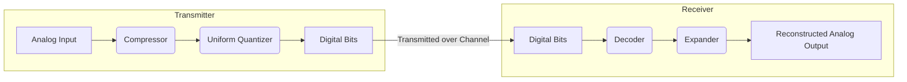

---

# **Non-Uniform Quantization and Companding — Complete Note**

## **1. What is Quantization?**

Quantization is the process of **rounding a continuous-amplitude signal to a finite set of levels** so it can be represented digitally.

- Quantization introduces an **unavoidable error** called **quantization noise**.
    
- **Important distinction:** Sampling → time; Quantization → amplitude.
    

---

## **2. Uniform Quantization**

Uniform quantization uses **equally spaced levels**:

$$  
\Delta = \frac{2V_{\max}}{L}  
$$

- Step size Δ is constant
    
- Quantization error lies in ( $ -\frac{\Delta}{2} \le e \le +\frac{\Delta}{2} $ )
    
- **Noise power is constant**, independent of signal amplitude
    

**Observation:** SNR changes with signal amplitude (small signals → poor SNR).

---

## **3. Why Uniform Quantization Fails for Speech**

- Speech signals are **mostly low-amplitude**
    
- Uniform quantization treats all amplitudes equally
    
- Consequence:
    

|Amplitude|Noise|Result|
|---|---|---|
|Large|same|OK|
|Small|same|buried → grainy sound|

- Inefficient: wastes quantization levels on rare loud signals, starves frequent quiet signals
    

---

## **4. Core Idea of Non-Uniform Quantization**

- Allocate **finer resolution (smaller Δ)** to **small, frequent amplitudes**
    
- Allocate **coarser resolution (larger Δ)** to **large, rare amplitudes**
    
- Goal: **roughly constant perceived quality (SNR)**
    
- Precision is **redistributed**, not increased
    

---

## **5. Why We Don’t Build Non-Uniform Quantizers Directly**

- Direct implementation requires uneven thresholds, complex ADCs, or huge lookup tables
    
- **Solution:** **Companding** — compress signal first, quantize uniformly, expand at receiver
    
- **Compander = Compressor + Expander**
    

---

## **6. Companding Example**

- Inputs: `0.05, 0.10, 0.40, 0.85`
    
- 5-level uniform quantizer: `0, 0.25, 0.5, 0.75, 1.0`
    

**Without companding:**

```
0.05 → 0, 0.10 → 0, 0.40 → 0.5, 0.85 → 1.0
```

- Small signals lost
    

**With simple compression (y = √x):**

```
0.05 → 0.22 → 0.25 (quantized) → 0.0625 (expanded)  
0.10 → 0.32 → 0.25 → 0.0625  
0.40 → 0.63 → 0.75 → 0.5625  
0.85 → 0.92 → 1.0 → 1.0
```

- Small amplitudes are **better preserved**
    
- Large amplitudes distorted slightly, perceptually acceptable
    

---

## **7. μ-Law and A-Law Companding**

**μ-Law (USA, Japan):**

$$  
F(x) = \text{sgn}(x)\frac{\ln(1 + \mu |x|)}{\ln(1 + \mu)}  
$$

- Fully logarithmic
    
- μ = 255 typical
    
- Small signals stretched, large compressed
    

**A-Law (Europe, others):**

$$
F(x)=\text{sgn}(x)\begin{cases}  
\frac{A|x|}{1+\ln A}, & |x| < 1/A\  
\frac{1+\ln(A|x|)}{1+\ln A}, & |x| \ge 1/A  
\end{cases}  
$$

- Linear near zero, logarithmic otherwise
    
- Avoids excessive slope for tiny amplitudes
    
- A = 87.6 typical
    

**Key difference:** A-law is piecewise linear near zero; μ-law is fully logarithmic.

---

## **8. How Companding Improves SNR**

- Compression **stretches small amplitudes** → uniform quantizer can represent them better
    
- Expansion restores original amplitude scale
    
- Result: **small signals have higher SNR**, large signals slightly degraded but perceptually fine
    
- Achieves **better speech quality** with same number of quantization levels
    

---

## **9. Compander Block Diagram**

The companding process involves a compressor at the transmitter and an expander at the receiver.



**Key point:** The **Compressor** at the transmitter and the **Expander** at the receiver are inverse operations. The compressor non-linearly amplifies quiet signals more than loud signals before they enter the uniform quantizer. This effectively creates non-uniform quantization.

---

## **10. Summary / Mental Model**

- Quantization → rounding amplitudes → unavoidable noise
    
- Uniform quantization → constant Δ → same noise power → poor SNR for small signals
    
- Non-uniform quantization → finer resolution for small signals, coarser for large signals
    
- Implemented practically via **companding** (compress + uniform quantize + expand)
    
- Standard companders: μ-law (logarithmic), A-law (piecewise linear/log)
    
- **Analogy:** like camera exposure — dark areas get more sensitivity, bright areas less
    

**Bottom line:**

> Non-uniform quantization gives **better perceived quality for speech signals** without increasing bit rate, by smartly allocating quantization levels according to signal statistics.

---
