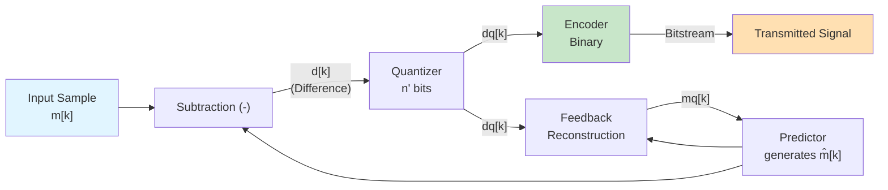
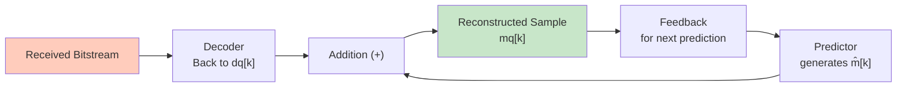
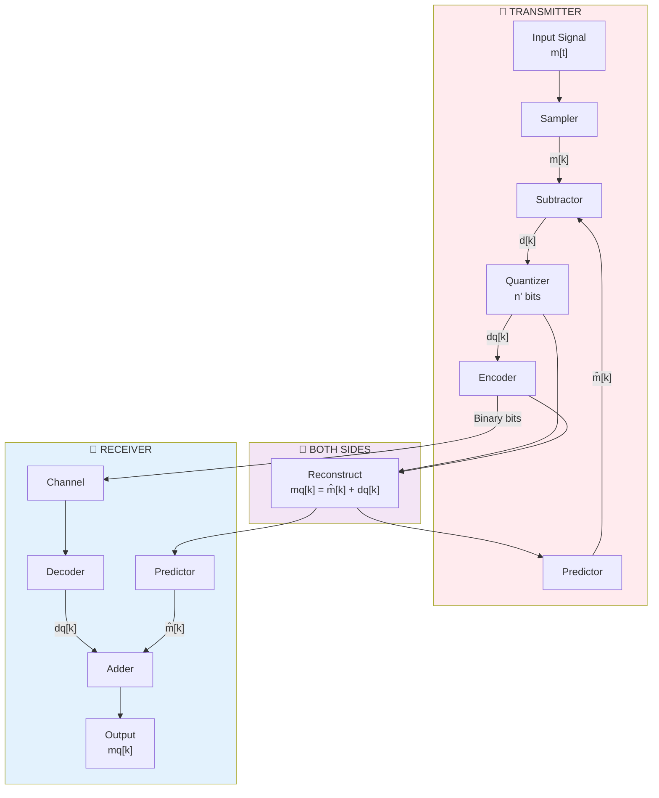

# Differential Pulse Code Modulation (DPCM) - Complete Guide

## What is DPCM?

**Differential Pulse Code Modulation (DPCM)** is a smart improvement over regular [[../class lecture 5/2.1 PCM System Overview|Pulse Code Modulation (PCM)]]. Instead of encoding every sample's absolute value, DPCM only encodes the **difference** between what a sample actually is and what we predicted it would be.

Think of it like this: If you're watching the temperature over time, it changes slowly. Each reading is very similar to the previous one. PCM would send the entire temperature reading every time. DPCM says "the last reading was 25°C, and this one is 25.3°C" - so we only need to send +0.3°C instead of 25.3°C.

## Key Notations and Symbols

To avoid confusion, here's a quick reference for the symbols used in DPCM:

- **m[k]**: The actual input sample at time k (the original signal value)
- **m̂[k]**: The predicted value for sample k (what we guess it will be based on past samples)
- **d[k]**: The difference (error) between actual and predicted: d[k] = m[k] - m̂[k]
- **dq[k]**: The quantized (approximated) difference after reducing to fewer bits
- **m_q[k]**: The reconstructed sample at the receiver: m_q[k] = m̂[k] + dq[k]
- **Bits**: Binary representation of the value being transmitted

**Example**: If m[k] = 67, m̂[k] = 65, then d[k] = 67 - 65 = +2. After quantization, dq[k] = +2, and the reconstructed m_q[k] = 65 + 2 = 67.

## Why Does DPCM Work Better Than PCM?

### The Problem with PCM
- Sends full value of every sample
- Wastes bits encoding redundant information
- Adjacent samples are usually similar (high correlation)

### The DPCM Solution
- Exploits the fact that signals don't change drastically between samples
- Only sends the **change** (difference), not the absolute value
- The difference is much smaller → needs fewer bits
- Same quality with fewer bits = Lower bandwidth!

### Real Number Example

**Signal:** Audio that varies between 0 and 100

| Sample | PCM (with 8 bits) | DPCM (with 4 bits for difference) |
|--------|-----------|-------------|
| Sample 1 | 01000000 (value: 64) | 0100 (diff: 0) |
| Sample 2 | 01000011 (value: 67) | 0001 (diff: +3) |
| Sample 3 | 01000010 (value: 66) | 1111 (diff: -1) |
| Sample 4 | 01000110 (value: 70) | 0010 (diff: +4) |
| **Bits used** | **32 bits** | **16 bits** | 

**DPCM uses 50% fewer bits!**

## DPCM Transmitter - How It Works

### Step-by-Step Process

**Step 1: Prediction**
The predictor looks at previous samples and guesses what the current sample will be:
$$\hat{m}[k] = \text{predictor output based on previous samples}$$

**Step 2: Calculate Difference**
Subtract the prediction from the actual sample:
$$d[k] = m[k] - \hat{m}[k]$$

**Example:** 
- Actual sample: 67
- Predicted value: 65
- Difference: 67 - 65 = +2 (much smaller than 67!)

**Step 3: Quantize the Difference**
Since differences are small, we can use fewer bits (e.g., 4 bits instead of 8):
$$d_q[k] = \text{Quantize}(d[k])$$

**Step 4: Encode and Transmit**
Convert the quantized difference to binary and send it.

**Step 5: Crucial Feedback Loop**
Reconstruct the current sample from prediction + quantized difference:
$$m_q[k] = \hat{m}[k] + d_q[k]$$

**Why is this important?** This reconstructed value becomes the input to the predictor for the next sample. This ensures the transmitter's predictor and receiver's predictor use the same information - no error buildup!

## DPCM Receiver - How It Reconstructs

### Receiver Steps

1. **Decode** the incoming bitstream → get $d_q[k]$
2. **Predict** using previous samples → get $\hat{m}[k]$
3. **Add** prediction + difference → get $m_q[k]$
4. **Feed back** the reconstructed sample to the predictor

**Key insight:** The receiver is actually simpler than the transmitter! It doesn't need to do subtraction - just addition.

## Complete DPCM System Diagram

## Complete Numerical Example

**Input signal samples (audio):** [50, 52, 51, 55, 58, 60]

**Predictor:** Use previous sample as prediction (1st order): $\hat{m}[k] = \hat{m}[k-1] + dq[k-1]$ (equivalent to $\hat{m}[k] = m_q[k-1]$ since $m_q[k-1] = \hat{m}[k-1] + dq[k-1]$)

**Quantization:** 3 bits for difference (range: -4 to +3)

| Sample | m[k] | m̂[k] | d[k] | Bits | dq[k] |
|--------|------|------|------|------|-------|
| k=0 | 50 | 0 | 50 | 110010 | +2 |
| k=1 | 52 | 50 | +2 | 010 | +2 |
| k=2 | 51 | 52 | -1 | 111 | -1 |
| k=3 | 55 | 51 | +4 | 100 | +3 |
| k=4 | 58 | 54 | +4 | 100 | +3 |
| k=5 | 60 | 57 | +3 | 011 | +3 |

**PCM would need:** 6 samples × 8 bits = 48 bits
**DPCM needs:** 1 sample × 8 bits (first) + 5 samples × 3 bits = 8 + 15 = **23 bits** (52% reduction!)

## Why DPCM is Better

| Aspect | PCM | DPCM |
|--------|-----|------|
| **Encodes** | Absolute sample values | Difference signals |
| **Bits per sample** | More | Fewer |
| **Exploits correlation** | No | Yes |
| **Requires predictor** | No | Yes |
| **Data rate** | Higher | Lower |
| **Complexity** | Simple | Medium |

## Key Takeaways

1. **DPCM = PCM + Prediction + Difference encoding**
2. **Works because real signals change slowly** between samples
3. **Feedback loop is critical** to prevent error accumulation
4. **Predictor quality determines performance**
5. **Can reduce data rate significantly** while maintaining quality

---

## Frequently Asked Questions

**Q: What happens if the prediction is bad?**
A: If the predictor makes poor predictions, the differences $d[k]$ remain large, and DPCM won't save many bits. However, for most natural signals (audio, images), adjacent samples are correlated, so even simple predictors work well.

**Q: Why do we feed back the quantized value, not the original?**
A: Because the receiver only has access to quantized values. Feeding back $m_q[k]$ (not $m[k]$) ensures the transmitter and receiver's predictors see the same information. This prevents error from accumulating.

**Q: Can DPCM introduce errors?**
A: Only through quantization, just like PCM. The quantized value $dq[k]$ is the source of noise, not the prediction itself.

**Q: What's the difference between DPCM and Delta Modulation?**
A: Delta Modulation (DM) is the simplest form of DPCM using just 1 bit and a very simple predictor. DPCM is more general and flexible.

---
**Parent:** [[./MOC|DPCM and Modulation Techniques]]
