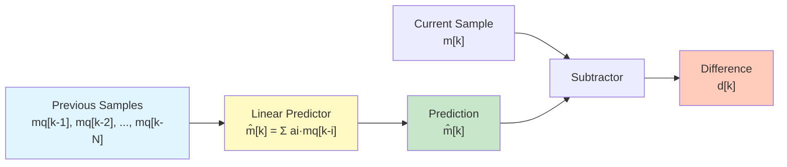
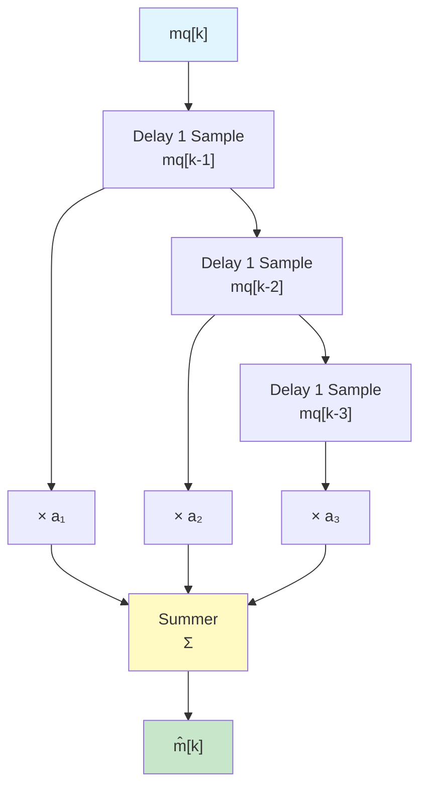

# Prediction in DPCM - Complete Guide

## What is a Predictor?

The **predictor** is the heart of DPCM. It's a "guesser" - it looks at previous samples and predicts what the current sample will be.

**Simple idea:** If I know the last 3 values were [100, 102, 104], I can guess the next one might be around 106 (continuing the trend).

The quality of your predictor directly determines how well DPCM works:
- **Good predictor** → Small differences → Few bits needed → High compression
- **Bad predictor** → Large differences → Many bits needed → Poor compression

## How Prediction Works

### The Prediction Equation

The predictor generates an estimate $\hat{m}[k]$ based on **previously reconstructed samples**:

$$\hat{m}[k] = f(m_q[k-1], m_q[k-2], ..., m_q[k-N])$$

**Critical rule:** Use quantized samples $m_q$, NOT original samples $m$!

Why? The receiver only has access to quantized values. If the transmitter uses different values, predictors will diverge and errors accumulate.

**Quick clarification on quantization in DPCM:**
We do **NOT** quantize the original sample $m[k]$ directly. Instead:
1. Predict $\hat{m}[k]$ using previous reconstructed samples $m_q[k-1], \dots$
2. Calculate the difference: $d[k] = m[k] - \hat{m}[k]$
3. **Quantize the difference**: $dq[k] = \text{quantize}(d[k])$
4. Reconstruct the sample: $m_q[k] = \hat{m}[k] + dq[k]$
5. Use $m_q[k]$ for the next prediction

This way, only the small differences are quantized (saving bits), and the predictor stays synchronized between transmitter and receiver.

## Types of Predictors

### 1. First-Order Linear Predictor (Simplest)

Uses only the previous sample:

$$\hat{m}[k] = a_1 \cdot m_q[k-1]$$

Where $a_1$ is a coefficient (usually close to 1).

**Example with $a_1 = 0.9$:**

| k | m[k] (actual) | m̂[k] (prediction) | d[k] (difference) | Bits needed |
|---|---|---|---|---|
| 0 | 50 | — | 50 | 8 bits |
| 1 | 51 | $0.9 \times 50 = 45$ | 51 - 45 = +6 | 4 bits |
| 2 | 52 | $0.9 \times 51 = 45.9$ | 52 - 46 = +6 | 4 bits |
| 3 | 53 | $0.9 \times 52 = 46.8$ | 53 - 47 = +6 | 4 bits |

**How much data saved?** 
- PCM: $4 \times 8 = 32$ bits
- DPCM: $8 + 3 \times 4 = 20$ bits  
- **Savings: 37.5%**

### 2. First-Order with Coefficient = 1

The simplest of all predictors - just use the previous value:

$$\hat{m}[k] = m_q[k-1]$$

**Example:**

| k | m[k] | m̂[k] | d[k] | Quantized d[k] (3 bits) |
|---|---|---|---|---|
| 0 | 64 | — | 64 | 110010 (8 bits) |
| 1 | 65 | 64 | +1 | 001 |
| 2 | 63 | 65 | -2 | 110 |
| 3 | 66 | 63 | +3 | 011 |
| 4 | 68 | 66 | +2 | 010 |

**This is what Delta Modulation uses!** (See [[../class lecture 8/4.1 Delta Modulation System Overview|Delta Modulation]])

### 3. Second-Order Linear Predictor (More Complex)

Uses the last two samples:

$$\hat{m}[k] = a_1 \cdot m_q[k-1] + a_2 \cdot m_q[k-2]$$

**Example with $a_1 = 1.2, a_2 = -0.2$:**

| k | m[k] | m̂[k] | d[k] |
|---|---|---|---|
| 0 | 50 | — | 50 |
| 1 | 52 | — | 52 |
| 2 | 54 | $1.2(52) - 0.2(50) = 62.4-10 = 52.4$ | 54 - 52 = +2 |
| 3 | 56 | $1.2(54) - 0.2(52) = 64.8-10.4 = 54.4$ | 56 - 54 = +2 |
| 4 | 58 | $1.2(56) - 0.2(54) = 67.2-10.8 = 56.4$ | 58 - 56 = +2 |

Notice: The differences stay very small (+2) because we're capturing the trend!

### 4. Nth-Order Linear Predictor (General Form)

For a signal with strong patterns, use more previous samples:

$$\hat{m}[k] = \sum_{i=1}^{N} a_i \cdot m_q[k-i] = a_1 m_q[k-1] + a_2 m_q[k-2] + ... + a_N m_q[k-N]$$

Where:
- $N$ = number of previous samples used (order)
- $a_i$ = prediction coefficients

**Trade-off:**
- **Higher N:** Better predictions, smaller differences, fewer bits needed ✓
- **Higher N:** More computation, more complex design ✗

Usually N = 1 to 3 is a good balance.

## How to Choose Prediction Coefficients

The coefficients $a_i$ should minimize the variance of the difference signal.

### Method: Autocorrelation-Based Design

For a signal with autocorrelation function $R[m]$, the optimal coefficients satisfy:

$$R[0] \cdot a_1 = R[1] \quad \text{(for 1st order)}$$

**Practical example:**
If a speech signal has:
- $R[0] = 100$ (signal power)
- $R[1] = 85$ (correlation with 1 sample delay)

Then: $a_1 = \frac{R[1]}{R[0]} = \frac{85}{100} = 0.85$

This means: "The signal in 1 sample is predicted to be 85% of what it was before."

## Real Signal Example - Speech Signal

**Given:** Speech sample stream (8 kHz sampling rate)

| Sample # | Sample Value | Natural? |
|---|---|---|
| 0 | 100 | No (start value) |
| 1 | 102 | Yes (+2 change) |
| 2 | 101 | Yes (-1 change) |
| 3 | 104 | Yes (+3 change) |
| 4 | 105 | Yes (+1 change) |

All changes are small! Predictor will work great.

**With 1st-order predictor** ($a_1 = 0.95$):

| k | m[k] | m̂[k] = 0.95×m_q[k-1] | d[k] | Bits (4-bit) |
|---|---|---|---|---|
| 0 | 100 | — | 100 | 8 bits |
| 1 | 102 | 95 | +7 | 0111 |
| 2 | 101 | 97 | +4 | 0100 |
| 3 | 104 | 96 | +8 | 1000 |
| 4 | 105 | 99 | +6 | 0110 |

Much smaller differences than original values!

## Block Diagram - Predictor in Context

## Predictor Architecture Diagram

## Comparison of Different Predictors

| Predictor | Equation | Complexity | Performance | Use Case |
|---|---|---|---|---|
| **1st-order (a₁=1)** | m̂[k] = mq[k-1] | Very Low | Good | Delta Modulation, simple speech |
| **1st-order general** | m̂[k] = a₁·mq[k-1] | Low | Good | Most DPCM systems |
| **2nd-order** | m̂[k] = a₁·mq[k-1] + a₂·mq[k-2] | Medium | Better | Audio, video |
| **Nth-order** | m̂[k] = Σaᵢ·mq[k-i] | High | Best | Advanced coding |

## Key Principles

1. **Use quantized values** ($m_q$), not original values ($m$)
2. **Prevent error accumulation** between transmitter and receiver
3. **Higher order = better predictions but more complexity**
4. **Prediction quality directly impacts DPCM performance**
5. **Choose coefficients based on signal's autocorrelation**

---

## Frequently Asked Questions

**Q: Why not use the original sample m[k] instead of the quantized sample mq[k]?**
A: The receiver doesn't have the original sample, only the quantized version. If we use $m[k]$ at the transmitter and $m_q[k]$ at the receiver, the predictions diverge and errors accumulate exponentially. Using $m_q[k]$ ensures both sides make identical predictions.

**Q: What happens if we use a very high-order predictor (e.g., N=100)?**
A: You get slightly better predictions, but with massive computational cost and complexity. The improvement becomes marginal after N=3 or N=4 for most real signals. Plus, you need to transmit or store the coefficients, adding overhead.

**Q: Can we have negative coefficients?**
A: Yes! A negative coefficient means "if the sample goes up, the next one is predicted to go down." This helps model oscillating signals like AC power or vibrations. Example: m̂[k] = 1.5·mq[k-1] - 0.5·mq[k-2]

**Q: How are the optimal coefficients a₁, a₂, ... computed?**
A: Using the Wiener-Hopf equations, which minimize the prediction error variance. In practice, you analyze the signal's autocorrelation function and solve a system of linear equations.

**Q: Is there a predictor that works best for all signals?**
A: No! Different signals need different predictors:
- **Speech:** 1st-order works well (high correlation)
- **Images:** 2nd or 3rd order (more structure)
- **Random noise:** Even a complex predictor won't help much (signals are uncorrelated)

**Q: What if the signal is completely random (no correlation)?**
A: Then any predictor fails! The differences will be as large as the original samples. DPCM only works well for correlated signals. For random signals, PCM is better.

---
**Parent:** [[./MOC|DPCM and Modulation Techniques]]
