# Signal-to-Noise Ratio (SNR) in DPCM - Complete Guide

## What is SNR?

**Signal-to-Noise Ratio (SNR)** tells you how good the quality of a reconstructed signal is.

$$SNR = \frac{\text{Power of Original Signal}}{\text{Power of Quantization Noise}} = \frac{P_S}{N_q}$$

Higher SNR = Better quality sound/image (less noise).

Think of it like this:
- **Good radio:** Music (signal) is loud, static (noise) is quiet → High SNR
- **Bad radio:** Music and static are equally loud → Low SNR

## SNR in DPCM vs PCM

This is where DPCM gets exciting! **DPCM achieves BETTER SNR than PCM with the SAME number of bits per sample.**

### PCM SNR Formula

For standard PCM with uniform quantization:

$$SNR_{PCM} = 3L^2 \frac{\overline{m^2(t)}}{m_p^2}$$

Where:
- $L$ = number of quantization levels
- $\overline{m^2(t)}$ = average power of the signal
- $m_p$ = peak amplitude of the signal

**In dB:** $SNR_{PCM} = 10\log_{10}\left(3L^2 \frac{\overline{m^2(t)}}{m_p^2}\right)$ dB

### DPCM SNR Formula

For DPCM with the same quantization levels:

$$SNR_{DPCM} = 3L^2 \frac{\overline{m^2(t)}}{d_p^2}$$

Where:
- $d_p$ = peak amplitude of the **difference signal** (not the original signal!)
- Everything else is the same

**The key difference:** We're quantizing $d[k]$, not $m[k]$!

**In dB:** $SNR_{DPCM} = 10\log_{10}\left(3L^2 \frac{\overline{m^2(t)}}{d_p^2}\right)$ dB

## Processing Gain - Why DPCM Wins

The ratio of the SNRs tells us the improvement:

$$G_p = \frac{SNR_{DPCM}}{SNR_{PCM}} = \frac{3L^2 \frac{\overline{m^2(t)}}{d_p^2}}{3L^2 \frac{\overline{m^2(t)}}{m_p^2}} = \frac{m_p^2}{d_p^2}$$

**Processing Gain (in dB):**

$$G_p(dB) = 10\log_{10}\left(\frac{m_p^2}{d_p^2}\right) = 20\log_{10}\left(\frac{m_p}{d_p}\right)$$

### What Does This Mean?

The processing gain depends on how much the predictor reduces the peak amplitude:

**Case 1:** Predictor reduces amplitude by 2×
- $d_p = \frac{m_p}{2}$
- $G_p = \frac{m_p^2}{(m_p/2)^2} = 4$ (6 dB improvement)

**Case 2:** Predictor reduces amplitude by 4×
- $d_p = \frac{m_p}{4}$
- $G_p = \frac{m_p^2}{(m_p/4)^2} = 16$ (12 dB improvement)

**Case 3:** Predictor reduces amplitude by 10×
- $d_p = \frac{m_p}{10}$
- $G_p = \frac{m_p^2}{(m_p/10)^2} = 100$ (20 dB improvement)

## Numerical Example - Audio Signal

Let's compare PCM and DPCM on a real audio signal:

**Signal Specifications:**
- Original signal peak amplitude: $m_p = 128$ (0-127 range)
- Signal power: $\overline{m^2(t)} = 1024$
- Both use 16 quantization levels ($L = 16$, so $n = \log_2(16) = 4$ bits)

### PCM Calculation

$$SNR_{PCM} = 3L^2 \frac{\overline{m^2(t)}}{m_p^2} = 3 \times 16^2 \times \frac{1024}{128^2}$$

$$= 3 \times 256 \times \frac{1024}{16384} = 768 \times 0.0625 = 48$$

$$SNR_{PCM}(dB) = 10\log_{10}(48) = 16.8 \text{ dB}$$

### DPCM Calculation (with good predictor)

Assume the predictor reduces the peak difference amplitude to:
- $d_p = 32$ (the predictor is effective!)

$$SNR_{DPCM} = 3L^2 \frac{\overline{m^2(t)}}{d_p^2} = 3 \times 16^2 \times \frac{1024}{32^2}$$

$$= 3 \times 256 \times \frac{1024}{1024} = 768$$

$$SNR_{DPCM}(dB) = 10\log_{10}(768) = 28.9 \text{ dB}$$

### The Big Picture

$$G_p = \frac{SNR_{DPCM}}{SNR_{PCM}} = \frac{768}{48} = 16$$

$$G_p(dB) = 28.9 - 16.8 = 12.1 \text{ dB improvement!}$$

**What does 12 dB mean?** According to the [[../class lecture 5/2.7 The 6-dB Rule|6-dB Rule]], every 6 dB = 1 extra bit. So DPCM achieves the same quality as adding **2 extra bits** to PCM!

- **PCM with 4 bits** = DPCM quality with 4 bits + extra 2 bits
- **Same quality, but DPCM saves 2 bits per sample!**

## Block Diagram - How DPCM Improves SNR

```mermaid
graph TB
    subgraph pcm["📊 PCM"]
        sig1["Signal m[k]<br/>Range: 0-128<br/>Peak: 128"]
        quant1["Quantize<br/>16 levels"]
        noise1["Quantization Noise<br/>Related to signal<br/>peak amplitude"]
        result1["Quality limited by<br/>quantizing large values"]
        
        sig1 --> quant1
        quant1 --> noise1
        noise1 --> result1
    end
    
    subgraph dpcm["🎯 DPCM"]
        sig2["Signal m[k]<br/>Range: 0-128"]
        pred["Predictor<br/>m̂[k]"]
        diff["Difference d[k]<br/>Range: -32 to +32<br/>Peak: 32"]
        quant2["Quantize<br/>16 levels"]
        noise2["Quantization Noise<br/>Related to difference<br/>peak amplitude"]
        result2["Better Quality!<br/>Noise lower"]
        
        sig2 --> pred
        sig2 --> diff
        pred --> diff
        diff --> quant2
        quant2 --> noise2
        noise2 --> result2
    end
    
    style noise1 fill:#ffcdd2
    style noise2 fill:#c8e6c9
```

## Why the Predictor Quality Matters

The **entire advantage of DPCM depends on predictor quality**:

### Good Predictor
- Prediction error is small
- $d[k]$ values stay within narrow range
- $d_p$ is small compared to $m_p$
- High processing gain $G_p$
- ✓ DPCM works great!

### Bad Predictor
- Prediction error is large
- $d[k]$ values are scattered wide
- $d_p$ is large, maybe even larger than $m_p$
- Low or negative processing gain
- ✗ DPCM performs like PCM (or worse!)

**Example with bad predictor:**
If $d_p = 100$ (almost as large as $m_p = 128$):
$$G_p = \frac{128^2}{100^2} = 1.64 \approx 2 \text{ dB}$$

Not much improvement! Bad predictor = wasted effort.

## The 6-dB Rule Connection

Recall from the [[../class lecture 5/2.7 The 6-dB Rule|6-dB Rule]]:
- Each additional bit in PCM adds **6 dB** to SNR
- 1 bit = 6 dB improvement

**Example:** With 12 dB gain:
$$12 \text{ dB} = 2 \times 6 \text{ dB} = \text{equivalent to adding 2 bits}$$

So:
- **4-bit DPCM** behaves like **6-bit PCM**
- **3-bit DPCM** behaves like **5-bit PCM**
- Huge data savings while maintaining quality!

## Comparison Table - SNR for Different Systems

| System | Bits | Peak Amplitude | SNR (dB) | Compression |
|--------|------|-----------------|----------|------------|
| **PCM** | 4 | 128 | 16.8 | Baseline |
| **PCM** | 5 | 128 | 22.8 | Baseline |
| **PCM** | 6 | 128 | 28.8 | Baseline |
| **DPCM (good)** | 4 | 32 | 28.9 | 2×! |
| **DPCM (ok)** | 4 | 64 | 22.8 | ~1.3× |
| **DPCM (bad)** | 4 | 120 | 17.6 | ~1× (poor) |

Notice: Good DPCM with 4 bits beats 6-bit PCM!

## Real-World Scenarios

### Scenario 1: Speech Signal (High Correlation)
- Samples change slowly
- Good predictor possible
- $d_p \approx 0.25 \times m_p$
- $G_p \approx 16$ (12 dB gain) ✓✓✓
- **DPCM is excellent here!**

### Scenario 2: Music Signal (Medium Correlation)
- Samples change moderately
- Decent predictor possible
- $d_p \approx 0.5 \times m_p$
- $G_p \approx 4$ (6 dB gain) ✓✓
- **DPCM works well**

### Scenario 3: Random Noise (No Correlation)
- Samples are independent
- Predictor useless
- $d_p \approx m_p$ (or larger!)
- $G_p \approx 1$ (0 dB) ✗
- **Use PCM instead!**

## Practical Formula - Decibel Form

For quick calculations without a calculator:

$$SNR_{DPCM}(dB) = 20\log_{10}(L) + 10\log_{10}(3) + 20\log_{10}\left(\frac{m_p}{d_p}\right)$$

$$= 20\log_{10}(L) + 4.77 + G_p(dB)$$

**Rule of thumb:**
- 4 bits ($L=16$): Base 24.08 dB
- 5 bits ($L=32$): Base 30.08 dB  
- 6 bits ($L=64$): Base 36.08 dB
- Add the processing gain $G_p(dB)$ for final answer

## Key Takeaways

1. **DPCM SNR depends on difference signal, not original signal**
2. **Good predictor → large processing gain → better quality**
3. **Processing gain is $G_p = (m_p/d_p)^2$**
4. **12 dB gain ≈ saving 2 bits per sample** (using 6 dB/bit rule)
5. **DPCM only works for correlated signals** (speech, music, images)
6. **Random signals: PCM is better than DPCM**

---

## Frequently Asked Questions

**Q: Why do we use L² in the SNR formula?**
A: This comes from quantization theory. For uniform quantization, quantization noise power is proportional to (step size)². Since step size is inversely proportional to L, noise is proportional to 1/L². Hence SNR is proportional to L².

**Q: Can DPCM SNR ever be worse than PCM?**
A: Yes! If the predictor is bad and $d_p > m_p$, then:
$$G_p = \frac{m_p^2}{d_p^2} < 1 \quad \text{(negative dB gain)}$$
DPCM would perform worse than PCM. This happens with uncorrelated signals like white noise. For such signals, use PCM.

**Q: How does prediction error (m[k] - m̂[k]) relate to SNR?**
A: The quantization noise power in DPCM is based on the peak amplitude of the *quantized difference* $d_q[k]$, which is the prediction error $d[k]$ after quantization. A good predictor minimizes $d[k]$, which minimizes $d_p$, which maximizes SNR.

**Q: What's the best predictor order N for SNR?**
A: Higher N generally gives better SNR (smaller $d_p$), but with diminishing returns:
- **N=1:** Works well for most signals, very simple
- **N=2:** Noticeably better for images and video
- **N≥3:** Marginal improvements, increasing complexity
For most practical systems, N=1 or N=2 is optimal.

**Q: Why not use more bits for DPCM instead of improving the predictor?**
A: Adding bits increases data rate (opposite of DPCM's goal). Improving the predictor reduces $d_p$ without increasing data rate - much better trade-off!

**Q: Can you achieve the same SNR as 8-bit PCM with 4-bit DPCM?**
A: Not easily. 8-bit PCM gives $SNR = 4.77 + 20\log_{10}(256) = 52.9$ dB. 
With 4-bit DPCM ($L=16$, base 24.08 dB), you'd need processing gain of 28.8 dB, requiring $m_p/d_p ≈ 31$. That's an extremely good predictor! Practical predictors achieve 8-12 dB gain.

---
**Parent:** [[./MOC|DPCM and Modulation Techniques]]