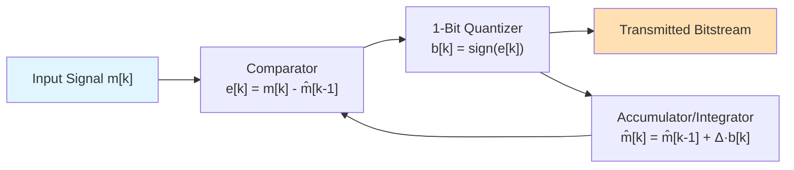

# Delta Modulation (DM) System Overview

**Delta Modulation (DM)** is a simplified and highly efficient form of [[../class lecture 6,7/3.1 DPCM System Overview|Differential Pulse Code Modulation (DPCM)]]. It can be considered the most basic implementation of differential waveform encoding, as it uses a **1-bit quantizer** and a simple [[../class lecture 6,7/3.2 Prediction in DPCM|first-order predictor]].

## Principle

Instead of transmitting a multi-bit code for the difference signal, a Delta Modulator transmits only a single bit per sample. This bit indicates whether the current signal sample is greater or smaller than the previous reconstructed sample.

-   If the current sample is larger, a `+Δ` step is taken.
-   If the current sample is smaller, a `-Δ` step is taken.

The output of the DM encoder is a stream of bits representing the direction of change. The reconstructed signal at both the transmitter's feedback loop and at the receiver is a **staircase approximation** of the original analog signal.

## Delta Modulator (Transmitter) Block Diagram

1.  **Input Signal:** The analog input signal is denoted by $m(t)$. It is sampled at a rate $f_s$, which is typically much higher than the Nyquist rate for DM (a practice called oversampling). Let the sampled signal be $m[k]$.
2.  **Comparator:** The current input sample $m[k]$ is compared to the previously reconstructed sample, $\hat{m}[k-1]$. The output of the comparator, $e[k]$, determines the sign of the error.
    $e[k] = m[k] - \hat{m}[k-1]$
3.  **1-Bit Quantizer:** This is the core of DM. It is simply a hard limiter or a sign function.
    -   If $e[k] > 0$, the quantizer outputs a positive pulse (+1), representing a step up.
    -   If $e[k] < 0$, the quantizer outputs a negative pulse (-1), representing a step down.
    The output bit, $b[k]$, is transmitted.
4.  **Accumulator/Integrator (Predictor):** The predictor in DM is a simple accumulator. It adds the quantized output (scaled by a step size $\Delta$) to the previous predicted value. This creates the staircase approximation.
    $\hat{m}[k] = \hat{m}[k-1] + \Delta \cdot b[k]$
    This new value, $\hat{m}[k]$, is stored and used as the prediction for the next sample interval.

The transmitted bitstream is essentially the sign of the difference between the signal and its staircase approximation.

## Delta Demodulator (Receiver) Block Diagram

The receiver is remarkably simple and mirrors the feedback loop of the transmitter.

1.  **Decoder:** The incoming bits $b[k]$ are converted into pulses of height $+\Delta$ or $-\Delta$.
2.  **Accumulator/Integrator:** The pulses are fed into an accumulator (an integrator). This accumulator simply sums up the received step commands, perfectly recreating the same staircase approximation, $\hat{m}[k]$, that was generated at the transmitter.
    $\hat{m}[k] = \hat{m}[k-1] + \Delta \cdot b[k]$
3.  **Low-Pass Filter:** The staircase signal $\hat{m}[k]$ is passed through a low-pass filter to smooth out the steps and recover an approximation of the original analog signal.

## Limitations

Delta Modulation is simple and requires a very low bit rate ($R = f_s \times 1 = f_s$). However, it suffers from two fundamental types of quantization error:

1.  **[[4.2 Slope Overload Distortion|Slope Overload Distortion]]**: Occurs when the analog signal changes too rapidly for the staircase to keep up.
2.  **[[4.3 Granular Noise|Granular Noise]]**: Occurs when the analog signal is relatively flat, and the staircase approximation "hunts" or oscillates around it.

These limitations can be partially addressed by [[4.4 Adaptive Delta Modulation|Adaptive Delta Modulation]], which allows the step size $\Delta$ to change based on the signal's characteristics.

---
**Parent:** [[../MOC|MOC (Map of Content)]]
