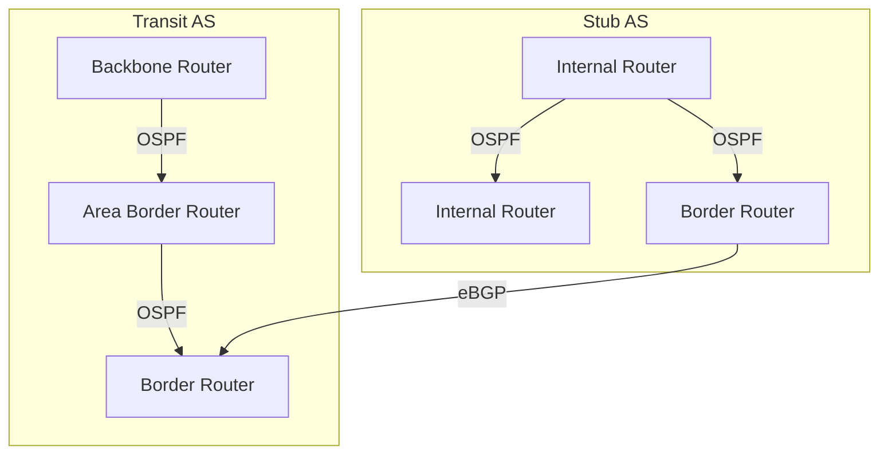

# Autonomous Systems (AS)

An **Autonomous System (AS)** is a large, administratively defined network or group of networks under a single technical administration, presenting a unified routing policy to the Internet. ASes are the fundamental building blocks of Internet routing and interconnection.

## 1. Definition and Role

- An AS is identified by a unique Autonomous System Number (ASN), assigned by a regional Internet registry (RIR).
- An AS may consist of thousands of routers and subnets, but all routers within an AS share a consistent internal routing policy and external routing relationships.
- ASes are the units of policy and control in interdomain routing (BGP). Each AS can set its own import/export rules, filtering, and path preferences.

## 2. Types of Autonomous Systems

- **Stub AS:**
  - Connects to only one other AS (usually a single upstream provider).
  - Does not provide transit for other ASes; only carries traffic to/from its own networks.
  - Examples: small businesses, universities, or organizations with a single ISP.

- **Multihomed AS:**
  - Connects to two or more upstream providers, but does not provide transit for other ASes.
  - Increases redundancy and reliability; can select best path for outbound traffic.
  - Example: a large enterprise with contracts to two ISPs for failover.

- **Transit AS:**
  - Connects to multiple ASes and provides transit service, carrying traffic that neither originates nor terminates within the AS.
  - Examples: ISPs, Tier-1 and Tier-2 providers.

## 3. ASN (Autonomous System Number)

- **16-bit ASN:** Range 0–65535 (original format; some reserved for private use).
- **32-bit ASN:** Extended range (0–4,294,967,295) to accommodate Internet growth.
- **Private ASN:** 64512–65535 (16-bit) and 4200000000–4294967294 (32-bit); used for internal routing, not advertised globally.

## 4. Router Roles within an AS

- **Internal Routers:** Operate entirely within the AS, exchanging routes using an Interior Gateway Protocol (IGP) such as OSPF or IS-IS.
- **Area Border Routers (ABR):** In protocols like OSPF, connect different areas (e.g., area 0 to area 1), summarizing and filtering routes between areas.
- **Backbone Routers:** Form the core of the AS (e.g., OSPF area 0), responsible for inter-area traffic.
- **Border Routers (Edge Routers):** Connect the AS to external ASes, running both IGP (internal) and BGP (external) protocols. They enforce routing policy, filter routes, and manage import/export of prefixes.

## 5. Internal Routing: IGPs

- **OSPF (Open Shortest Path First):** Link-state protocol, supports hierarchical design with areas, fast convergence, and route summarization.
- **IS-IS (Intermediate System to Intermediate System):** Similar to OSPF, widely used in large ISPs.
- **RIP (Routing Information Protocol):** Distance-vector, rarely used in modern large ASes due to scalability limits.

## 6. External Routing: BGP

- **eBGP (External BGP):** Used between border routers of different ASes to exchange reachability information and enforce policy.
- **iBGP (Internal BGP):** Used within an AS to distribute external routes to all routers; requires a full mesh or route reflectors for scalability.
- **Policy Control:** BGP allows each AS to control which routes are advertised, accepted, or preferred, based on business agreements, security, and technical requirements.

## 7. Load Balancing and Traffic Engineering

- **Edge/Segment Load Balancing:** Distributes traffic across multiple links (e.g., multiple upstream providers or inter-area links) to optimize bandwidth, redundancy, and reliability.
- **Traffic Engineering:** Adjusts routing to optimize network performance, avoid congestion, and meet service-level agreements (SLAs). Techniques include BGP attributes (local preference, AS path prepending, MED), OSPF cost tuning, and MPLS.

## 8. Quality of Service (QoS) and ToS

- **Type of Service (ToS):** Field in the IP header (now DSCP) used to indicate desired service characteristics (delay, throughput, reliability, precedence).
- **DiffServ (Differentiated Services):** Architecture for scalable QoS, classifies and manages traffic using DSCP values, enabling priority for real-time or critical applications.

## 9. Security and Filtering

- **Prefix Filtering:** Prevents accidental or malicious advertisement of incorrect routes (route leaks, hijacks).
- **Route Validation:** Use of RPKI (Resource Public Key Infrastructure) to cryptographically verify route origin.
- **BGP Session Security:** MD5 authentication, TTL security, and monitoring for BGP session hijacking or misconfiguration.

## 10. Real-World Example: ISP AS Topology

This diagram shows a stub AS (single provider) and a transit AS (multiple connections), with internal OSPF and external BGP.

## 11. Further Reading

- [[Internet Structure and ISP Hierarchy]]
- [[Routing Protocols]]
- [[BGP and Interdomain Routing]]
- [[ISP Business Relationships]]
- [[Type of Service and DiffServ]]
