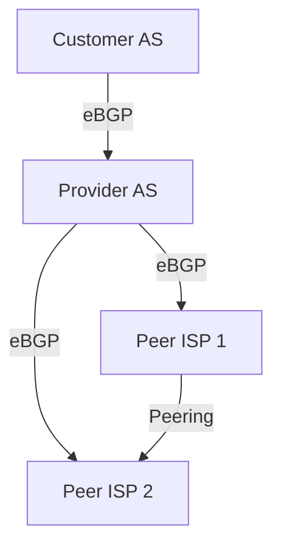

# BGP and Interdomain Routing

**Border Gateway Protocol (BGP)** is the de facto standard for interdomain routing on the Internet, enabling Autonomous Systems (ASes) to exchange reachability information and enforce routing policies at a global scale.

## 1. BGP Fundamentals

- **Type:** Path vector protocol (BGP-4 is the current version).
- **Scope:** Used for routing between ASes (eBGP) and within an AS for distributing external routes (iBGP).
- **Operation:**
  - Routers exchange UPDATE messages containing network prefixes and AS path information.
  - Each route advertisement includes the full AS path, enabling loop prevention and policy enforcement.
  - BGP routers maintain a Routing Information Base (RIB) with all received routes and select the best path based on policy and attributes.

## 2. BGP Attributes and Path Selection

- **AS_PATH:** Sequence of ASes a route has traversed; used for loop detection and path selection (shortest path preferred).
- **NEXT_HOP:** IP address of the next-hop router for the route.
- **LOCAL_PREF:** Indicates preference for outbound traffic within an AS (higher is preferred).
- **MULTI_EXIT_DISC (MED):** Suggests preferred entry points into an AS for inbound traffic (lower is preferred).
- **COMMUNITY:** Tag for grouping routes and applying policy actions.
- **ORIGIN:** Indicates how the route was learned (IGP, EGP, or incomplete).

**Path Selection Process:**
1. Highest LOCAL_PREF
2. Shortest AS_PATH
3. Lowest ORIGIN type (IGP < EGP < incomplete)
4. Lowest MED
5. eBGP over iBGP
6. Lowest IGP metric to NEXT_HOP
7. Oldest route
8. Lowest router ID

## 3. BGP Routing Policies and Business Relationships

- **Customer-Provider:**
  - Customer pays provider for Internet access (transit).
  - Provider advertises all routes to customer; customer advertises only its own and its customers' routes to provider.
- **Peering:**
  - Two ISPs exchange traffic between their own customers without payment.
  - Peers do not provide transit for each other to third parties.
  - Reduces costs, improves performance, but requires negotiation and management.
- **Non-transit AS:**
  - Does not carry traffic for others (e.g., enterprise, campus network).

**Policy Enforcement:**
- BGP import/export filters, route maps, and prefix lists control which routes are accepted, advertised, or preferred.
- Policies are based on business agreements, security, and technical requirements.

## 4. BGP Scalability and Security

- **Scalability:**
  - BGP supports hundreds of thousands of prefixes and thousands of ASes.
  - Route reflectors and confederations reduce iBGP mesh complexity within large ASes.
- **Security:**
  - Prefix filtering, max-prefix limits, and RPKI (Resource Public Key Infrastructure) for origin validation.
  - BGP session authentication (MD5), TTL security, and monitoring for route leaks/hijacks.

## 5. ASN and BGP

- **ASN (Autonomous System Number):** Unique identifier for each AS, included in BGP path advertisements.
- **16-bit and 32-bit ASN:** Support for Internet growth; private ASNs for internal use.
- **ASN Assignment:** Managed by RIRs (ARIN, RIPE, APNIC, etc.).

## 6. Real-World Example: BGP Policy and Traffic Flow

This diagram shows a customer-provider relationship and peering between ISPs. BGP policies determine which routes are advertised and which traffic is allowed to flow.

## 7. Further Reading

- [[Routing Protocols]]
- [[Internet Structure and ISP Hierarchy]]
- [[ISP Business Relationships]]
