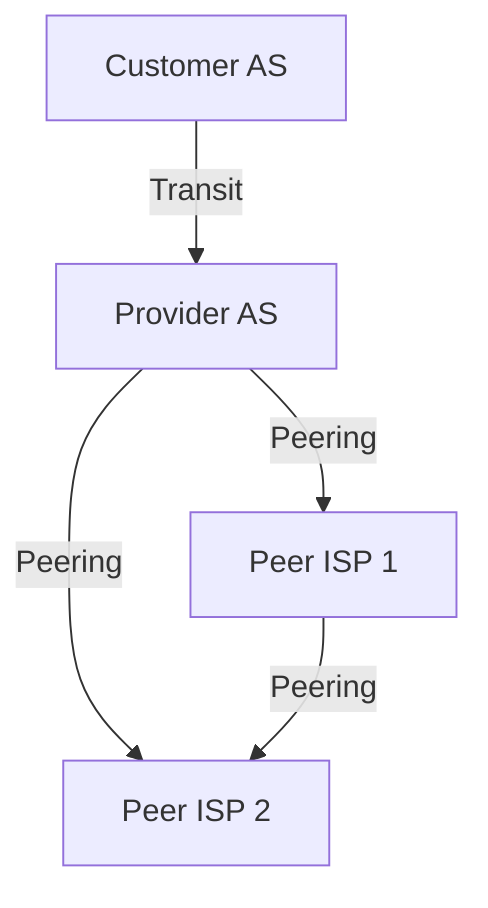

# ISP Business Relationships: Transit and Peering

Internet Service Providers (ISPs) form complex business relationships that shape the flow of traffic and the economics of the global Internet. The two primary relationships are **transit** and **peering**.

## 1. Transit

- **Definition:** A contractual relationship where a customer pays a provider for full Internet access (transit). The provider agrees to carry the customer's traffic to all destinations on the Internet and to accept traffic from the Internet destined for the customer.
- **Provider:** Sells Internet access (transit) to customers, typically with Service Level Agreements (SLAs) for reliability and performance.
- **Customer:** Pays for the ability to send/receive data to/from the global Internet.
- **Non-transit AS:** Only carries its own traffic; does not provide transit for others (e.g., enterprise, campus network).
- **Transit Agreements:** Specify pricing (per Mbps, flat rate), traffic ratios, and technical requirements (e.g., BGP session setup, prefix limits).

## 2. Peering

- **Definition:** Two ISPs connect directly to exchange traffic between their own customers (and their customers' customers), but do not provide transit to third parties.
- **No Payment:** Peers do not pay each other for traffic exchange; the relationship is typically settlement-free.
- **No Transit:** Peers do not carry each other's traffic to other networks (no "free ride" to the rest of the Internet).
- **Benefits:**
	- Reduces upstream transit costs by keeping local traffic local.
	- Can improve performance and reduce latency.
	- Increases redundancy and resilience.
- **Peering Agreements:** May be formal (written contract) or informal (handshake), and often specify traffic ratios, minimum traffic volumes, and technical requirements.
- **Disputes:** Peering disputes can lead to de-peering, causing parts of the Internet to become temporarily unreachable.

## 3. Traffic Flow and Policy

- **Solid lines:** Allowed traffic (e.g., customer to provider, peer to peer for customer traffic).
- **Dashed lines:** Disallowed traffic (e.g., peer to non-customer network, customer to customer via a peer).
- **Policy Enforcement:** BGP import/export filters and route maps ensure that only permitted traffic flows according to business agreements.

## 4. Real-World Example: ISP Relationship Diagram

This diagram shows a customer-provider relationship and peering between ISPs. Only customer and peer traffic is exchanged; transit to third parties is not allowed via peering.

## 5. Economic and Policy Implications

- **Transit:** Drives the business model of Tier-1 and Tier-2 ISPs; customers pay for global reachability.
- **Peering:** Reduces costs, increases efficiency, but can be contentious due to traffic imbalances or competitive concerns.
- **IXPs (Internet Exchange Points):** Facilitate peering by providing a neutral location for ISPs to interconnect.

## 6. Further Reading

- [[BGP and Interdomain Routing]]
- [[Internet Structure and ISP Hierarchy]]
- [[Autonomous Systems]]
