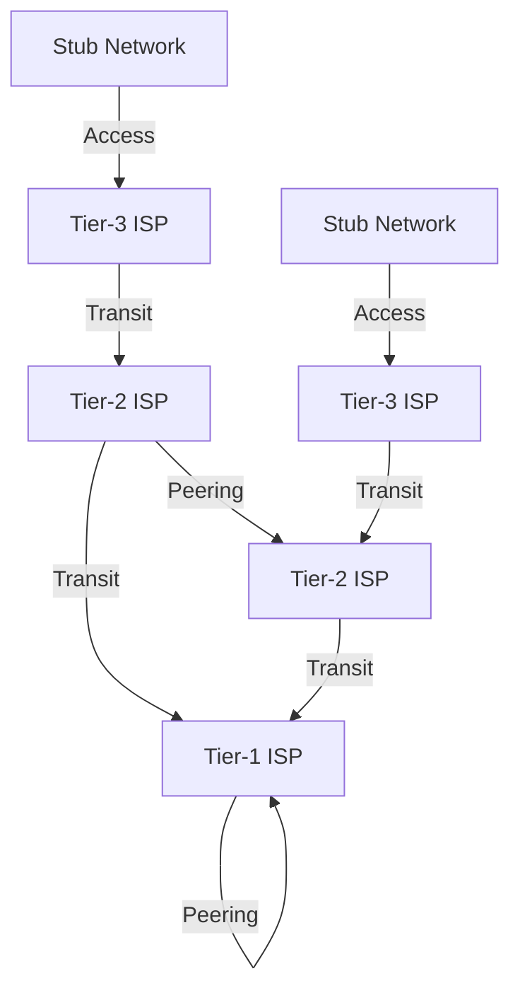

# Internet Structure and ISP Hierarchy

The Internet is a vast, decentralized network of networks, structured as a hierarchy of interconnected domains managed by Internet Service Providers (ISPs) and Autonomous Systems (ASes). This structure enables global connectivity, scalability, and policy enforcement.

## 1. Global Internet Topology

- The Internet is not a flat mesh; it is organized into a multi-tiered hierarchy of ISPs and ASes, each with distinct roles and business relationships.
- At the top are Tier-1 ISPs, which form the backbone of the Internet, interconnecting with each other and providing global reachability.
- Lower tiers (Tier-2, Tier-3) connect to higher tiers for transit and may peer with each other for efficiency and cost savings.

## 2. ISP Tiers and Roles

- **Tier-1 ISP:**
  - Large, global providers (e.g., AT&T, NTT, Level 3) with direct connections to all other Tier-1s.
  - Do not pay for transit; exchange traffic via settlement-free peering.
  - Provide transit to lower-tier ISPs and large enterprises.

- **Tier-2 ISP:**
  - Regional or national ISPs; connect to Tier-1s for global reach and peer with other Tier-2s for efficiency.
  - Pay for transit to Tier-1s, may have paid or settlement-free peering with other Tier-2s.
  - Serve as providers for Tier-3 ISPs and large organizations.

- **Tier-3 ISP / Access ISP:**
  - Local ISPs that connect end-users (homes, businesses) to the Internet.
  - Purchase transit from higher-tier ISPs; may not have any peering relationships.

## 3. Stub Networks and Access Networks

- **Stub Network:**
  - A network (e.g., home, business, university) that connects to the Internet via a single ISP.
  - Does not provide transit for other networks; only sends/receives its own traffic.

- **Access Network:**
  - The segment of the network that connects end-users to their ISP (e.g., DSL, cable, fiber, wireless access).
  - Responsible for last-mile delivery and aggregation of user traffic.

## 4. Autonomous System Numbers (ASN)

- **16-bit ASN:** Range 0–65535; original format, now largely exhausted.
- **32-bit ASN:** Range 0–4,294,967,295; supports Internet growth.
- **Private ASN:** 64512–65535 (16-bit), 4200000000–4294967294 (32-bit); used for internal routing, not advertised globally.
- **ASN Assignment:** Managed by Regional Internet Registries (RIRs) such as ARIN, RIPE, APNIC, LACNIC, AFRINIC.

## 5. Peering and Transit Relationships

- **Transit:** Lower-tier ISPs or organizations pay higher-tier ISPs for access to the global Internet.
- **Peering:** ISPs exchange traffic directly, usually without payment, to reduce costs and improve performance. Peering can be public (at Internet Exchange Points) or private (direct links).
- **Settlement-Free Peering:** Common among Tier-1 ISPs; no money changes hands, as both parties benefit equally.

## 6. Internet Exchange Points (IXPs)

- Physical infrastructure where multiple ISPs and networks interconnect and exchange traffic.
- IXPs reduce the need for expensive transit, lower latency, and improve redundancy.
- Examples: DE-CIX (Frankfurt), LINX (London), AMS-IX (Amsterdam).

## 7. Real-World Topology Diagram

This diagram illustrates the hierarchical structure and relationships between ISPs and stub networks.

## 8. Policy and Routing Implications

- The hierarchical structure enables scalable routing (BGP aggregation, prefix summarization) and enforces business policies (who can send traffic where).
- Routing policies are implemented via BGP, with each AS controlling import/export of routes and path selection based on business agreements.

## 9. Further Reading

- [[Autonomous Systems]]
- [[Routing Protocols]]
- [[BGP and Interdomain Routing]]
- [[ISP Business Relationships]]
