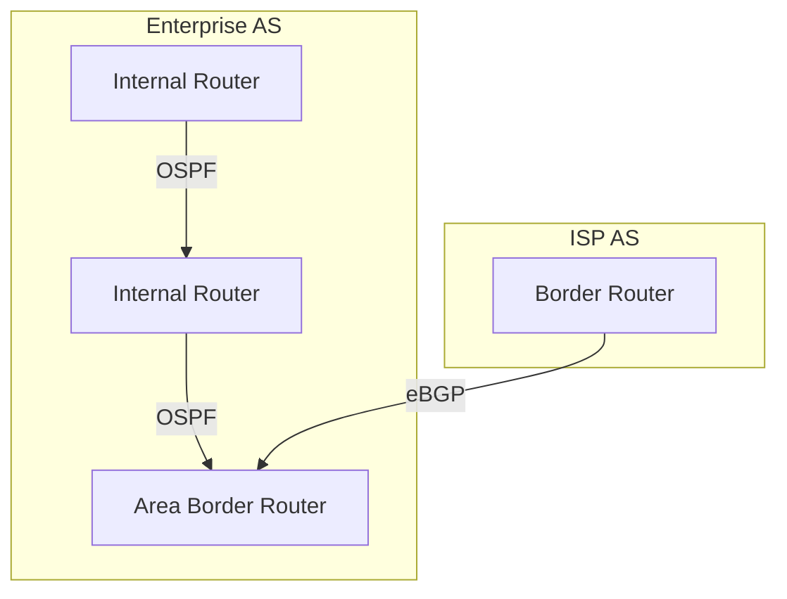

# Routing Protocols: Intra-domain and Inter-domain

Routing protocols are algorithms and standards that enable routers to exchange information, build routing tables, and determine optimal paths for forwarding packets across networks. They are divided into two main categories: intra-domain (within an AS) and inter-domain (between ASes).

## 1. Intra-domain Routing Protocols (IGP)

**Interior Gateway Protocols (IGPs)** operate within a single Autonomous System (AS). Their primary goals are fast convergence, scalability, and efficient use of network resources.

### 1.1 OSPF (Open Shortest Path First)
- **Type:** Link-state protocol (standardized as OSPFv2 for IPv4, OSPFv3 for IPv6).
- **Operation:**
  - Routers exchange Link State Advertisements (LSAs) describing their local connectivity.
  - Each router builds a complete map (link-state database) of the AS topology.
  - Dijkstra's algorithm is used to compute shortest paths.
- **Areas and Hierarchy:**
  - OSPF supports hierarchical design with areas (area 0 is the backbone).
  - Area Border Routers (ABRs) connect non-backbone areas to area 0.
  - Reduces routing table size and limits LSA flooding.
- **Route Summarization:**
  - ABRs and Autonomous System Boundary Routers (ASBRs) can summarize routes to reduce advertisement size.
- **Authentication and Security:**
  - Supports plain-text and cryptographic authentication for LSA exchanges.

### 1.2 IS-IS (Intermediate System to Intermediate System)
- **Type:** Link-state protocol, similar to OSPF, widely used in large ISPs.
- **Features:**
  - Flexible addressing (CLNS, IP), supports large topologies, fast convergence.
  - Uses Level 1 (intra-area) and Level 2 (inter-area) hierarchy.

### 1.3 RIP (Routing Information Protocol)
- **Type:** Distance-vector protocol.
- **Operation:**
  - Routers periodically advertise their routing tables to neighbors.
  - Uses hop count as the metric (max 15 hops).
- **Limitations:**
  - Slow convergence, not suitable for large or complex networks.

## 2. Inter-domain Routing Protocols (EGP)

**Exterior Gateway Protocols (EGPs)** operate between different ASes. The primary protocol is BGP.

### 2.1 BGP (Border Gateway Protocol)
- **Type:** Path vector protocol (current version is BGP-4).
- **Operation:**
  - Routers exchange BGP UPDATE messages containing network reachability and AS path information.
  - Each route advertisement includes the full AS path, enabling loop prevention and policy enforcement.
- **Policy-Based Routing:**
  - Routing decisions are based on business agreements, security, and technical preferences, not just shortest path.
  - BGP attributes (AS_PATH, LOCAL_PREF, MED, COMMUNITY) influence route selection.
- **Scalability:**
  - Designed to handle the global Internet's size and complexity.
- **Route Filtering and Security:**
  - Prefix filtering, route maps, RPKI for origin validation, and session authentication.

## 3. Path Vector vs Distance Vector vs Link State

- **Distance Vector:**
  - Routers advertise only the cost (metric) to reach each destination (e.g., RIP, EIGRP).
  - Prone to routing loops and slow convergence.
- **Link State:**
  - Routers advertise their local connectivity (links) to all routers (e.g., OSPF, IS-IS).
  - Each router computes the full topology and shortest paths.
- **Path Vector:**
  - Routers advertise the full path (sequence of ASes) to each destination (e.g., BGP).
  - Enables loop prevention and policy enforcement at the interdomain level.

## 4. Real-World Example: OSPF and BGP in an ISP

This diagram shows OSPF used within an enterprise AS and BGP used for inter-AS routing.

## 5. Further Reading

- [[Autonomous Systems]]
- [[Internet Structure and ISP Hierarchy]]
- [[BGP and Interdomain Routing]]
- [[ISP Business Relationships]]
