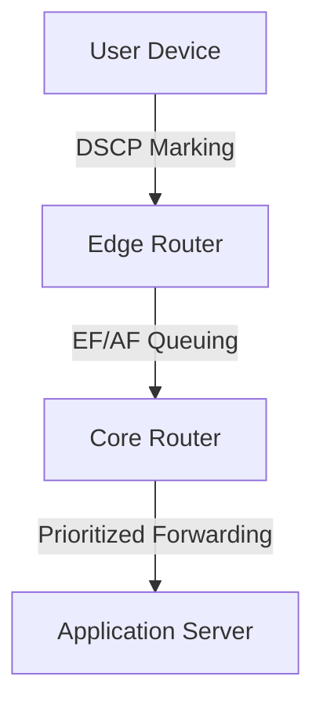

# Type of Service (ToS) and Differentiated Services (DiffServ)

Quality of Service (QoS) mechanisms in IP networks enable differentiated treatment of packets based on application requirements, business priorities, and network policies. The two main approaches are the legacy Type of Service (ToS) field and the modern Differentiated Services (DiffServ) architecture.

## 1. Type of Service (ToS)

- **Definition:** The ToS field is an 8-bit field in the IPv4 header (replaced by the DS field in IPv6) used to specify desired service characteristics for a packet.
- **Original ToS Bits:**
	- Precedence (3 bits): Priority of the packet (e.g., routine, priority, immediate).
	- Delay (1 bit): Low delay required.
	- Throughput (1 bit): High throughput required.
	- Reliability (1 bit): High reliability required.
	- Cost (1 bit): Minimize monetary cost.
- **Purpose:** Allows routers and switches to make forwarding and queuing decisions based on application needs (e.g., voice, video, file transfer).
- **Limitations:** Rarely used in practice due to lack of standardization and scalability.

## 2. Differentiated Services (DiffServ)

- **Definition:** A scalable, modern approach to providing multiple levels of service in IP networks, replacing the legacy ToS model.
- **DS Field (DSCP):**
	- The first 6 bits of the DS field in the IP header are the Differentiated Services Code Point (DSCP), which specifies the per-hop behavior (PHB) for the packet.
- **Per-Hop Behaviors (PHB):**
	- **Default (Best Effort):** No special treatment; all packets are equal.
	- **Expedited Forwarding (EF):** Low loss, low latency, low jitter (e.g., VoIP, real-time video).
	- **Assured Forwarding (AF):** Four classes, each with three drop precedences; enables differentiated loss and delay guarantees.
- **Traffic Classification and Marking:**
	- Edge routers classify packets based on application, source/destination, or other criteria and mark the DSCP value accordingly.
- **Queuing and Scheduling:**
	- Core routers use DSCP to place packets into different queues, apply scheduling algorithms (e.g., weighted fair queuing), and enforce policies (e.g., rate limiting, policing).
- **Applications:**
	- Prioritizes real-time traffic (voice, video) over best-effort (web, email), supports Service Level Agreements (SLAs), and enables traffic engineering.

## 3. Real-World Example: DiffServ in an Enterprise Network

This diagram shows how packets are classified and marked at the edge, then prioritized in the core based on DSCP.

## 4. Further Reading

- [[Autonomous Systems]]
- [[Routing Protocols]]
- [[Internet Structure and ISP Hierarchy]]
