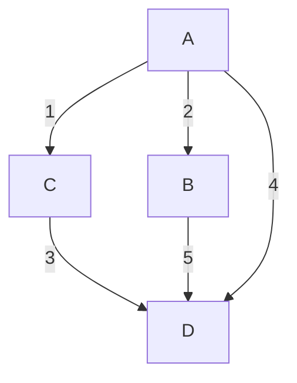

# Practice Questions: Routing Algorithms

This file contains questions based on the provided notes. The difficulty increases gradually. Good luck with your test!

---

## Part 1: Foundational Concepts (Easy)

1.  What is the fundamental difference between an adaptive and a non-adaptive routing algorithm?
2.  What is the simplest, most brute-force routing algorithm, and what are its two main problems?
3.  What are the three essential columns in a Distance Vector Routing (DVR) table?
4.  In Link State Routing (LSR), what is the primary purpose of running Dijkstra's algorithm?
5.  What does the "Open" in OSPF signify?

---

## Part 2: Mechanisms & Protocols (Medium)

1.  Explain the "Count-to-Infinity" problem in DVR using a simple `A --- B --- C` network diagram where the link between B and C fails.
2.  How does the "Split-Horizon" technique attempt to solve the "Count-to-Infinity" problem?
3.  In Link State Routing, what are the two main problems that **Sequence Numbers** in LSPs are designed to solve?
4.  Why is the "Age" field necessary in an LSP? Describe a specific scenario where its absence would cause a permanent routing failure.
5.  What are two critical parameters that MUST match in OSPF Hello packets for two routers to become neighbors?
6.  Explain the most effective method to prevent infinite loops and duplicate packets in a Flooding algorithm.
7.  Why is there a conflict between Fairness and Optimality in routing? Use a simple example.

---

## Part 3: Quizzes (Multiple Choice)

1.  Which technique is an *aggressive* version of Split-Horizon?
    a) Triggered Updates
    b) Poison Reverse
    c) TTL
    d) OSPF

2.  In LSR, if a router receives an LSP with a sequence number *lower* than the one it has stored for the source router, what will it do?
    a) Accept and forward the LSP
    b) Update its own sequence number
    c) Discard the LSP
    d) Send an error message back to the sender

3.  What is the destination multicast address for OSPF Hello packets?
    a) 224.0.0.1
    b) 224.0.0.5
    c) 224.0.0.9
    d) 255.255.255.255

4.  A packet's Hop Count (or TTL) is used to control which problem in Flooding?
    a) Network Congestion
    b) Incorrect Path Finding
    c) Infinite Loops
    d) Both a) and c)

5.  The "Shortest Path" in a routing algorithm is always the one with the fewest hops.
    a) True
    b) False

---

## Part 4: Problem Solving (Hard)

**Problem 1: Dijkstra's Algorithm**

Consider the following network graph, where the numbers represent the cost of the link.

Starting from source node **A**, use Dijkstra's algorithm to find the shortest path to all other nodes. For each step of the algorithm, show:
- The set of visited nodes.
- The current shortest distance and predecessor for every node (B, C, D).

**Problem 2: Distance Vector Routing - "Count-to-Infinity"**

Consider the linear network: `A --- B --- C`.
- Link costs are 1 for A-B and 1 for B-C.
- Initially, the network is stable.
- The link between **B and C fails**.

**Initial State (Stable):**
- **Router A's Table:** `(Dest: C, Dist: 2, Next: B)`
- **Router B's Table:** `(Dest: C, Dist: 1, Next: C)`

Now, the B-C link fails. B detects this and updates its distance to C to $\infty$. However, before B can send its new table to A, A sends its periodic update to B.

Trace the state of the routing tables for both **A and B** for the **next 3 update cycles**, showing how they "count to infinity" for destination C. Assume they exchange tables simultaneously in each cycle.
