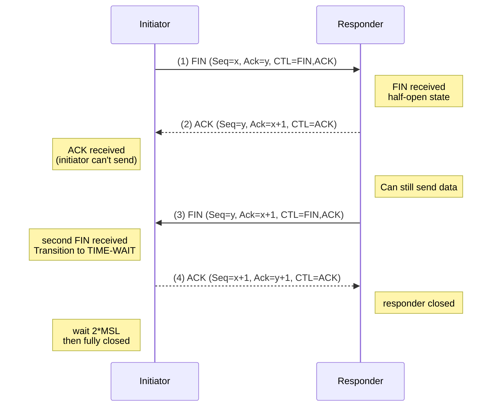

# Connection Release

## Purpose

**Connection release** (or connection termination) is the protocol sequence by which two communicating processes explicitly close their connection. Unlike the [[Three-Way_Handshake|three-way handshake]] which establishes connection, release must handle asymmetric scenarios:

1. **Bidirectional communication**: One side may finish sending while the other still has data
2. **Graceful closure**: Outstanding data must be delivered before connection is destroyed
3. **Abrupt closure**: A process may crash or force disconnect immediately
4. **Lost ACKs**: Final acknowledgment may be lost; protocol must handle this

## Graceful Connection Release

### Four-Way Handshake (Normal Close)

The standard TCP connection release uses a four-way exchange:



### Detailed Exchange

#### Segment 1: Initiator FIN

**Sent by**: Process that wants to close (client or server)

**Composition**:
- Sequence number: $x$ (current position in sequence)
- Acknowledgment number: $y$ (confirms received data)
- Flags: FIN set, ACK set
- Data payload: May contain final data being sent

**Semantics**:
- "I have no more data to send"
- "I am closing my send side"
- Receiver can still send data to initiator

**State change at initiator**:
- Transitions from ESTABLISHED to FIN-WAIT-1
- Cannot send more data (attempted SEND returns error)
- Can still receive data

**Example**:
```
Client (who initiated connection):
FIN segment at current sequence position
Server has nothing left to send to client
```

#### Segment 2: Responder ACK

**Sent by**: Process receiving the FIN

**Composition**:
- Sequence number: $y$ (current position)
- Acknowledgment number: $x + 1$ (acknowledges FIN as single sequence unit)
- Flags: ACK set, FIN not set
- Data payload: May send final data

**Semantics**:
- "I received your FIN"
- "I acknowledge you have finished sending"
- "I may send more data; I'm not done yet"

**State change at responder**:
- Transitions from ESTABLISHED to CLOSE-WAIT
- Can still send data to initiator
- Cannot receive new data from initiator (already received FIN)

**State change at initiator**:
- Transitions from FIN-WAIT-1 to FIN-WAIT-2
- Waiting for responder's FIN
- Still receiving data if responder sends more

#### Segment 3: Responder FIN

**Sent by**: Process that originally received FIN, now finished sending

**Composition**:
- Sequence number: $y'$ (may be different from Segment 2 if data was sent between)
- Acknowledgment number: $x + 1$ (still acknowledging initiator's FIN)
- Flags: FIN set, ACK set
- Data payload: None (FIN marks end of data)

**Semantics**:
- "I also have no more data to send"
- "I am now closing my send side"
- "You can now close completely"

**State change at responder**:
- Transitions from CLOSE-WAIT to LAST-ACK
- Waiting for final ACK of this FIN
- Cannot send or receive more

**State change at initiator**:
- Transitions from FIN-WAIT-2 to TIME-WAIT
- Received all data; connection logically closed
- Must wait before fully releasing resources

#### Segment 4: Initiator ACK

**Sent by**: Process in TIME-WAIT state

**Composition**:
- Sequence number: $x + 1$
- Acknowledgment number: $y' + 1$
- Flags: ACK set, FIN not set
- Data payload: None

**Semantics**:
- "I received your FIN"
- "Connection is now closed"
- "I will not send or receive more"

**State change at responder**:
- Transitions from LAST-ACK to CLOSED
- Connection fully released
- Resources freed

**State change at initiator**:
- Remains in TIME-WAIT state
- Will not send/receive on this connection
- After timeout (2×MSL), transitions to CLOSED

## Why Four Segments?

### Cannot Be Reduced to Three

Suppose we used three-way close (initiator FIN, responder FIN-ACK, initiator ACK):

**Problem**: What if initiator's final ACK is lost?

```
Initiator sends FIN-ACK (Segment 1)
Responder receives, sends FIN-ACK (Segment 2)
Initiator receives, sends ACK (Segment 3) — but it's lost
Responder waits forever for Segment 3
Responder connection hangs in LAST-ACK state
```

**Solution**: Four-way exchange:
- Responder ACKs independently (Segment 2)
- Then sends its own FIN (Segment 3)
- Even if final ACK lost, responder knows initiator received its FIN-ACK

#### Two-Way Close Possibility

TCP allows **two-way simultaneous close**: Both sides send FIN simultaneously

```
Side A sends FIN (Seq=100, Ack=200)      Side B sends FIN (Seq=200, Ack=100)
                                     →     
         (crosse in flight) — ↓ ←
Side A receives FIN at Seq=200
Sends ACK (Seq=101, Ack=201)             Side B receives FIN at Seq=100
                                          Sends ACK (Seq=201, Ack=101)
```

Result: Both transition directly through FIN-WAIT-1 to TIME-WAIT when receiving cross-FIN.

Even so, minimum is still four total segments.

## TIME-WAIT State

### Purpose

After initiator sends final ACK, it enters TIME-WAIT state:

**Problem it solves:**

1. **Lost final ACK**: If Segment 4 is lost, responder retransmits FIN. Initiator in TIME-WAIT can receive it and resend ACK.

2. **Old packets in network**: Residual packets from closed connection may arrive after closure. TIME-WAIT ensures these ancient packets don't confuse new connections reusing the same 4-tuple.

### Duration

**Standard value**: 2×MSL (Maximum Segment Lifetime)

- MSL = maximum time a segment can live in network (typically 120 seconds in practice, 30 seconds in IANA spec)
- 2×MSL = 240 seconds typical (though varies by OS)

**Reasoning**:
- Initiator sends final ACK
- If lost, responder's FIN retransmits after timeout (MSL)
- Retransmitted FIN may take MSL to traverse network
- Initiator in TIME-WAIT for 2×MSL can receive and ACK this retransmitted FIN
- After 2×MSL, all segments from this connection cannot exist in network

### Consequences

**Port Reuse Limitation**:
- Socket (IP:port pair) enters TIME-WAIT after close
- Cannot immediately rebind to same port
- Initiator of close waits 2×MSL; responder (CLOSED state) can reuse immediately

**Example**:
```
Server closes connection first
→ Enters TIME-WAIT
→ Wait 240 seconds
→ Then port can be reused for new listening

Client closes connection first
→ Server enters TIME-WAIT
→ Client can reuse its ephemeral port immediately
```

This asymmetry is why servers that close gracefully experience delays before restarting if they crashed unexpectedly.

## Abrupt Connection Release

### RST (Reset) Segment

In contrast to graceful four-way close, a **reset** terminates connection abruptly:

**Segment composition**:
- Flags: RST set, ACK typically set
- Data: None
- Sequence/ACK numbers: Valid for current connection

**Semantics**:
- "Terminate connection immediately"
- "Do not wait for outstanding data"
- "Discard send and receive buffers"

**Causes for RST**:

1. **Host crash**: Peer reboots; no connection state. If data arrives from old connection, host sends RST.

2. **Port not listening**: Segment arrives for port with no listening process. OS sends RST.

3. **Connection abort**: Application calls ABORT (different from graceful CLOSE).

4. **Timeout**: No communication for extended period; connection aborted with RST.

### Receiving RST

**Effect**:
- Immediately close connection
- Clear receive and send buffers
- Report error to application (connection reset by peer)
- No further communication possible

**Unlike FIN**: Receiver does not send RST in response. RST is terminal.

### Why RST Exists

**TCP assumption**: Connections should close gracefully when possible

**Reality**: Processes crash, networks fail, errors occur. RST provides immediate termination when needed.

## Half-Open Connections

### Definition

**Half-open connection**: One side has closed (sent FIN), other side has not.

### Valid Transitions

After one side sends FIN:

**Sender of FIN**:
- Can no longer send data
- Can still receive data
- In FIN-WAIT-1 or FIN-WAIT-2 state

**Receiver of FIN**:
- Received notification that sender finished
- Can still send data to sender (hasn't sent its own FIN)
- In CLOSE-WAIT state

### Use Cases

1. **HTTP requests**: Client sends request (FIN), server sends response, server sends FIN

2. **Remote login**: Client sends command (FIN), server processes and sends output (FIN)

3. **Streaming**: Server sends stream (FIN), client closes independently

Half-open state is **expected and normal** during graceful close.

## Connection Abortion

### Difference from Graceful Close

| Aspect | Graceful Close | Abortion |
|---|---|---|
| **Segments** | Four-way exchange (FIN, ACK, FIN, ACK) | One RST segment |
| **Data delivery** | Outstanding data transmitted | Outstanding data discarded |
| **Timing** | Waits for peer and TIME-WAIT period | Immediate |
| **State of peer** | Clean closure knowledge | May not know connection aborted |
| **Use** | Normal operation | Errors, crashes, timeouts |

## Crash Recovery

### Client Crash

**Scenario**: Client process crashes; server still has active connection

**Server behavior**:
- Connection remains ESTABLISHED
- If server tries to SEND, no response from client
- After timeout (keep-alive probes), server receives no ACK
- Connection assumed dead; aborted with RST

### Server Crash

**Scenario**: Server crashes; client sends data

**Behavior**:
- Server reboots; has no record of connection
- Client data arrives at rebooted server
- Server TCP receives segment for non-existent connection
- Server sends RST
- Client receives RST; reports connection reset error

## Keep-Alive Probes

Some implementations use **keep-alive** to detect dead connections:

**Mechanism**:
- After period of inactivity (e.g., 2 hours), send probe segment
- No data; special ACK segment
- If no response after threshold, declare connection dead
- Optional per TCP spec; not required

## See Also

- [[Three-Way_Handshake]]: Connection establishment
- [[The_Two_Army_Problem]]: Why perfect closure is impossible
- [[Segment_Structure]]: FIN and RST flags
- [[TCP_Protocol]]: TCP state transitions
- [[Service_Primitives]]: CLOSE primitive
