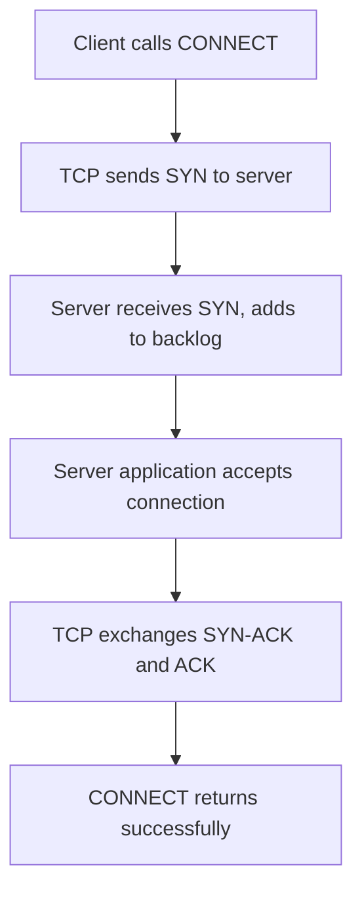
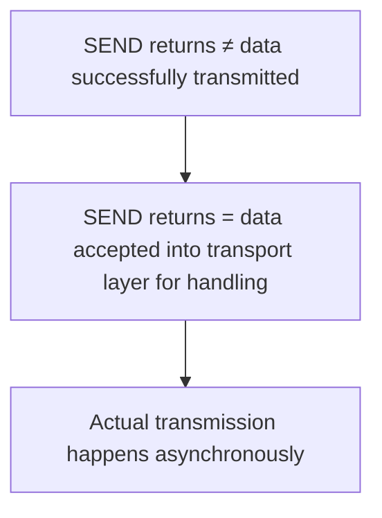

# Service Primitives

## Definition

**Service Primitives** (or **Service Calls**) are the operations through which an application process requests services from the [[Transport_Layer|Transport Layer]]. They form the API between the application layer and the transport layer, abstracting the complexity of network communication into manageable operations.

## The Service Interface

The service interface represents a contract:

- **Above the interface**: Application concerns (data to send, data received)
- **Below the interface**: Transport protocol operations (segmentation, sequencing, retransmission, etc.)

The primitives translate application intents into network actions and translate network events into application notifications.

## Primitive Categories

Transport primitives fall into three functional categories:

1. **Connection Management**: Establish and terminate logical connections
2. **Data Transfer**: Send and receive data
3. **Status/Control**: Query connection state, handle error conditions

## Standard Primitives

### Connection-Oriented Primitives

#### SOCKET

**Purpose**: Create a communication endpoint (socket)

**Parameters**:
- Protocol family (IPv4, IPv6)
- Socket type (TCP, UDP, etc.)
- Protocol number

**Returns**: Socket descriptor (file descriptor-like integer)

**Semantics**: 
- Must be called before any other operation on a socket
- Creates an unbound socket with no connection
- Does not interact with network; purely local operation

**Error conditions**:
- Invalid protocol family
- Invalid socket type
- Out of file descriptors/memory

#### BIND

**Purpose**: Associate a local port (and optionally local IP) with a socket

**Parameters**:
- Socket descriptor
- Local address (IP address and port)

**Returns**: Success/failure status

**Semantics**:
- Registers socket with kernel's port allocation table
- For servers: typically called before [[LISTEN|LISTEN]]
- For clients: typically implicit (called by [[CONNECT|CONNECT]] if not done explicitly)
- Binds socket to specific port or can request OS to select ephemeral port

**Error conditions**:
- Port already in use
- Invalid socket descriptor
- Invalid address format

#### LISTEN

**Purpose**: Mark a socket as willing to accept incoming connections

**Parameters**:
- Socket descriptor
- Backlog (maximum pending connection requests)

**Returns**: Success/failure status

**Semantics**:
- Only valid for connection-oriented protocols (TCP)
- After LISTEN, socket can receive incoming connection requests
- Pending connections queue up to backlog limit
- Does not block; immediately returns
- Socket must have been BIND'd before calling LISTEN

**Backlog mechanics**:
```
Incoming connections → [Connection Queue (backlog)] → ACCEPT() → Application
                      ↑                              ↑
                      Queue size ≤ backlog      Dequeued by ACCEPT
```

**Error conditions**:
- Not a connection-oriented socket
- Socket not bound
- Invalid backlog size

#### ACCEPT

**Purpose**: Accept an incoming connection from a pending request

**Parameters**:
- Socket descriptor (listening socket)

**Returns**:
- Socket descriptor for new connection
- Address of connecting peer (source IP and port)

**Semantics**:
- Blocks until a connection is available in the queue
- Dequeues first pending connection from backlog
- Creates new socket for the accepted connection
- Original socket remains in LISTEN state, ready for more connections
- Establishes new connection while allowing server to continue accepting more

**Connection semantics**:
- Dequeued from kernel's pending connection queue
- [[Three-Way_Handshake|Three-way handshake]] has already completed
- Connection is established when ACCEPT returns

**Example flow**:
```
Server:
  socket_server = SOCKET()
  BIND(socket_server, port=80)
  LISTEN(socket_server, backlog=5)
  while True:
    socket_connection = ACCEPT(socket_server)
    # Handle connection using socket_connection
    # Send/receive on socket_connection
    CLOSE(socket_connection)
```

**Error conditions**:
- Socket not in LISTEN state
- No pending connections
- Connection reset by peer

#### CONNECT

**Purpose**: Initiate connection to a remote peer

**Parameters**:
- Socket descriptor
- Remote address (destination IP and port)
- Optional: local address/port (if not already bound)

**Returns**: Success/failure status

**Semantics**:
- Initiates [[Three-Way_Handshake|three-way handshake]] with remote host
- Blocks until connection established or timeout/error occurs
- If local port not specified, OS selects ephemeral port
- Cannot use socket for data until connection established

**Connection process**:


**Error conditions**:
- Remote host unreachable
- Connection refused (no server listening)
- Connection timeout
- Network error

#### SEND

**Purpose**: Queue data for transmission to connected peer

**Parameters**:
- Socket descriptor
- Data buffer (pointer and length)
- Optional: flags (urgent data, don't route, etc.)

**Returns**: Number of bytes accepted by transport layer

**Semantics**:
- Places data in socket's send buffer
- Transport layer responsible for segmentation, sequencing, retransmission
- Does not guarantee data has reached peer
- Blocks if send buffer is full (or operates non-blocking depending on socket mode)
- Returns number of bytes queued (may be less than requested)

**Important distinction**:


**Error conditions**:
- Socket not connected
- Connection reset by peer
- Send buffer full (in blocking mode)
- Invalid socket descriptor

#### RECEIVE

**Purpose**: Extract data that has arrived from connected peer

**Parameters**:
- Socket descriptor
- Buffer pointer and maximum length
- Optional: flags

**Returns**: 
- Number of bytes copied into buffer
- 0 if connection closed by peer
- Error code if failure

**Semantics**:
- Blocks until data available (or socket times out/closes)
- Copies up to requested bytes from receive buffer
- Copies only data that has arrived; doesn't wait for full buffer
- May return fewer bytes than requested
- Data is removed from buffer upon return

**Flow control interaction**:
- Transport layer maintains sufficient receive buffer
- [[Flow_Control_Mechanisms|Flow control]] ensures sender doesn't exceed buffer capacity

**Connection closure signals**:
- Normal close: RECEIVE returns 0 bytes
- Abrupt close: RECEIVE returns error code

**Example**:
```
Server:
  socket_connection = ACCEPT(socket_server)
  while True:
    bytes_received = RECEIVE(socket_connection, buffer, 1024)
    if bytes_received == 0:
      break  # Connection closed
    # Process buffer[0:bytes_received]
```

**Error conditions**:
- Socket not connected
- Connection reset
- Timeout

#### CLOSE

**Purpose**: Terminate a connection and release resources

**Parameters**:
- Socket descriptor

**Returns**: Success/failure status

**Semantics**:
- Initiates graceful connection closure
- For TCP: initiates [[Connection_Release|connection release sequence]]
- Prevents further SEND on this socket
- Any pending RECEIVE may still return buffered data
- Subsequent operations on socket fail

**Resource cleanup**:
- Socket descriptor becomes invalid
- Kernel resources associated with connection released
- May not be fully released immediately (TIME_WAIT state)

**Error conditions**:
- Invalid socket descriptor
- Socket already closed
- Network error during close sequence

### Connectionless (UDP) Primitives

#### SOCKET, BIND

Same as connection-oriented primitives.

#### SENDTO

**Purpose**: Send data to a specific destination (no prior connection)

**Parameters**:
- Socket descriptor
- Data buffer
- Destination address (IP and port)
- Optional: flags

**Returns**: Number of bytes sent

**Semantics**:
- Sends single datagram
- No connection required
- Each call creates independent packet
- Destination may be different for each SENDTO
- No delivery guarantee

**Example**:
```
socket_dns = SOCKET(UDP)
BIND(socket_dns, port=any)
SENDTO(socket_dns, query, server_address=8.8.8.8:53)
RECVFROM(socket_dns, buffer)
```

#### RECVFROM

**Purpose**: Receive data from unspecified source

**Parameters**:
- Socket descriptor
- Buffer pointer and maximum length

**Returns**:
- Number of bytes received
- Source address (IP and port)

**Semantics**:
- Blocks until data arrives
- Returns with data and information about source
- Can receive datagrams from any source
- No concept of connection state

## Primitive Call Sequences

### Reliable Connection-Oriented (TCP-style)

**Server side**:
```
SOCKET()         ← Create socket
BIND()           ← Register port
LISTEN()         ← Accept incoming
ACCEPT()         ← Wait for client (blocks)
RECEIVE()        ← Get data (blocks until arrives)
SEND()           ← Send response
CLOSE()          ← Terminate
```

**Client side**:
```
SOCKET()         ← Create socket
CONNECT()        ← Initiate connection (blocks until established)
SEND()           ← Send request
RECEIVE()        ← Get response (blocks)
CLOSE()          ← Terminate
```

### Unreliable Connectionless (UDP-style)

**Server side**:
```
SOCKET()         ← Create socket
BIND()           ← Register port
RECVFROM()       ← Get request and source (blocks)
SENDTO()         ← Send response to source
(repeat from RECVFROM)
```

**Client side**:
```
SOCKET()         ← Create socket
SENDTO()         ← Send request to server
RECVFROM()       ← Get response (blocks)
```

## Error Handling

### Synchronous vs. Asynchronous Errors

**Synchronous errors** (detected immediately):
- Invalid socket descriptor
- Not connected
- Invalid parameters

Returned directly from primitive call.

**Asynchronous errors** (detected later):
- Network unreachable (detected during CONNECT/SEND)
- Connection reset by peer (detected during RECEIVE/SEND)
- Timeout

Reported on next operation on socket or through signal.

### Socket Errors

Common error codes:

| Error | Cause | Primitive(s) |
|---|---|---|
| ECONNREFUSED | Connection actively refused | CONNECT, SEND |
| ETIMEDOUT | Operation timeout | CONNECT, RECEIVE |
| ENOTCONN | Socket not connected | SEND, RECEIVE |
| EADDRINUSE | Address/port already in use | BIND |
| EBADF | Invalid socket descriptor | Any |
| EMFILE | Too many open sockets | SOCKET |

## Non-Blocking and Asynchronous Primitives

### Non-Blocking Mode

Primitives can be set non-blocking:
- SEND: Returns immediately, queues available space worth of data
- RECEIVE: Returns immediately with available data (may be 0)
- CONNECT: Returns immediately; application must check connection status later
- ACCEPT: Returns immediately if pending connections exist

### Asynchronous Notification

Signals indicate socket events without blocking:
- SIGIO: Socket ready for I/O
- SIGURG: Urgent data arrived
- Application can set signal handlers for automatic notification

## See Also

- [[Port_and_Addressing]]: How ports relate to service access points
- [[Three-Way_Handshake]]: Connection establishment in detail
- [[Connection_Release]]: Connection termination in detail
- [[TCP_Protocol]]: TCP-specific behaviors
- [[UDP_Protocol]]: UDP-specific behaviors
- [[Flow_Control_Mechanisms]]: Buffer management during transmission
