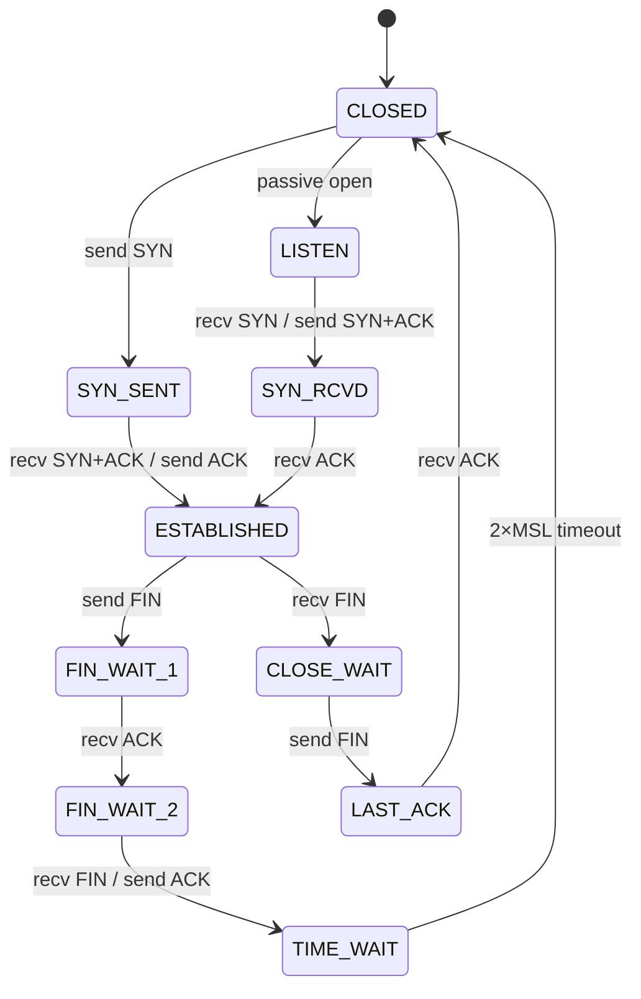

# TCP Protocol

## Overview

**TCP** (Transmission Control Protocol) is a [[Connection-Oriented_Protocols|connection-oriented]], reliable transport protocol that provides ordered, error-checked delivery of data streams. Defined in RFC 793 (1981) and updated by subsequent RFCs.

**Design philosophy**: End-to-end reliability

Rather than assuming the network provides guarantees, TCP implements all necessary mechanisms at the endpoints to ensure:
- No packet loss
- In-order delivery  
- No duplicates
- Flow control (receiver not overwhelmed)
- Congestion control (network not overwhelmed)

## Service Model

### Guarantees

**TCP provides**:
1. **Reliability**: All data delivered exactly once
2. **Ordering**: Data delivered in sequence sent
3. **Streams**: Treats connection as continuous byte stream, not message sequence
4. **Full-duplex**: Simultaneous two-way communication
5. **Graceful close**: Coordinated connection termination

### Streams vs. Messages

**TCP perspective**:
```
Application writes: "GET", " ", "/", " ", "HTTP/1.1"
TCP receives bytes: [71, 69, 84, 32, 47, 32, 72, 84, 84, 80, 47, 49, 46, 49]
TCP segments internally at will:
  Segment 1: [71, 69, 84, 32]  → Seq 1000-1003
  Segment 2: [47, 32]          → Seq 1004-1005
  Segment 3: [72, 84, 84, 80, 47, 49, 46, 49] → Seq 1006-1013
Receiver obtains: [71, 69, 84, 32, 47, 32, 72, 84, 84, 80, 47, 49, 46, 49]
Message boundaries lost; receiver doesn't know where original writes were.
```

**Implication**: Applications must implement own message framing if needed (e.g., HTTP headers with Content-Length).

## Connection Model

### Lifecycle
![[tcp state diagram.png]]


### Connection Types

**Server (Passive) Connection**:
```
SOCKET(TCP) → BIND(port) → LISTEN() → ACCEPT() → ESTABLISHED
```

**Client (Active) Connection**:
```
SOCKET(TCP) → CONNECT(server) → ESTABLISHED
```

Both sides identical after ESTABLISHED.

## Sequencing and Acknowledgment

### Sequence Number Space

Each direction has independent 32-bit sequence number space [0, 2³²-1].

**Initialization**:
- Each side chooses initial sequence number (ISN)
- Typically derived from: hash(source IP, source port, dest IP, dest port, timestamp)
- Prevents connection confusion with old packets

**Advancement**:
- Sequence number incremented by number of data bytes sent
- SYN and FIN each consume one sequence number (even though no data)
- ACK-only segments don't advance sequence number

**Example**:
```
Seq 1000: SYN (no data) → advances to 1001
Seq 1001: Data "Hello" (5 bytes) → advances to 1006  
Seq 1006: Data "World" (5 bytes) → advances to 1011
Seq 1011: FIN (no data) → advances to 1012

Next segment must have Seq 1012 (or be retransmission)
```

### Acknowledgment Number Semantics

**ACK number = next sequence number expected**

$$\text{ACK}_{receiver} = \text{last\_byte\_received\_correctly} + 1$$

**Cumulative acknowledgment**: ACK number acknowledges all bytes up to (but not including) this number.

**Example**:
```
Receiver has received bytes [1000, 1010) correctly
Receiver sends: ACK=1010
Meaning: "I received everything up through byte 1009; next I expect byte 1010"

Sender previously sent:
  [1000, 1005) with Seq=1000
  [1005, 1010) with Seq=1005
  [1010, 1015) with Seq=1010

Upon receiving ACK=1010:
  Bytes [1000, 1010) confirmed delivered
  Can discard from send buffer
  Bytes [1010, 1015) still outstanding; waiting for ACK
```

### Handling Out-of-Order Segments

If segments arrive out of order:

```
Send in order:
  Seq 1000-1005: "Hello"
  Seq 1005-1010: "World"

Arrive as:
  Seq 1005-1010: "World" (arrives first)
  Seq 1000-1005: "Hello" (arrives second)

Receiver behavior:
  Upon [1005-1010]: Buffer this; ACK=1000 (still waiting for [1000-1005))
  Upon [1000-1005]: Fill gap; Application receives "HelloWorld"
                     ACK=1010
```

Out-of-order handling prevents duplicate delivery (if retransmission arrives out of order).

## Retransmission and Timeout

### Retransmission Mechanism

TCP must detect loss and retransmit. Mechanisms:

**RTO (Retransmission Timeout)**:
- Timer set for each outstanding segment
- If no ACK received within RTO: assume lost; retransmit
**Read this for a better understanding [[RTO meaning and variations]]**

**Fast Retransmit**:
- If receiver gets segment with seq $x$ but already received past $x$, send duplicate ACK
- Sender sees duplicate ACKs (e.g., 3 identical ACKs) = probable loss
- Retransmit without waiting for timeout

### RTT Estimation

RTO must be tuned to network conditions. Measured using **Round-Trip Time (RTT)**:

$$\text{RTT} = \text{(ACK arrival time)} - \text{(segment send time)}$$

**Karn's Algorithm**:
- Only measure RTT for segments that aren't retransmissions
- Retransmitted segments have ambiguous RTT (was original or retransmitted lost?)
- Avoid using ambiguous measurements

**EWMA (Exponentially Weighted Moving Average)**:

$$\text{SRTT} = (1 - \alpha) \cdot \text{SRTT} + \alpha \cdot \text{RTT}_{sample}$$

where $\alpha \approx 0.125$ (1/8)

$$\text{RTO} = \text{SRTT} + 4 \cdot \text{RTTVAR}$$

Adapts RTO to actual network conditions; prevents unnecessary retransmission and timeouts.

## Reliability Mechanisms

### Checksums

TCP header includes 16-bit checksum covering:
- TCP header
- Payload data
- Pseudo-header (source/dest IP, protocol, length)

**Detection**: Bit errors from transmission corruption or memory errors

**Not prevention**: Checksum detects errors but doesn't correct them; corrupted segments are discarded.

### Sequence Numbers for Deduplication

Sequence numbers allow receiver to detect duplicate segments:

```
Sender sends: Seq 1000-1005 (5 bytes)
Sender times out; retransmits: Seq 1000-1005 (5 bytes)
Receiver receives both; sequence numbers identical
Receiver delivers only once
```

Without sequence numbers, both would be treated as new data.

## Flow Control

### Window-Based Flow Control

Receiver advertises available buffer space via window field:

$$\text{bytes\_sender\_can\_send} = \text{window\_size}$$

**Mechanism**:
```
Receiver has 8KB buffer
Receiver advertises: Window = 8192
Sender can send up to 8192 bytes without ACK

As sender sends:
  Send 1000 bytes, sender's "bytes in flight" = 1000
  Receive ACK, sender's "bytes in flight" = 0
  
As receiver buffers:
  Application reads from buffer
  Window advertised again with remaining space
```

### Zero Window

If receiver buffer full: advertises Window = 0

**Sender behavior**:
- Cannot send data
- Sends periodic probe segments (1 byte) to detect window opening
- Waits for non-zero window in ACK

Prevents buffer overflow at receiver.

### [[Flow_Control_Mechanisms|Silly Window Syndrome]]

**Problem**: Small advertisements lead to inefficient small segments

**Sender-side solution ([[Nagle's_Algorithm|Nagle's Algorithm]])**:
- Don't send small segments (< MSS)
- Wait for either: (a) MSS data available or (b) previous segment ACK'd
- Reduces number of small packets

**Receiver-side solution ([[Clark's_Solution]])**:
- Don't advertise small window increases
- Wait for either: (a) significant buffer available or (b) buffer empty
- Reduces ACK frequency

## Congestion Control

### Problem

[[Congestion_Control|Congestion]] occurs when:
- Multiple flows share network link
- Total demand exceeds link capacity
- Queues build up; packets dropped
- Timeouts increase; retransmissions waste bandwidth

### [[TCP_Tahoe|TCP Tahoe]]: First Congestion Control Algorithm

**Slow Start Phase**:

Exponential growth from small initial window to probe network capacity:

$$\text{cwnd}_{new} = \text{cwnd}_{old} + \text{MSS}$$

per ACK received.

**Effect**: Window doubles each RTT until loss detected.

**Congestion Avoidance Phase**:

After reaching threshold (half of congestion window when loss occurred):

$$\text{cwnd}_{new} = \text{cwnd}_{old} + \frac{\text{MSS}^2}{\text{cwnd}_{old}}$$

Linear growth per RTT.

**Threshold Calculation**:

Upon loss detection (RTO timeout or fast retransmit):

$$\text{threshold} = \frac{\text{cwnd}}{2}$$

Reset $\text{cwnd} = \text{MSS}$; restart slow start until threshold.

### Window Management

**Actual window** sender uses:

$$\text{send\_window} = \min(\text{cwnd}, \text{receiver\_window})$$

**cwnd** (congestion window): Sender's estimate of network capacity  
**receiver\_window**: Receiver's available buffer space

Both constrain transmission rate.

## TCP Transmission Policy

### Segment Timing

TCP can send segment immediately OR wait. Choices affect latency vs. efficiency:

1. **Immediate send**: Low latency; many small segments
2. **Wait for more data**: High efficiency; few large segments  
3. **Delayed ACK**: Send ACK with piggybacked data; saves segments

### Nagle's Algorithm

**Rule**: Don't send segment unless either:
1. Can send full MSS, OR
2. All previous data has been ACK'd

**Effect**:
- Telnet (1 byte per keystroke) sends only when prior byte is ACK'd
- Streams like HTTP pipelined requests batch automatically
- Reduces small packet overhead

**Can disable** if application needs: low latency > efficiency (interactive apps).

### Push Flag

Application can set PSH flag via [[Service_Primitives|SEND]] call:

**Effect**:
- Receiver processes immediately; doesn't buffer waiting for more
- Doesn't change delivery; just affects timing

Used rarely; most applications don't need.

## Urgent Data

### Urgent Pointer Mechanism

Application can send data "ahead of queue" via [[Service_Primitives|SEND]] with urgent flag:

```
Send segment with SEQ=1000, Urgent Pointer=50
→ Bytes [1000, 1050) are urgent
→ Byte 1050+ are normal

Receiver processes immediately despite queue.
```

### Purpose

Interrupt destination with important signal:

- Telnet: User presses Ctrl-C; send urgent byte
- File transfer: Cancel request  
- Streaming: Skip frame

### Implementation

**Sender**:
1. Sets URG flag, Urgent Pointer field
2. Points to last byte of urgent data (offset from Seq number)

**Receiver**:
1. Upon receiving URG flag: signal application (SIGURG in BSD)
2. Application can read urgent data in-band or from urgent pointer

Note: Urgent data still travels in-band; no separate channel. Urgent Pointer just marks location.

## Connection State Machine

[[TCP_Protocol|Full TCP state machine]] available separately; major transitions:

**Opening**:
```
CLOSED → [SYN] → SYN-SENT → [SYN-ACK] → ESTABLISHED
LISTEN → [SYN] → SYN-RECEIVED → [ACK] → ESTABLISHED
```

**Closing**:
```
ESTABLISHED → [FIN] → FIN-WAIT-1 → [ACK] → FIN-WAIT-2
ESTABLISHED → [FIN] → CLOSE-WAIT → [FIN from peer] → LAST-ACK
FIN-WAIT-2 → [FIN] → TIME-WAIT → [2×MSL timer] → CLOSED
```

## Performance Considerations

### Throughput Limitations

**Maximum throughput**:
$$\text{Throughput} \approx \frac{\text{window\_size}}{\text{RTT}}$$

For 64KB window and 100ms RTT:
$$\text{Throughput} \approx \frac{64000}{0.1} = 640 \text{ KB/s} = 5.12 \text{ Mbps}$$

**Slow start**: Takes time to ramp up to high throughput

**Packet loss**: Reduces throughput significantly due to congestion control backoff

### Bandwidth-Delay Product

High-speed, high-latency links require large windows:

$$\text{BDP} = \text{bandwidth} \times \text{RTT}$$

Example: 1 Gbps link, 100ms latency:
$$\text{BDP} = 10^9 \text{ bits/sec} \times 0.1 \text{ sec} = 100 \text{ Mbits} = 12.5 \text{ MBytes}$$

64KB TCP window insufficient; TCP window scaling (RFC 1323) extends to 1GB.

## See Also

- [[Three-Way_Handshake]]: TCP connection establishment
- [[Connection_Release]]: TCP connection termination
- [[Segment_Structure]]: TCP header format  
- [[Flow_Control_Mechanisms]]: Window-based flow control
- [[Congestion_Control]]: Network congestion handling
- [[UDP_Protocol]]: Unreliable alternative
- [[Service_Primitives]]: API for TCP usage
