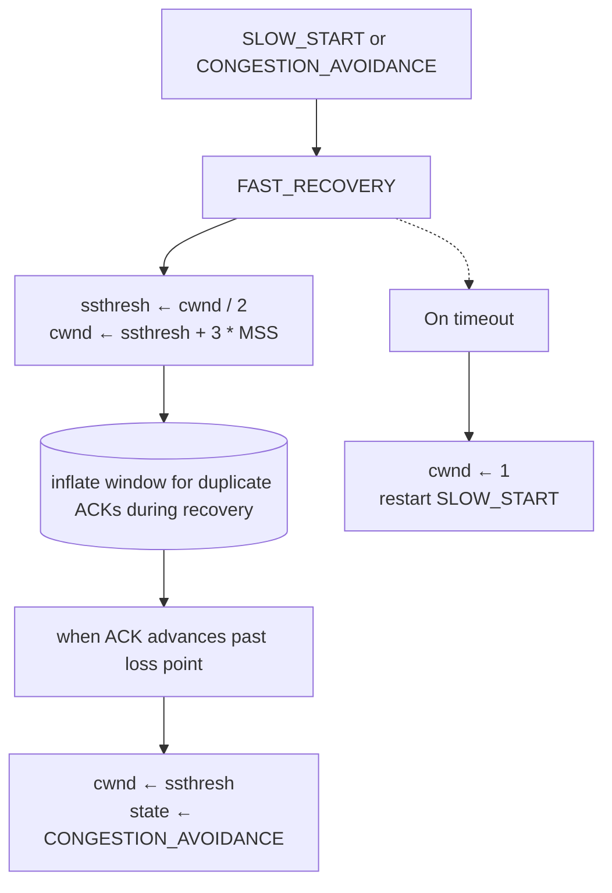

# TCP Reno

## Development

**TCP Reno** (1990) improved on [[TCP_Tahoe|TCP Tahoe]] by introducing **Fast Recovery**, addressing the severe congestion window reduction on loss.

## Key Innovation: Fast Recovery

### Problem with Tahoe

```
Upon loss detection (3-duplicate-ACK):
  cwnd reset to 1 MSS
  ssthresh = cwnd_before_loss / 2
  
Example: cwnd = 100 MSS, loss occurs
  cwnd → 1 MSS (extreme reduction!)
  ssthresh = 50 MSS
  Recovery: 1 → 2 → 4 → 8 → 16 → 32 → 64 → 100 (many RTTs)
  
Network underutilized during recovery.
```

### Reno's Solution

**Distinguish loss types**:

```
Timeout (RTO expires):
  → Severe congestion; reset cwnd to 1 (Tahoe behavior)
  
3-duplicate-ACK (fast retransmit):
  → Transient loss; network still transmitting
  → Less severe response: cwnd to half (not 1!)
  → Fast Recovery phase
```

### State Machine



## Algorithm

### During Fast Recovery

**Initialization on 3-duplicate-ACK**:

```
ssthresh = max(2, cwnd / 2)
cwnd = ssthresh + 3 * MSS
```

**For each subsequent duplicate ACK**:

```
cwnd = cwnd + MSS
```

**Rationale**: 3 duplicate ACKs mean 3 segments successfully crossed network (just received out-of-order). ACK inflation temporarily increases window to allow new segments during recovery.

**When ACK advances beyond loss point**:

```
cwnd = ssthresh  // Deflate back to conservative level
state = CONGESTION_AVOIDANCE
```

## Comparison: Tahoe vs. Reno

### Numerical Example

```
Initial: cwnd = 100 MSS
Loss detected at RTT 10 (via 3-duplicate-ACK)

TAHOE:
  RTT 10: Loss; ssthresh=50, cwnd=1
  RTT 11: cwnd=2, send 2 segments
  RTT 12: cwnd=4, send 4 segments
  RTT 13: cwnd=8, send 8 segments
  RTT 14: cwnd=16, send 16 segments
  RTT 15: cwnd=32, send 32 segments
  RTT 16: cwnd=64, send 64 segments (past ssthresh)
  RTT 17: cwnd=65, send 65 segments (Congestion Avoidance)
  ...
  RTT 27: cwnd=75 (slow linear growth)
  
  Recovery time: ~17 RTTs to reach pre-loss level

RENO:
  RTT 10: Loss; ssthresh=50, cwnd=53 (=50+3)
  RTT 11: cwnd=54, send 54 segments (dup-ACK)
  RTT 12: cwnd=55, send 55 segments (dup-ACK)
  ...
  RTT 20: cwnd=63 (ACKs inflating window)
  RTT 21: ACK advances past loss; cwnd=50 (deflate)
  RTT 22: cwnd=51 (Congestion Avoidance)
  ...
  RTT 25: cwnd=54 (back to reasonable level)
  
  Recovery time: ~6-7 RTTs to reach pre-loss level
```

**Speedup**: 2-3× faster recovery than Tahoe.

### Throughput Impact

```
TAHOE:
  Window: 100 → 1 → 2 → 4 → ... → 50 → 51 → ... → 100
  Throughput: Drops to 1/100 ≈ 1% initially; slow climb

RENO:
  Window: 100 → 53 → 54 → ... → 63 → 50 → 51 → ... → 100
  Throughput: Drops to 53/100 ≈ 53% initially; fast climb
```

Reno maintains much higher throughput during recovery.

## Timeout Handling

**On RTO timeout** (not 3-duplicate-ACK):

```
ssthresh = max(2, cwnd / 2)
cwnd = 1 MSS
state = SLOW_START
retransmit_oldest_unacked_segment()
```

Same as Tahoe; timeout indicates severe congestion.

## Pseudocode

```python
def reno():
    cwnd = 1 * MSS
    ssthresh = 65535
    state = "SLOW_START"
    
    while True:
        # Send data up to window
        while bytes_in_flight < cwnd:
            send_segment()
            bytes_in_flight += MSS
        
        event = wait_for_event()
        
        if event == "ACK":
            bytes_in_flight -= acked_bytes
            
            if state == "SLOW_START":
                cwnd += MSS
                if cwnd >= ssthresh:
                    state = "CONGESTION_AVOIDANCE"
            
            elif state == "CONGESTION_AVOIDANCE":
                cwnd += MSS * MSS / cwnd
            
            elif state == "FAST_RECOVERY":
                if ack_advances_beyond_loss:
                    cwnd = ssthresh
                    state = "CONGESTION_AVOIDANCE"
        
        elif event == "3-duplicate-ACK":
            # Loss detected; enter fast recovery
            ssthresh = max(2, cwnd / 2)
            cwnd = ssthresh + 3 * MSS
            state = "FAST_RECOVERY"
            retransmit_lost_segment()
        
        elif event == "duplicate-ACK" and state == "FAST_RECOVERY":
            # Inflate window for duplicate ACK
            cwnd += MSS
        
        elif event == "RTO timeout":
            # Severe congestion
            ssthresh = max(2, cwnd / 2)
            cwnd = 1 * MSS
            state = "SLOW_START"
            retransmit_oldest_segment()
```

## SACK (Selective Acknowledgment) with Reno

**Reno + SACK (RFC 2883)**:

Receiver uses SACK option to tell sender which segments received:

```
Segments 1, 2, 3, 4, 5, 6 sent
Segments 2 and 4 lost
Receiver reports: "I have 1, [3,3], [5,6]"

Sender:
  Knows exactly which are lost
  Doesn't retransmit 3, 5, 6 (already received)
  Retransmits only 2, 4
  
Benefit: Fewer unnecessary retransmissions
```

Without SACK: Sender might retransmit 2 through 6 before learning 3,5,6 arrived.

## Performance Characteristics

### Loss Probability

TCP Reno achieves steady-state throughput:

$$\text{Throughput} \propto \frac{1}{\sqrt{p}}$$

where $p$ = loss probability

```
p = 0.1% (0.001): Throughput ∝ 1/√0.001 ≈ 31.6 Mbps (typical)
p = 1.0% (0.01):  Throughput ∝ 1/√0.01 ≈ 10 Mbps
p = 10% (0.1):    Throughput ∝ 1/√0.1 ≈ 3.2 Mbps (poor)
```

### Window-Limited Performance

If no congestion (no loss), window grows linearly:

```
Time to double window: N RTTs (where N = window size)
Example: cwnd = 64 MSS in Congestion Avoidance
  Doubles from 64 to 128: ~128 RTTs
  
Implication: Very large files needed to probe network capacity
  1 Gbps link, 100ms RTT: BDP = 12.5 MB
  cwnd = 64 MSS (96 KB): Throughput = 96KB / 0.1s = 960 Kbps
  Vastly underutilizes 1 Gbps link
  
Solution: TCP window scaling (RFC 1323) for large windows
```

## Adoption and Variants

**TCP Reno** became standard in 1990s, implemented in:
- BSD Unix
- Linux
- Windows
- Most implementations

**Still used today** in many systems; later replaced by:
- [[TCP_Cubic]]: For high-speed networks
- [[TCP_BBR]]: For complex network conditions
- [[TCP_HTCP]]: For high-speed, high-delay links

## Limitations Addressed by Later Protocols

1. **High-speed networks**: Reno's linear growth too slow
2. **High-delay networks**: Slow to converge; window scaling needed
3. **Multiple losses**: SACK reduces retransmissions, but underlying algorithm unchanged
4. **Fairness between flows**: Reno tends to favor flows with lower RTT

## See Also

- [[TCP_Tahoe]]: Original algorithm; Reno's predecessor
- [[Congestion_Control]]: General principles
- [[TCP_Protocol]]: TCP implementation
- [[AIMD]]: Additive Increase Multiplicative Decrease
