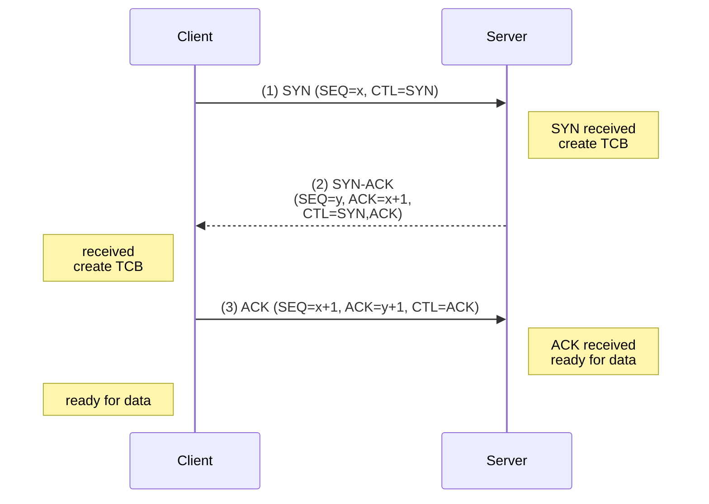

# Three-Way Handshake

## Purpose

The three-way handshake is a formal protocol exchange that establishes a connection between two processes in connection-oriented protocols. It solves critical problems arising from an unreliable network environment.

**Problems it solves:**
1. **Initial sequence number selection**: Both sides must agree on starting sequence numbers
2. **Old duplicate packets**: Network may contain ancient packets from previous connections; must not be mistaken for new data
3. **Half-open connections**: Connection state must be synchronized; both sides must know connection is established before data transfer
4. **Asymmetric closing**: Either side may initiate close; protocol must handle half-closes gracefully

## [[The_Two_Army_Problem|The Two-Army Problem]]

Before examining the handshake, understand the fundamental theoretical limitation:

In an unreliable network, it is **impossible to guarantee** that both parties have irrevocably committed to the connection. The best we can do is minimize the window of uncertainty through a carefully orchestrated exchange.

The three-way handshake represents the optimal minimal exchange for this scenario.

## Formal Definition

**Assumptions:**

1. Network is unreliable: segments may be lost, duplicated, or reordered
2. Both sides have local clocks and can maintain state
3. Each side has a sequence number space (32-bit for TCP)
4. The goal is to reach a state where both parties agree the connection exists

**Invariants to maintain:**

- No connection state is established until three exchanges complete
- Each side has verified the other side is alive and willing to receive
- Each side has announced its initial sequence number
- Both sides are ready for data transfer

## The Exchange

### State Machine Overview



### Detailed Exchange

#### Segment 1: Client SYN

**Sent by**: Client initiating connection (calls [[Service_Primitives|CONNECT]])

**Composition**:
- Source port: Client's ephemeral port (assigned by OS, typically from 49152–65535)
- Destination port: Server's well-known port (e.g., 80 for HTTP)
- [[Segment_Structure|Sequence number]]: $x$ (client's initial sequence number, often random)
- [[Segment_Structure|Flags]]: SYN set, ACK not set
- Data payload: None typically

**Interpretation by server**:
- "I (client) exist and want to communicate"
- "My initial sequence number is $x$"
- "I am ready to receive segments with sequence numbers starting at my_ack_number"
- No guarantee server will accept; merely a request

**Example**:
```
Source: 192.168.1.100:52341
Dest: 93.184.216.34:80
Seq: 1000
Flags: SYN
```

#### Segment 2: Server SYN-ACK

**Sent by**: Server that received SYN and is willing to accept

**Composition**:
- Source port: Server's listening port (80)
- Destination port: Client's port (52341, extracted from incoming SYN)
- [[Segment_Structure|Sequence number]]: $y$ (server's initial sequence number, must be independent of client's $x$)
- [[Segment_Structure|Acknowledgment number]]: $x + 1$ (acknowledges receipt of client's sequence number)
- [[Segment_Structure|Flags]]: SYN set, ACK set
- Data payload: None typically

**Interpretation by client**:
- "I (server) received your SYN"
- "I acknowledge your sequence number $x$"
- "My initial sequence number is $y$"
- "I am ready to communicate and have created connection state"

**Important**: Server must choose $y$ **independently** of $x$. If $y$ were derived from $x$, an attacker could predict server's sequence and craft bogus data segments.

**Example**:
```
Source: 93.184.216.34:80
Dest: 192.168.1.100:52341
Seq: 2000
Ack: 1001
Flags: SYN, ACK
```

#### Segment 3: Client ACK

**Sent by**: Client that received SYN-ACK

**Composition**:
- Source port: Client's port (52341)
- Destination port: Server's port (80)
- [[Segment_Structure|Sequence number]]: $x + 1$ (continuation of client sequence space)
- [[Segment_Structure|Acknowledgment number]]: $y + 1$ (acknowledges receipt of server's sequence number)
- [[Segment_Structure|Flags]]: ACK set, SYN not set
- Data payload: None or may contain initial data (piggybacking)

**Interpretation by server**:
- "I received your SYN-ACK"
- "I acknowledge your sequence number $y$"
- Connection is established and ready for data

**Example**:
```
Source: 192.168.1.100:52341
Dest: 93.184.216.34:80
Seq: 1001
Ack: 2001
Flags: ACK
```

## Why Three Exchanges?

### Necessity of Each Exchange

**Exchange 1 (Client SYN)**: 
- Cannot be omitted; server needs to receive client's initial sequence number
- Client hasn't verified server exists yet, but server will respond

**Exchange 2 (Server SYN-ACK)**:
- Cannot be omitted; client needs to receive server's initial sequence number
- Server has now verified client sent at least one segment

**Exchange 3 (Client ACK)**:
- Why necessary? Consider: what if Segment 2 arrives at client, but server crashes?
- Server thinks connection established; client never received SYN-ACK
- Server sends data; client doesn't recognize connection; data disappears
- Client must send Segment 3 so server knows client received SYN-ACK

**Cannot be reduced to two**:
If protocol were: (1) Client SYN, (2) Server acknowledges with Segment 2

Then: Server thinks connection ready after sending Segment 2, but what if Segment 2 is lost? Server sends data; client treats it as unsolicited.

### Why Not Four or More?

Additional exchanges don't increase assurance:
- After Segment 3, both sides have exchanged sequence numbers
- Additional ACKs don't change the fundamental uncertainty of networks
- [[The_Two_Army_Problem|The Two-Army Problem]] shows ultimate limitations

Three is the minimum necessary exchange to maximize synchronization while remaining practical.

## Sequence Number Initialization

### Why Random Initial Sequence Numbers?

**Problem**: If sequence numbers always start at 0 or increment predictably:

1. Old segment from previous connection (still in network) arrives with seq=10000
2. If new connection also starts at seq=10000, old segment appears valid
3. Application receives corrupted data from old connection

**Solution**: Choose initial sequence number independently and (pseudo)randomly

- Reduces probability of collision with old packets
- Based on clock values and random functions
- RFC 6528: Use hash function on (source IP, source port, dest IP, dest port, timestamp)

**TCP convention**:
- Each side chooses its sequence space independently
- No relationship between client's $x$ and server's $y$
- Both should be unpredictable to potential attackers

### Sequence Number Wraparound

TCP sequence numbers are 32-bit: range [0, 2³²-1] ≈ [0, 4.3 billion]

**Wraparound behavior**:
- After sending 2³² bytes, next byte has sequence number 0
- Sequence numbers wraparound cyclically

**Why not a problem**:
- At typical network speeds (1 Gbps), wraparound takes ~34 seconds
- [[The_Two_Army_Problem|Connection lifetime limits]] typically exceed this
- TCP uses sequence number arithmetic modulo 2³² for comparisons
- Timestamp option (RFC 1323) protects against issues when this wraps

## Handling Failures During Handshake

### Lost Segment 1 (Client SYN)

**Scenario**: SYN lost on wire

**Behavior**:
- Client calls CONNECT, sends SYN, sets timeout (typically 3 seconds)
- Timer expires; no SYN-ACK received
- Client retransmits SYN (exponential backoff: 3s, 6s, 12s, etc.)
- After multiple retries: CONNECT returns error (ETIMEDOUT)

### Lost Segment 2 (Server SYN-ACK)

**Scenario**: Server sends SYN-ACK, but it's lost

**Behavior**:
- Client SYN was received; server created state and sent SYN-ACK
- Client timeout triggers; client retransmits SYN
- Server receives retransmitted SYN; recognizes connection already exists
- Server retransmits SYN-ACK (same sequence number $y$ as original)
- Client receives SYN-ACK (original or retransmitted); sends ACK

**Critical requirement**: Server must respond to duplicate SYN with same SYN-ACK (idempotent)

### Lost Segment 3 (Client ACK)

**Scenario**: SYN-ACK received by client, client sends ACK, but ACK lost

**Behavior**:
- Client: Connection established (third segment sent)
- Server: Waiting for Segment 3; connection in SYN-RECEIVED state
- Client may start sending data immediately after Segment 3
- Server may receive data before ACK arrives
- When data arrives at server from client, server implicitly verifies client received SYN-ACK
- Server transitions to ESTABLISHED state

**In TCP**: If data arrives in SYN-RECEIVED state with valid sequence, implicitly confirms connection.

Receiving data from valid sequence is treated as acknowledgment.

## SYN Flood Attack

### Problem

Attackers can exploit the handshake by sending massive numbers of SYN segments:

1. Attacker spoofs source IP and sends thousands of SYNs to server
2. Server creates state for each SYN (SYN-RECEIVED)
3. Server sends SYN-ACK to spoofed address (no response)
4. Server's connection queue fills up
5. Legitimate clients cannot connect; server appears down

### Defenses

**SYN Cookies**:
- Server doesn't create full state on SYN receipt
- Server encodes connection info in sequence number $y$
- When ACK arrives with embedded state, server recreates connection
- Reduces memory overhead

**Connection Rate Limiting**:
- Limit number of new connections per second
- Per-IP limits to detect concentrated attacks

**Firewall filtering**:
- Detect and filter spoofed SYNs
- Rate-limit SYNs from single source

## Data Transfer After Handshake

Once Segment 3 completes:

- Both client and server have established connection identity (4-tuple)
- Both have exchanged and acknowledged initial sequence numbers
- Both are in ESTABLISHED state
- Data transfer can commence using sequence/acknowledgment numbers established in handshake

**Example**: After handshake (client seq=1001, server seq=2001)

```
Client sends data: Seq=1001, Ack=2001, Data="GET / HTTP/1.1\r\n..." (100 bytes)
                → Seq space now [1001, 1101)
Next segment:   Seq=1101, Ack=2001, Data=...
```

## See Also

- [[Connection_Release]]: How connections terminate
- [[The_Two_Army_Problem]]: Theoretical foundation for handshake design
- [[Segment_Structure]]: Segment composition used in handshake
- [[Service_Primitives]]: CONNECT primitive that initiates handshake
- [[TCP_Protocol]]: TCP connection state machine
