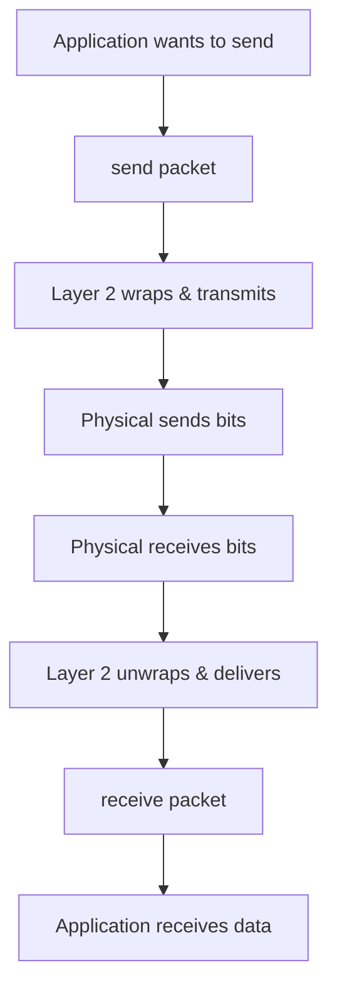
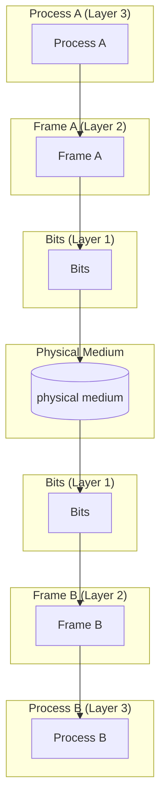
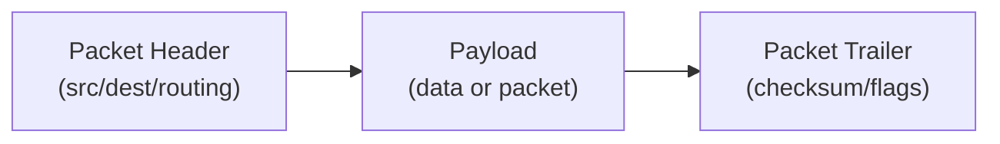
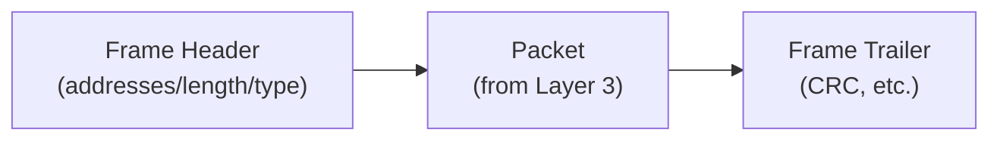
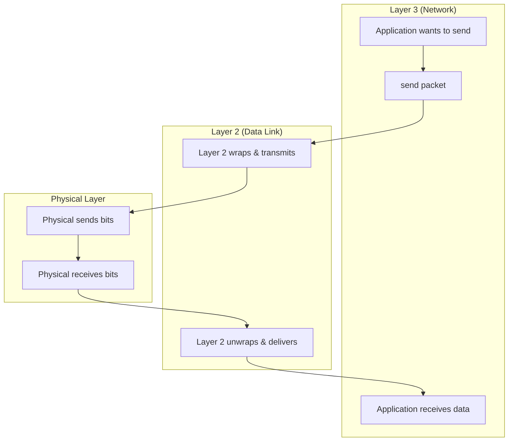
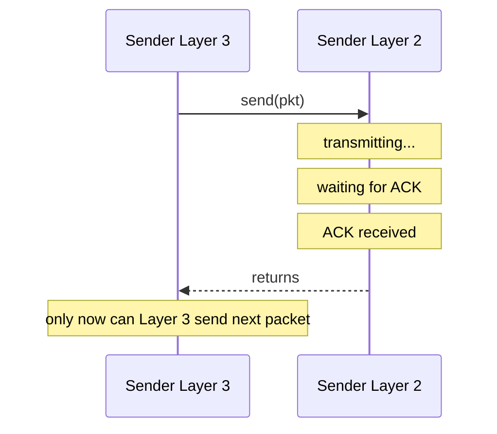
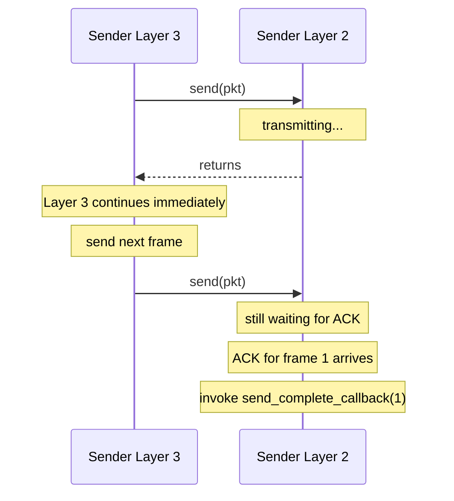

# 1. DLL Foundations & Services

> **[[00_DLL_Index|← Back to Index]]**

## The Core Problem: Bridging Two Layers

### The Gap Between Layers

| Layer | Abstraction | Reality |
|-------|-------------|---------|
| **Physical (Layer 1)** | Raw bit transmission | Bitstream, no boundaries, errors likely |
| **Data Link (Layer 2)** | Frames, error checking, flow control | Must interpret bitstream as discrete units |
| **Network (Layer 3)** | Packets, routable units | Assumes reliable, in-order delivery |

**The DLL's Job**: Layer 2 must transform the Physical Layer's unreliable bitstream into the reliably-delivered, discrete-unit abstraction that Layer 3 expects.

---

## Virtual vs. Actual Communication Path

### The Illusion: Virtual Path



Layer 3 perceives **direct, hop-by-hop communication** between peer processes. A packet from Process A appears to travel directly to Process B's Layer 3 entity.

### The Reality: Actual Path



**Reality Check**:
1. Layer 3's packet is wrapped into a **Layer 2 frame**
2. The frame is transmitted as **bits** over the physical medium
3. The receiver's Layer 2 unwraps the frame and delivers the packet to Layer 3
4. Each hop (node-to-node) may involve error detection/retransmission before passing up

**Key Insight**: Layers 3 and above care about **end-to-end** delivery. Layer 2 cares about **link-by-link** delivery. Layer 3 sees the network as a "cloud" and delegates hop details to Layer 2.

---

## Encapsulation: Packet in a Frame

### The Packet (Layer 3 PDU)

A packet is the **data unit produced by Layer 3**. Its structure varies by protocol (IPv4, IPv6, etc.) but logically contains:



### The Frame (Layer 2 PDU)

Layer 2 **wraps** the packet into a frame:



### Why Headers and Trailers Are Necessary

**Frame Header** (`n` bytes):
- **Destination Address**: Which interface/device on the link receives this frame?
- **Source Address**: Where did this frame originate?
- **Type/Protocol Field**: What does the payload contain? (e.g., IPv4, ARP, VLAN tag)
- **Frame Length**: How long is the payload? (Helps receiver detect truncation)
- **Flags/Control**: Prioritization, more-fragments indicator, etc.

**Frame Trailer** (`m` bytes):
- **Error Detection Field (CRC)**: Can receiver detect single/double/burst bit errors?
- **Control/Padding**: May align frame to word boundaries or signal end of frame

### Overhead Analysis

For a 1500-byte packet:

| Overhead Type | Bytes | Efficiency |
|---------------|-------|-----------|
| Payload (Packet) | 1500 | — |
| Ethernet II Header | 14 | 99.1% |
| CRC Trailer | 4 | 99.7% |
| **Total Frame** | **1518** | **98.8%** |

For a 50-byte packet:

| Overhead Type | Bytes | Efficiency |
|---------------|-------|-----------|
| Payload (Packet) | 50 | — |
| Ethernet II Header | 14 | 78.1% |
| CRC Trailer | 4 | 92.6% |
| **Total Frame** | **68** | **73.5%** |

**Lesson**: Small packets incur proportionally more overhead. Real protocols often batch small packets or use MTU (Maximum Transmission Unit) enforcement to minimize this impact.

---

## DLL Service Models

### What is a Service Model?

A **service model** defines **how reliably** and **how formally** Layer 2 promises to deliver frames to Layer 3.

Think of it like shipping options:
- **Unacknowledged**: Drop package at door, no signature (fast, no proof of delivery)
- **Acknowledged**: Get signature, but don't reserve a route (flexible, confirms delivery)
- **Connection-Oriented**: Reserve a shipping lane, use scheduled courier, confirm delivery and closure (formal, guaranteed)

Each model represents a **contract** between Layer 2 (sender) and Layer 3 (receiver).

### Three Service Categories

#### 1. **Unacknowledged Connectionless Service** (Fire-and-Forget)

**What it means**: Layer 2 just sends frames with **no confirmation or setup**.

- No connection setup or teardown
- No ACK sent after frame delivery
- Sender has **no idea** if frame arrived
- Receiver accepts frames with no expectations

**Why use it?**
- *Speed*: Minimum overhead
- *Simplicity*: No state tracking
- *Broadcast scenarios*: One sender, many receivers (ACK to whom?)

**Real-world example**:
```
LAN broadcast: Sender says "Hello everyone"
               → Sent to ALL devices on network
               → No one sends back "I got it"
               → If some devices miss it, sender doesn't know/care
```

**Used for**: LAN broadcast, real-time streaming (video call—lost frame is obsolete anyway), IoT sensor broadcasts

**Example**: Classic Ethernet (original design)

#### 2. **Acknowledged Connectionless Service** (Confirmed Fire-and-Forget)

**What it means**: Layer 2 sends frames **independently**, but each one gets a confirmation.

- No connection setup (can send to different addresses)
- **ACK confirms delivery** (sender knows frame arrived)
- Sender **retransmits if no ACK** arrives
- Each frame is independent (different receivers possible)

**Why use it?**
- *Reliability*: Know each frame arrived
- *Simplicity*: No handshake/teardown overhead
- *Flexibility*: Can send to different addresses anytime

**Real-world example**:
```
WiFi frame transmission:
Sender: "Frame for Device B"      → Transmit
        [waiting for ACK]
Device B receives: "Got it" ← ACK
Sender: "Frame for Device C"      → Transmit (next frame, maybe different target)
        [waiting for ACK]
Device C receives: "Got it" ← ACK

(Each frame is independent; receiver address can change frame-to-frame)
```

**Used for**: Wireless links (WiFi), unreliable media, one-to-one communication without formal setup

**Example**: Some WiFi (802.11) implementations

#### 3. **Acknowledged Connection-Oriented Service** (Formal Delivery)

**What it means**: Establish a **logical connection**, send frames **in order**, then **formally close**.

- **Connection setup**: Handshake before data (like "Are you ready?")
- Frames **acknowledged and ordered** (must arrive in sequence)
- **Connection closure**: Formal goodbye (like "I'm done, close the link")
- Sender **knows link state** (open/closed/error)

**Why use it?**
- *Guaranteed sequence*: Frames in order, none skipped
- *State awareness*: Both sides know connection status
- *Formal closure*: Clean shutdown (no dangling resources)
- *Reliability*: Built-in recovery from errors

**Real-world example**:
```
Traditional modem connection (PPP - Point-to-Point Protocol):

[Setup]
Caller: "Hello, can I send data?"
Server: "Yes, connection established"

[Data Transfer]
Caller: Frame 0 → [ACK 0] ← Server (confirmed, in order)
Caller: Frame 1 → [ACK 1] ← Server (must be after Frame 0)
Caller: Frame 2 → [ACK 2] ← Server

[Closure]
Caller: "I'm done, close connection"
Server: "Connection closed, goodbye"
[link torn down]
```

**Used for**: Point-to-point links (modem, serial), reliability-critical systems, ordered-delivery requirements

**Example**: Traditional telephone modems, PPP, dedicated circuits

### Service Model Comparison Table

| Aspect | Unacknowledged | Acknowledged | Connection-Oriented |
|--------|---|---|---|
| **Setup** | No | No | Yes (handshake) |
| **ACK per frame?** | No | Yes | Yes |
| **Ordering guarantee** | No | No | Yes |
| **Teardown** | No | No | Yes (formal close) |
| **Sender knows delivery?** | No | Yes | Yes |
| **Overhead** | Minimal | Low | High |
| **Complexity** | Simple | Medium | Complex |

**Design Choice**: Each service trades complexity for reliability guarantees.

---

## Service Primitives: The Interface Between Layers

### What is a Service Primitive?

A **service primitive** is a **function call** or **message** that one layer uses to request services from another layer.

Think of it as an **API** (Application Programming Interface) for inter-layer communication:
- Layer 3 calls Layer 2 functions to *send* data
- Layer 2 calls Layer 3 functions to *deliver* received data

**Flow**:



### The Four Direction Groups

Layer 2 exposes operations to Layer 3 through **service primitives**:

#### **Downward** (Layer 3 → Layer 2: Layer 3 *requests* services)

```c
// For Unacknowledged/Acknowledged Connectionless:
send(packet, destination_address)    // "Layer 2, please send this packet"
                                     // Layer 3 doesn't wait for delivery confirmation

// For Connection-Oriented:
request_connection(remote_address)   // "Layer 2, set up a connection to this address"
                                     // Layer 2 performs handshake
send(packet)                         // "Send this packet on the open connection"
close_connection(handle)             // "Close this connection formally"
```

**Synchronicity options**:
- **Blocking** (synchronous): Layer 3 waits → `send()` returns only after transmission complete
- **Non-blocking** (asynchronous): Layer 3 continues → `send()` returns immediately, notification comes later

#### **Upward** (Layer 2 → Layer 3: Layer 2 *notifies* Layer 3)

```c
// For unacknowledged/acknowledged services:
receive(packet, source_address)      // "Layer 3, here's a packet that arrived"
                                     // Called when Layer 2 finishes framing/error-checking

// For connection-oriented:
connection_request(from_address)     // "Layer 3, remote device wants connection"
                                     // Layer 3 must accept/reject
receive(packet)                      // "Here's a packet on an open connection"
connection_closed(handle)            // "Your connection was closed (peer closed it)"
```

**Execution Model**: Layer 2 calls these to **push** data up to Layer 3, or Layer 3 registers callbacks that Layer 2 triggers.

### Concrete Example: Email Service Model

**Unacknowledged Connectionless** (broadcast announcement):
```
Sender Layer 3: send("Anyone listening?", BROADCAST_ADDR)
Sender Layer 2: Send frame to all devices on network
Receivers get it or don't; sender never knows
```

**Acknowledged Connectionless** (texting):
```
Sender Layer 3: send("Hi Bob", BOB_ADDR)
Sender Layer 2: Transmit frame, wait for ACK from Bob's device
Bob's Layer 2: Receives frame, passes to Layer 3
Bob's Layer 3: receive(packet, SENDER_ADDR)
Bob's Layer 2: Sends ACK back
Sender Layer 2: Receives ACK → "Delivery confirmed" ✓
```

**Connection-Oriented** (phone call):
```
Caller Layer 3: request_connection(BOB_ADDR)
Caller Layer 2: Sends "connection request" frame to Bob
Bob's Layer 2: receive this request, notify Layer 3
Bob's Layer 3: [user accepts call]
Bob's Layer 2: Sends "connection accepted" frame back
Caller Layer 2: receive acceptance → connection_established
Caller Layer 3: send("Hi Bob, can you hear me?")
Caller Layer 2: Transmit frame on established connection [ACK received]
Bob's Layer 3: receive(packet)
Bob Layer 3: send("Yes, I hear you")
... [conversation continues with ACKs for each frame] ...
Bob Layer 3: close_connection()
Bob Layer 2: send "connection close" frame
Caller Layer 2: receive close frame → connection_closed notification
Caller Layer 3: connection_closed() [link is down]
```

### Service Primitive Timing Example

**Synchronous (blocking)**:



**Asynchronous (non-blocking)**:



**Practical choice**: 
- **Blocking**: Simple, but inefficient (Layer 3 stalls waiting)
- **Non-blocking**: Complex, but allows pipelining (Layer 3 sends multiple frames)

---

## Why This Abstraction Matters

### For System Designers
- **Modularity**: Network protocol logic isolated from link-specific details
- **Reusability**: Same Layer 3 code works over Ethernet, WiFi, or fiber
- **Testability**: Layer 3 algorithms can be tested without physical hardware

### For Efficiency
- Error recovery happens at the right scope: link-level errors don't require end-to-end retransmission
- Flow control adapts to link speeds: a slow link doesn't stall the entire network

### For Reliability
- Duplicate detection and retransmission manage link failures
- Error detection catches corruption before it propagates upward

---

## Key Takeaways

1. **Virtual illusion**: Layer 3 sees direct point-to-point paths; Layer 2 handles the physical reality
2. **Encapsulation overhead**: Necessary but not free; impacts efficiency for small packets
3. **Service choice**: Connectionless vs. connection-oriented trades setup cost for reliability
4. **Clean abstraction**: Separating concerns allows independent optimization of each layer

---

> **Next**: [[02_Framing_Mechanics|2. Framing Mechanics]] — How does Layer 2 convert a bitstream into discrete frames?

