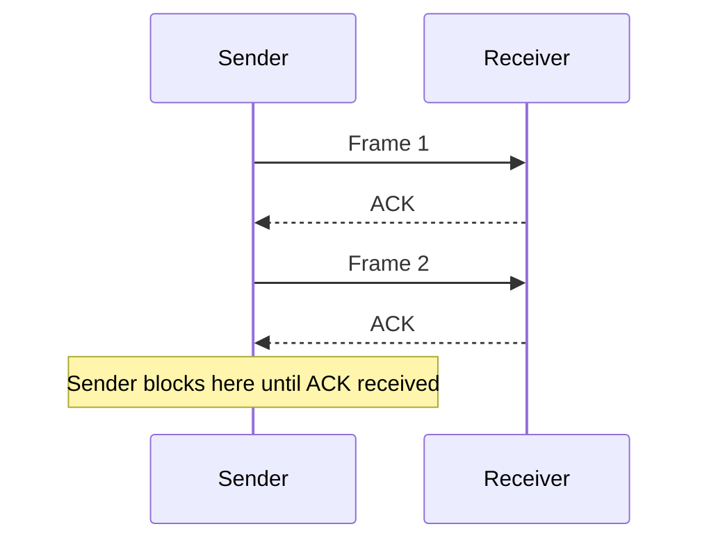
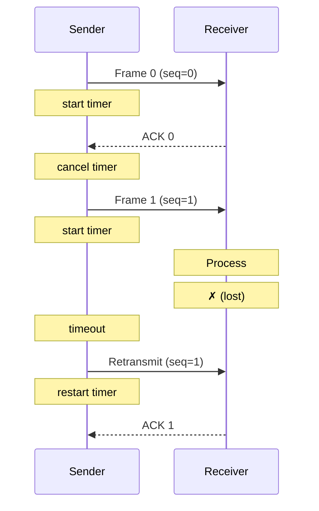

# 4. Evolution of DLL Protocols

> **[[00_DLL_Index|← Back to Index]]**

## Overview: From Ideal to Realistic

We examine three progressively realistic protocol designs:
1. **Protocol 1 (Utopia)**: Perfect conditions, no errors
2. **Protocol 2 (Stop-and-Wait)**: Introduce flow control
3. **Protocol 3 (PAR/Noisy Channel)**: Handle errors and packet loss

Each layer adds complexity to handle real-world constraints.

---

## Protocol 1: Utopia (Simplex, Error-Free, Infinite Buffer)

### Assumptions

1. **No transmission errors**: All frames arrive intact
2. **No frame loss**: Every frame sent is received
3. **Infinite receiver buffer**: No flow control needed
4. **Simplex**: One-way communication only
5. **No sequence numbers**: Not needed without errors

### Data Structures

```c
#define MAX_PKT 1024

typedef struct {
  unsigned char data[MAX_PKT];
} packet;

typedef struct {
  unsigned char data[MAX_PKT];
  // No header/trailer fields — completely transparent
} frame;

typedef enum {
  NETWORK_LAYER_READY,      // Packet ready to send
  FRAME_ARRIVAL             // Frame arrived
} event_type;
```

### Sender Code

```c
void sender_protocol1(void) {
  packet pkt;
  frame f;
  
  while (true) {
    wait_for_event(NETWORK_LAYER_READY);  // Layer 3 gives packet
    pkt = get_packet_from_network_layer();
    
    f.data = pkt.data;                     // Wrap into frame
    send_frame(f);
  }
}
```

### Receiver Code

```c
void receiver_protocol1(void) {
  frame f;
  packet pkt;
  
  while (true) {
    wait_for_event(FRAME_ARRIVAL);        // Physical layer delivers
    f = get_frame_from_physical_layer();
    
    pkt.data = f.data;                     // Unwrap frame
    pass_packet_to_network_layer(pkt);
  }
}
```

### Analysis

| Aspect | Value |
|--------|-------|
| **Complexity** | Minimal |
| **Throughput** | Limited by transmission time only |
| **Real-world applicability** | None (useless for actual systems) |
| **Lesson** | Establishes baseline; shows abstraction layers |

**Problem**: If receiver buffers are finite or transmission has errors, this protocol fails catastrophically.

---

## Protocol 2: Stop-and-Wait (Simplex, Error-Free, Finite Buffer)

### Motivation

**Problem**: Receiver may have limited buffer space. Sender must wait for an acknowledgment before sending the next frame.

### Design: Flow Control via ACKs



### Data Structures

```c
#define MAX_PKT 1024

typedef enum { DATA, ACK } frame_type;

typedef struct {
  unsigned char data[MAX_PKT];
} packet;

typedef struct {
  frame_type type;           // DATA or ACK
  unsigned char data[MAX_PKT];
  // No sequence numbers (not needed: alternating pattern implicit)
} frame;

typedef enum {
  NETWORK_LAYER_READY,
  FRAME_ARRIVAL
} event_type;
```

### Sender Code

```c
void sender_protocol2(void) {
  packet pkt;
  frame f, ack;
  
  while (true) {
    wait_for_event(NETWORK_LAYER_READY);  // Get packet from Layer 3
    pkt = get_packet_from_network_layer();
    
    f.type = DATA;
    f.data = pkt.data;
    send_frame(f);
    
    wait_for_event(FRAME_ARRIVAL);        // Wait for ACK
    ack = get_frame_from_physical_layer();
    
    // (If ACK, loop continues; if not, still continues in real protocol)
  }
}
```

### Receiver Code

```c
void receiver_protocol2(void) {
  frame f;
  packet pkt;
  
  while (true) {
    wait_for_event(FRAME_ARRIVAL);        // Wait for DATA
    f = get_frame_from_physical_layer();
    
    pkt.data = f.data;
    pass_packet_to_network_layer(pkt);    // Deliver payload
    
    f.type = ACK;
    send_frame(f);                         // Send ACK back
  }
}
```

### Timing Analysis

```
Sender action: Send frame    (time: t_s)
Propagation:                 (time: t_prop)
Receiver action: Process + send ACK (time: t_r)
Propagation:                 (time: t_prop)
Sender receives ACK:         (total: 2*t_prop + t_s + t_r)
```

**Utilization**: If frame transmission time = 1 ms and round-trip delay = 100 ms:

$$U = \frac{t_s}{2 \cdot t_{prop} + t_s + t_r} = \frac{1}{200 + 1} \approx 0.5\%$$

**Problem**: Sender is idle 99.5% of the time waiting for ACK!

### Limitations

1. **Simplex only**: Bidirectional communication requires separate channels
2. **Low efficiency**: Propagation delay dominates
3. **No error recovery**: Still assumes perfect transmission
4. **No duplicate detection**: If ACK is lost and sender retransmits, receiver gets duplicate

**Lesson**: Flow control solves buffer overflow but exposes latency inefficiency.

---

## Protocol 3: PAR (Positive Acknowledgment with Retransmission) / Noisy Channel

### Motivation

**Problems from Protocol 2**:
1. Frames may be lost (no error check)
2. ACKs may be lost (sender doesn't know if frame arrived)
3. No duplicate detection (retransmission creates duplicates)
4. No recovery mechanism

### Design: Sequence Numbers + Timeouts



### Data Structures

```c
#define MAX_PKT 1024

typedef enum { DATA, ACK } frame_type;

typedef struct {
  unsigned char data[MAX_PKT];
} packet;

typedef struct {
  frame_type type;           // DATA or ACK
  unsigned char seq;         // Sequence number (0 or 1 for stop-and-wait)
  unsigned char ack;         // Acknowledgment number
  unsigned char data[MAX_PKT];
} frame;

typedef enum {
  NETWORK_LAYER_READY,
  FRAME_ARRIVAL,
  TIMEOUT                    // New: timer expired
} event_type;
```

### Sender Code

```c
void sender_protocol3(void) {
  packet pkt;
  frame f, ack;
  unsigned char seq = 0;     // Alternate between 0 and 1
  
  while (true) {
    wait_for_event(NETWORK_LAYER_READY);
    pkt = get_packet_from_network_layer();
    
    f.type = DATA;
    f.seq = seq;
    f.data = pkt.data;
    
    send_frame(f);
    start_timer(TIMEOUT_INTERVAL);  // Start timeout
    
    while (true) {
      wait_for_event(FRAME_ARRIVAL | TIMEOUT);
      
      if (event == FRAME_ARRIVAL) {
        ack = get_frame_from_physical_layer();
        
        if (ack.type == ACK && ack.ack == seq) {
          // Correct ACK received
          cancel_timer();
          seq = 1 - seq;        // Toggle 0 ↔ 1
          break;
        }
        // If wrong ACK or not ACK type, loop and wait for next event
      }
      else if (event == TIMEOUT) {
        // Timeout: retransmit
        send_frame(f);
        start_timer(TIMEOUT_INTERVAL);
      }
    }
  }
}
```

### Receiver Code

```c
void receiver_protocol3(void) {
  frame f, ack;
  packet pkt;
  unsigned char expected_seq = 0;
  
  while (true) {
    wait_for_event(FRAME_ARRIVAL);
    f = get_frame_from_physical_layer();
    
    if (f.type == DATA) {
      if (f.seq == expected_seq) {
        // Correct sequence number: accept
        pkt.data = f.data;
        pass_packet_to_network_layer(pkt);
        
        expected_seq = 1 - expected_seq;  // Toggle
      }
      // (If wrong seq, discard; still send ACK for last received)
      
      ack.type = ACK;
      ack.ack = f.seq;          // ACK the sequence number we saw
      send_frame(ack);
    }
  }
}
```

### Key Features

#### 1. Sequence Numbers
- Alternates 0 and 1 (sufficient for stop-and-wait)
- Allows receiver to detect **duplicates**: same seq twice = retransmission
- Allows sender to match ACK to sent frame

#### 2. Timeouts
- Sender waits $T_{timeout}$ for ACK
- If timeout expires, retransmit frame
- Handles **frame loss** and **ACK loss**

#### 3. Duplicate Handling
```
Sender                  Receiver
Frame 0 ------→
Timer starts
         ←------ ACK 0
         (ACK delayed)
         ←------ ACK 0  (arrives after timeout)
Timeout!
Frame 0 ------→  (retransmit)
         ←------ ACK 0
Receiver gets Frame 0 twice with same seq.
Expected_seq = 0, so first accepted ✓
Frame 0 arrives again, seq = 0, expected = 1, so discarded ✓
```

### Timeout Selection

**Too short**: Unnecessary retransmissions (false positives)
**Too long**: Slow recovery from packet loss

**Practical formula**:
$$T_{timeout} = 2 \times (t_{prop} + t_{process})$$

where $t_{prop}$ is propagation delay and $t_{process}$ is processing time.

### Example Scenario: Packet Loss

```
Time    Sender                  Receiver
  0     Send Frame 0 (seq=0)
 10     [waiting for ACK]
 20     [waiting...]
 30     [timeout!]
        Send Frame 0 again       Process Frame 0 ✓
 40     [waiting for ACK]        Send ACK 0
 50     Receive ACK 0 ✓
        Move to next packet
```

---

## Frame Format with Headers/Trailers

Typical Protocol 3 frame (simplified Ethernet/PPP style):

```mermaid
graph TD
    A[Start Flag (framing)] --> B[Frame Type (1 bit): 0=DATA, 1=ACK]
    B --> C[Sequence Number (2 bits): 0, 1, ...]
    C --> D[Acknowledgment Number (2 bits)]
    D --> E[Length Field (8 bits): payload size]
    E --> F[Payload Data (0 to 1024 bytes)]
    F --> G[CRC Trailer (32 bits: error detection)]
    G --> H[End Flag (framing)]
```

**Note**: [[02_Framing_Mechanics|Framing]] (flags) and [[03_Error_Detection_Correction|error detection]] (CRC) are applied in addition to sequence numbers.

---

## Limitations of Stop-and-Wait Protocol 3

Despite improvements, stop-and-wait is **still inefficient**:

```
Link capacity:  1 Gbps
Frame size:     1000 bits
Transmission:   1 μs
RTT latency:    100 μs

Utilization:    1 / (100 + 1) ≈ 0.99%
```

**Solution**: [[05_Sliding_Window_Pipelining|Sliding Window Protocols]] (Protocol 4+)

---

## Key Takeaways

1. **Protocol 1 (Utopia)** establishes baseline; useless in practice
2. **Protocol 2 (Stop-and-Wait)** adds flow control; exposes latency inefficiency
3. **Protocol 3 (PAR)** adds sequence numbers, timeouts, and retransmission:
   - Handles frame loss via retransmission
   - Detects duplicates via sequence numbers
   - Recovers from ACK loss via timeout logic
4. **Sequence number toggling**: 0 ↔ 1 sufficient for stop-and-wait (simple but limits scalability)
5. **Timeout tuning**: Critical for performance; must account for latency and processing

---

> **Next**: [[05_Sliding_Window_Pipelining|5. Sliding Window & Pipelining]] — How do we improve utilization while maintaining reliability?

