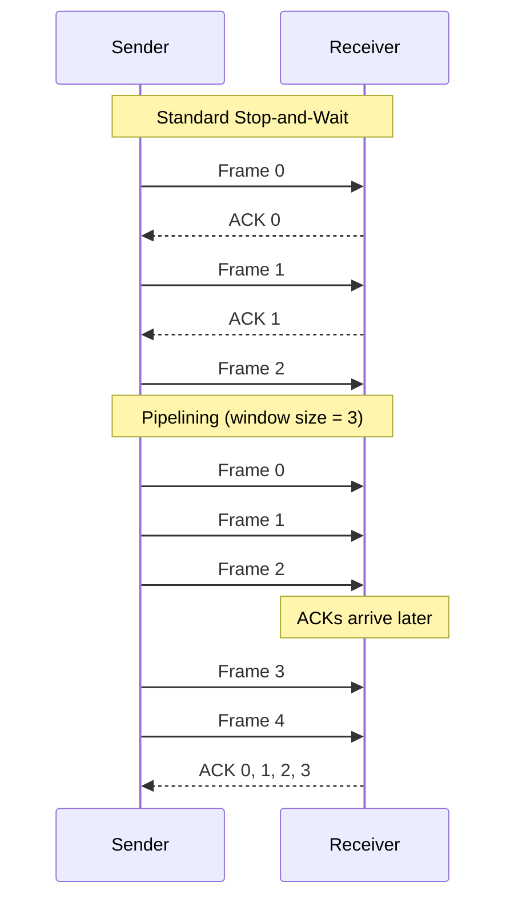
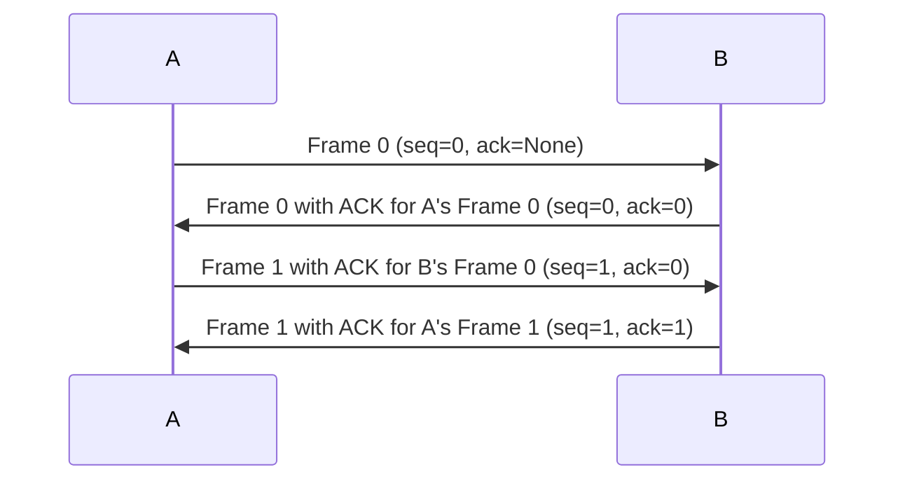
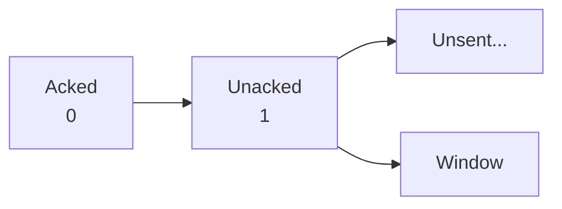
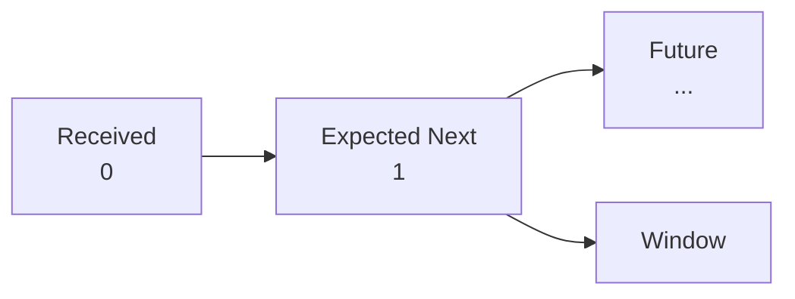
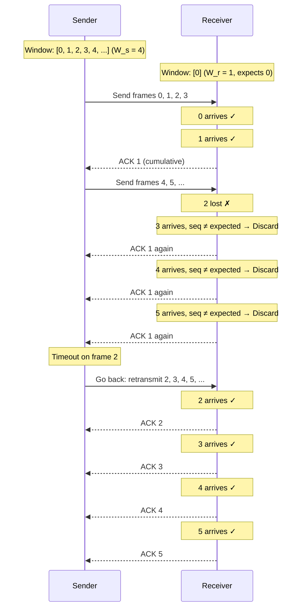
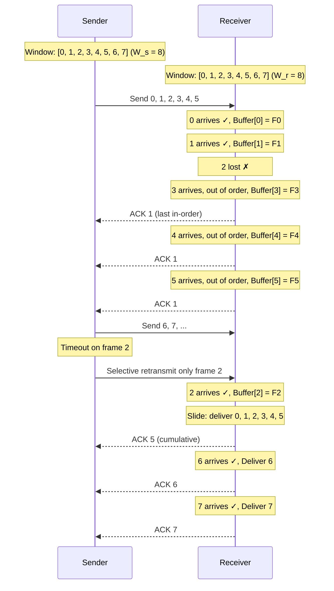

# 5. Sliding Window & Pipelining

> **[[00_DLL_Index|← Back to Index]]**

## The Efficiency Problem: Stop-and-Wait Wastage

[[04_Evolution_DLL_Protocols|Protocol 3 (stop-and-wait)]] mandates sender block until ACK received:

```
Sender sends Frame 0
        ↓ (1 μs)
Propagation delay
        ↓ (100 μs)
Receiver processes, sends ACK
        ↓ (1 μs)
Propagation delay
        ↓ (100 μs)
Sender receives ACK, sends Frame 1
```

**Total time per frame**: ~200 μs (for a 1 μs transmission!)

**Utilization**: $U = \frac{1}{200} = 0.5\%$ 

**Waste**: Sender idle 99.5% of the time waiting for ACK.

---

## Pipelining: Send Multiple Frames Before ACKing

### Core Idea

**Allow sender to have multiple unacknowledged frames "in flight"** simultaneously:



---

## Piggybacking: Bidirectional ACKs

### Problem with Simplex ACKs

Two separate channels needed for bidirectional traffic:
```
A → B: Data frames
A ← B: ACKs only
```

This wastes the reverse channel capacity (ACK frames are small control messages).

### Solution: Piggybacking

**Combine ACKs with outgoing data frames**:

```c
typedef struct {
  frame_type type;              // DATA or ACK
  unsigned char seq;            // My sequence number
  unsigned char ack;            // Acknowledgment for peer's frame
  unsigned char data[MAX_PKT];
} frame;
```

```
A sends Frame 0 (seq=0, ack=<None>)
        ↓
B sends Frame 0 with ACK for A's Frame 0 (seq=0, ack=0)
        ↓
A sends Frame 1 with ACK for B's Frame 0 (seq=1, ack=0)
        ↓
B sends Frame 1 with ACK for A's Frame 1 (seq=1, ack=1)
```



---

## Sliding Window Protocol

### The Window Concept

Sender maintains a **window** of frames allowed to be sent without ACK:

```mermaid
graph LR
    A[Sent & Acked<br/>[0]] --> B[Sent & Unacked<br/>[1][2][3][4]] --> C[Unsent<br/>[5]..]
    B --> D[Window (size 4)]
    A --> E[LAR<br/>(Last Acked)]
    B --> F[LFS<br/>(Last Frame Sent)]
```

**Invariant**: $LFS - LAR \leq W_{sender}$ (window size constraint)

Similarly, **receiver maintains a window** of frames it will accept:

```mermaid
graph LR
    G[Out of order or not yet seen<br/>[0][1][2]] --> H[Future<br/>[3][4][5]...]
    G --> I[Window]
    G --> J[LFR<br/>(Last Frame Received in order)]
```

**Invariant**: Receiver accepts frames in range $[LFR+1, LFR+W_{receiver}]$

### Terminology

| Term | Meaning |
|------|---------|
| **LAR** | Last Acked Received: highest sequence number acknowledged by receiver |
| **LFS** | Last Frame Sent: highest sequence number transmitted by sender |
| **LFR** | Last Frame Received (in order): highest consecutive frame received by receiver |
| **Window size** | Max unacknowledged frames allowed in flight |

---

## 1-Bit Sliding Window (Stop-and-Wait Variant)

### Concept

Sequence numbers are just 0 or 1; window size = 1 (i.e., only one unacknowledged frame allowed).

```
Sender:


Receiver:


### Normal Operation

```
Time  Sender State (seq, LAR, LFS)   Receiver State (LFR, expected)
  0   (0, -1, -1) → Send Frame 0                    (-1, 0)
  1   (0, -1, 0) [waiting]          
  2   [Frame arrives]                          [accept: seq=0 ✓]
  3                                           (0, 1)
  4                                           → Send ACK 0
  5   [ACK arrives]
  6   (1, 0, 0) → Send Frame 1              (-1, 0)
  7   (1, 0, 1) [waiting]
  8   [Frame arrives]                        [accept: seq=1 ✓]
  9                                          (1, 0)
 10                                          → Send ACK 1
 11   [ACK arrives]
 12   (0, 1, 1) → Send Frame 0 (restart)   (1, 0)
```

### Abnormal Case: Simultaneous Start

Both sides try to send Frame 0 at the same time:

```
Time  Sender State              Receiver State
  0   (0, -1, -1)              (0, -1, -1)
      → Send Frame 0           → Send Frame 0
  1   [Wait for ACK]           [Wait for ACK]
  2   [Receive Frame 0 ✓]      [Receive Frame 0 ✓]
      Both accept frame!
      → Send ACK 0             → Send ACK 0
  3   [Receive ACK 0]          [Receive ACK 0]
      (1, 0, 0) Move forward   (0, 1) Move forward
      → Send Frame 1           → Send Frame 1
  4   [both send Frame 1]      ...
```

**Result**: Both proceed normally, but "wasted" first transmission (both sent same seq). Rare edge case; protocol handles it.

---

## Go-Back-N Protocol

### Concept

- **Sender window**: Large ($W_s = N$, e.g., 4, 8)
- **Receiver window**: Small ($W_r = 1$, fixed)

**Key behavior**: Receiver **discards all frames after a gap**. If Frame $i$ is corrupted/lost, receiver rejects Frames $i+1, i+2, ...$ until $i$ is retransmitted.

### Sender Logic

```
Send frames sequentially up to window size:
for (seq = 0 to N-1) {
  send(frame[seq])
  start_timer(seq)
}

On ACK arrival:
  if (ack_num > LAR) {
    LAR = ack_num
    cancel all timers up to LAR
    while (LFS < LAR + W_s) {
      send(frame[LFS])
      LFS++
      start_timer(LFS)
    }
  }

On timeout for frame i:
  // Retransmit frame i and all after it (go back to i)
  seq = i
  while (seq <= LFS) {
    send(frame[seq])
    start_timer(seq)
    seq++
  }
```

### Receiver Logic

```
expected_seq = 0

while (true) {
  if (frame_received.seq == expected_seq) {
    pass_to_network_layer(frame)
    expected_seq = (expected_seq + 1) % (2 * W_s)
    send(ACK expected_seq - 1)
  } else {
    // Out of order or duplicate: discard
    send(ACK expected_seq - 1)  // ACK last in-order frame
  }
}
```

### Example: Go-Back-N with Loss



### Efficiency Analysis

**Throughput** (for single frame loss at position $i$ in window of size $N$):

$$\text{Utilization} = \frac{N-1}{N + (\text{recovery time})}$$

If recovery time = $N$ RTT (retransmit $N$ frames):
$$U \approx \frac{N-1}{2N} \approx 0.5 \text{ (bad for large } N \text{)}$$

**Advantage**: Simple; receiver needs minimal buffering
**Disadvantage**: Single loss causes mass retransmission (inefficient)

---

## Selective Repeat Protocol

### Concept

- **Sender window**: Large ($W_s = N$)
- **Receiver window**: Large ($W_r = N$)

**Key behavior**: Receiver **buffers out-of-order frames**. If Frame $i$ is lost, receiver only requests retransmission of $i$, not $i+1, i+2, ...$

### Sender Logic

```
Send frames up to window limit:
while (LFS < LAR + W_s) {
  if (frame[LFS] != sent) {
    send(frame[LFS])
    start_timer(LFS)
    sent[LFS] = true
  }
  LFS++
}

On ACK for frame i:
  if (i in [LAR, LFS]) {
    mark frame i as acked
    if (i == LAR) {
      // Slide window: find new LAR
      while (frame[LAR] is acked) {
        LAR++
      }
    }
  }

On timeout for frame i:
  // Retransmit only frame i (selective)
  send(frame[i])
  start_timer(i)
```

### Receiver Logic

```
LFR = -1
buffer[0...W_r-1] = empty

while (true) {
  if (frame_received.seq in [LFR+1, LFR+W_r]) {
    buffer[frame.seq % W_r] = frame
    
    // Slide window
    while (buffer[LFR+1] != empty) {
      pass_to_network_layer(buffer[LFR+1])
      LFR++
      send(ACK LFR)
    }
  } else if (frame.seq <= LFR) {
    // Duplicate: already delivered
    send(ACK LFR)
  } else {
    // Out of window: ignore
  }
}
```

### Example: Selective Repeat with Loss



### Efficiency

**Throughput** (single loss):
$$U = \frac{N}{N + 1} \approx 1 - \frac{1}{N}$$

For $N = 8$: $U \approx 87.5\%$ (much better than Go-Back-N!)

**Advantage**: Only lost frame retransmitted; much better utilization
**Disadvantage**: Receiver must buffer up to $W_r$ frames; more complex

---

## Window Size Constraint

### The Problem

Can sequence numbers be reused? How many frames can be "in flight"?

**Scenario**: Sequence numbers 0-3 (total = 4 possible values)

```
Sender                      Receiver
Frame 0 ------→             (expects 0)
Frame 1 ------→
Frame 2 ------→             [all arrive]
Frame 3 ------→
Frame 0 ------→             ACK 0, 1, 2, 3
                            (LFR = 3, expects 0)

                            [PROBLEM!]
                            Receives Frame 0 again
                            Is it a NEW frame or DUPLICATE?
```

### Window Size Constraint

**Rule**: $$W_{max} \leq \frac{\text{Sequence Number Space}}{2}$$

**Intuition**: With total space $M$ (e.g., $M = 4$ for 2-bit sequence), max window = $M/2$.

**Example (2-bit seq, $M = 4$)**:
- Go-Back-N: $W_s = 2, W_r = 1$ ✓ ($W_s \leq 2$)
- Selective Repeat: $W_s = W_r = 2$ ✓ ($W_s + W_r \leq 4$)

**Example (3-bit seq, $M = 8$)**:
- Go-Back-N: $W_s = 4, W_r = 1$ ✓
- Selective Repeat: $W_s = W_r = 4$ ✓

**Why not larger?**
```
Sequence: 0, 1, 2, 3, 0, 1, 2, 3, ...

If W_s = 3 and M = 4:
Sent:     0  1  2  3  0  ...
          ↑           ↑
          May not yet know if this is new Frame 0 or retransmission
          from window [0, 1, 2] wrapping around
```

---

## Comparison: Go-Back-N vs. Selective Repeat

| Aspect | Go-Back-N | Selective Repeat |
|--------|-----------|------------------|
| **Sender Window** | Large ($N$) | Large ($N$) |
| **Receiver Window** | 1 | $N$ |
| **On Loss** | Retransmit all after loss | Retransmit only lost frame |
| **Receiver Buffering** | Minimal | $O(N)$ |
| **Complexity** | Simple | Complex |
| **Utilization** | Low (~50% for large $N$) | High (~87-99%) |
| **Real-world** | Legacy (TCP uses variant) | Modern (used in WiFi, 5G) |

---

## Modern Context

[[04_Evolution_DLL_Protocols|Protocol 3 (stop-and-wait)]] is superseded by:
- **TCP** (network layer): Sliding window, cumulative ACKs, selective retransmission via SACK option
- **Modern wireless**: Selective Repeat to handle high error rates
- **Satellite links**: Larger windows ($N = 64-256$) to amortize latency

---

## Key Takeaways

1. **Pipelining** solves stop-and-wait efficiency: allow multiple unacknowledged frames
2. **Piggybacking** saves bandwidth: combine ACKs with outgoing data
3. **Sliding window** formalism: sender window $[LAR+1, LFS]$, receiver window $[LFR+1, LFR+W_r]$
4. **1-bit window** = stop-and-wait with 0/1 sequence toggle
5. **Go-Back-N**: Simple but inefficient (discards good frames after loss)
6. **Selective Repeat**: Complex but efficient (only retransmit lost frame)
7. **Window size constraint**: $W_{max} \leq \text{SequenceSpace} / 2$ (prevent ambiguity)

---

> **Return to**: [[00_DLL_Index|DLL Index]] — Complete reference ready for study

