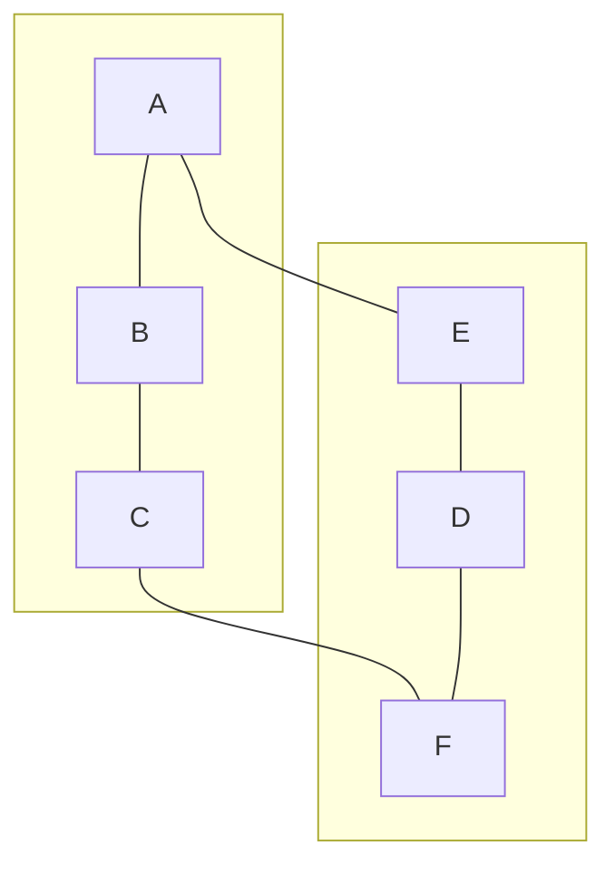
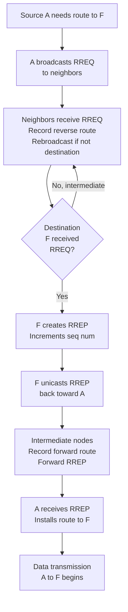

# AODV Protocol

## Definition

**AODV** stands for **Ad Hoc On-Demand Distance Vector**. It is a routing protocol designed specifically for **mobile ad hoc networks (MANETs)** where:
- No centralized routing authority exists
- Network topology is highly dynamic (nodes move frequently)
- Mobile nodes have limited battery and bandwidth
- There is no fixed infrastructure (base stations)

AODV combines concepts from both distance vector and on-demand routing:
- **Distance Vector aspect**: Uses hop count as metric
- **On-Demand aspect**: Only discovers routes when needed (not proactively)

## Why AODV for Ad Hoc Networks?

### Traditional routing protocols fail in ad hoc networks because:

| Problem | Reason | Impact |
|---|---|---|
| **High topology change rate** | Nodes move frequently, links appear/disappear | Periodic updates become obsolete before received |
| **Limited bandwidth** | Wireless medium is shared, battery limited | Can't afford constant periodic updates like RIP |
| **Power constraints** | Nodes run on batteries | Computing and communicating routing updates drains battery |
| **Lack of infrastructure** | No central servers/routers | Can't rely on stable fixed infrastructure |

### AODV Solutions:

1. **On-demand routing**: Only send route discovery packets when route is needed
2. **Limited scope flooding**: Use expanding ring search (TTL incrementally increases)
3. **Route maintenance**: Actively maintain only routes currently in use
4. **Local repair**: Try to fix broken routes locally before discarding

## AODV Core Concepts

### Route Request (RREQ) and Route Reply (RREP)

When node A wants to send a packet to node D but doesn't have a route:

1. A broadcasts a **Route Request (RREQ)** message
2. Intermediate nodes rebroadcast the RREQ, creating reverse routes back to A
3. When RREQ reaches D, D sends back a **Route Reply (RREP)**
4. The RREP unicasts back to A along the reverse path
5. A can now send data packets to D

### Sequence Numbers

AODV uses **sequence numbers** to ensure freshness of routes and prevent loops:

- Each node maintains a **sequence number** that increments with each new route it initiates
- Routes with higher sequence numbers are considered fresher/more valid
- Prevents using stale routes from cached entries

## AODV Route Discovery Process

### Detailed Steps

**Step 1: Source node wants to send data**

```
Source node A wants to send packet to destination D
A checks routing table: no route to D found
A creates Route Request (RREQ)
```

**Step 2: RREQ Packet Format**

```
RREQ packet contains:
  Source IP: A
  Destination IP: D
  Source Sequence Number: seq_A++ (incremented)
  Destination Sequence Number: Last known seq for D (or 0 if unknown)
  Hop Count: 0
  RREQ ID: Unique identifier (incremented for each RREQ)
  TTL: Time To Live (starts at some threshold, e.g., 5)
```

**Step 3: A broadcasts RREQ to all neighbors**

```
A broadcasts RREQ to all neighbors (B, C, E)
TTL is decremented at each hop
```

**Step 4: Intermediate nodes process RREQ**

```
For each intermediate node (e.g., B) receiving RREQ from A:
  1. Check if this RREQ was seen before (using source + RREQ_ID)
     If yes: Discard (prevent infinite forwarding)
  2. Record reverse path to source A (via incoming interface)
     - Store in Reverse Route Table: "To reach A, use interface eth0, next hop B"
     - Set expiration timer (route validity timeout, typically 3000ms)
  3. If B == destination D:
     - Process as final destination (see Step 5)
  4. Else (B is intermediate):
     - Check if B has fresh route to D in its routing table
       a. If yes AND destination seq in routing table >= seq in RREQ:
          - Send RREP back to A (unicast) via reverse path
          - Include distance to D from B's routing table
       b. If no valid route or stale route:
          - Increment hop count: RREQ.hopcount++
          - Forward RREQ to all neighbors (except incoming interface)
          - Some implementations use expanding ring search:
            * First attempt with TTL = 5
            * If no reply after timeout, retry with TTL = 10, 20, etc.
```

**Step 5: Destination receives RREQ**

```
When D receives RREQ (after multiple hops):
  1. Increment own sequence number: seq_D++
  2. Create Route Reply (RREP) packet:
     - Destination IP: D
     - Source IP: A
     - Destination Sequence Number: seq_D (fresh, just incremented)
     - Hop Count: 0 (will increase as it travels back)
     - Source IP: A (where RREP is going)
  3. Send RREP back to A via reverse path (unicast)
     - This unicast follows the reverse route recorded by intermediate nodes
```

**Step 6: RREP travels back to source**

```
RREP is unicast back along reverse path (A ← C ← B ← D)

Each intermediate node (e.g., C) receiving RREP:
  1. Increment hop count
  2. Record forward route to D:
     - "To reach D, use this interface, next hop is D, distance = hop_count"
     - Set expiration timer
  3. Forward RREP back toward A (unicast)
```

**Step 7: Source receives RREP**

```
Source A receives RREP from D (via reverse path):
  1. Extract route: A → ... → D with hop count = N
  2. Install forward route to D in routing table
  3. Can now send data packets to D
  4. Packets are routed to D via the established path
```

## Step-by-Step Simulation: AODV Route Discovery

### Network Topology



**Annotations:**
- **Link costs:** All links have equal cost (one hop = 1 unit).
- **Objective:** A wants to send data to F.


### Simulation: Route Discovery from A to F

**Time t=0: A initiates route discovery**

```
A creates RREQ:
  Source: A, Destination: F
  Source Seq: 5, Dest Seq: 0 (unknown)
  Hop Count: 0, RREQ_ID: 101, TTL: 5

A broadcasts RREQ to neighbors (B, E)
```

**Time t=1: B and E receive RREQ from A**

```
B receives RREQ from A:
  ✓ Not seen before (new RREQ_ID 101)
  ✓ Record reverse route: A via interface eth0, timer = 3000ms
  ✗ B is not destination F
  ✗ B has no route to F
  → Increment hop count to 1
  → Rebroadcast RREQ to neighbors (C, not back to A)

E receives RREQ from A:
  ✓ Not seen before
  ✓ Record reverse route: A via interface eth1, timer = 3000ms
  ✗ E is not destination F
  ✗ E has no route to F
  → Increment hop count to 1
  → Rebroadcast RREQ to neighbors (D, not back to A)
```

**Time t=2: C and D receive RREQ**

```
C receives RREQ from B (now hop_count = 1):
  ✓ Not seen before (same RREQ_ID, but first time receiving)
  ✓ Record reverse route: A via B, timer = 3000ms
  ✗ C is not destination F
  ✗ C has no route to F
  → Increment hop count to 2
  → Rebroadcast RREQ to neighbors (F, not back to B)

D receives RREQ from E (now hop_count = 1):
  ✓ Not seen before
  ✓ Record reverse route: A via E, timer = 3000ms
  ✗ D is not destination F
  ✗ D has no route to F
  → Increment hop count to 2
  → Rebroadcast RREQ to neighbors (F, not back to E)
```

**Time t=3: F receives RREQ from two paths**

```
F receives RREQ from C (hop_count = 2):
  ✓ This is F (destination)!
  ✓ Create new RREP:
    - Destination: F, Source: A
    - Destination Seq: 10 (F's latest seq, incremented)
    - Hop Count: 0 (will become 2 when reaching A)
  → Send RREP unicast back via reverse path (F → C → B → A)

F receives RREQ from D (hop_count = 2) (shortly after):
  ✗ Already sent RREP for this RREQ
  → Discard this RREQ (or send another RREP via this path)
  
Note: Some AODV implementations send RREPs via all paths that arrive,
      creating multiple routes. Standard AODV sends RREP for first arrival.
```

**Time t=4: RREP travels back**

```
F sends RREP:
  Source: A, Destination: F
  Hop Count: 0, TTL: appropriate value
  Destination Seq: 10

C receives RREP from F (hop_count becomes 1):
  ✓ This is for destination F
  ✓ Record forward route: F via this interface, next_hop = F, distance = 1
  → Increment hop count to 2 (now 2 hops to F)
  → Unicast RREP back to A via reverse path (toward B)

B receives RREP from C (hop_count becomes 2):
  ✓ This is for destination F
  ✓ Record forward route: F via this interface, next_hop = C, distance = 2
  → Increment hop count to 3
  → Unicast RREP back to A (toward B)

RREP from D path is discarded or arrives later
```

**Time t=5: A receives RREP**

```
A receives RREP (hop count = 3, path A-B-C-F):
  ✓ Extract route to F: A → B → C → F, distance = 3 hops
  ✓ Install in routing table:
    Destination: F
    Next Hop: B
    Hop Count: 3
    Destination Seq: 10
    Route Expiration: Set timer (~3000ms)

A can now send data packets to F!
```

### Routing Tables After Discovery

**A's routing table:**
```
Destination | Next Hop | Hop Count | Dest Seq | Status
F           | B        | 3         | 10       | Valid
```

**B's routing table:**
```
Destination | Next Hop | Hop Count | Dest Seq | Status
A           | (local)  | 0         | 5        | Valid (reverse)
F           | C        | 2         | 10       | Valid
```

**C's routing table:**
```
Destination | Next Hop | Hop Count | Dest Seq | Status
A           | B        | 2         | 5        | Valid (reverse)
F           | (local)  | 1         | 10       | Valid
```

**F's routing table:**
```
Destination | Next Hop | Hop Count | Dest Seq | Status
A           | C        | 3         | 5        | Valid (reverse)
```

## Mermaid Diagram: AODV Route Discovery Flow



## AODV Route Maintenance

See: [[AODV_Route_Maintenance_Simulation]]

Routes are maintained through:
1. **Link failure detection**: Intermediate nodes monitor links; if no data for timeout period, assume broken
2. **Route error (RERR)** messages: When a link fails, upstream nodes are notified
3. **Local repair**: Some implementations allow intermediate nodes to repair routes locally
4. **Route expiration**: Routes are aged out if not used (route timeout timer)

## Comparison with Other Routing Protocols

| Aspect | AODV | RIP | OSPF |
|---|---|---|---|
| **Routing type** | On-demand, distance vector | Proactive, distance vector | Proactive, link state |
| **Metric** | Hop count | Hop count | Cost (bandwidth-based) |
| **Convergence** | On-demand (sec) | Periodic (min) | Event-driven (sec) |
| **Scalability** | Medium (100s nodes) | Poor (max 15 hops) | Good (1000s nodes) |
| **Bandwidth overhead** | Low | High (periodic) | Medium |
| **Best use case** | Mobile ad hoc | Legacy, small networks | Enterprise, ISP networks |

## Key Advantages of AODV

1. **On-demand routing**: Routes discovered only when needed → saves bandwidth/power
2. **No periodic broadcasts**: Unlike RIP, doesn't continuously update → battery efficient
3. **Loop-free routes**: Sequence numbers prevent routing loops
4. **Scales better than RIP**: Can work in networks larger than 15 hops
5. **Handles mobility**: Designed for dynamic topologies with moving nodes

## Limitations of AODV

1. **Higher latency for first packet**: Initial route discovery adds delay
2. **Broadcast storm**: During route discovery, RREQ can flood the entire network
3. **Requires route maintenance**: Must actively monitor and repair routes
4. **TTL expansion overhead**: Expanding ring search can send multiple RREQs
5. **Security**: Susceptible to various attacks (spoofing, blackhole, etc.)

---

## Next Steps

- [[AODV_Route_Discovery_Simulation]] — Detailed step-by-step simulation
- [[AODV_Route_Maintenance_Simulation]] — How AODV handles link failures
- [[Ad_Hoc_Networks_Overview]] — Overview of ad hoc network types
