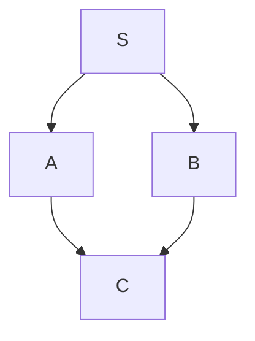

# Broadcast Routing Algorithms

## Overview

Broadcast routing algorithms define the mechanisms and decision procedures routers use to forward broadcast packets such that all network nodes receive the packet exactly once (or at least once). This note details three major algorithmic approaches: flooding with limits, reverse path forwarding, and sink trees.

## Assumption and Prerequisite

This discussion assumes:
- A connected network graph $G = (V, E)$ where routing information is available to construct unicast paths.
- Each broadcast packet carries a unique identifier (source address + broadcast sequence number).
- Routers maintain state to detect and suppress duplicate broadcasts.

Refer to [[Broadcast_Routing]] for foundational definitions.

## Algorithm 1: Controlled Flooding

### Principle

Controlled flooding forwards a broadcast packet over all outgoing interfaces except the one on which it arrived, but limits forwarding through a hop count (TTL) mechanism.

### Pseudocode

```
upon reception of broadcast packet P at router R on interface i_in:
  if P is a duplicate (already processed):
    discard P
  else:
    mark P as processed
    for each interface i_out in R.interfaces where i_out != i_in:
      if P.TTL > 0:
        P.TTL := P.TTL - 1
        forward P over i_out
      end if
    end for
  end if
```

### Properties

**Correctness**: If the network diameter is $D$ (maximum distance in hops between any two nodes), setting initial TTL to $D$ or greater ensures all nodes receive the packet.

**Completeness**: Every connected node receives the broadcast packet at least once.

**Overhead**: Let $|V| = n$ and $|E| = m$. In the worst case, the number of packet transmissions is $O(m)$ because each edge may carry the packet at most once in each direction.

### Duplicate Detection Mechanism

Routers must maintain a broadcast cache storing tuples $(S, \text{broadcast\_id})$ for recently seen broadcasts from source $S$. Typically:
- The broadcast ID is a sequence number assigned by the source.
- The cache has a finite size and entries expire after a timeout (e.g., several minutes).

Formally, if router $R$ receives packet $P$ with $(S, \text{bid}) \in R.\text{cache}$, then $P$ is a duplicate and is discarded.

### Limitations

1. **No explicit spanning tree**: The algorithm may result in redundant transmissions if the network has cycles.
2. **Scalability**: TTL-based limiting works only for networks with bounded diameter. Large networks require careful TTL tuning.
3. **Inefficiency**: The algorithm does not optimize for minimal bandwidth usage; it simply floods subject to TTL constraints.

## Algorithm 2: Reverse Path Forwarding (RPF)

### Principle

Reverse Path Forwarding exploits the existence of unicast routing information (e.g., from a routing protocol like [[Distance_Vector_Routing|RIP]] or [[Link_State_Routing|OSPF]]) to forward broadcast packets only on edges that are part of the shortest-path tree rooted at the broadcast source.

### Formal Definition

Let $S$ be the broadcast source. For each router $R$ and interface $i$, define:
- $\text{parent}(R, S)$ = the interface over which the shortest unicast path from $R$ back to $S$ is reached (the "reverse path" interface).

The RPF rule states: A broadcast packet from source $S$ arriving at router $R$ on interface $i$ is forwarded on all outgoing interfaces except $i$ **if and only if** $i = \text{parent}(R, S)$.

### Pseudocode

```
upon reception of broadcast packet P (source = S) at router R on interface i_in:
  if P is a duplicate:
    discard P
  else if i_in == parent(R, S):  // packet arrived on correct reverse path
    mark P as processed
    for each interface i_out in R.interfaces where i_out != i_in:
      forward P over i_out
    end for
  else:  // packet arrived on wrong interface
    discard P (or log for monitoring)
  end if
```

### Properties

**Spanning Tree Construction**: RPF implicitly constructs a spanning tree rooted at source $S$. The tree consists of all shortest paths from every node back to $S$. When traversed from $S$ outward, this tree is called the **shortest-path tree (SPT)**.

**Duplicate-Free Delivery**: Over the SPT, each node is reached exactly once because there is a unique shortest path from each node to the source.

**Efficiency**: The number of transmissions equals exactly $|V| - 1$ (the number of tree edges), which is optimal for broadcast delivery.

**Optimality**: RPF is optimal in terms of number of packets transmitted, provided the underlying unicast routing protocol computes shortest paths correctly.

### Unicast Routing Dependency

RPF correctness depends entirely on the accuracy of unicast routing information:
- If the unicast routing protocol converges to correct shortest paths, RPF delivers the broadcast exactly once to all nodes.
- If unicast routes are incorrect (due to transient convergence during route changes), RPF may fail to reach some nodes.

### Example

Consider a simple network:



Suppose shortest paths from each node to $S$ are:
- $A \to S$: direct edge
- $B \to S$: direct edge
- $C \to S$: via $A$ (path length 2)

When $S$ broadcasts:
- $A$ receives on interface $i_A$ (from $S$); $i_A = \text{parent}(A, S)$. $A$ forwards to $C$.
- $B$ receives on interface $i_B$ (from $S$); $i_B = \text{parent}(B, S)$. $B$ does not forward (no outgoing edges except to $S$).
- $C$ receives from $A$ on interface $i_C$; $i_C = \text{parent}(C, S)$. $C$ does not forward.

Result: $S \to A \to C$ and $S \to B$. All nodes receive exactly once.

## Algorithm 3: Sink Tree (Steiner Tree) Approach

### Principle

Instead of computing broadcast trees dynamically per source, a network may pre-compute a single spanning tree (rooted at a central "rendezvous" node or core) over which all broadcast traffic is forwarded.

### Formal Definition

A sink tree $T$ rooted at a core node $C$ is a spanning tree of the network where:
- The root is a designated core node $C$.
- For any broadcast source $S$, the broadcast packet is first forwarded from $S$ toward the root $C$ (upstream).
- Once the packet reaches $C$, it is flooded to all nodes in the tree (downstream).

This approach is primarily used in multicast routing (see [[Multicast_Routing_Algorithms]]) but can also be applied to broadcast.

### Properties

**Simplicity**: Only one tree needs to be computed and maintained, reducing router memory and complexity.

**Efficiency Trade-off**: A sink tree may not be the shortest path tree for every source. Packets may travel longer routes, increasing latency and bandwidth usage compared to source-specific SPTs.

**Centralized Computation**: The tree is typically computed once at the core node or through a centralized routing center.

### Comparison to RPF

| Aspect | RPF (Source SPT) | Sink Tree |
|---|---|---|
| **Tree per source** | Yes | No (single core tree) |
| **Optimality** | Shortest path to source | Potentially suboptimal |
| **Router state** | Requires reverse path computation per source | Only one tree state |
| **Deployment complexity** | Requires working unicast routing | Requires core node election/configuration |

## Duplicate Suppression

All broadcast algorithms require duplicate suppression to prevent exponential packet replication in networks with cycles.

### Implementation

Each router maintains a **broadcast cache**:

```
BroadcastCache = {(source_address, broadcast_sequence_number): timestamp}
```

When a broadcast packet arrives:
1. Extract $(S, \text{seq})$ from the packet.
2. If $(S, \text{seq})$ exists in the cache and timestamp is not expired, discard as duplicate.
3. Otherwise, add $(S, \text{seq})$ to the cache with current timestamp.
4. Process according to the forwarding algorithm (flooding, RPF, or sink tree).

### Cache Management

- **Timeout**: Entries are removed after a timeout period (typically 60-300 seconds), allowing rebroadcasts if needed.
- **Memory**: Cache size is bounded; old entries are evicted when the cache is full.

## Scalability and Practical Considerations

### Broadcast in Large Networks

In large networks (ISPs, global networks), broadcast is typically:
- Restricted to administrative domains (link-local or subnet-local).
- Disabled for Internet-wide scope to prevent congestion.

[[DHCP_Protocol|DHCP]] and [[ICMP_Protocol|ICMP]] rely on broadcast, but only within administrative boundaries.

### Broadcast Storm

An uncontrolled broadcast (e.g., due to misconfiguration or software bug) can cause a broadcast storm where the same packet is repeatedly rebroadcast, consuming all available bandwidth. This is prevented through:
- TTL limits in flooding.
- Correct reverse path implementation in RPF.
- Cache-based duplicate detection.

## Related Concepts

- [[Broadcast_Routing]]: Foundational broadcast routing concepts.
- [[Multicast_Routing_Algorithms]]: Extends broadcast concepts to multicast groups.
- [[Distance_Vector_Routing]]: Provides routing information used by RPF.
- [[Link_State_Routing]]: Alternative routing information source for RPF.

---

**Next:** [[Multicast_Routing]]
