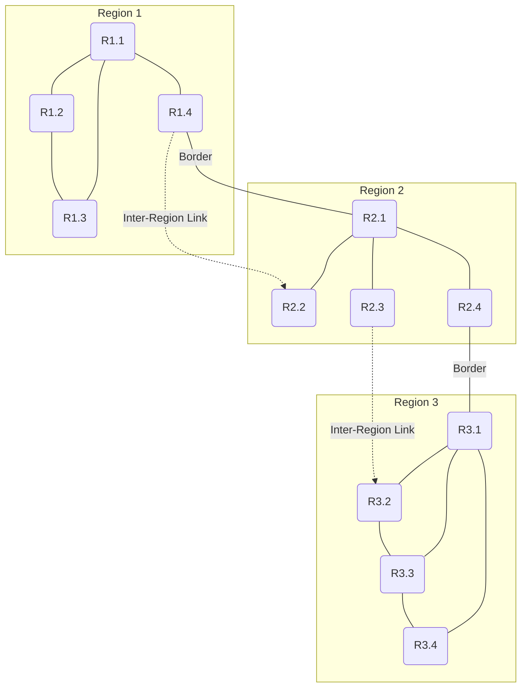

# Hierarchical Routing

## Motivation: Scalability Problem

In a flat routing architecture where all routers know routes to all destinations:
- Each router maintains a routing table with entries for every other router
- Routing table size: $O(n)$ where $n$ = total number of routers
- In the Internet: over 800,000 routers → routing tables would have 800,000+ entries
- **Infeasible**: Memory, lookup time, and protocol overhead become prohibitive

**Solution: Hierarchical Routing** — Organize the network into regions, routers learn detailed routes within their region and only aggregate information about other regions.

## Core Concept

**Hierarchical routing** structures the network as a hierarchy of routing domains:

```
Level 1: Regions (Areas)
  Region A
  Region B
  Region C

Level 2: Routers within each region
  Region A: R1, R2, R3
  Region B: R4, R5
  Region C: R6, R7, R8

Level 3: Border routers connecting regions
  A-B border: R3 (border router)
  B-C border: R5 (border router)
  A-C border: None (no direct link)
```

### Formal Definition

A hierarchical routing system has:
1. **Partition** of the network into regions (areas, domains, AS)
2. **Intra-region routing**: Each region runs its own routing protocol
3. **Inter-region routing**: Border routers connect regions and advertise reachability
4. **Route aggregation**: Summary information replaces detailed routing entries

## Routing Table Structure in Hierarchical Networks

### Without Hierarchical Routing

A router in a flat network maintains:
```
Destination    Next Hop
1.0.0.0/8      Router_A
1.0.1.0/24     Router_B
1.0.2.0/24     Router_C
1.1.0.0/16     Router_D
... (800,000 entries)
```

### With Hierarchical Routing

The same router maintains:
```
Local Region (Region A):
  Detailed routes to all 100 routers in Region A

Other Regions:
  Route to Region B:        Via Border Router BR_A (1 entry)
  Route to Region C:        Via Border Router BR_A (1 entry)
  Route to Region D:        Via Border Router BR_B (1 entry)
  Route to All Other Regions: Via default border router (1 entry)

Total entries: ~100 (local) + 5-10 (regional summary)
```

## Three-Level Hierarchical Example

### Network Structure



**Border Routers:**
- R1.4 -- R2.1 (Region 1 to Region 2)
- R2.4 -- R3.1 (Region 2 to Region 3)

### Routing Tables

**Router R1.2 (internal to Region 1):**
```
Destination    Next Hop    Type
R1.1           R1.1        Intra-region
R1.3           R1.3        Intra-region
R1.4           R1.1        Intra-region
Region 2       R1.1        Inter-region (border)
Region 3       R1.1        Inter-region (border)
```

**Border Router R1.4 (connecting Regions 1 and 2):**
```
Destination    Next Hop    Type
R1.1           R1.1        Intra-region (to Region 1)
R1.2           R1.2        Intra-region (to Region 1)
R1.3           R1.3        Intra-region (to Region 1)
R2.1           R2.1        Inter-region (border link)
R2.2           R2.1        Inter-region (via R2.1)
R2.3           R2.1        Inter-region (via R2.1)
R2.4           R2.1        Inter-region (via R2.1)
Region 3       R2.1        Inter-region (to Region 2, then to 3)
```

**Router R2.2 (internal to Region 2):**
```
Destination    Next Hop    Type
R2.1           R2.1        Intra-region
R2.3           R2.3        Intra-region
R2.4           R2.4        Intra-region
Region 1       R2.1        Inter-region (border via R2.1)
Region 3       R2.4        Inter-region (border via R2.4)
```

## Packet Forwarding in Hierarchical Networks

### Step 1: Intra-Region Routing

When a packet is sent from R1.2 to a destination in Region 1:
1. R1.2 checks: Is destination in Region 1?
2. If yes: Use intra-region routing table
3. Forward using detailed route (e.g., R1.2 → R1.3 → destination)

### Step 2: Inter-Region Routing

When a packet is sent from R1.2 to a destination in Region 2:
1. R1.2 checks: Is destination in Region 1? NO
2. Check inter-region table: Region 2 is reachable via R1.1 (to border R1.4)
3. Forward to R1.1
4. R1.1 forwards to R1.4
5. R1.4 receives packet: Is destination in Region 1? NO
6. R1.4 checks inter-region table: Region 2 is reachable via border link R2.1
7. Forward to R2.1
8. R2.1 receives packet: Is destination in Region 2? YES
9. R2.1 uses intra-region table to forward to final destination

### Complete Forwarding Example

**Scenario:** Packet from R1.2 (Region 1) to R3.3 (Region 3)

```
R1.2 (intra-region lookup):
  Destination R3.3 not in Region 1
  Check inter-region: Region 3 via R1.1 (to reach border R1.4)
  Action: Forward to R1.1

R1.1 (intra-region forwarding):
  Destination R3.3 not in Region 1
  Forward to R1.4 (border router)

R1.4 (border router, inter-region decision):
  Incoming: R1.1
  Destination: R3.3 (in Region 3)
  Inter-region table: Region 3 via R2.1 (border to Region 2)
  Action: Forward to R2.1

R2.1 (border router, received from Region 1):
  Incoming: R1.4
  Destination: R3.3 (not in Region 2)
  Intra-region table: R3.3 not local
  Inter-region table: Region 3 via R2.4 (border to Region 3)
  Action: Forward to R2.4

R2.4 (border router, inter-region decision):
  Incoming: R2.1
  Destination: R3.3 (in Region 3)
  Inter-region table: Region 3 via R3.1 (border to Region 3)
  Action: Forward to R3.1

R3.1 (border router, received from Region 2):
  Incoming: R2.4
  Destination: R3.3 (in Region 3)
  Intra-region table: R3.3 via R3.1 → R3.3
  Action: Forward to R3.3

R3.3 (final destination):
  Receives packet
  Destination is local
  Deliver to application layer
```

## OSPF as Hierarchical Protocol

**OSPF** (Open Shortest Path First) is a practical example of hierarchical routing using **areas**.

### OSPF Hierarchy

```
AS (Autonomous System)
  ├── Backbone Area (Area 0)
  │    ├── ABR (Area Border Routers)
  │    └── Internal Backbone routers
  ├── Area 1
  │    ├── Internal routers
  │    └── ABR (connects to Area 0)
  ├── Area 2
  │    ├── Internal routers
  │    └── ABR (connects to Area 0)
  └── ASBR (AS Boundary Routers for external routes)
```

### OSPF Routing Table

**Router in Area 1 (not ABR):**
```
Destination              Type                 Cost    Next Hop
10.0.1.0/24             Intra-area route      5      Direct
10.0.2.0/24             Intra-area route      8      Router_A
Backbone (Area 0)       Inter-area route      10     ABR
Other areas             Inter-area route      15     ABR
External routes         External route        20     ASBR
```

### OSPF Link State Distribution

**Intra-area (within Area 1):**
- Routers flood LSAs (Link State Advertisements) only within Area 1
- All routers in Area 1 have complete topology of Area 1

**Inter-area (Area 1 to Area 2):**
- ABR (Area Border Router) summarizes routes from Area 1
- Instead of advertising all individual routers, ABR advertises:
  - "Area 1 contains subnets 10.0.1.0/24, 10.0.2.0/24, ..."
- Only one entry per area in other areas' routing tables

## Benefits of Hierarchical Routing

| Benefit | Explanation |
|---|---|
| **Reduced routing table size** | $O(n)$ becomes $O(r + h)$ where $r$ = regions, $h$ = height of hierarchy |
| **Lower protocol overhead** | Fewer LSAs/updates to propagate across network |
| **Faster convergence** | Failures in one region don't affect other regions' calculations |
| **Administrative scalability** | Each region can have independent management |
| **Reduced CPU load** | Less routing computation needed at non-border routers |
| **Simplified network design** | Clearer structure and organization |

## Example Scalability Comparison

### Flat Network with 1000 routers

- Routing table size per router: ~1000 entries
- LSA flooded to all routers: 1000 LSAs per topology change
- Convergence time: O(n²) = 1,000,000 operations

### Hierarchical Network with 1000 routers in 10 areas

- Routing table size per router: ~100 (intra-area) + 10 (inter-area) = 110 entries
- LSAs flooded: Only within local area (~100 LSAs), summarized across areas
- Convergence time: O(n/r)² = O(100)² = 10,000 operations
- **Improvement factor: 100x reduction in routing table and computation**

## Practical Configuration: OSPF Areas

```bash
# Router A: Area 0 (Backbone)
configure terminal
router ospf 1
  router-id 1.1.1.1
  network 10.0.0.0 0.0.255.255 area 0
  network 172.16.0.0 0.0.15.255 area 0

# Router B: Area 1
configure terminal
router ospf 1
  router-id 2.2.2.2
  network 192.168.1.0 0.0.0.255 area 1
  network 172.16.0.0 0.0.15.255 area 0  # Connects to backbone

# View area information
show ip ospf
show ip ospf neighbor
show ip ospf database summary
```

## Hierarchical Routing in the Internet

**The Internet uses multi-level hierarchy:**

```
Level 1: Autonomous Systems (AS)
  AS 65001 (ISP A)
  AS 65002 (ISP B)
  AS 65003 (Enterprise)

Level 2: Within AS - Regional Areas
  Region USA
  Region Europe
  Region Asia

Level 3: Within Region - Individual networks
  Branch offices
  Data centers
  Customer networks

Inter-level routing:
  Within Level 3: Static routes or OSPF (interior)
  Within Level 2: OSPF or ISIS (interior)
  Between Level 1 (between AS): BGP (exterior)
```

---

## Next Steps

- [[Unicast_Routing_Overview]] — Foundation concepts
- [[Link_State_Routing]] — OSPF detailed explanation
- [[Hierarchical_Routing_Examples_and_Simulations]] — Detailed examples
