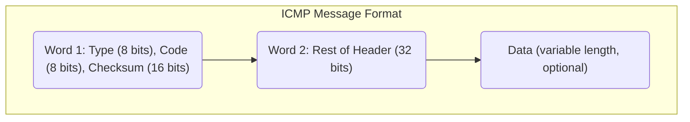

# ICMP Protocol

## Definition

**ICMP** stands for **Internet Control Message Protocol**. It is a network layer protocol (Layer 3) used for:
- Reporting errors in packet delivery
- Providing diagnostic information about network status
- Testing reachability and connectivity

ICMP is defined in RFC 792 for IPv4. It operates independently of transport layer and is considered part of the IP protocol suite.

## ICMP Message Structure

All ICMP messages have a common header followed by optional data:



**Fields:**
- **Type** (8 bits): Message type (0-255)
- **Code** (8 bits): Additional context for the type
- **Checksum** (16 bits): For error detection
- **Rest of Header** (32 bits): Type-specific data
- **Data** (variable): Often contains copy of original IP packet that caused error

## ICMP Message Types

### Common ICMP Types

| Type | Code | Name | Purpose | Direction |
|---|---|---|---|---|
| 0 | 0 | Echo Reply | Response to echo request | Host → Host |
| 3 | 0-15 | Destination Unreachable | Packet cannot reach destination | Router → Sender |
| 5 | 0-3 | Redirect | Tell sender of better route | Router → Sender |
| 8 | 0 | Echo Request | Request for reachability test | Host → Host/Router |
| 11 | 0,1 | Time Exceeded | TTL expired or fragment timeout | Router → Sender |
| 12 | 0,1 | Parameter Problem | Invalid IP header field | Router → Sender |
| 13,14,15,16,17 | — | Timestamp (obsolete) | — | — |

### Type 3: Destination Unreachable

This is the most common error message. Code indicates the reason:

| Code | Meaning |
|---|---|
| 0 | Network unreachable |
| 1 | Host unreachable |
| 2 | Protocol unreachable (IP protocol number not supported) |
| 3 | Port unreachable |
| 4 | Fragmentation needed but DF flag set |
| 5 | Source route failed |
| 6 | Destination network unknown |
| 7 | Destination host unknown |
| 9 | Network administratively prohibited |
| 10 | Host administratively prohibited |
| 11 | Network unreachable for ToS |
| 12 | Host unreachable for ToS |
| 13 | Communication administratively prohibited |

### Type 8/0: Echo Request/Reply (Ping)

Used to test if a host is reachable and responsive.

**Echo Request structure:**
```
Type: 8 (Echo Request)
Code: 0
Checksum: Calculated
Identifier: ID of this echo session
Sequence Number: Sequential number (0, 1, 2, ...)
Data: Arbitrary payload (default: 56 bytes)
```

**Echo Reply structure:**
```
Type: 0 (Echo Reply)
Code: 0
Checksum: Calculated
Identifier: Same as request
Sequence Number: Same as request
Data: Same as request (echoed back)
```

### Type 11: Time Exceeded

Sent when a router discards a packet because TTL reached 0.

| Code | Meaning |
|---|---|
| 0 | TTL exceeded in transit |
| 1 | Fragment reassembly time exceeded |

Used by **traceroute** command to discover router hops.

## Ping: Practical ICMP Echo Example

### Scenario: Host A pings Host B

**Host A → Host B (10.0.0.2)**

**Command:**
```bash
ping 10.0.0.2
```

**Step 1: A constructs Echo Request**
```
Destination IP: 10.0.0.2
Type: 8 (Echo Request)
Sequence: 1
Payload: 56 bytes of data (or whatever specified)
```

**Step 2: A sends packet**
```
IP Header:
  Source: 10.0.0.1
  Destination: 10.0.0.2
  TTL: 64
  Protocol: 1 (ICMP)

ICMP Header:
  Type: 8
  Code: 0
  Checksum: 0x1234 (calculated)
  
ICMP Payload:
  Identifier: 0x1a2b (process ID of ping)
  Sequence: 1
  Data: [56 bytes]
```

**Step 3: B receives Echo Request**
```
B checks destination IP: 10.0.0.2 (matches)
B checks protocol: 1 (ICMP)
B checks Type: 8 (Echo Request)
→ Echo Request is for me, process it
```

**Step 4: B constructs Echo Reply**
```
Type: 0 (Echo Reply, not 8)
Code: 0
Checksum: recalculated
Identifier: 0x1a2b (copied from request)
Sequence: 1 (copied from request)
Data: [same 56 bytes] (copied from request)
```

**Step 5: B sends Echo Reply**
```
IP Header:
  Source: 10.0.0.2 (swapped)
  Destination: 10.0.0.1 (swapped)
  TTL: 64
  Protocol: 1 (ICMP)

ICMP: [as above]
```

**Step 6: A receives Echo Reply**
```
A checks:
  - Source IP: 10.0.0.2 (matches destination of my request) ✓
  - Type: 0 (Echo Reply) ✓
  - Identifier: 0x1a2b (matches my request) ✓
  - Sequence: 1 (matches my request) ✓
  
Calculates round-trip time:
  RTT = (current_time - send_time)
  
Displays:
  64 bytes from 10.0.0.2: icmp_seq=1 ttl=64 time=4.2ms
```

### Ping Command Line Examples

```bash
# Simple ping (sends 4 packets on Linux, continuous on Windows/Mac)
ping 8.8.8.8

# Ping with specific count
ping -c 4 8.8.8.8

# Ping with larger payload
ping -s 1000 8.8.8.8  # 1000 bytes of data

# Ping with timeout
ping -W 5 8.8.8.8  # 5 second timeout per packet

# Output interpretation:
# 64 bytes from 8.8.8.8: icmp_seq=1 ttl=56 time=18.5ms
#   64 bytes = total ICMP message size
#   icmp_seq=1 = sequence number
#   ttl=56 = remaining TTL (started at ~64, decremented by hops)
#   time=18.5ms = round-trip time
```

## Traceroute: Using ICMP Time Exceeded

### How Traceroute Works

Traceroute discovers the path to a destination by:
1. Sending packets with increasing TTL values
2. Each router decrements TTL and, when TTL reaches 0, sends "Time Exceeded" ICMP
3. Traceroute learns the IP of each router along the path

### Scenario: Traceroute to 8.8.8.8

**Step 1: Send probe with TTL=1**
```
Destination: 8.8.8.8
TTL: 1
Sequence: 1

Router at hop 1 receives packet:
  TTL = 1 (reached 0 after decrement)
  Sends ICMP Type 11 (Time Exceeded)
  
ICMP response:
  Type: 11 (Time Exceeded)
  Code: 0 (TTL exceeded in transit)
  Includes original IP header of probe
  Source of ICMP: IP of Router 1
  
Traceroute displays:
  1  10.0.0.1  4.2ms
     (IP of router at hop 1)
```

**Step 2: Send probe with TTL=2**
```
Destination: 8.8.8.8
TTL: 2

Router 1 receives, decrements to 1, forwards
Router 2 receives, TTL = 1 (reached 0)
  Sends ICMP Type 11 from Router 2 IP
  
Traceroute displays:
  2  192.168.1.1  8.5ms
     (IP of router at hop 2)
```

**Step 3: Continue with TTL=3, 4, 5, ...**

```
Each iteration reaches one more router.
Continues until:
  - Destination is reached (gets Echo Reply instead of Time Exceeded)
  - Maximum TTL is reached (default 30)
  - Timeout occurs for a hop
```

### Traceroute Command Examples

```bash
# Basic traceroute to Google DNS
traceroute 8.8.8.8

# Traceroute with specific count of probes per hop
traceroute -q 3 8.8.8.8
# Sends 3 probes for each TTL (default is 3)

# Traceroute with maximum hops
traceroute -m 15 8.8.8.8
# Stop after 15 hops (default is 30)

# Output example:
# traceroute to 8.8.8.8 (8.8.8.8), 30 hops max, 60 byte packets
#  1  router.local (192.168.1.1)  1.234 ms  1.345 ms  1.234 ms
#  2  10.0.0.1 (10.0.0.1)  8.123 ms  8.234 ms  8.145 ms
#  3  172.16.0.1 (172.16.0.1)  15.234 ms  15.345 ms  15.234 ms
#  4  8.8.8.8 (8.8.8.8)  18.234 ms  18.345 ms  18.234 ms
```

### Understanding Traceroute Output

```
1  router.local (192.168.1.1)  1.234 ms  1.345 ms  1.234 ms

1             = Hop number (TTL used = 1)
router.local  = Hostname (resolved from IP via reverse DNS)
192.168.1.1   = IP address of router
1.234 ms      = Round-trip time for first probe
1.345 ms      = Round-trip time for second probe
1.234 ms      = Round-trip time for third probe

If probe times out:
  * * *        = Three asterisks (no response received)
```

## Destination Unreachable Scenarios

### Scenario 1: Host Unreachable

```
Host A (10.0.1.5) sends packet to Host B (10.0.5.10)
Router R2 receives packet:
  Checks routing table for 10.0.5.0/24
  No route found
  Host is unreachable
  
R2 sends ICMP Type 3 (Destination Unreachable), Code 1 (Host Unreachable)
  Source: R2's IP
  Destination: A (10.0.1.5)
  
A receives ICMP message:
  Type: 3, Code: 1
  Learns: Host 10.0.5.10 is unreachable
  
A may display:
  ping: sendto: No route to host
  or
  Host is unreachable
```

### Scenario 2: Port Unreachable

```
Host A sends UDP packet to Host B, port 12345
Host B receives packet:
  Checks: Is UDP service on port 12345 running?
  No service listening on port 12345
  
Host B sends ICMP Type 3 (Destination Unreachable), Code 3 (Port Unreachable)
  Includes original UDP packet header in data
  
Host A receives ICMP:
  Type: 3, Code: 3
  Learns: Port unreachable at destination
  
Application sees:
  Connection refused (UDP)
  ICMP Port Unreachable received
```

### Scenario 3: Fragmentation Needed but DF Flag Set

```
Host A sends 1500-byte IP packet with DF (Don't Fragment) flag set
Router R encounters link with MTU = 1000 bytes
  R checks: Can I fragment this packet?
  DF flag = 1 (Don't Fragment)
  Cannot proceed
  
R sends ICMP Type 3 (Destination Unreachable), Code 4
  Includes suggested MTU: 1000
  
Host A receives ICMP:
  Learns: Must use smaller MTU (≤1000) for this path
  Resends with smaller packets
```

## Practical Diagnostic Commands

### Checking Host Reachability

```bash
# Check if host is reachable and responsive
ping -c 4 192.168.1.1

# If successful:
# 64 bytes from 192.168.1.1: icmp_seq=1 ttl=64 time=4.2ms
# Indicates: Host is reachable, RTT = 4.2ms

# If fails:
# No response from 192.168.1.1
# May indicate: Host down, firewall blocking, or network issue
```

### Discovering Network Path

```bash
# See all routers between you and destination
traceroute example.com

# Can identify:
# - Where latency increases
# - Where packet loss occurs
# - ISP boundaries (AS changes)
# - Unreachable hops (*)
```

### Checking Connectivity to Specific Port

```bash
# ICMP doesn't test ports, but TCP/UDP do
# For TCP:
telnet 8.8.8.8 53

# For UDP (requires separate tools):
nc -u 8.8.8.8 53
```

### Troubleshooting Network Issues

```bash
# 1. Check local gateway
ping 192.168.1.1

# 2. Check reachability of target
ping 8.8.8.8

# 3. Trace path if reachable but slow
traceroute 8.8.8.8

# 4. Check MTU issues
ping -s 1472 -M do 8.8.8.8  # DF flag set, large payload
# Helps identify PMTUD (Path MTU Discovery) issues
```

## ICMP in Practice: Network Monitoring

### Using ICMP for Health Checks

```bash
# Monitor gateway continuously
ping -i 1 192.168.1.1  # Ping every 1 second

# Gather statistics
ping -c 100 8.8.8.8  # Send 100 pings, then show stats
# Output shows:
#   min/avg/max/stddev = round-trip times
#   packet loss percentage
```

---

## Next Steps

- [[ICMP_Practical_Examples]] — More detailed command examples
- [[Network_Diagnostics]] — Using ICMP and other tools together
- [[Routing_Fundamentals]] — How routers handle ICMP messages
