z# Leaky Bucket Algorithm

## Definition

The **Leaky Bucket Algorithm** is a traffic shaping mechanism that controls the rate at which packets are transmitted from a network interface. It ensures that traffic conforms to a specified maximum rate, smoothing bursty traffic into a uniform output stream.

## Core Concept

The algorithm is named after an analogy:
- Imagine a bucket with a hole at the bottom
- Water (packets) flows in at variable rate (bursty network traffic)
- Water leaks out at a **constant rate** (shaped output rate)
- If water overflows the bucket, excess water is discarded (packets dropped)

## Formal Definition

**Leaky Bucket parameters:**
- $C$ = Bucket capacity (maximum packets that can be buffered)
- $r$ = Output rate (packets per unit time; "leak rate")

**At time $t$:**
- Packet arrives at rate $a(t)$ (variable, bursty)
- Packets transmitted at constant rate $r$
- If buffered packets > $C$: new packets are discarded
- Otherwise: packets are enqueued and transmitted at rate $r$

**Bucket fill level at time $t$:**

$$L(t) = \max(0, L(t-dt) + a(t) - r \cdot dt)$$

Where:
- $L(t)$ = number of packets in bucket at time $t$
- $a(t)$ = arrival rate (packets per unit time)
- $r$ = output rate (packets per unit time)

## Algorithm Description

```
Algorithm: LeakyBucket(packet_arrival, current_time)
Input: Arriving packet, current simulation time
Output: Packet transmitted or discarded

Parameters:
  bucket_capacity = C
  leak_rate = r (packets per second)
  bucket_contents = number of packets currently buffered
  last_leak_time = time of last packet transmission

1. Calculate time elapsed since last transmission:
   elapsed_time = current_time - last_leak_time

2. Calculate tokens leaked (packets that can be transmitted):
   tokens_to_leak = leak_rate * elapsed_time

3. Transmit queued packets up to number of tokens:
   packets_to_transmit = min(bucket_contents, tokens_to_leak)
   bucket_contents -= packets_to_transmit
   Transmit packets_to_transmit packets now

4. Check if new packet can be enqueued:
   IF bucket_contents < bucket_capacity:
      bucket_contents++
      Enqueue packet
   ELSE:
      Discard packet (bucket is full)

5. Update last_leak_time = current_time
```

## Step-by-Step Example: Leaky Bucket Simulation

### Setup

**Leaky Bucket parameters:**
- Bucket capacity: $C = 3$ packets
- Leak rate: $r = 1$ packet per second
- Time step: 1 second (discrete time)

**Packet arrivals:**

| Time (sec) | Arrivals | Queue Before | Queue After | Transmitted |
|---|---|---|---|---|
| 0 | 2 packets | 0 | 2 | 0 |
| 1 | 3 packets | 2 | 3 (2-1+3=4, but capped at 3) | 1 |
| 2 | 1 packet | 3 | 3 (3-1+1=3) | 1 |
| 3 | 0 packets | 3 | 2 (3-1+0=2) | 1 |
| 4 | 2 packets | 2 | 3 (2-1+2=3) | 1 |
| 5 | 0 packets | 3 | 2 (3-1+0=2) | 1 |
| 6 | 0 packets | 2 | 1 (2-1+0=1) | 1 |
| 7 | 0 packets | 1 | 0 (1-1+0=0) | 1 |
| 8+ | 0 packets | 0 | 0 | 0 |

### Detailed Trace

**Time t=0:**
```
2 packets arrive
Bucket empty (0 packets)
Both packets fit in bucket (capacity 3)
Queue: [Pkt1, Pkt2]
Queue length: 2
Transmitted this second: 0 (leak hasn't started yet, or we start leaking at t=1)
```

**Time t=1:**
```
1 second has elapsed since t=0
Leak rate = 1 packet/second
Packets to transmit: 1

Transmit 1 packet from queue
Queue: [Pkt2]
Queue length: 1

3 new packets arrive
Check if they fit:
  Current queue: 1
  Capacity: 3
  Space available: 3 - 1 = 2
  Arrivals: 3
  Can accept: 2 packets
  
Enqueue 2 of the 3 arriving packets
Discard 1 packet (overflow)

Queue: [Pkt2, Pkt3, Pkt4]
Queue length: 3
Transmitted this second: 1
Discarded this second: 1
```

**Time t=2:**
```
1 second elapsed
Leak rate = 1 packet/second
Transmit 1 packet from queue

Queue: [Pkt3, Pkt4]
Queue length: 2

1 new packet arrives
Space available: 3 - 2 = 1
Arrivals: 1
Can accept: 1 packet

Enqueue arriving packet
Queue: [Pkt3, Pkt4, Pkt5]
Queue length: 3
Transmitted this second: 1
```

**Time t=3:**
```
Transmit 1 packet
Queue: [Pkt4, Pkt5]
Queue length: 2

0 packets arrive
No changes

Queue: [Pkt4, Pkt5]
Queue length: 2
Transmitted this second: 1
```

**Time t=4:**
```
Transmit 1 packet
Queue: [Pkt5]
Queue length: 1

2 packets arrive
Space available: 3 - 1 = 2
Can accept: 2 packets

Enqueue both
Queue: [Pkt5, Pkt6, Pkt7]
Queue length: 3
Transmitted this second: 1
```

**Time t=5-7:**
```
Each second:
  Transmit 1 packet
  0 packets arrive
  Queue shrinks by 1

t=5: Queue = [Pkt6, Pkt7]
t=6: Queue = [Pkt7]
t=7: Queue = []
```

**Time t=8+:**
```
Queue empty
No arrivals
No transmission
System at rest
```

### Summary

**Over the 8-second period:**
- Packets arrived: 2 + 3 + 1 + 0 + 2 + 0 + 0 + 0 = 8 packets
- Packets transmitted: 1 + 1 + 1 + 1 + 1 + 1 + 1 + 0 = 7 packets
- Packets discarded: 1 packet

**Key observation:** Despite bursty arrivals (3 packets at t=1), output is perfectly smooth (exactly 1 packet per second).

## Graphical Representation

```mermaid
gantt
    title Leaky Bucket Simulation
    dateFormat  X
    axisFormat %s

    section Packet Arrivals (Bursty)
    t=0: 0, 1
    t=1: 1, 1
    t=2: 2, 1
    t=4: 4, 1

    section Queue Length
    Full       : 1, 2
    Almost Full: 2, 1
    Half Full  : 0, 1
    Half Full  : 3, 2
    Empty      : 7, 1
    
    section Transmission (Constant Rate)
    Packet Out: 1, 7
```



## Properties of Leaky Bucket

### Advantages

1. **Perfectly smooth output**: Transmission rate is constant regardless of input
2. **Guaranteed maximum output rate**: Cannot exceed $r$ packets/second
3. **Simple implementation**: Easy to implement in hardware or software
4. **Predictable**: Output is deterministic and independent of input pattern

### Disadvantages

1. **No burst transmission**: Even if bucket has tokens available, output is limited to constant rate
2. **No accommodation for peak traffic**: Excess packets discarded rather than buffered
3. **Inefficient buffer use**: In presence of idle periods, bucket capacity might not be fully utilized
4. **Not traffic-aware**: Doesn't adapt to changes in traffic patterns

## Applications of Leaky Bucket

| Application | Use Case |
|---|---|
| **ATM Networks** | Policing cell rates to guarantee QoS |
| **Traffic Regulation** | Enforce maximum transmission rate for traffic contracts |
| **Network Access Control** | Limit bandwidth per user/application |
| **Congestion Control** | Prevent buffer overflow by smoothing traffic |

## Comparison with Token Bucket Algorithm

See: [[Token_Bucket_Algorithm]]

The **Token Bucket** algorithm is similar but more flexible:

| Aspect | Leaky Bucket | Token Bucket |
|---|---|---|
| **Buffer capacity** | Fixed; excess packets discarded | Can burst up to capacity |
| **Output rate** | Strictly constant | Constant on average, burst possible |
| **Peak rate** | Limited by leak rate | Limited by token generation rate |
| **Use case** | Strict rate limitation | Flexible QoS with burst allowance |
| **Allows traffic shaping** | Yes (strict) | Yes (flexible) |
| **Allows burst transmission** | No | Yes |

## Mathematical Analysis

### Worst-case transmission time

For a packet to be transmitted, if the bucket is full:
- Packet arrives when bucket is at capacity $C$
- Previous packets must "leak out"
- Time until this packet is transmitted: up to $\lceil C / r \rceil$ seconds

### Maximum end-to-end delay

If a packet arrives and bucket is full:
$$d_{\max} = \frac{C}{r}$$

**Example:** With $C = 10$ packets and $r = 2$ packets/sec:
$$d_{\max} = \frac{10}{2} = 5 \text{ seconds}$$

A packet could be delayed up to 5 seconds before transmission.

## Practical Implementation: Linux Traffic Control

On Linux, the leaky bucket is implemented via TC (Traffic Control) with qdisc (queue discipline):

```bash
# Install tc (if needed)
sudo apt-get install iproute2

# Create a leaky bucket on interface eth0
# Rate: 10 Mbps, Bucket size: 100KB
sudo tc qdisc add dev eth0 root tbf \
  rate 10mbit \
  burst 100k \
  latency 25ms

# View the configured qdisc
sudo tc qdisc show dev eth0

# Delete the qdisc
sudo tc qdisc del dev eth0 root

# Monitor traffic (check queue lengths)
watch -n 1 'tc -s qdisc show dev eth0'
```

## Command-Line Example: Simulating Leaky Bucket

```bash
# Python simulation of leaky bucket
python3 << 'EOF'
import time

class LeakyBucket:
    def __init__(self, capacity, leak_rate):
        self.capacity = capacity
        self.leak_rate = leak_rate  # packets per second
        self.buffer = 0
        self.last_time = time.time()
        self.transmitted = 0
        self.discarded = 0
    
    def leak(self):
        """Allow packets to leak at constant rate"""
        current_time = time.time()
        elapsed = current_time - self.last_time
        
        leak_amount = self.leak_rate * elapsed
        self.buffer = max(0, self.buffer - leak_amount)
        self.transmitted += min(self.buffer, leak_amount)
        self.last_time = current_time
    
    def arrive(self, num_packets):
        """Handle packet arrival"""
        self.leak()
        
        if self.buffer + num_packets <= self.capacity:
            self.buffer += num_packets
            return num_packets  # All accepted
        else:
            accepted = self.capacity - self.buffer
            self.discarded += num_packets - accepted
            self.buffer = self.capacity
            return accepted

# Simulate
bucket = LeakyBucket(capacity=3, leak_rate=1)

arrivals = [(0, 2), (1, 3), (2, 1), (4, 2)]

for time_sec, num_packets in arrivals:
    accepted = bucket.arrive(num_packets)
    print(f"t={time_sec}: {num_packets} packets arrive, " + 
          f"{accepted} accepted, buffer={bucket.buffer:.1f}")

print(f"\nTotal transmitted: {bucket.transmitted:.1f}")
print(f"Total discarded: {bucket.discarded}")
EOF
```

---

## Next Steps

- [[Token_Bucket_Algorithm]] — Alternative traffic shaping method
- [[Leaky_Token_Bucket_Comparison_Simulation]] — Side-by-side comparison
- [[Quality_of_Service_QoS]] — QoS context where shaping is used
