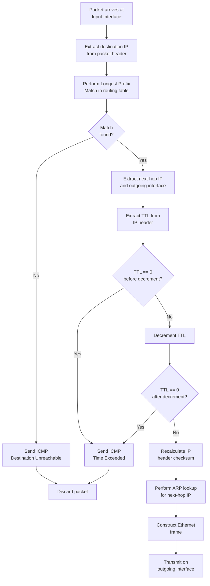
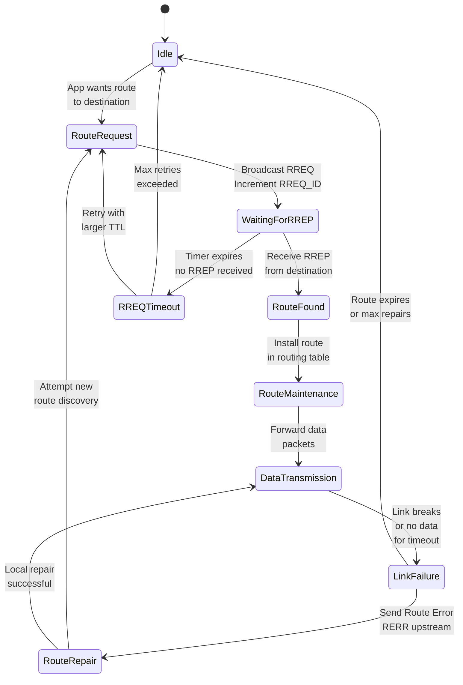
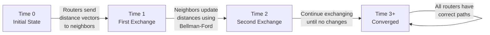
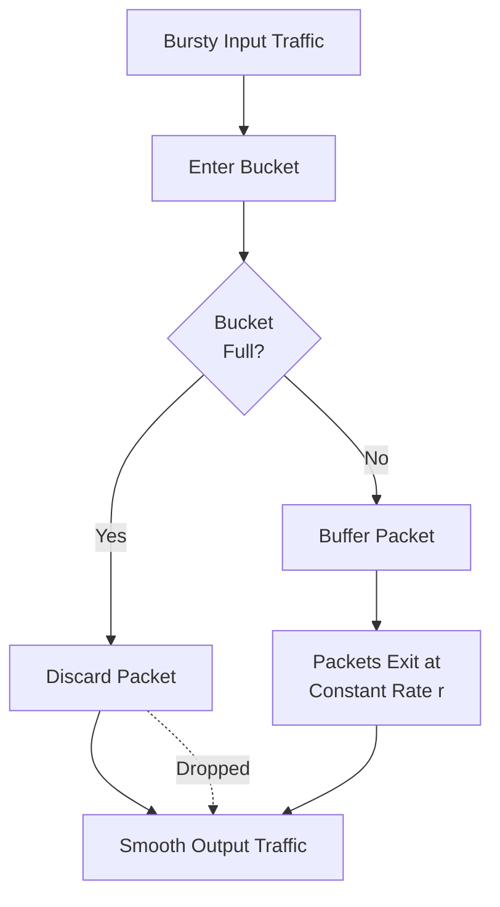
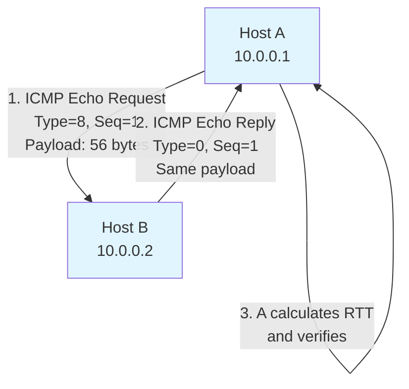
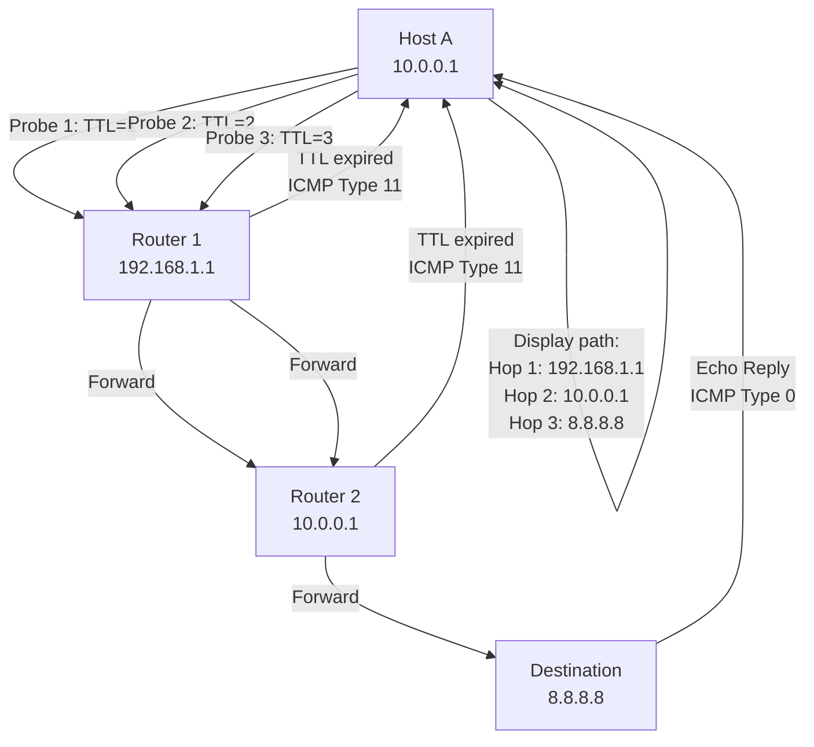
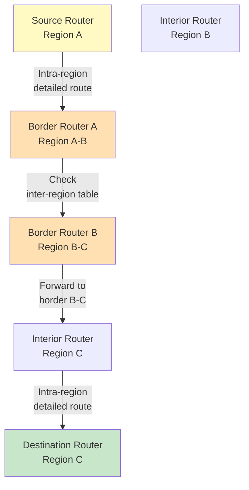
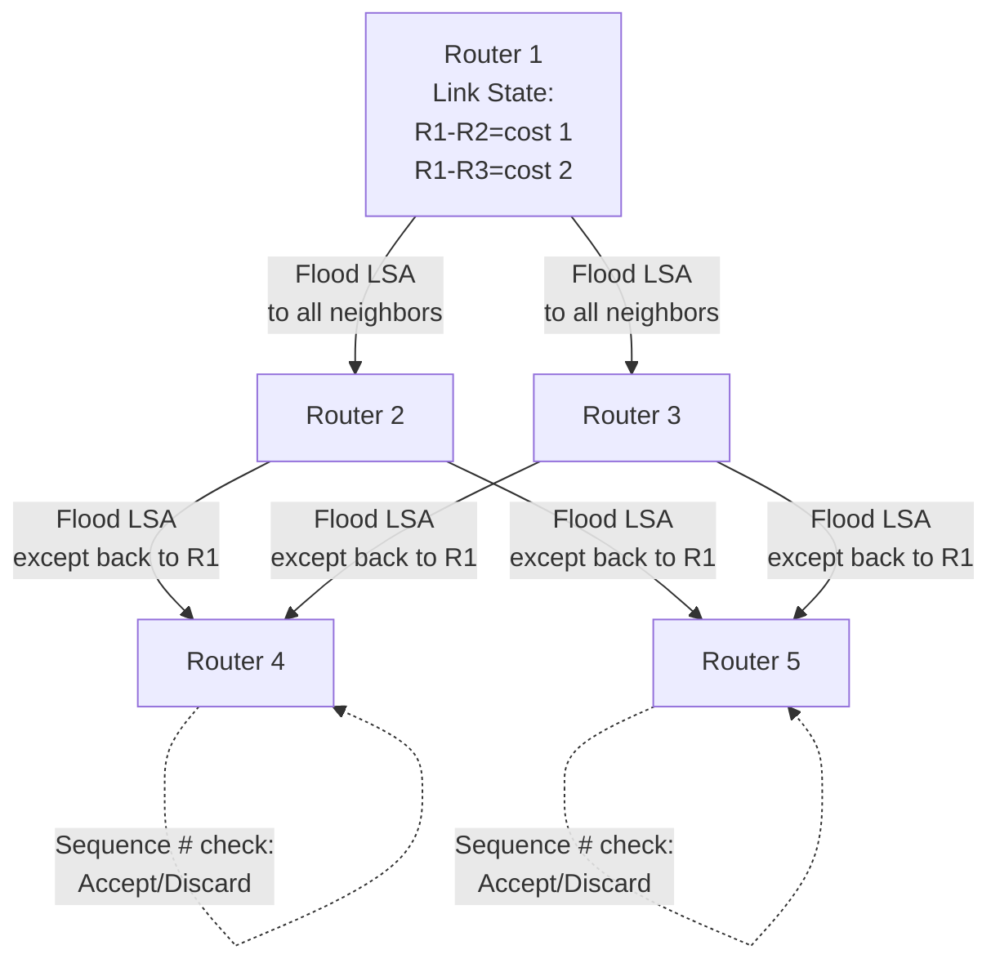
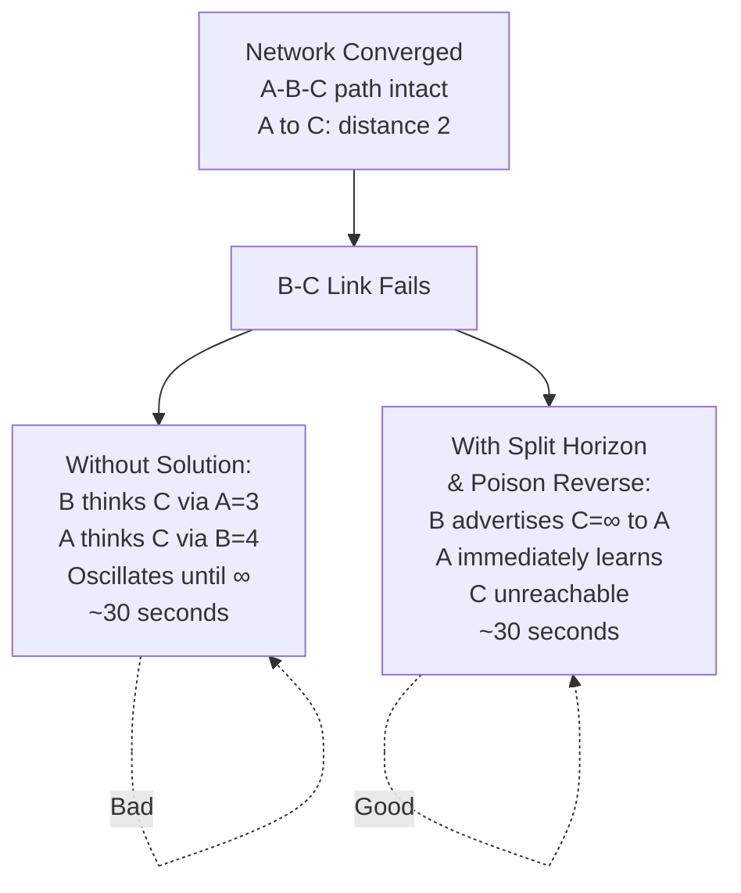
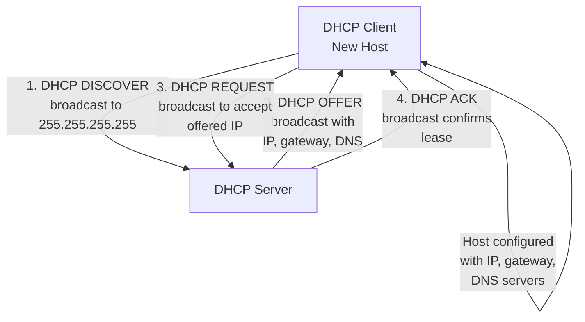

# Network Layer Practical Diagrams and State Machines

## Mermaid Diagrams for Key Concepts

### 1. Packet Forwarding Decision Process



### 2. AODV Route Discovery State Machine



### 3. Distance Vector Routing Convergence



### 4. Leaky Bucket Traffic Shaping



### 5. ICMP Echo Request/Reply (Ping)



### 6. Traceroute Using TTL Expiry



### 7. Hierarchical Routing: Packet Forwarding



### 8. OSPF Link State Distribution (Flooding)



### 9. RIP Count-to-Infinity Problem and Solution



### 10. DHCP Configuration Process



## Detailed Command-Line Exploration Examples

### Example 1: Analyzing Packet Flow with tcpdump

```bash
# Capture ICMP packets (ping)
sudo tcpdump -i eth0 -n icmp

# Output when running: ping 8.8.8.8
# 14:23:45.123456 IP 192.168.1.100 > 8.8.8.8: ICMP echo request, id 0x1a2b, seq 1, length 64
# 14:23:45.141234 IP 8.8.8.8 > 192.168.1.100: ICMP echo reply, id 0x1a2b, seq 1, length 64

# Capture with more detail
sudo tcpdump -i eth0 -vvv icmp

# Capture and save to file
sudo tcpdump -i eth0 icmp -w ping_capture.pcap

# Read saved file
tcpdump -r ping_capture.pcap
```

### Example 2: Viewing Routing Table with ip route

```bash
# Show all routes
ip route show

# Example output:
# default via 192.168.1.1 dev eth0
# 10.0.0.0/24 via 192.168.1.10 dev eth0 metric 100
# 192.168.1.0/24 dev eth0 proto kernel scope link src 192.168.1.100
# 172.16.0.0/16 via 192.168.1.20 dev eth0 metric 200

# Show route to specific destination
ip route show 8.8.8.8

# Example output:
# 8.8.8.8 via 192.168.1.1 dev eth0 src 192.168.1.100

# Add static route
sudo ip route add 10.1.0.0/16 via 192.168.1.20

# Delete static route
sudo ip route del 10.1.0.0/16 via 192.168.1.20

# Show table details with metric
ip route show table all
```

### Example 3: Using mtr (Combined ping + traceroute)

```bash
# Install
sudo apt-get install mtr

# Real-time path analysis
mtr 8.8.8.8

# Output (updates in real-time):
# HOST: router.local
# Loss%   Snt   Last   Avg  Best  Wrst StDev
#  0.0%  100   2.1m  2.4m  2.0m  4.1m  0.8m
# 1. router.local (192.168.1.1)
#  0.0%  100   4.2m  4.8m  4.1m  8.3m  1.2m
# 2. 10.0.0.1
#  0.0%  100  18.2m 18.5m 18.1m 22.3m  1.5m
# 3. 8.8.8.8

# Show as report (non-interactive)
mtr -c 100 --report 8.8.8.8
```

### Example 4: Analyzing Network Traffic with iftop

```bash
# Install
sudo apt-get install iftop

# Monitor real-time traffic per connection
sudo iftop -i eth0

# Output (updates in real-time):
#  192.168.1.100:47234 => 172.217.14.206:443  1.2MB  2.3MB  3.4MB
#  192.168.1.100:56789 => 93.184.216.34:80    512KB  756KB  1.1MB
#  192.168.1.100:33445 => 8.8.8.8:53          45KB   67KB   89KB
```

### Example 5: Testing Connectivity with netcat

```bash
# Test TCP port connectivity
nc -zv 8.8.8.8 53

# Test UDP port
nc -uzv 8.8.8.8 53

# Listen on port 9999 for incoming connections
nc -l 9999

# Connect to listening port
nc 192.168.1.100 9999

# Send message and receive response
# (Type message and press Enter)
```

### Example 6: Analyzing ICMP with ping detailed options

```bash
# Ping with TTL control (simulate traceroute)
ping -t 1 8.8.8.8  # ttl=1 (reaches first hop)
ping -t 2 8.8.8.8  # ttl=2 (reaches second hop)

# Flood ping (dangerous: can overwhelm network)
# sudo ping -f 8.8.8.8  (DON'T RUN IN PRODUCTION!)

# Ping with specific payload size
ping -s 1472 -M do 8.8.8.8
# 1472 bytes payload (+ 28 bytes header = 1500 total = standard MTU)

# Ping and stop after count
ping -c 5 8.8.8.8

# Parse ping statistics
ping -c 100 8.8.8.8 2>&1 | tail -1
# Example: min/avg/max/stddev = 15.234/18.456/45.123/5.234 ms
```

## Network Simulation: Python-based Examples

### Example 1: Simulating Distance Vector Routing Convergence

```python
# Python simulation of DV routing convergence
import time
from collections import defaultdict

class DistanceVectorRouter:
    def __init__(self, router_id):
        self.id = router_id
        self.distance_vector = {router_id: 0}  # Distance to self = 0
        self.neighbors = {}  # {neighbor_id: cost}
        self.iteration = 0
    
    def add_neighbor(self, neighbor_id, cost):
        self.neighbors[neighbor_id] = cost
    
    def update_distance_vector(self, neighbor_id, neighbor_dv):
        """Apply Bellman-Ford update"""
        changes = False
        cost_to_neighbor = self.neighbors[neighbor_id]
        
        for dest, dist_via_neighbor in neighbor_dv.items():
            if dest == self.id:
                continue  # Don't update distance to self
            
            new_dist = cost_to_neighbor + dist_via_neighbor
            
            if dest not in self.distance_vector:
                self.distance_vector[dest] = new_dist
                print(f"[Router {self.id}] Discovered {dest}: distance {new_dist} via {neighbor_id}")
                changes = True
            elif new_dist < self.distance_vector[dest]:
                old_dist = self.distance_vector[dest]
                self.distance_vector[dest] = new_dist
                print(f"[Router {self.id}] Updated {dest}: {old_dist} → {new_dist}")
                changes = True
        
        return changes
    
    def __repr__(self):
        return f"Router {self.id}: {self.distance_vector}"

# Create network: A - B - C - D (linear)
routers = {
    'A': DistanceVectorRouter('A'),
    'B': DistanceVectorRouter('B'),
    'C': DistanceVectorRouter('C'),
    'D': DistanceVectorRouter('D'),
}

# Add links
routers['A'].add_neighbor('B', 1)
routers['B'].add_neighbor('A', 1)
routers['B'].add_neighbor('C', 1)
routers['C'].add_neighbor('B', 1)
routers['C'].add_neighbor('D', 1)
routers['D'].add_neighbor('C', 1)

# Simulate convergence
print("=== INITIAL STATE ===")
for r in routers.values():
    print(r)

print("\n=== STARTING CONVERGENCE ===")
converged = False
iteration = 0

while not converged and iteration < 10:
    iteration += 1
    print(f"\n--- Iteration {iteration} ---")
    any_changes = False
    
    # Each router exchanges with neighbors
    for router_id, router in routers.items():
        for neighbor_id in router.neighbors:
            changes = routers[neighbor_id].update_distance_vector(
                router_id, router.distance_vector.copy()
            )
            any_changes = any_changes or changes
    
    # Check convergence
    if not any_changes:
        converged = True
        print("\n=== CONVERGED ===")
    
    print("\nState after iteration:")
    for r in routers.values():
        print(r)

# Final routing tables
print("\n=== FINAL ROUTING TABLES ===")
for router_id, router in routers.items():
    print(f"\n{router_id}:")
    for dest in sorted(router.distance_vector.keys()):
        print(f"  to {dest}: distance {router.distance_vector[dest]}")
```

### Example 2: Simulating Leaky Bucket

```python
# Python simulation of leaky bucket algorithm
import time
from collections import deque

class LeakyBucket:
    def __init__(self, capacity, leak_rate_pps):
        """
        capacity: maximum packets in bucket
        leak_rate_pps: packets per second to leak
        """
        self.capacity = capacity
        self.leak_rate = leak_rate_pps
        self.buffer = deque()
        self.last_leak_time = time.time()
        self.transmitted = 0
        self.discarded = 0
    
    def add_packet(self, packet_id):
        """Add packet to bucket"""
        self.leak_packets()
        
        if len(self.buffer) < self.capacity:
            self.buffer.append(packet_id)
            return True  # Accepted
        else:
            self.discarded += 1
            return False  # Discarded
    
    def leak_packets(self):
        """Transmit packets at constant rate"""
        current_time = time.time()
        elapsed = current_time - self.last_leak_time
        
        packets_to_leak = int(self.leak_rate * elapsed)
        
        for _ in range(packets_to_leak):
            if self.buffer:
                pkt = self.buffer.popleft()
                self.transmitted += 1
        
        self.last_leak_time = current_time
    
    def get_stats(self):
        return {
            'buffer_level': len(self.buffer),
            'transmitted': self.transmitted,
            'discarded': self.discarded,
        }

# Simulate
bucket = LeakyBucket(capacity=3, leak_rate_pps=1)  # 1 packet/sec

# Simulate arrivals over time
import random
random.seed(42)

print("Time\tArrivals\tBuffer\tTransmitted\tDiscarded")
for sec in range(8):
    # Random arrivals
    arrivals = random.randint(0, 4)
    
    for _ in range(arrivals):
        bucket.add_packet(f"Pkt_t{sec}")
    
    stats = bucket.get_stats()
    print(f"{sec}\t{arrivals}\t\t{stats['buffer_level']}\t{stats['transmitted']}\t\t{stats['discarded']}")
    
    time.sleep(1)  # Wait 1 second before next iteration

print("\n=== FINAL STATISTICS ===")
stats = bucket.get_stats()
print(f"Transmitted: {stats['transmitted']}")
print(f"Discarded: {stats['discarded']}")
print(f"Final buffer level: {stats['buffer_level']}")
```

---

## Next Steps

- [[AODV_Protocol]] — Detailed AODV protocol
- [[Distance_Vector_Routing]] — DV algorithm details
- [[Leaky_Bucket_Algorithm]] — Traffic shaping details
- [[ICMP_Protocol]] — ICMP message types
