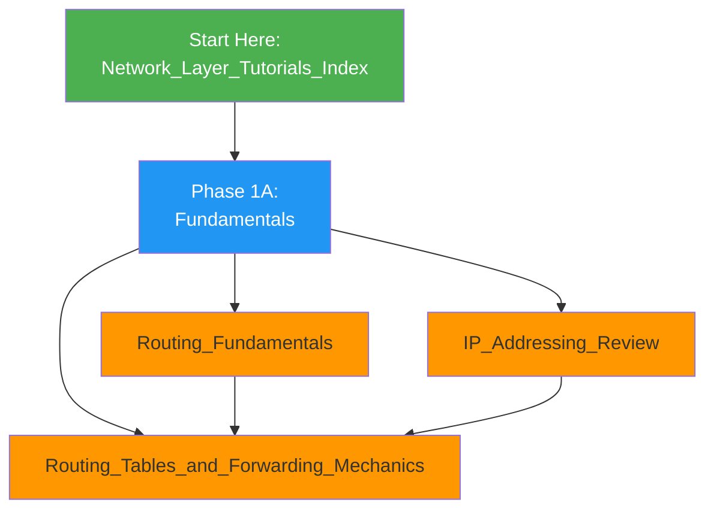
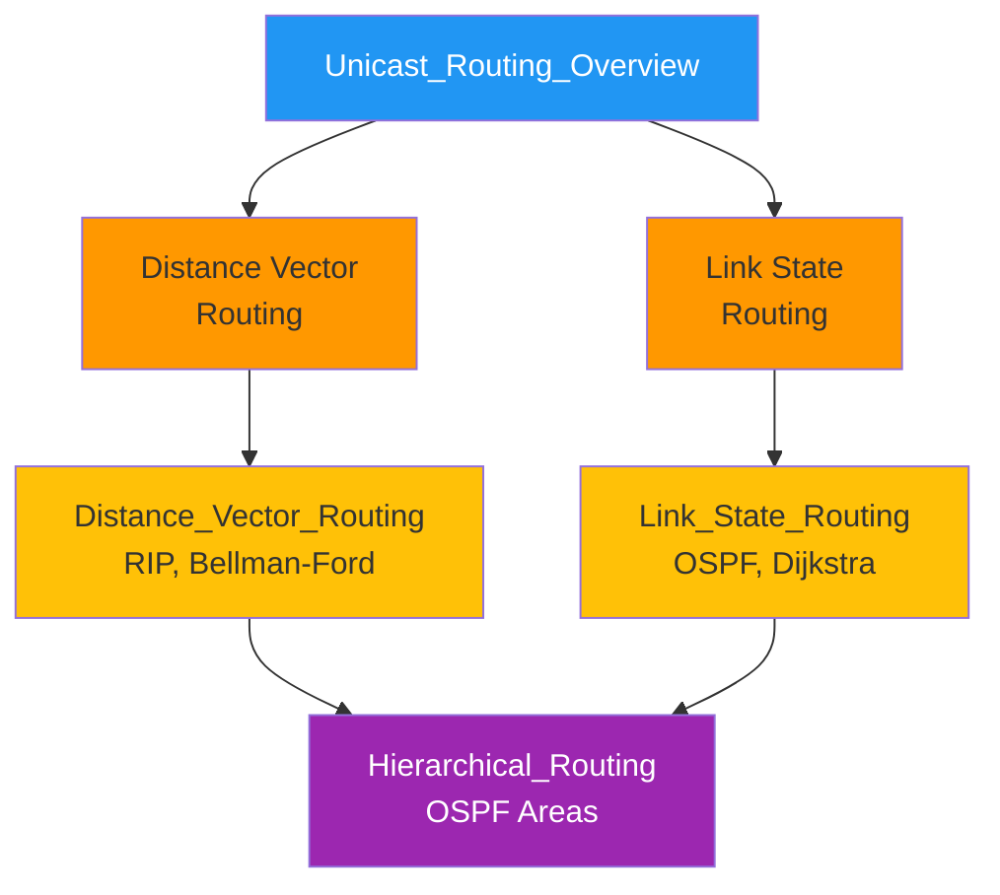
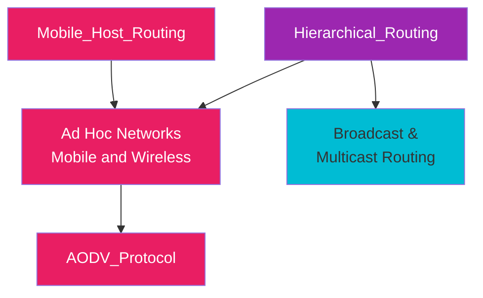
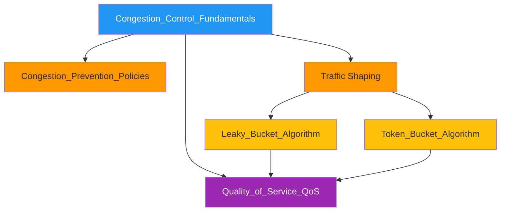
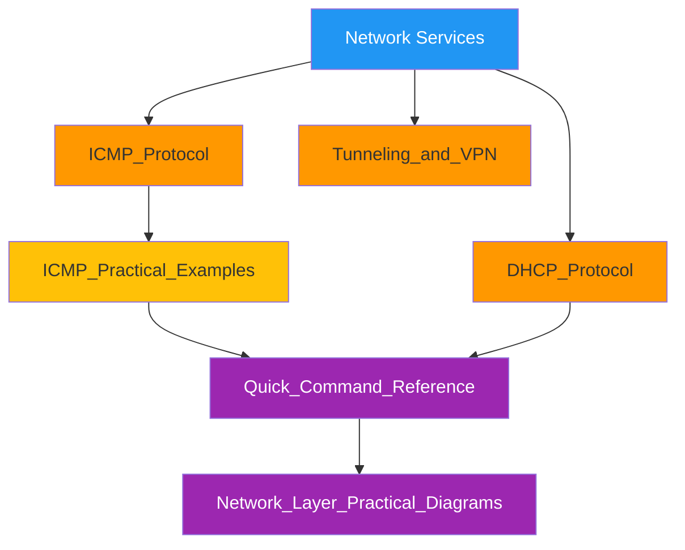
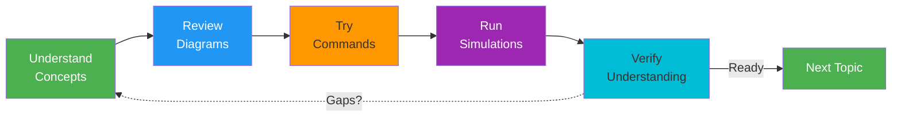
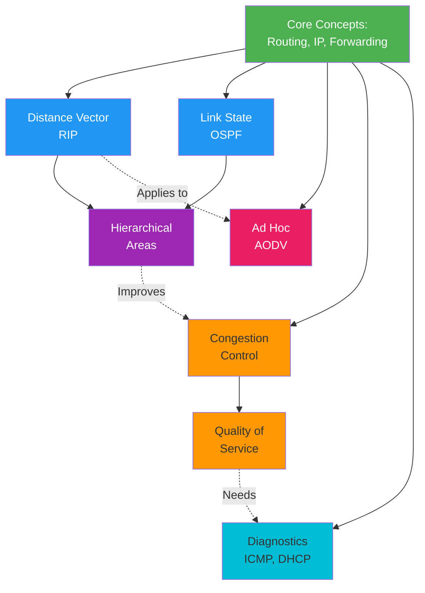

# Network Layer Study Roadmap

## Visual Learning Path

This document provides a structured roadmap for studying Network Layer concepts.

## Phase 1: Foundation (Hours 1-6)

**What you'll learn:**
- How packets are forwarded between routers
- IPv4 addressing, subnetting, CIDR notation
- Routing table lookups (longest prefix matching)
- Network interfaces and ARP

**Practical skills:**
- Basic network calculations
- Using `ip route show` and `route -n`
- Understanding IP addresses with `ip addr show`

---

## Phase 2: Routing Algorithms (Hours 7-12)

**What you'll learn:**
- Distance vector algorithm (Bellman-Ford equation)
- Link state algorithm (Dijkstra's shortest path)
- How routers exchange information
- Convergence properties and routing loops
- Hierarchical routing for scalability

**Practical skills:**
- Understand RIP protocol updates
- Analyze OSPF advertisements
- Use `debug` commands for routing protocols
- Predict convergence behavior

---

## Phase 3: Advanced Routing (Hours 13-18)

**What you'll learn:**
- Dynamic routing in mobile networks
- AODV route discovery process
- Broadcast and multicast tree formation
- Mobile IP and NEMO

**Practical skills:**
- Trace AODV route discovery
- Analyze broadcast flooding
- Understand mobile IP registration

---

## Phase 4: Performance and QoS (Hours 19-22)

**What you'll learn:**
- Why congestion happens
- Congestion prevention at different layers
- Traffic shaping mechanisms
- QoS requirements and techniques

**Practical skills:**
- Configure leaky bucket (tc qdisc)
- Monitor queue lengths
- Analyze traffic patterns

---

## Phase 5: Diagnostics and Services (Hours 23-25)

**What you'll learn:**
- ICMP messages and error handling
- Ping and traceroute mechanisms
- DHCP configuration process
- VPN and tunneling concepts

**Practical skills:**
- Use ping and traceroute effectively
- Analyze ICMP with tcpdump
- Troubleshoot network issues

---

## Study Flow Diagram

**For each topic, follow this cycle:**
1. **Read concept explanation** (10-15 min)
2. **Review diagrams and examples** (5-10 min)
3. **Try commands** with network tools (10-15 min)
4. **Run simulations** to see behavior (10-15 min)
5. **Verify understanding** by explaining to yourself (5 min)

---

## Daily Study Schedule

### Option A: Intensive (5 days × 5 hours)

**Day 1: Foundations**
- 1.5 hrs: [[Routing_Fundamentals]]
- 1.5 hrs: [[IP_Addressing_Review]]
- 2 hrs: [[Routing_Tables_and_Forwarding_Mechanics]]

**Day 2: Distance Vector**
- 2.5 hrs: [[Unicast_Routing_Overview]] + [[Distance_Vector_Routing]]
- 1.5 hrs: Examples and simulations
- 1 hr: Commands and practice

**Day 3: Link State & Hierarchical**
- 2 hrs: [[Link_State_Routing]] (to be created)
- 2 hrs: [[Hierarchical_Routing]]
- 1 hr: OSPF configuration

**Day 4: Ad Hoc & Advanced**
- 2 hrs: [[AODV_Protocol]]
- 1.5 hrs: [[Ad_Hoc_Networks_Overview]]
- 1.5 hrs: Simulations and examples

**Day 5: QoS & Diagnostics**
- 1.5 hrs: [[Congestion_Control_Fundamentals]] + [[Leaky_Bucket_Algorithm]]
- 1.5 hrs: [[ICMP_Protocol]]
- 2 hrs: Practice with [[Quick_Command_Reference]]

### Option B: Distributed (5 weeks × 1 hour daily)

**Week 1 (Mon-Fri):**
- Focus: Foundational concepts
- Daily: 1 hour theory + 30 min practice

**Week 2 (Mon-Fri):**
- Focus: Distance Vector routing
- Daily: Read example + Commands

**Week 3 (Mon-Fri):**
- Focus: Link State and Hierarchical
- Daily: Study + OSPF lab

**Week 4 (Mon-Fri):**
- Focus: Ad Hoc and Advanced topics
- Daily: AODV simulations

**Week 5 (Mon-Fri):**
- Focus: QoS, Diagnostics, Integration
- Daily: Commands + Complex scenarios

---

## Key Checkpoints

### After Phase 1 (Day 1)
- [ ] Understand packet forwarding process
- [ ] Calculate subnets correctly
- [ ] Explain longest prefix matching
- [ ] Know how ARP works

**Checkpoint task:** Calculate network addresses and ranges for 5 CIDR blocks

### After Phase 2 (Days 2-3)
- [ ] Understand Bellman-Ford equation
- [ ] Explain Dijkstra's algorithm
- [ ] Compare DV and LS convergence
- [ ] Understand routing loops

**Checkpoint task:** Trace a 4-node DV routing convergence by hand

### After Phase 3 (Days 4-5)
- [ ] Understand AODV route discovery
- [ ] Explain mobile IP concepts
- [ ] Know broadcast/multicast trees
- [ ] Compare MANET/VANET/FANET

**Checkpoint task:** Trace AODV RREQ/RREP for 5-node ad hoc network

### After Phase 4 (Week 4)
- [ ] Understand congestion
- [ ] Explain traffic shaping
- [ ] Configure leaky bucket
- [ ] Design QoS policies

**Checkpoint task:** Design traffic shaping policy for mixed traffic types

### After Phase 5 (Week 5)
- [ ] Use ping/traceroute effectively
- [ ] Analyze packets with tcpdump
- [ ] Troubleshoot network issues
- [ ] Configure DHCP

**Checkpoint task:** Diagnose and fix a network connectivity problem

---

## Interactive Learning Activities

### Activity 1: Network Calculator
Use [[IP_Addressing_Review]] to practice:
- Converting between decimal and binary
- Calculating subnet sizes
- Finding network/broadcast addresses
- Subnetting large networks

### Activity 2: Routing Simulation
Use [[Network_Layer_Practical_Diagrams]] Python scripts:
- Run DV routing convergence
- Trace AODV discovery
- Simulate leaky bucket
- Plot results

### Activity 3: Command Practice
Use [[Quick_Command_Reference]]:
- Execute 10 ping commands
- Run traceroute to different destinations
- Capture packets with tcpdump
- Analyze routing tables

### Activity 4: Scenario Analysis
Create scenarios and solve:
- Host A can't reach Host B — diagnose why
- Latency suddenly increased — find the cause
- Routing loop detected — apply solutions
- AODV route breaks — show maintenance

### Activity 5: Protocol Deep-Dive
For each protocol (RIP, OSPF, AODV):
- Read message format specification
- Decode example packets
- Trace state transitions
- Design improvements

---

## Concept Integration Map

---

## Time-Saving Tips

### Parallel Learning
- While reading theory, have terminal open for commands
- Review diagrams while waiting for simulations to run
- Make flashcards of key formulas/equations

### Focus Areas
- Spend 40% on algorithms (DV, LS, AODV)
- Spend 30% on fundamentals (Routing, IP, Forwarding)
- Spend 20% on applications (QoS, Traffic Shaping)
- Spend 10% on diagnostics and tools

### Retention Strategies
- Explain concepts to yourself daily
- Create your own Mermaid diagrams
- Write down key equations from memory
- Teach someone else (rubber duck debugging)

---

## Troubleshooting Your Studies

| Issue | Solution |
|---|---|
| **Concepts feel abstract** | Review [[Network_Layer_Practical_Diagrams]] visual examples |
| **Formulas confusing** | Work through [[IP_Addressing_Review]] step-by-step |
| **Can't visualize routing** | Trace example networks by hand on paper |
| **Commands not working** | Check [[Quick_Command_Reference]] syntax and permissions |
| **Lost in complexity** | Return to [[Routing_Fundamentals]] for review |
| **Need motivation** | See [[Network_Layer_Complete_Index]] progress checklist |

---

## Resources by Learning Style

### Visual Learners
- [[Network_Layer_Practical_Diagrams]] — Mermaid diagrams and state machines
- [[Network_Layer_Tutorials_Index]] — Concept map
- Wireshark GUI (download separately)

### Hands-on Learners
- [[Quick_Command_Reference]] — Try every command
- Python simulations in [[Network_Layer_Practical_Diagrams]]
- GNS3 network simulator labs

### Analytical Learners
- [[Distance_Vector_Routing]] — Algorithm mathematics
- [[Unicast_Routing_Overview]] — Formal problem definitions
- RFC specifications

### Reading Learners
- Read all concept explanations thoroughly
- Follow wikilinks to explore depth
- Study examples carefully

---

## Final Review Checklist

Before considering yourself complete, you should be able to:

### Explain Without Notes
- [ ] Routing process from first principles
- [ ] Bellman-Ford and Dijkstra algorithms
- [ ] Why hierarchical routing is needed
- [ ] How AODV discovers routes
- [ ] Traffic shaping mechanisms
- [ ] ICMP error scenarios

### Apply to Real Scenarios
- [ ] Design a network topology
- [ ] Choose appropriate routing protocol
- [ ] Configure traffic shaping
- [ ] Diagnose connectivity issues
- [ ] Predict convergence time
- [ ] Optimize for latency or throughput

### Use Tools Effectively
- [ ] ping, traceroute, mtr
- [ ] tcpdump, wireshark
- [ ] netstat, ss, netcat
- [ ] ip route, route commands
- [ ] Traffic monitoring tools

### Understand Trade-offs
- [ ] DV vs LS: pros/cons
- [ ] Flat vs Hierarchical
- [ ] Convergence vs Overhead
- [ ] Throughput vs Latency
- [ ] Simplicity vs Optimality

---

**Estimated Total Time:** 20-25 hours for complete mastery

**Ready to start?** → [[Network_Layer_Tutorials_Index]]
