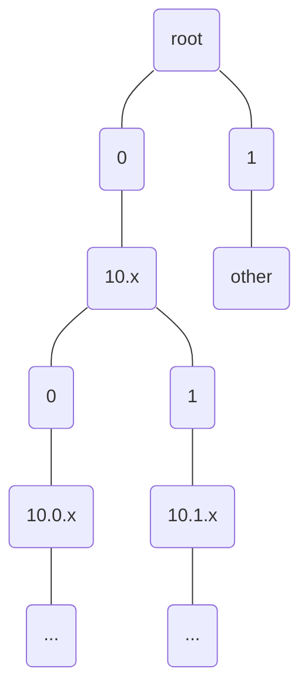
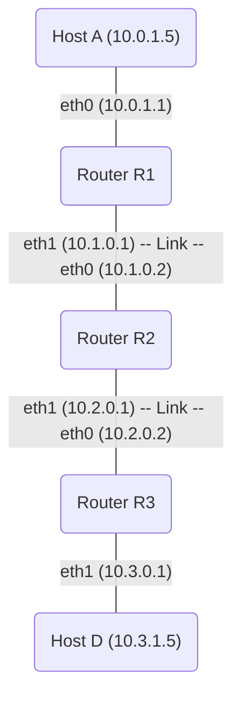

# Routing Tables and Forwarding Mechanics

## Routing Table Structure in Detail

A routing table is a core data structure in every router. Understanding its structure and lookup mechanism is essential for understanding packet forwarding.

### Classical Routing Table Format

A traditional routing table entry contains:

```
Destination        Netmask          Next Hop        Interface   Metric   Flags
10.0.0.0          255.255.255.0    192.168.1.1     eth0        1        UG
10.1.0.0          255.255.0.0      192.168.1.2     eth0        2        UG
172.16.0.0        255.255.0.0      192.168.2.1     eth1        5        UG
127.0.0.0         255.0.0.0        127.0.0.1       lo          0        U
192.168.1.0       255.255.255.0    0.0.0.0         eth0        0        U
0.0.0.0           0.0.0.0          192.168.1.1     eth0        10       UG
```

### Field Definitions

| Field | Meaning | Example |
|---|---|---|
| **Destination** | Target network address (first address of the network) | 10.0.0.0 |
| **Netmask** | Subnet mask showing which bits represent the network | 255.255.255.0 (/24) |
| **Next Hop** | IP address of the next-hop router (or 0.0.0.0 for direct delivery) | 192.168.1.1 |
| **Interface** | Physical interface on this router where packet is forwarded | eth0, eth1 |
| **Metric** | Cost of this route (lower is better) | 1, 2, 5 |
| **Flags** | Status codes: U=route usable, G=uses gateway (next-hop), H=host route | UG, U |

### CIDR Notation

Modern routing tables use Classless Inter-Domain Routing (CIDR) notation, which combines IP address and prefix length:

```
10.0.0.0/24       means network 10.0.0.0 with 24-bit prefix
10.1.0.0/16       means network 10.1.0.0 with 16-bit prefix
192.168.1.128/25  means network 192.168.1.128 with 25-bit prefix (smaller subnet)
```

The slash notation indicates the number of bits in the network portion of the address.

## Longest Prefix Matching Algorithm

When a router receives a packet with destination address $D$, it performs a longest prefix match:

**Definition**: Given a destination IP address $D$ and a routing table with entries $(P_1, M_1), (P_2, M_2), \ldots, (P_n, M_n)$ where $P_i$ is a network prefix and $M_i$ is the number of prefix bits, find the entry where:

1. $D$ matches the network (i.e., the first $M_i$ bits of $D$ equal $P_i$)
2. $M_i$ is **maximum** among all matching entries

**Algorithm**:

```
Algorithm: LongestPrefixMatch(destination_ip_D)
Input: Destination IP address D
Output: Matched routing table entry (next_hop, interface, metric)

1. best_match ← null
2. longest_prefix_len ← 0

3. For each routing table entry (prefix, prefix_len, next_hop, interface, metric):
   a. If D matches prefix for prefix_len bits:
      - if_bits ← extract first prefix_len bits from D
      - prefix_bits ← extract first prefix_len bits from prefix
      - if if_bits == prefix_bits:
        i.   if prefix_len > longest_prefix_len:
        ii.  best_match ← (next_hop, interface, metric)
        iii. longest_prefix_len ← prefix_len

4. If best_match is not null:
   Return best_match
5. Else:
   Return default_route or ICMP_Destination_Unreachable
```

### Example: Longest Prefix Matching

**Routing Table:**
```
10.0.0.0/8        → Next Hop A
10.1.0.0/16       → Next Hop B
10.1.2.0/24       → Next Hop C
0.0.0.0/0         → Default Gateway D
```

**Scenario 1: Packet destined for 10.1.2.5**

1. Check 10.0.0.0/8: Does 10.1.2.5 have first 8 bits = 10? **Yes** (10 is first octet)
   - Match found, prefix length = 8
2. Check 10.1.0.0/16: Does 10.1.2.5 have first 16 bits = 10.1? **Yes** (10.1 are first two octets)
   - Match found, prefix length = 16 (longer)
3. Check 10.1.2.0/24: Does 10.1.2.5 have first 24 bits = 10.1.2? **Yes** (10.1.2 are first three octets)
   - Match found, prefix length = 24 (longest)
4. Check default route: Match would be found, but prefix length = 0

**Result**: Use Next Hop C (10.1.2.0/24 has longest prefix match)

**Scenario 2: Packet destined for 172.16.1.1**

1. Check 10.0.0.0/8: First 8 bits = 172? No match
2. Check 10.1.0.0/16: First 16 bits = 172.16? No match
3. Check 10.1.2.0/24: First 24 bits = 172.16.1? No match
4. Check 0.0.0.0/0: Any address matches the default route
   - Match found, prefix length = 0

**Result**: Use Default Gateway D

## Packet Forwarding Process

When a router receives a packet at an input interface, it executes the following forwarding process:

### Step-by-Step Forwarding

```
Algorithm: ForwardPacket(packet_received_on_interface_I)
Input: A complete Ethernet frame containing an IP packet
Output: Packet transmitted on outgoing interface, or discarded

=== LAYER 2 (Data Link) PROCESSING ===

1. Extract Ethernet frame from input interface I
2. Verify Ethernet frame checksum (FCS - Frame Check Sequence)
   - If checksum fails: discard frame and count error
3. Extract IP packet from Ethernet payload

=== LAYER 3 (Network/IP) PROCESSING ===

4. Verify IP header checksum
   - If checksum fails: discard packet
5. Extract destination IP address D from IP header
6. Extract TTL value from IP header
7. Decrement TTL: TTL ← TTL - 1
8. If TTL == 0:
   - Generate ICMP Time Exceeded message
   - Send ICMP message to source address
   - Discard original packet
   - RETURN

9. Perform Longest Prefix Match on D to get next_hop, out_interface, metric
   - If no match found:
     a. Send ICMP Destination Unreachable to source
     b. Discard packet
     c. RETURN

10. Is next_hop on directly connected subnet? (directly attached network)
    - If YES: 
      - Destination MAC address = MAC of destination host
      - Destination is directly reachable
    - If NO:
      - Destination MAC address = MAC of next_hop router

11. Recalculate IP header checksum with new TTL
12. Construct new Ethernet frame:
    - Source MAC = this router's interface MAC
    - Destination MAC = next-hop MAC (from ARP table or ARP request)
    - Payload = modified IP packet

=== OUTPUT ===

13. Transmit Ethernet frame out out_interface
14. Update interface statistics (packets out, bytes out)
```

## ARP (Address Resolution Protocol) in Forwarding

When a router determines the next-hop IP address, it must translate that IP address to a MAC address before transmission. This is done using ARP.

**ARP Lookup Process:**

```
Algorithm: GetMACAddress(ip_address_next_hop)
Input: IP address of next-hop router
Output: MAC address of next-hop router

1. Check ARP cache (table of IP→MAC mappings)
   - If entry exists and not expired:
     Return cached MAC address
   
2. If ARP cache miss:
   a. Generate ARP Request:
      - Broadcast question: "Who has IP address next_hop?"
   b. Send ARP Request on outgoing interface
   c. Wait for ARP Reply (typically 1-5 seconds)
   d. When reply received:
      - Extract MAC address from reply
      - Cache the IP→MAC mapping with TTL ~600 seconds
      - Return MAC address
   e. If timeout (no reply):
      - Typically retry a few times
      - If still no reply: drop packet or use default neighbor
      - This is rare in properly configured networks
```

## Forwarding Table Optimization

Real routers must perform longest prefix matching at **line rate** (millions of packets per second). Several data structures optimize this:

### Trie Data Structure (Prefix Tree)

A trie organizes routing entries hierarchically based on bit sequences:




**Lookup Time**: $O(k)$ where $k$ is the number of bits in the IP address (32 for IPv4, 128 for IPv6)

### Multi-level Lookup / Hash Tables

Modern routers use combinations of:
- Direct lookup tables for first 16 bits (65536 entries)
- Secondary tables for remaining bits
- Result: Very fast, practical lookup

## Forwarding Information Base (FIB)

The **Forwarding Information Base (FIB)** is the data structure that routers actually use for forwarding. It is derived from the routing table (built by routing protocols) but optimized for fast lookup.

| Aspect | Routing Table | Forwarding Information Base |
|---|---|---|
| **Built by** | Routing protocols (OSPF, RIP, etc.) | Conversion from routing table |
| **Purpose** | Routing protocol computation | Fast packet forwarding |
| **Access pattern** | Occasional updates | Millions of lookups per second |
| **Data structure** | Usually simple list/array | Optimized trie or hash table |
| **Update frequency** | Seconds to minutes | Milliseconds (after routing table change) |

## Practical Example: Complete Forwarding Trace

**Network Setup:**



**Routing Tables:**

*Router R1:*
```
10.0.0.0/24    → Direct (eth0), Metric 0
10.1.0.0/24    → Direct (eth1), Metric 0
10.2.0.0/24    → R2 (10.1.0.2), eth1, Metric 1
10.3.0.0/24    → R2 (10.1.0.2), eth1, Metric 2
```

*Router R2:*
```
10.0.0.0/24    → R1 (10.1.0.1), eth0, Metric 1
10.1.0.0/24    → Direct (eth0), Metric 0
10.2.0.0/24    → Direct (eth1), Metric 0
10.3.0.0/24    → R3 (10.2.0.2), eth1, Metric 1
```

*Router R3:*
```
10.0.0.0/24    → R2 (10.2.0.1), eth0, Metric 2
10.1.0.0/24    → R2 (10.2.0.1), eth0, Metric 1
10.2.0.0/24    → Direct (eth0), Metric 0
10.3.0.0/24    → Direct (eth1), Metric 0
```

**Scenario: Host A sends packet to Host D (10.3.1.5)**

*At Router R1:*
1. Packet arrives from Host A with destination 10.3.1.5
2. Longest prefix match: 10.3.0.0/24 → Next Hop R2 (10.1.0.2), Interface eth1
3. ARP lookup: 10.1.0.2 → MAC of R2's eth0 (e.g., aa:bb:cc:dd:ee:02)
4. Construct frame:
   - Destination MAC: aa:bb:cc:dd:ee:02
   - Source MAC: R1's eth1 MAC
   - IP payload: Host A → Host D (TTL decremented from 64 to 63)
5. Transmit on eth1

*At Router R2:*
1. Frame arrives on eth0
2. Extract IP packet, verify checksums
3. Destination 10.3.1.5 matches 10.3.0.0/24
4. Longest prefix match: 10.3.0.0/24 → Next Hop R3 (10.2.0.2), Interface eth1
5. ARP lookup: 10.2.0.2 → MAC of R3's eth0 (e.g., aa:bb:cc:dd:ee:03)
6. Recalculate IP checksum with TTL = 62
7. Construct frame and transmit on eth1

*At Router R3:*
1. Frame arrives on eth0
2. Destination 10.3.1.5 matches 10.3.0.0/24
3. Longest prefix match: 10.3.0.0/24 → Direct (eth1), not a router
4. Since destination is directly connected:
   - ARP lookup: 10.3.1.5 → MAC of Host D (e.g., 11:22:33:44:55:66)
5. Recalculate IP checksum with TTL = 61
6. Construct frame with destination MAC of Host D
7. Transmit on eth1 (directly to Host D)

*At Host D:*
1. Frame arrives with destination MAC matching Host D's NIC
2. Extract IP packet
3. Destination IP 10.3.1.5 matches Host D's IP
4. Deliver packet to application layer

---

## Next Steps

- [[IP_Addressing_Review]] — Understanding subnet masks and CIDR notation
- [[Distance_Vector_Routing]] — How routers learn routes automatically
- [[Link_State_Routing]] — Alternative routing protocol method
