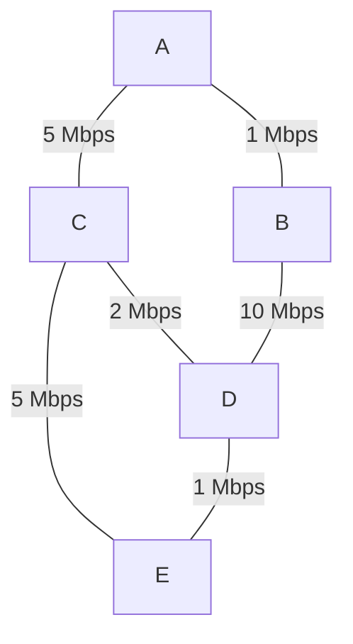

# Unicast Routing Overview

## Definition

**Unicast routing** is the process of determining a path for a packet to travel from a specific source to a specific destination host (one-to-one communication).

This contrasts with:
- **Broadcast**: Packet sent to all hosts on a network
- **Multicast**: Packet sent to a specific group of hosts
- **Anycast**: Packet sent to any one of several equivalent destinations

## Routing Algorithm Goals

All unicast routing algorithms aim to optimize one or more of the following objectives:

### Primary Objectives

| Objective | Definition | Impact |
|---|---|---|
| **Correctness** | Packets must be delivered to destination without loops | Essential; without this, routing fails |
| **Optimality** | Select the shortest/best path according to a metric | Minimize bandwidth use, delay |
| **Convergence** | Adapt quickly when network topology changes | Reduce packet loss during failures |
| **Stability** | Avoid oscillation, remain stable once converged | Predictable, consistent behavior |
| **Scalability** | Handle large networks with reasonable computational load | Works for millions of routers |
| **Efficiency** | Minimal overhead for routing computations and messages | Don't consume excessive bandwidth/CPU |

### Formal Problem Statement

**Given:**
- Directed graph $G = (V, E)$ where $V$ = routers, $E$ = links
- Weight function $w: E \to \mathbb{R}^+$ assigning cost to each link
- Source router $s \in V$, destination router $d \in V$

**Find:**
- Path $P = (s = v_0, v_1, \ldots, v_k = d)$ such that:
  - Total cost $\sum_{i=0}^{k-1} w((v_i, v_{i+1}))$ is minimized
  - All edges $(v_i, v_{i+1}) \in E$

## Routing Algorithm Classification

Routing algorithms are classified along several dimensions:

### 1. Static vs. Dynamic Routing

| Static | Dynamic |
|---|---|
| Routing tables never change (or change manually) | Routing tables adjust automatically |
| Administrator manually enters routes | Routing protocols discover routes |
| Used in: Small, stable networks | Used in: Most production networks |
| Advantage: Predictable, low overhead | Advantage: Adapts to failures and changes |
| Disadvantage: Doesn't adapt to failures | Disadvantage: More complex, more overhead |

### 2. Global vs. Local Information

**Global routing algorithms** (Link State):
- Each router knows the complete network topology
- Computes routes based on complete information
- Example: OSPF, IS-IS, Dijkstra's algorithm

**Local/Decentralized routing algorithms** (Distance Vector):
- Routers only know information about immediate neighbors
- Routes computed using only local information passed from neighbors
- Example: RIP, IGRP, Bellman-Ford algorithm

### 3. Flat vs. Hierarchical

**Flat routing**: All routers compute routes at the same level
- Simple for small networks
- Routing table size grows as $O(n)$ where $n$ = number of routers
- Infeasible for large networks

**Hierarchical routing**: Routers organized into regions/areas
- Only detailed knowledge within area; summary knowledge of other areas
- Routing table size grows as $O(\log n)$
- Essential for large-scale networks like the Internet
- See: [[Hierarchical_Routing]]

### 4. Intra-domain vs. Inter-domain

**Intra-domain (Interior Gateway Protocol - IGP)**:
- Used within a single Autonomous System (AS)
- Assumes trusting environment
- Goals: Minimize delay, maximize throughput
- Routers: Interior routers
- Example protocols: OSPF, RIP, ISIS

**Inter-domain (Exterior Gateway Protocol - EGP)**:
- Used between Autonomous Systems
- Must handle policy, trust, business relationships
- Goals: Path selection based on policy
- Routers: Border routers
- Example protocols: BGP (Beyond scope of this tutorial)

## Common Metrics

Different routing protocols use different metrics to measure path cost:

### Hop Count
$$\text{Cost} = \text{Number of hops (routers)}$$

**Characteristics:**
- Simple to compute
- Doesn't account for link speed or congestion
- Maximum hop count limits network diameter (RIP limits to 15)
- Used by: RIP

**Example:**
```
Path A→B→C has cost 2 (two hops)
Path A→D→E→C has cost 3 (three hops)
Prefer path A→B→C
```

### Link Bandwidth

$$\text{Cost} = \max\{\text{bandwidth}^{-1}\} \text{ on path}$$

(Inversely proportional to minimum bandwidth on path)

**Characteristics:**
- Accounts for link speeds
- Prefers paths through faster links
- Used by: EIGRP, some configurations of OSPF

**Example:**
```
Path A →(100Mbps)→ B →(100Mbps)→ C: Cost = 1/100 = 0.01
Path A →(1Gbps)→ D →(10Mbps)→ C: Cost = 1/10 = 0.1
Prefer first path (lower cost)
```

### Delay

$$\text{Cost} = \sum \text{(propagation delay + queueing delay)}$$

**Characteristics:**
- Measured in milliseconds
- Varies with link utilization
- Requires periodic measurement
- Used by: EIGRP (as extended metric)

**Example:**
```
Path A →(delay 5ms)→ B →(delay 5ms)→ C: Total = 10ms
Path A →(delay 1ms)→ D →(delay 50ms)→ C: Total = 51ms
Prefer first path
```

### OSPF Cost

$$\text{Cost} = \frac{10^8 \text{ bps}}{\text{link bandwidth in bps}}$$

**Characteristics:**
- Inversely proportional to bandwidth
- Standard formula in OSPF
- Reference bandwidth defaults to 100 Mbps (can be configured)
- Used by: OSPF

**Example:**
```
1 Gbps link: Cost = 10^8 / 10^9 = 0.1
100 Mbps link: Cost = 10^8 / 10^8 = 1
10 Mbps link: Cost = 10^8 / 10^7 = 10
```

## Routing Algorithm Categories

### Distance Vector Routing

See: [[Distance_Vector_Routing]]

**How it works:**
- Each router maintains a vector of distances (costs) to all destinations
- Exchanges distance vectors with neighbors periodically
- Updates its own distances based on neighbors' information
- Uses Bellman-Ford algorithm principle

**Advantages:**
- Simple to implement
- Minimal information about network topology needed
- Suitable for small networks

**Disadvantages:**
- Slow convergence (poor when topology changes)
- Can create routing loops during convergence
- Counts-to-infinity problem
- Higher overhead (constant updates)

**Examples:** RIP, IGRP

### Link State Routing

See: [[Link_State_Routing]]

**How it works:**
- Each router floods entire network with information about links to its neighbors
- Every router builds complete topology map
- Uses Dijkstra's algorithm to compute shortest path tree
- Only updates when topology actually changes

**Advantages:**
- Faster convergence
- No routing loops during convergence
- More scalable with hierarchical areas
- Better for modern networks

**Disadvantages:**
- More complex to implement
- Higher memory requirements (stores topology)
- Initial flooding overhead

**Examples:** OSPF, IS-IS

## Shortest Path Problem Formulation

Both distance vector and link state routing solve variants of the **shortest path problem**:

**Single-Source Shortest Path Problem:**

Given a source node $s$ and a graph $G = (V, E, w)$, find the shortest path from $s$ to every other node $v \in V$.

**Solution Methods:**
- **Dijkstra's algorithm**: For non-negative weights (used by OSPF)
- **Bellman-Ford algorithm**: For general weights, detects negative cycles (used by RIP)

## Routing Loop Prevention

A **routing loop** occurs when packets cycle between routers indefinitely, never reaching their destination.

**Root cause:** Inconsistent routing tables (different routers disagree on the path)

**Prevention mechanisms:**

| Mechanism | Description |
|---|---|
| **TTL (Time-To-Live)** | Counter in IP header decremented at each hop; packet discarded at TTL=0 |
| **Split Horizon** | Router doesn't send route back to neighbor from which it learned the route |
| **Poison Reverse** | Router explicitly sends "unreachable" (infinite cost) back to neighbor |
| **Hold-down timers** | Ignore updates about route for hold-down period after receiving unreachable |

## Convergence Example

**Scenario:** Link between Router A and Router B fails.

**Without fast convergence:**
- Old routing tables might still direct traffic toward failed link
- Packets get lost
- Takes minutes for network to stabilize

**With fast convergence (modern protocols):**
- Failure detected within milliseconds
- Routers recompute routes within seconds
- Minimal packet loss

## Key Terminology

| Term | Definition |
|---|---|
| **Path** | Sequence of routers from source to destination |
| **Metric** | Numerical cost of a link or path |
| **Cost** | Same as metric |
| **Next Hop** | The immediate next router on the path to destination |
| **Metric Aggregation** | Method of combining individual link costs into total path cost |
| **Reachable** | A destination is reachable if at least one path exists in the routing table |
| **Unreachable** | A destination has no path in the routing table |
| **Feasible Distance** | The shortest distance known to a destination |
| **Advertised Distance** | Distance reported by a neighbor to a destination |

## Network Topology Example



**Link Costs (using OSPF formula: 10^8 / bandwidth):**

| Link | Bandwidth | Cost |
|---|---|---|
| A-B | 1 Mbps | 100 |
| A-C | 5 Mbps | 20 |
| C-D | 2 Mbps | 50 |
| B-D | 10 Mbps | 10 |
| D-E | 1 Mbps | 100 |
| C-E | 5 Mbps | 20 |

**Shortest paths from A to all destinations:**

| Destination | Path | Total Cost |
|---|---|---|
| B | A→B | 100 |
| C | A→C | 20 |
| D | A→B→D | 110 |
| E | A→C→E | 40 |

---

## Next Steps

- [[Distance_Vector_Routing]] — Learn distance vector algorithms
- [[Link_State_Routing]] — Learn link state algorithms
- [[Hierarchical_Routing]] — Scale routing to large networks
