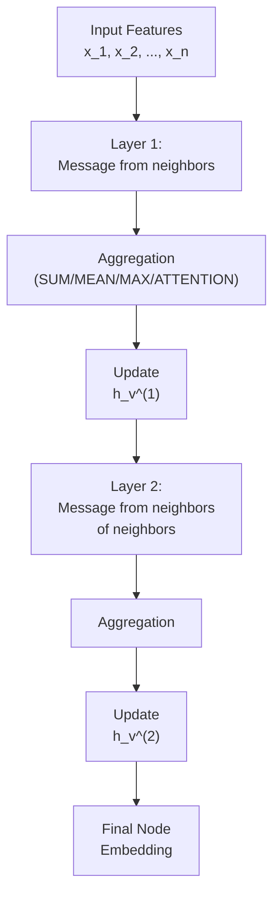

# Graph Neural Networks: The Message Passing Perspective

## Why GNNs?

Standard neural networks assume **fixed vector inputs**. Graphs have **variable structure** (different neighbors per node, different graph sizes). GNNs learn on this variable structure by having nodes exchange information with neighbors, aggregating it, and updating their representations iteratively.

---

## Symbol Dictionary

| Symbol | Meaning | Example/Shape |
|--------|---------|---------|
| $G = (V, E)$ | Graph: nodes V and edges E | 5 nodes, 8 edges |
| $v, u$ | Specific nodes | node 0, node 1 |
| $N(v)$ | Neighbors of v (node set) | For v=0: {1, 2} |
| $h_v^{(l)}$ | Node v's hidden state at layer l | Shape: d-dimensional vector |
| $d$ | Hidden dimension (embedding size) | 64, 128, 256, ... |
| $x_v$ | Initial features of node v | Input shape: d₀ |
| $m_u^{(l)}$ | Message from node u at layer l | Shape: d |
| $W^{(l)}$ | Weight matrix at layer l | Shape: d × d |
| $U^{(l)}$ | Aggregation weight matrix | Shape: d × d |
| $\alpha_{vu}^{(l)}$ | Attention weight from u to v | Scalar in [0,1] |
| $\sigma$ | Activation function | ReLU, ELU, etc. |
| $AGG$ | Aggregation function | SUM, MEAN, MAX |
| $\text{softmax}(·)$ | Normalizes attention weights | ∑ᵢ attention = 1 |

---

## Part 1: The Absolute Basics—Node Computation

### What Is a Computation Graph?

A node v computes its next representation by:
1. **Looking at neighbors:** Access all $h_u^{(l)}$ for $u \in N(v)$
2. **Transforming:** Apply learned weights to each neighbor
3. **Combining:** Aggregate all transformed neighbor features
4. **Updating:** Mix aggregated info with own state, apply nonlinearity

This is called a **computation graph**—the path from neighbors to v's new state.

### Receptive Field

After $l$ GNN layers, node v sees all nodes within **hop distance $l$**.
- Layer 1: v sees itself + immediate neighbors
- Layer 2: v sees itself + neighbors + neighbors-of-neighbors
- Growing receptive field = richer context, but eventual **over-smoothing**

---

## Part 2: The GNN Layer Recipe

Every GNN layer has **three mandatory steps:**

### Step 1: Message Computation

Each neighbor u sends a **message** to v:
$$m_u^{(l)} = W^{(l)} h_u^{(l)}$$

**Why shared weight $W^{(l)}$?**
- Graphs have no canonical ordering (node 0 vs node 1 is arbitrary)
- Shared weight ensures **permutation invariance**: reordering neighbors doesn't change output
- Same weight handles variable neighbor count

**Matrix form (for all nodes at once):**
$$M^{(l)} = W^{(l)} H^{(l)}$$
where $H^{(l)}$ stacks all hidden states (shape: $|V| \times d$), $M^{(l)}$ stacks all messages.

### Step 2: Aggregation

Node v combines all neighbor messages:
$$m_v^{(l)} = AGG(\{m_u^{(l)} : u \in N(v)\})$$

**Common aggregations:**
- **Sum:** $\sum_{u \in N(v)} m_u^{(l)}$ (most common, no information loss)
- **Mean:** $\frac{1}{|N(v)|} \sum_{u \in N(v)} m_u^{(l)}$ (normalized by degree)
- **Max:** $\max_{u \in N(v)} m_u^{(l)}$ (selects strongest signal)

**Why order-invariant?**
- SUM, MEAN, MAX don't depend on neighbor ordering
- Mathematically: $f(a,b,c) = f(b,c,a) = f(c,a,b)$, etc.
- This is permutation invariance—required for unordered graphs

### Step 3: Update (Layer Connectivity)

Mix aggregated neighborhood info with own state:
$$h_v^{(l+1)} = \sigma(W^{(l)} h_v^{(l)} + U^{(l)} m_v^{(l)})$$

**Components:**
- $W^{(l)} h_v^{(l)}$: self-loop (node's own information)
- $U^{(l)} m_v^{(l)}$: neighborhood aggregation
- $\sigma$: nonlinearity (ReLU, ELU, etc.)

**Alternative form (combines W and U):**
$$h_v^{(l+1)} = \sigma(W^{(l)}(h_v^{(l)} + m_v^{(l)}))$$
or even simpler for some architectures: direct aggregation without self-loop.

---

## Part 3: Stacking Layers (Receptive Field Growth)

To increase receptive field from 1-hop to 2-hop to k-hop, **stack layers sequentially:**

| Layer | Input to v | What v Sees |
|-------|-----------|-----------|
| 0 | $x_v$ (initial features) | Self only |
| 1 | $h_v^{(1)}$ | Self + 1-hop neighbors |
| 2 | $h_v^{(2)}$ | Self + 1-hop + 2-hop neighbors |
| L | $h_v^{(L)}$ | All nodes ≤ L hops away |

**Each layer applies the same recipe:** Message → Aggregate → Update.

---

## Part 4: Deriving GCN (Graph Convolutional Network)

GCN simplifies the recipe to:

$$h_v^{(l+1)} = \sigma\left(W^{(l)} \sum_{u \in N(v) \cup \{v\}} \frac{m_u^{(l)}}{\sqrt{|N(v)| \cdot |N(u)|}}\right)$$

**Breakdown:**

1. **Message:** $m_u^{(l)} = W^{(l)} h_u^{(l)}$ (standard)
2. **Aggregation:** $\text{SUM}_{u \in N(v) \cup \{v\}}$ (includes self-loop explicitly)
3. **Normalization:** $\frac{1}{\sqrt{|N(v)| \cdot |N(u)|}}$ (important detail—not sum/mean/max!)

**Why the symmetric normalization?**
- Prevents representation explosion for high-degree nodes
- Makes updates scale-invariant (high-degree nodes don't dominate)
- Derived from spectral graph convolution theory

**Matrix form (entire layer at once):**
$$H^{(l+1)} = \sigma(W^{(l)} \tilde{A} H^{(l)})$$

where $\tilde{A} = D^{-1/2}(A + I)D^{-1/2}$ is the **normalized adjacency with self-loops:**
- $A$: adjacency matrix (1 if edge between i,j; 0 otherwise)
- $I$: identity (adds self-loops)
- $D$: degree matrix (diagonal, $D_{ii} = $ degree of node i)
- $D^{-1/2}$: normalization

---

## Part 5: Deriving GAT (Graph Attention Networks)

Instead of fixed normalization, GAT **learns which neighbors matter** via attention:

$$h_v^{(l+1)} = \sigma\left(\sum_{u \in N(v) \cup \{v\}} \alpha_{vu}^{(l)} W^{(l)} h_u^{(l)}\right)$$

### How Attention Works

**Step 1: Compute attention logits**
$$e_{vu}^{(l)} = a^{(l)T} \text{LeakyReLU}(W^{(l)} [h_v^{(l)} || h_u^{(l)}])$$

where:
- $||$ = concatenation operator
- $a^{(l)}$ = learnable attention parameter vector
- $W^{(l)}$ = learnable weight matrix
- $e_{vu}^{(l)}$ = unnormalized attention score (can be any real number)

**Step 2: Normalize via softmax**
$$\alpha_{vu}^{(l)} = \frac{\exp(e_{vu}^{(l)})}{\sum_{k \in N(v) \cup \{v\}} \exp(e_{vk}^{(l)}}$$

**Why softmax?**
- Ensures $\sum_{u} \alpha_{vu} = 1$ (weights sum to 1)
- Makes attention probabilities comparable across nodes
- Prevents numerical instability (exp normalization)
- Alternative: other normalization (but softmax is standard)

**Step 3: Aggregate with attention weights**
$$m_v^{(l)} = \sum_{u \in N(v) \cup \{v\}} \alpha_{vu}^{(l)} W^{(l)} h_u^{(l)}$$

### Multi-head Attention

Instead of one set of attention weights, use K parallel attention heads:
- Head k computes its own $\alpha_{vu}^{(l,k)}$ and $W^{(l,k)}$
- Outputs concatenated: $h_v^{(l+1)} = \text{CONCAT}(\text{head}_1, \ldots, \text{head}_K)$
- Benefits: Different heads attend to different features

---

## Part 6: Computation Graph Visualization

### Single Node Computation (2-Layer GNN)



### Message Flow in GNN (Example: Node 0)

Layer 1 computation for node 0 with neighbors {1, 2}:

| Step | Node | Hidden State | Operation |
|------|------|--------------|-----------|
| Input | 1 | $h_1^{(0)} = x_1$ | Initial features |
| Input | 2 | $h_2^{(0)} = x_2$ | Initial features |
| Input | 0 | $h_0^{(0)} = x_0$ | Initial features |
| Message | 1 | $m_1^{(1)} = W^{(1)} h_1^{(0)}$ | Transform neighbor 1 |
| Message | 2 | $m_2^{(1)} = W^{(1)} h_2^{(0)}$ | Transform neighbor 2 |
| Aggregate | 0 | $m_0^{(1)} = m_1^{(1)} + m_2^{(1)}$ | Sum neighbor messages |
| Update | 0 | $h_0^{(1)} = \sigma(W^{(1)} h_0^{(0)} + U^{(1)} m_0^{(1)})$ | Self + neighbors |

**Result:** $h_0^{(1)}$ contains information from nodes {0, 1, 2} (1-hop receptive field)

---

## Part 7: The Over-smoothing Problem

### What Is Over-smoothing?

As layers increase, all node embeddings converge to nearly identical vectors.

**Formal observation:**
After $l$ layers, $h_v^{(l)} \approx h_u^{(l)}$ for all $v, u$ (small difference).

**Why does this happen?**

1. **Receptive field growth:** Each layer doubles (roughly) the neighborhood size
   - Layer 1: see 1-hop
   - Layer 2: see 2-hop  
   - Layer L: see L-hop (entire graph if diameter ≤ L)

2. **Repeated aggregation:** Once all nodes are in receptive field, further layers just re-aggregate the same global information

3. **Squashing nonlinearity:** ReLU on repeated aggregations reduces variance, pushing embeddings toward mode

**Example (6-node cycle graph):**
```
Layer 0: h_v^(0) = diverse (node features)
Layer 1: h_v^(1) = moderately mixed
Layer 2: h_v^(2) = fairly similar (all see 2-hop)
Layer 3: h_v^(3) ≈ h_u^(3) (all see full graph, nearly identical)
```

### Consequences

- **Loss of discriminative power:** Can't distinguish nodes anymore
- **Performance plateau:** Adding layers doesn't help; may hurt
- **Node classification fails:** All nodes encode "global graph info," not local structure

### Remedies

1. **Limit depth:** Use L = 2-3 layers max (before receptive field saturates)
2. **Skip connections:** $h_v^{(l+1)} = h_v^{(l)} + f(h_v^{(l)}, m_v^{(l)})$ (preserve node identity)
3. **Residual networks:** GNNs with skip connections explicitly fight over-smoothing
4. **Jumping knowledge:** Concatenate outputs from multiple layers (use layer 1 + layer 2 + layer 3 outputs)
5. **Deeper but wider:** More hidden dimensions per layer can partially overcome

**Theoretical bound:** GNN depth is fundamentally limited by graph diameter / information propagation speed.

---

## Part 8: Complete GNN Layer Template

```
INPUT: Nodes {1, ..., n}, adjacency structure, hidden states h^(l)

FOR EACH NODE v:
    INIT aggregated_messages = 0
    FOR EACH NEIGHBOR u IN N(v):
        message = W^(l) * h_u^(l)                    [Message computation]
        aggregated_messages += message                [Accumulation]
    
    neighbor_info = aggregated_messages / |N(v)|     [Aggregation: mean]
    h_v^(l+1) = ReLU(W_self * h_v^(l) + W_nbr * neighbor_info)  [Update]

OUTPUT: New hidden states {h_1^(l+1), ..., h_n^(l+1)}
```

**Vectorized form (what libraries implement):**
```
M = W^(l) @ H^(l)               # All messages at once
H^(l+1) = ReLU(W_self @ H^(l) + W_nbr @ (A @ M))  # A is adjacency matrix
```

---

## Part 9: Key Properties & Theorems

### Permutation Invariance (Formal)

If $\pi$ is any permutation of node indices:
$$\text{GNN}(\pi(G)) = \pi(\text{GNN}(G))$$

Proof sketch: Aggregation (SUM/MEAN/MAX) doesn't depend on order.

### Expressive Power (Weisfeiler-Lehman Isomorphism)

**Claim:** GNN can distinguish non-isomorphic graphs (under certain conditions).

**Limitation:** Some graph properties (e.g., specific cycle structures) are **not GNN-computable** because aggregation is too lossy.

**Fix:** Use more expressive aggregations (e.g., higher-order operations, but at computational cost).

### Generalization

GNNs trained on graph structure + node features can **transfer to new graphs** of different sizes (unlike fixed-input NNs). This is the key advantage.

---

## Part 10: Comparison Table (GCN vs GAT vs Others)

| Aspect | GCN | GAT | GraphSAGE |
|--------|-----|-----|-----------|
| **Aggregation** | SUM (normalized) | Weighted SUM (attention) | SUM (random sample) |
| **Normalization** | Fixed ($D^{-1/2}(A+I)D^{-1/2}$) | Learned (softmax) | None |
| **Trainable Parameters** | Weight $W^{(l)}$ only | $W^{(l)}$, attention params | $W^{(l)}$ per sampler |
| **Receptive Field** | All neighbors | All neighbors | K-hop sample |
| **Computational Cost** | Low | Medium (softmax) | Medium (sampling) |
| **When to Use** | General; no edge weights | Variable importance (e.g., cite-worthy papers) | Large graphs (scalability) |

---

## Summary: The Complete Recipe

1. **Initialize** node features $x_v$
2. **For each layer l = 0 to L-1:**
   - Compute messages: $m_u^{(l)} = W^{(l)} h_u^{(l)}$
   - Aggregate: $m_v^{(l)} = \text{AGG}(\{m_u^{(l)} : u \in N(v) \cup \{v\}\})$
   - Update: $h_v^{(l+1)} = \sigma(m_v^{(l)})$ (with optional self-loop mix)
3. **Output** final embeddings $h_v^{(L)}$ for downstream task (classification, regression, ranking)

**Core insight:** GNNs are just learnable functions that mix neighborhood info iteratively. The message passing view makes the mechanism transparent and allows variations (GCN normalizes, GAT attends, GraphSAGE samples).
