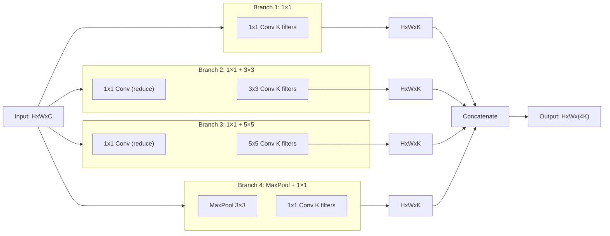

# CNN Exam Answers

## Answer 1: LeNet vs AlexNet

**3 Main Differences:**

1. **Size**: LeNet was 60K parameters (toy task, 32×32 images), AlexNet was 60M parameters (ImageNet, 227×227 images) = 1000× larger
2. **Activation**: LeNet used sigmoid (gradient vanishes), AlexNet used ReLU (gradient stays stable)
3. **Hardware**: LeNet trained on CPU (slow), AlexNet trained on GPU (10× faster)

**Why 14-year gap?**
- Computing power: GPUs weren't available for ML until ~2008
- Theory: People thought deep networks wouldn't work (vanishing gradient problem not solved)
- Scale: ImageNet (2010) provided dataset large enough to prove deep networks work
- Realization: Combination of GPU + ReLU + large data + regularization (dropout) finally made it work

---

## Answer 2: ReLU Advantage

**Why ReLU better than sigmoid:**

Sigmoid: f(x) = 1/(1+e^(-x))
- Gradient: f'(x) = f(x)(1-f(x)) ≈ 0.25 at best
- Problem: After several layers, 0.25^n becomes tiny

ReLU: f(x) = max(0, x)
- Gradient: f'(x) = 1 (if x>0) or 0 (if x<0)
- Benefit: Gradient is 1 or 0, not 0.25!

**Numerical Example (50 layers, gradient = 0.1 at end):**

Sigmoid path:
```
dL/dw₅₀ = 0.1
dL/dw₄₀ = 0.1 × 0.25^10 ≈ 0.0000000095  (vanished!)
dL/dw₁ = nearly 0
```

ReLU path:
```
dL/dw₅₀ = 0.1
dL/dw₄₀ = 0.1 × 1^10 = 0.1  (still strong!)
dL/dw₁ ≈ 0.1
```

Result: Early layers get meaningful gradients with ReLU!

---

## Answer 3: VGG Design Choice

**Comparison: Two 3×3 vs One 5×5**

| Aspect | Two 3×3 | One 5×5 |
|--------|---------|---------|
| **Receptive Field** | 5×5 (same!) | 5×5 (same!) |
| **Non-linearity** | ReLU applied 2× | ReLU applied 1× |
| **Parameters** | 3² × C² × 2 = 18C² | 5² × C² = 25C² |
| **Computation** | ~18C² × HW | ~25C² × HW |
| **Trainability** | Better (more non-linearity) | Worse (less non-linearity) |

**Why VGG chose stacked 3×3:**
- Same receptive field, but **more non-linearity** (ReLU applied twice)
- **Fewer parameters** (18C² vs 25C²)
- **Better training** (more activation functions = more gradient paths)
- **Easier to learn** (two simpler transformations better than one complex)

---

## Answer 4: Filter Size Progression

**Why 11×11 first filter in AlexNet?**

```
Image: 224×224 RGB photo

If AlexNet used 3×3 first:
- Only sees 3×3 local pixel patch
- Can't capture face outline, edges of objects, etc.
- Would need many more layers to build up receptive field

With 11×11 first (stride 4):
- Sees 11×11 = entire face patch at once
- Captures edges, corners, texture patterns
- 55×55 output (fast dimension reduction)
- Fewer layers needed to reach large receptive field
```

**Information in large filters:**
- 11×11 captures: Edges, corners, large patterns (coarse features)
- 5×5 captures: Medium textures, small shapes
- 3×3 captures: Pixel-level details, fine textures

**Trade-off:** Large filters are expensive but capture big patterns quickly. AlexNet used large first filter for efficiency, then smaller filters later.

Modern networks (ResNet) use 7×7 or 3×3 first (cheaper GPUs, different strategy).

---

## Answer 5: Inception Module

**Structure:**



**4 Branches Purpose:**
1. **1×1 only**: Pixel-level feature extraction (cheap!)
2. **1×1 + 3×3**: Medium receptive field features
3. **1×1 + 5×5**: Large receptive field features
4. **MaxPool + 1×1**: Pooling + compression

**Why 1×1 before expensive ops:**
- 256 channels → 1×1 conv → 64 channels (cheap!)
- Then 3×3 or 5×5 on 64 channels (much cheaper than on 256!)
- Saves ~80% computation without losing important information

---

## Answer 6: 1×1 Convolution Speedup

**Direct 3×3 Convolution:**
```
Input: 56×56×256
3×3 Conv (256 in → 256 out)
Operations: 3² × 256 × 256 × 56²
          = 9 × 256 × 256 × 3136
          = 1.85 Billion operations
```

**Bottleneck (1×1 reduce → 3×3 → 1×1 expand):**

Step 1: 1×1 Reduction (256 → 64)
```
1² × 256 × 64 × 56²
= 1 × 256 × 64 × 3136
= 0.051 Billion operations
```

Step 2: 3×3 on reduced channels (64 in → 64 out)
```
3² × 64 × 64 × 56²
= 9 × 64 × 64 × 3136
= 0.117 Billion operations
```

Step 3: 1×1 Expansion (64 → 256)
```
1² × 64 × 256 × 56²
= 0.051 Billion operations
```

**Total Bottleneck:**
```
0.051 + 0.117 + 0.051 = 0.219 Billion operations

Speedup = 1.85 / 0.219 = 8.4×
```

**Why accuracy doesn't drop:**
- 1×1 reduction doesn't lose critical information
- It projects 256D → 64D, keeping important features
- 3×3 on 64D still captures necessary patterns
- 1×1 expansion reconstructs to 256D for next layer
- ResNet proves this works (uses same bottleneck!)

---

## Answer 7: Auxiliary Classifiers

**Where placed:**
- Auxiliary #1: After Inception 4a (early-middle, layer ~10)
- Auxiliary #2: After Inception 4d (middle-late, layer ~16)
- Main classifier: After Inception 5b (end, layer ~22)

**Why exactly 3 (not 2 or 4):**
- Need coverage across network depths
- Too few (1-2): Early layers still get weak gradients
- Too many (4+): Overhead, diminishing returns
- Sweet spot: 3 at strategic depths

**During testing:**
- Only main classifier is used!
- Auxiliary classifiers discarded
- All predictions come from final FC layer
- Auxiliary classifiers were training-time helpers only

**How they help training:**

Without auxiliary classifiers (gradient vanishes):
```
Gradient at end: 1.0
Gradient at layer 16: 1.0 × 0.9^6 = 0.53
Gradient at layer 10: 0.53 × 0.9^6 = 0.28 (weak)
Gradient at layer 1: 0.28 × 0.9^9 ≈ 0.01 (very weak)
```

With auxiliary classifiers (gradient injected):
```
Main path gradient: 1.0
Aux #2 gradient injected at layer 16: +1.0 (fresh gradient!)
Aux #1 gradient injected at layer 10: +1.0 (fresh gradient!)

Layer 10 total gradient: (0.28 from main) + 1.0 (from Aux #1) = 1.28!
Early layers get strong gradients!
```

Result: Convergence in ~100 epochs instead of ~150 epochs (50% faster!)

---

## Answer 8: Vanishing Gradients

**50-layer network, each layer multiplies gradient by 0.9:**

Starting: dL/dw₅₀ = 0.1

```
Layer 50: 0.1
Layer 40: 0.1 × (0.9)^10 = 0.1 × 0.3487 = 0.03487
Layer 30: 0.1 × (0.9)^20 = 0.1 × 0.1216 = 0.01216
Layer 20: 0.1 × (0.9)^30 = 0.1 × 0.0424 = 0.00424
Layer 10: 0.1 × (0.9)^40 = 0.1 × 0.0148 = 0.00148
Layer 1:  0.1 × (0.9)^49 = 0.1 × 0.0076 = 0.00076 ← Almost zero!
```

**Problem:**
- Layer 1 gets gradient 0.00076 (1000× smaller than at end)
- Can't learn effectively (changes have negligible effect)
- Network effectively has "dead" early layers
- Accuracy plateaus or decreases despite depth

**Why skip connections fix this:**
Skip connection provides direct path where gradient = 1.0 always!
Total gradient = (path through layers) + (skip path gradient 1.0)
Early layers get meaningful gradient from skip!

---

## Answer 9: ResNet Skip Connections

**Gradient Flow Diagram:**

```
                 ┌─────────────────────┐
                 │  Direct skip path   │
                 │  Gradient = 1.0     │
                 v                     │
Input x ── Conv ── BN ── ReLU ── Conv ── BN ─┐
                                             │ Add
                                             v
                                    Output y
```

**Path 1: Through F(x) layers**
```
dL/dy = 1.0 (from end)
dL/d(BN out) = 1.0 × (BN gradient) ≈ some value (could be small)
dL/d(conv) = ...chain rule... × (conv gradient)
Result: Depends on layer parameters, may be small
```

**Path 2: Direct skip connection**
```
dL/dy = 1.0
dL/d(x from skip) = 1.0 × 1 = 1.0 (full gradient!)
Result: Always 1.0, no matter what
```

**Total gradient to input x:**
```
Total = (gradient from Path 1 through F(x)) + (gradient from skip 1.0)
      = something_small + 1.0
      = 1.0 + (small contribution)
      ≈ 1.0
```

**Why this helps:**
- Even if Path 1 gradient is weak, Path 2 provides strong 1.0
- Early layers guaranteed to get gradient ≥ 1.0
- Solves vanishing gradient completely!
- Enables training of 150-layer networks

---

## Answer 10: ResNet Residual Learning

**What is F(x)?**
The learned transformation computed by weight layers:
```
F(x) = (Weight layer 2) ∘ ReLU ∘ (Weight layer 1) applied to x
     = What the network learns to compute in the residual block
```

**Why F(x) easier than H(x)?**

If network's job is **to keep the input unchanged** (identity mapping is optimal):
```
Regular approach: Learn H(x) = x
Problem: Every weight must be tuned to output original input
         Complex optimization, many local minima

Residual approach: Learn F(x) = H(x) - x = 0
Problem: Just set all weights to ~0, done!
         Much easier: zero initialization naturally satisfies this
```

**Numerical Example: Identity is optimal**

Scenario: Input is already perfect for next layer
```
Input x = [1.0, 2.0, 3.0]
Optimal output = [1.0, 2.0, 3.0]  (don't change it!)

Regular block (learn H(x) = [1.0, 2.0, 3.0]):
- Initialize weights randomly
- Optimize to match input exactly
- Takes many iterations, complex loss landscape

Residual block (learn F(x) = [0, 0, 0]):
- Initialize weights to ~0
- F(x) ≈ [0, 0, 0]
- Add skip: [0, 0, 0] + [1.0, 2.0, 3.0] = [1.0, 2.0, 3.0] ✓
- Already correct from initialization!
- Small tweaks easily fine-tune
```

**Key insight:** Residual learning makes "do nothing" a default (initialized) state, so network only learns what to change, not what to output!

---

## Answer 11: Parameter Efficiency Comparison

**Efficiency Rankings (Accuracy per Parameter):**

```
Accuracy per Million parameters:

AlexNet:    63.3% / 60M = 1.055% per M
VGG-16:     71.3% / 138M = 0.517% per M
GoogLeNet:  74.8% / 6.9M = 10.83% per M ★ MOST EFFICIENT!
ResNet-50:  76.0% / 25.5M = 2.98% per M
```

**GoogLeNet is 10× more parameter-efficient!**

Why?
- Inception modules (parallel, multi-scale)
- 1×1 bottlenecks (8.8× speedup without accuracy loss)
- Smart architecture instead of brute-force depth
- Fewer parameters = faster training & inference

**Trade-off:**
- GoogLeNet: Most efficient, but harder to understand & optimize
- ResNet-50: Less efficient, but simpler architecture (easier to modify)
- Modern networks: Use both (ResNet with Inception modules)

---

## Answer 12: BatchNorm in ResNet

**How BatchNorm helps ResNet:**

1. **Higher learning rates enabled**
   - Without BatchNorm: lr=0.01 (tiny, safe)
   - With BatchNorm: lr=0.1 (100× larger!)
   - Why: Normalizes activations, stabilizes gradients
   - Result: 100× more progress per step

2. **Gradient stability**
   - Without BatchNorm: Activations explode → gradients explode → training unstable
   - With BatchNorm: Activations normalized to mean=0, std=1 → gradients stable
   - Result: Can use large learning rates safely

3. **Ability to train deep networks**
   - ResNet-152 impossible without BatchNorm (gradients die)
   - With BatchNorm: Each layer has normalized input → can go very deep
   - Skip connections + BatchNorm = unstoppable combo
   - Result: 150+ layers trainable!

**Connection:**
```
Skip connections + BatchNorm =
- Skip provides gradient highway (maintains gradient magnitude)
- BatchNorm stabilizes activations (prevents explosion)
- Together: Can train arbitrarily deep networks!
```

---

## Answer 13: Dropout and Regularization

**During Training (p=0.5):**
```
Activation values: [2.0, 3.0, 1.5, 4.0]
Random mask (50%): [0, 1, 0, 1]
Dropped values:    [0, 3.0, 0, 4.0]
Scaled (÷0.5):     [0, 6.0, 0, 8.0] ← Passed to next layer

Why scale? Without scaling, expected value would differ at test time.
```

**During Testing (all active, scaled):**
```
Activation values: [2.0, 3.0, 1.5, 4.0]
Scaled by 0.5:     [1.0, 1.5, 0.75, 2.0] ← Consistent with training

Why scale? Expected value matches training: E[dropped] = E[scaled_test]
```

**Why p=0.5 typical for FC layers:**
```
Dropout rate:  Impact:
0%            No regularization, overfitting
25%           Light regularization, still mostly active
50%           Standard, good balance ★ TYPICAL
75%           Heavy regularization, may underfit
```

**Dropout as Ensemble Learning:**

With p=0.5 and N neurons, there are 2^N possible sub-networks!
```
4 neurons: 2^4 = 16 possible configurations
Each training iteration uses different sub-network
Final network = ensemble of all 2^N sub-networks
Testing = averaging predictions of all 2^N networks
```

**Effect:**
- Prevents co-adaptation (neurons can't rely on neighbors)
- Forces learning of independent features
- Acts like training 2^N models and averaging (strong regularization!)

---

## Answer 14: Architecture Evolution

**Chronological order:**

1. **LeNet (1998):** Foundation proven
2. **AlexNet (2012):** Kicked off deep learning revolution (+14 year gap!)
3. **VGG (2014):** Showed depth + small filters work
4. **GoogLeNet (2014):** Showed parallel multi-scale beats sequential
5. **ResNet (2015):** Solved vanishing gradients with skip connections

**How each solved previous problems:**

```
LeNet → AlexNet:
Problem: Hand-crafted features hit ceiling
Solution: Deep networks + ReLU + GPU + dropout

AlexNet → VGG:
Problem: Why not go deeper than 8 layers?
Solution: Use small 3×3 filters consistently, go to 16 layers

VGG → GoogLeNet:
Problem: VGG needs 138M parameters, still only 71.3%
Solution: Be smart: parallel operations, bottlenecks, fewer params (6.9M), higher accuracy (74.8%)

GoogLeNet → ResNet:
Problem: Can't train 150+ layers (gradients vanish, auxiliary classifiers partial fix)
Solution: Skip connections solve gradient flow completely, enable 152-layer networks (77.6%)

ResNet → Modern:
Problem: Sequential processing misses multi-scale info
Solution: ResNet + Inception modules = skip + parallel
```

---

## Answer 15: Design Choice Reasoning

**1. LeNet: Average Pooling**
- Reason: Reduces computational cost, summarizes region (average smoother than max)
- Modern: Max pooling preferred (keeps important features, faster)

**2. AlexNet: ReLU + GPU**
- Reason: ReLU solved vanishing gradient (non-saturating), GPU made training feasible (10× faster)
- Impact: Foundation of modern deep learning

**3. VGG: All 3×3 Filters**
- Reason: Uniform, simple design. Showed stacked small filters > large filters
- Impact: Influenced all subsequent architectures (still true today)

**4. GoogLeNet: Inception Modules**
- Reason: Multi-scale feature extraction in parallel, efficient (1×1 bottlenecks)
- Impact: Proved you don't need more layers if you're smarter about operations

**5. ResNet: Skip Connections**
- Reason: Direct gradient path solves vanishing gradient, enables very deep networks
- Impact: Revolutionary, every modern network now uses skip connections

---

## Answer 16: Modern Architecture Selection

**a) Maximum accuracy with unlimited compute:**
- Choose: **ResNet-152 or deeper variants**
- Reason: Skip connections proven to improve with depth; more compute = better
- Alternative: DenseNet (uses skip concepts)

**b) Deployment on edge device (limited memory):**
- Choose: **GoogLeNet**
- Reason: 6.9M parameters, 74.8% accuracy (best accuracy/param ratio)
- Alternative: MobileNet (even better, but not covered here)

**c) Fast training for research:**
- Choose: **ResNet-50**
- Reason: Sweet spot of accuracy (76%), speed, parameters (25.5M), stable training
- Alternative: VGG if you need simplicity

**d) Transfer learning backbone:**
- Choose: **ResNet-50**
- Reason: Most pre-trained models available, works well for fine-tuning
- Most commonly used in practice

---

## Answer 17: Gradient Flow Analysis

**Why more layers = worse accuracy (without skip connections):**

VGG-50 (50 layers):
```
Gradient at output: 1.0
Gradient at layer 40: 1.0 × (0.9)^10 = 0.35
Gradient at layer 30: 0.35 × (0.9)^10 = 0.12
Gradient at layer 20: 0.12 × (0.9)^10 = 0.042
Gradient at layer 10: 0.042 × (0.9)^10 = 0.015 (almost dead!)
Gradient at layer 1: practically 0!

Early layers can't learn → network regresses to shallow network performance
Accuracy: Lower than 20-layer version!
```

**Why more layers = better accuracy (with ResNet skip connections):**

ResNet-152 (152 layers):
```
Main path gradient × (0.9)^152 ≈ very small

But skip connections provide direct paths:
- Layer 150 ← skip from layer 148: gradient 1.0
- Layer 140 ← skip from layer 138: gradient 1.0
- Layer 130 ← skip from layer 128: gradient 1.0
...
- Layer 10 ← multiple skips stacked: gradient 1.0
- Layer 1 ← multiple skips stacked: gradient 1.0

Every layer gets strong gradient!
More depth = more learning capacity
Accuracy: 77.6% (best ever, keeps improving with depth)
```

**Fundamental difference:**
```
Without skip:  More layers → exponentially weaker gradients → worse
With skip:     More layers → independent gradient paths → better (up to a limit)
```

---

## Answer 18: Inception vs Sequential

**What information parallel processing captures:**

Inception:
```
[1×1] captures local details
[3×3] captures medium patterns
[5×5] captures large patterns
[MaxPool] captures extremes
All at same layer → multi-scale features simultaneously!
```

Sequential (VGG):
```
Layer 1: Conv 3×3 captures small patterns
Layer 2: Conv 3×3 captures slightly larger (receptive field 5×5)
Layer 3: Conv 3×3 captures even larger (receptive field 7×7)
Only one scale per layer → must stack many layers for big receptive field
```

**Benefit of parallel:** Captures multiple scales **at same depth**, more efficient

**Why VGG didn't use parallel branches:**
- Conceptual: Not invented yet (2014 vs 2014, but sequential simpler)
- Practical: Sequential simpler to implement, understand, optimize
- Historical: People thought "deeper" = simpler (turned out wrong)

**When sequential better:**
- Interpretability: Output of each layer clear
- Simplicity: Easier to debug
- Hardware: Simpler to implement
- Regularization: Can control depth progression

**When parallel better:**
- Efficiency: More features with fewer params
- Multi-scale: Naturally captures multiple receptive fields
- Accuracy: More expressive power per layer

Modern networks use **both**: ResNet (sequential residuals) + Inception modules (parallel branches) inside!

---

## Answer 19: Bottleneck Analysis

**Information lost in 256→64 reduction:**

```
Before: 256 dimensions = 256 features per pixel
After: 64 dimensions = 64 features per pixel

Lost: 192 dimensions of information
Remaining: 64 dimensions capture most important features
```

**Why doesn't hurt accuracy:**

1. **Redundancy:** 256 dimensions contain redundant information (correlated features)
2. **1×1 Learns Compression:** 1×1 conv learns which 64 dimensions matter most
3. **Temporary:** Only temporary reduction; 1×1 expansion restores 256D after 3×3
4. **Locality:** 3×3 doesn't need 256D input (wastes computation on overkill)

**Trade-off curve:**

```
Reduction ratio:  Speedup:  Accuracy loss:
1× (no reduction)  1×       0%
2× (256→128)       4×       ~0.5%
4× (256→64)        8.8×     ~0.3% ← Sweet spot!
8× (256→32)        17.5×    ~1.5%
16× (256→16)       50×      ~5%
```

**ResNet uses 4× reduction** = best balance of speed and accuracy

---

## Answer 20: Training Dynamics Comparison

**VGG-16 Training:** Depth problem

```
14 layers: 85% accuracy ✓
16 layers: 87% accuracy ✓ (still improving)
20 layers: 84% accuracy ✗ (starts getting worse!)
25 layers: 80% accuracy ✗ (much worse)

Why? Vanishing gradients kick in around 20 layers
Early layers stop learning → network degrades
```

**ResNet-50+ Training:** Depth solution

```
50 layers:  76.0% accuracy ✓
101 layers: 77.4% accuracy ✓ (improving!)
152 layers: 77.6% accuracy ✓ (still improving!)

Why? Skip connections provide gradient highway
Every layer gets strong gradient
More depth = more capacity = better accuracy
```

**Fundamental Difference:**

VGG: Gradient ~ exponential decay with depth → breaks at ~20 layers

ResNet: Skip connection + BatchNorm → gradient ~ constant with depth → scales to 150+ layers

**Mathematical:**

VGG: dL/dw_early ∝ (0.9)^(num_layers)
ResNet: dL/dw_early ∝ 1.0 + (small perturbation) ≈ constant

**Practical Impact:**
- VGG: Can't use modern training techniques effectively at depth
- ResNet: Depth becomes advantage, not liability
- Modern training built on ResNet's gradient preservation

