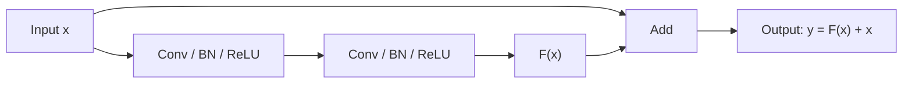

# ResNet: Residual Learning Explained (Concise)

## The Core Problem

**Regular Deep Networks:**
```
Input x → [Weight layers] → Output H(x)
Goal: Learn H(x) directly
```

**Problem at 50+ layers:**
- Gradients vanish during backprop
- Early layers receive almost no gradient
- Can't train deep networks effectively

---
![[resnet_why.png]]
## The Residual Solution

### The Idea: Learn the DIFFERENCE, Not the Output

**Regular network (old way):**
```
Output y = H(x)  where H is what we want to learn
```

**Residual network (new way):**
```
Output y = F(x) + x  where F is what we want to learn
```

**What's F(x)?** The DIFFERENCE (residual) from input to output:
```
F(x) = y - x = (desired_output) - (input)
```

### Why Learn the Difference? The Insight

Imagine a layer that's **already working fine**. In a very deep network, some layers don't need to do much—they could almost pass the input through unchanged.

**OLD WAY (without skip):**
```
Network must learn: y = H(x)
If best answer is y ≈ x (do almost nothing), 
network still needs to learn a function that outputs the input exactly.

Problem: This is surprisingly HARD to learn!
Weights need to be just right to reproduce the input.
```

**NEW WAY (with skip):**
```
Network learns: y = F(x) + x

If best answer is y ≈ x (do almost nothing), 
then F(x) should be ≈ 0 (tiny change needed).

Advantage: Learning F(x) = 0 is EASY!
Just initialize weights to near zero → already done!
```

### Simple Analogy

Think of copying a 100-page document:

**OLD WAY:** Print all 100 pages from scratch
- Takes forever
- Easy to make mistakes
- Lots of work

**NEW WAY:** Print a "COPY ALL" message, then just correct the 2 pages that are different
- Much faster (only fix 2 pages)
- Fewer mistakes (keep 98 pages as-is)
- Residual = corrections needed

### Real Numerical Example

**Input:** x = [1.0, 2.0, 3.0] (3D vector)

**Scenario:** This input is ALREADY PERFECT for the next layer. Ideal output = [1.0, 2.0, 3.0] (no change)

**WITHOUT residual connection:**
```
Goal: Learn H(x) = [1.0, 2.0, 3.0]

Initialize weights randomly:
W = [[0.1, 0.2, 0.3],
     [0.4, 0.5, 0.6],
     [0.7, 0.8, 0.9]]

Compute: H(x) = W × x = [1.4, 3.2, 5.0] ✗ WRONG

Optimize weights many iterations:
Iteration 1: Update W → H(x) = [0.9, 1.9, 3.1] (closer)
Iteration 2: Update W → H(x) = [0.95, 2.02, 3.02] (closer)
Iteration 3: Update W → H(x) = [1.0, 2.0, 3.0] ✓ FINALLY!

Takes MANY iterations to learn identity mapping!
```

**WITH residual connection:**
```
Goal: Learn F(x) = [0, 0, 0]  (zero change)

Initialize weights randomly:
W = [[0.01, 0.02, 0.03],
     [0.04, 0.05, 0.06],
     [0.07, 0.08, 0.09]]

Compute: F(x) = W × x = [0.14, 0.32, 0.50] (small!)
Add skip: y = F(x) + x = [1.14, 2.32, 3.50] (close to target!)

Optimize weights a few iterations:
Iteration 1: Update W → F(x) = [0.08, 0.16, 0.24]
             y = F(x) + x = [1.08, 2.16, 3.24] (closer)
Iteration 2: Update W → F(x) = [0.02, 0.04, 0.06]
             y = F(x) + x = [1.02, 2.04, 3.06] (very close)
Iteration 3: F(x) ≈ [0, 0, 0], y ≈ [1.0, 2.0, 3.0] ✓ DONE!

Takes FEWER iterations because F(x)=0 is already initialized!
```

### Key Difference

| Aspect | Regular | Residual |
|--------|---------|----------|
| **Learning target** | H(x) = identity | F(x) = 0 (zero) |
| **Initial state** | Random, far from solution | Near-zero already close to solution! |
| **Optimization** | Many iterations needed | Few iterations needed |
| **When it helps most** | All layers always | Especially when layer doesn't need to change much |

---

## Residual Block Structure



---

---

## Forward Pass

```
Input: x = [0.5, 0.3, 0.8]

Step 1: Compute F(x)
  Weight1(x) → ReLU → Weight2 → ReLU → F(x) = [0.01, 0.01, 0.01]

Step 2: Add skip connection
  y = F(x) + x
    = [0.01, 0.01, 0.01] + [0.5, 0.3, 0.8]
    = [0.51, 0.31, 0.81]

Step 3: Output
  Final = Activation(y) = [0.51, 0.31, 0.81]
```

---

## Backward Pass (Why It Helps Gradients)

**Without residual connection:**
```
Gradient at output: dL/dy = 1.0
Gradient at Weight2: dL/dW₂ = 1.0 × something_small
Gradient at Weight1: dL/dW₁ = something_small × something_small
                             = very_tiny → Vanishing!
```

**With residual connection:**
```
Gradient at output: dL/dy = 1.0

Gradient backprop path 1 (through F(x)):
dL/dW₂ = 1.0 × something_small

Gradient backprop path 2 (skip connection):
dL/dx_skip = 1.0 × 1 = 1.0 (full gradient passes through!)

Total gradient to Weight1:
dL/dW₁ = (something_small) + (1.0 × chain_rule)
       = something_small + something reasonable
       = not vanishing!

Skip connection gives FREE direct gradient path!
```

---

## Why 50+ Layer Networks Now Work

**VGG-152 (150 layers) without residuals:**
- Cannot train effectively
- Accuracy ≈ random (gradients dead)

**ResNet-152 (150 layers) with residuals:**
- Trains perfectly
- Accuracy 77.3% on ImageNet
- Better than shallower networks!

**Why?**
- Skip connection: Direct gradient highway
- Identity default: Network learns what to change
- Exponential improvement in trainability

---

## Concrete ResNet Numbers

| Depth | Without ResNet | With ResNet | Difference |
|-------|----------------|------------|-----------|
| 34 layers | 75.3% | 73.3% | ResNet ✓ (easier to train) |
| 50 layers | ~ fails | 76.6% | ResNet ✓ (needed!) |
| 101 layers | Impossible | 77.4% | ResNet ✓ (way needed!) |
| 152 layers | Cannot train | 77.6% | ResNet ✓ (only way!) |

Deeper = better with ResNet! (opposite of before)

---

## When Is Skip Connection Used?

### Case 1: Matching dimensions (easy skip)
```
Input: 28×28×64
F(x): 2 conv layers → still 28×28×64
Skip: Add directly (x + F(x))
```

### Case 2: Reducing dimensions (with 1×1 conv)
```
Input: 28×28×64
F(x): Stride-2 conv → 14×14×128
Skip: Use 1×1 conv to transform x
      28×28×64 → (1×1 conv) → 14×14×128
      Then add (1×1_conv(x) + F(x))
```

---

## Key Equations

```
Regular block:      y = H(x)
Residual block:     y = F(x, W) + x

Where:
F(x, W) = learned function (what network trains)
x = skip connection (identity)
y = output

Network learns residual: F(x) = H(x) - x
Not full transformation: F(x) = H(x)
```

---

## Exam Takeaways

✓ **Problem**: Can't train very deep networks (gradients vanish)

✓ **Solution**: Skip connection that adds input directly to output

✓ **Key idea**: Learn residual F(x) instead of H(x)

✓ **Why easier**: If identity is good, F(x)≈0 is easier than H(x)≈x

✓ **Gradient flow**: Skip connection creates direct gradient path (solves vanishing gradient)

✓ **Impact**: Can now train 150+ layer networks effectively

✓ **Formula**: y = F(x, W) + x (that's it!)

---

## Quick Comparison

| Network | Depth | Problem | Solution |
|---------|-------|---------|----------|
| AlexNet | 8 | Works fine | None needed |
| VGG | 16-19 | Still works | Deeper = worse |
| GoogLeNet | 22 | Auxiliary classifiers | Gradient injection |
| ResNet | 50-152 | **Solves vanishing** | **Skip connections** |

**ResNet Revolution**: Finally made very deep networks easy to train!
