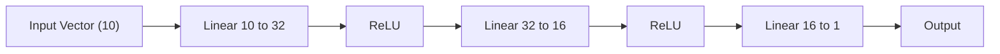

> **How neurons stack to form a Deep Neural Network (DNN) in PyTorch**


---

# 🧠 Deep Neural Network (DNN): How Stacking Neurons Works

## 1️⃣ Single Neuron (Linear Unit)

A single neuron computes:

$$
y = Wx + b
$$

Where:

* (x) = input vector (shape: `in_features`)
* (W) = weight matrix
* (b) = bias
* (y) = output vector (shape: `out_features`)

In PyTorch:

```python
layer = nn.Linear(in_features, out_features)
y = layer(x)
```

Example:

```python
nn.Linear(10, 1)
```

Takes a vector of length **10** → outputs **1 number**.

This is equivalent to **linear regression neuron**.

---

## 2️⃣ Layer = Many Neurons in Parallel

When you write:

```python
nn.Linear(10, 5)
```

It means:

* Input dimension = 10
* Output dimension = 5
* There are **5 neurons**, each seeing all 10 inputs.

Mathematically:

$$
x \in \mathbb{R}^{10}
$$
$$
W \in \mathbb{R}^{5 \times 10}
$$
$$
b \in \mathbb{R}^{5}
$$
$$
y = Wx + b \in \mathbb{R}^{5}
$$

So one layer transforms:

```
[10 numbers]  →  [5 numbers]
```

Each output number comes from a different neuron.

---

## 3️⃣ Why Activation Is Required

If you stack only linear layers:

```python
y = Linear2(Linear1(x))
```

This collapses into a **single linear function** mathematically.
You gain no extra modeling power.

To make the network learn complex patterns, you insert a **non-linear activation**:

```python
x = torch.relu(layer(x))
```

ReLU:
$$
f(z) = \max(0, z)
$$

This breaks linearity and allows deep networks to model nonlinear relationships.

---

## 4️⃣ Stacking Layers → A DNN

A DNN is simply:

```
Input → Linear → Activation → Linear → Activation → ... → Output
```

Example architecture:

```text
Input (10)
 → Linear(10, 32)
 → ReLU
 → Linear(32, 16)
 → ReLU
 → Linear(16, 1)
 → Output
```

Dimensions flow:

```
[10] → [32] → [16] → [1]
```

---

## 5️⃣ PyTorch Implementation (Canonical DNN)

```python
import torch
import torch.nn as nn

class Net(nn.Module):
    def __init__(self):
        super(Net, self).__init__()
        self.fc1 = nn.Linear(10, 32)
        self.fc2 = nn.Linear(32, 16)
        self.fc3 = nn.Linear(16, 1)

    def forward(self, x):
        x = torch.relu(self.fc1(x))   # hidden layer 1
        x = torch.relu(self.fc2(x))   # hidden layer 2
        x = self.fc3(x)               # output layer
        return x

model = Net()
```

Important rules:

* **Only define layers in `__init__`.**
* **Only compute flow in `forward`.**
* Activations are applied inside `forward`.

---

## 6️⃣ What “Depth” and “Width” Mean

* **Width** = number of neurons in a layer
  Example: `Linear(10, 32)` → width = 32

* **Depth** = number of layers
  Example: 3 Linear layers → depth = 3

More depth → hierarchical features
More width → higher capacity per layer

---

## 7️⃣ Batch Dimension (Real Input Shape)

In practice, PyTorch input shape is:

```
(batch_size, features)
```

Example:

```python
x.shape = (64, 10)   # 64 samples, each has 10 features
```

After:

```python
Linear(10, 32)
```

Shape becomes:

```
(64, 32)
```

Batch dimension always stays unchanged.

---

## 8️⃣ Training Loop (Always Same for Any DNN)

```python
optimizer.zero_grad()
output = model(x)
loss = criterion(output, y)
loss.backward()
optimizer.step()
```

This is identical for:

* linear model
* DNN
* CNN

Only the **model architecture changes**.

---

## 9️⃣ Mermaid Diagram (Architecture Visualization)

You can render this in any Mermaid-supported editor.



---

## 10️⃣ Mental Model (Exam-Safe)

When you see:

```python
nn.Linear(a, b)
```

Immediately think:

```
[a numbers] → [b neurons] → [b numbers]
```

When you see:

```python
torch.relu(...)
```

Think:

```
Nonlinearity added → model becomes expressive
```

When you see multiple Linear layers chained:

```
You are stacking neurons → building a DNN
```

---

