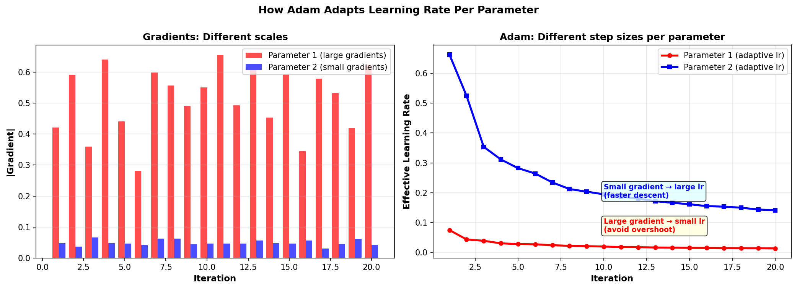

# Adam

Adam (Adaptive Moment Estimation) is a widely-used adaptive optimizer that combines momentum with per-parameter learning rate scaling. It automatically adjusts the step size for each parameter based on gradient history, making it robust and practical.

## Core Algorithm

At iteration $t$, Adam maintains two exponential moving averages per parameter:

$$\mathbf{m}_t = \beta_1 \mathbf{m}_{t-1} + (1 - \beta_1) \mathbf{g}_t$$

$$\mathbf{v}_t = \beta_2 \mathbf{v}_{t-1} + (1 - \beta_2) \mathbf{g}_t^2$$

where:
- $\mathbf{g}_t = \nabla \mathcal{L}(\mathbf{w}_t)$ is the gradient
- $\mathbf{m}_t$ is the **first moment** (exponential moving average of gradients, like momentum)
- $\mathbf{v}_t$ is the **second moment** (exponential moving average of **squared** gradients)
- $\beta_1, \beta_2 \in [0, 1)$ are decay rates (typical: $\beta_1 = 0.9$, $\beta_2 = 0.999$)
- $\mathbf{g}_t^2$ means element-wise squaring

Then apply **bias correction** (to account for initialization from zero):

$$\hat{\mathbf{m}}_t = \frac{\mathbf{m}_t}{1 - \beta_1^t}$$

$$\hat{\mathbf{v}}_t = \frac{\mathbf{v}_t}{1 - \beta_2^t}$$

Finally, update parameters:

$$\mathbf{w}_{t+1} = \mathbf{w}_t - \alpha \frac{\hat{\mathbf{m}}_t}{\sqrt{\hat{\mathbf{v}}_t} + \epsilon}$$

where:
- $\alpha$ is the [[Learning Rate and Step Size|learning rate]]
- $\epsilon$ is a small constant (typically $10^{-8}$) for numerical stability
- Division and square root are element-wise

## Understanding Each Component

### First Moment: $\mathbf{m}_t$ (Momentum)

$$\mathbf{m}_t = \beta_1 \mathbf{m}_{t-1} + (1 - \beta_1) \mathbf{g}_t$$

is identical to [[SGD with Momentum|momentum]]: exponential moving average of gradients.

**Concrete example:**

Starting with m = 0:

- **Iteration 1:** gradient = 0.3
  - m₁ = 0.9 × 0 + 0.1 × 0.3 = 0.03

- **Iteration 2:** gradient = 0.31 (similar direction)
  - m₂ = 0.9 × 0.03 + 0.1 × 0.31 = 0.027 + 0.031 = 0.058

- **Iteration 3:** gradient = -0.2 (opposite direction!)
  - m₃ = 0.9 × 0.058 + 0.1 × (-0.2) = 0.0522 - 0.02 = 0.0322

Even though iteration 3 has a negative gradient, the momentum stays positive (0.0322) because we remember the previous two positive steps.

**What this does:**
- Accumulates consistent descent directions
- Reduces oscillations from batch noise
- Acts like inertia in the parameter update

### Second Moment: $\mathbf{v}_t$ (Adaptive Scale)

$$\mathbf{v}_t = \beta_2 \mathbf{v}_{t-1} + (1 - \beta_2) \mathbf{g}_t^2$$

tracks the **squared gradients** (element-wise). This measures how large gradients are.

**Concrete example:**

Starting with v = 0, β₂ = 0.999 (heavy exponential average):

- **Iteration 1:** gradient = 0.3
  - g² = 0.09
  - v₁ = 0.999 × 0 + 0.001 × 0.09 = 0.00009

- **Iteration 2:** gradient = 0.31
  - g² = 0.0961
  - v₂ = 0.999 × 0.00009 + 0.001 × 0.0961 = 0.0000899 + 0.0000961 = 0.000186

- **Iteration 3:** gradient = -0.2
  - g² = 0.04
  - v₃ = 0.999 × 0.000186 + 0.001 × 0.04 = 0.0001857 + 0.00004 = 0.0002257

**What this means:**
- v accumulates squared magnitudes (0.09, 0.0961, 0.04)
- v grows over time as we collect more gradient history
- Larger v → divide by larger number → smaller step size

### Effective Learning Rate Per Parameter (Concrete!)

The denominator $\sqrt{\hat{\mathbf{v}}_t} + \epsilon$ acts as an **adaptive learning rate**:

$$\alpha_i^{\text{eff}} = \frac{\alpha}{\sqrt{\hat{\mathbf{v}}_t^{(i)}} + \epsilon}$$

**Parameter 1: Consistently large gradients**
- Iteration 10: v₁ = 0.05, so √v₁ = 0.224
- α_eff = 0.001 / 0.224 = 0.00446 (small step)

**Parameter 2: Consistently small gradients**
- Iteration 10: v₂ = 0.0001, so √v₂ = 0.01
- α_eff = 0.001 / 0.01 = 0.1 (large step!)

**Why this helps:**
- Parameter 1 moves with small steps (gradient already strong, need caution)
- Parameter 2 moves with large steps (gradient weak, need more encouragement)
- Automatic per-parameter learning rate adaptation



## Bias Correction

A subtle but important detail: both $\mathbf{m}_t$ and $\mathbf{v}_t$ are initialized to zero. This causes severe underestimation in early iterations:

$$\mathbf{m}_1 = (1 - \beta_1) \mathbf{g}_1 = 0.1 \mathbf{g}_1 \quad \text{(if } \beta_1 = 0.9\text{)}$$

So $\mathbf{m}_1$ is only **10% of the true first gradient!**

### Concrete Example

Suppose the true gradient at iteration 1 is 1.0:

**Without bias correction:**
- m₁ = 0.9 × 0 + 0.1 × 1.0 = 0.1 (only 10% of gradient)
- Update = 0.001 / √(0.01) = 0.1 (still too small)
- Parameter barely moves when it should move more

**With bias correction:**
- m₁ = 0.1 (same as above)
- m̂₁ = 0.1 / (1 - 0.9¹) = 0.1 / 0.1 = 1.0 (corrected!)
- Update = 0.001 / √(corrected v) = proper step size

**Second moment correction:**

For v, the correction is even more important:
- v₁ = 0.999 × 0 + 0.001 × g² ≈ 0 (severely underestimated!)
- v̂₁ = v₁ / (1 - 0.999¹) = v₁ / 0.001 ≈ 1000 × v₁ (massive correction)

By iteration 10:
- (1 - 0.9¹⁰) ≈ 0.651, correction still significant
- (1 - 0.999¹⁰) ≈ 0.01, huge correction for v

By iteration 100:
- (1 - 0.9¹⁰⁰) ≈ 1.0, no correction needed
- (1 - 0.999¹⁰⁰) ≈ 0.095, still some correction for v

**Why this matters:**
- Without correction, first 10-50 iterations barely train (parameters stuck at initialization)
- With correction, training starts immediately and smoothly
- Bias correction is **essential** for Adam's stability in early training

## PyTorch Implementation

```python
optimizer = torch.optim.Adam(
    model.parameters(),
    lr=0.001,          # learning rate (default)
    betas=(0.9, 0.999),  # (β₁, β₂)
    eps=1e-8,          # ε for numerical stability
    weight_decay=0.0   # L2 regularization (see [[Weight Decay vs L2 Regularization]])
)

# Standard training loop
for epoch in range(num_epochs):
    for batch in train_loader:
        loss = model(batch)
        loss.backward()
        optimizer.step()
        optimizer.zero_grad()
```

### Inspecting Adam State

```python
# After some iterations
for param_group in optimizer.param_groups:
    for param in param_group['params']:
        if param in optimizer.state:
            state = optimizer.state[param]
            m = state['exp_avg']          # first moment m_t
            v = state['exp_avg_sq']       # second moment v_t
            step = state['step']          # iteration count t
            
            print(f"m shape: {m.shape}, v shape: {v.shape}, step: {step}")
```

## Convergence Properties

For [[Convex vs Non-Convex Optimization|convex]] smooth losses:

$$\mathbb{E}[\mathcal{L}(\mathbf{w}_T)] - \mathcal{L}(\mathbf{w}^*) = O\left(\frac{\log T}{\sqrt{T}}\right)$$

**Comparison:**

| Algorithm | Rate |
|---|---|
| Vanilla SGD | $O(1/\sqrt{T})$ |
| Adam | $O(\log T / \sqrt{T})$ |
| Nesterov | $O(1/T^2)$ in theory |

Adam is slightly better than vanilla SGD (log factor advantage), but Nesterov is theoretically faster. However, **empirically Adam often converges faster** due to per-parameter adaptation.

## Advantages of Adam

✅ **Adaptive learning rates:** Each parameter gets its own step size  
✅ **Robust to learning rate choice:** Works across wide range of $\alpha$ values  
✅ **Momentum included:** Convergence acceleration for free  
✅ **Works well with sparse gradients:** [[Adagrad|Adagrad-like behavior]] for rarely-updated parameters  
✅ **Minimal hyperparameter tuning:** Defaults work for most problems  
✅ **Fast initial convergence:** Often reaches acceptable loss in fewest iterations  

## Disadvantages of Adam

❌ **Worse generalization:** Final test error often slightly higher than SGD  
❌ **Higher memory:** Stores two buffers per parameter (2× vs. 1× for SGD momentum)  
❌ **Complex dynamics:** Less interpretable than SGD  
❌ **Non-stationary behavior:** Effective step sizes change throughout training  
❌ **Can converge to sharp minima:** May generalize worse than SGD's flatter minima

## When to Use Adam

**Use Adam when:**
- Prototyping and need fast results
- Learning rate tuning is difficult
- Sparse or variable-scale gradients
- Short training time budget (fewer iterations needed)
- Starting fresh on unfamiliar problem

**Use SGD with Momentum when:**
- Maximum generalization (test) performance needed
- Have time to tune learning rate carefully
- Dataset is clean and stable
- Final model performance is critical

See [[SGD vs Adam: When to Use Which]].

## Hyperparameter Selection

### Learning Rate $\alpha$

Default: $0.001$ (much smaller than SGD's typical $0.01$)

Typical range: $10^{-5}$ to $10^{-2}$

Start with $0.001$ and adjust if needed.

```python
# If loss diverges: reduce lr
optimizer = torch.optim.Adam(model.parameters(), lr=0.0001)

# If convergence too slow: increase lr
optimizer = torch.optim.Adam(model.parameters(), lr=0.01)
```

### Momentum Coefficient $\beta_1$

Default: $0.9$ (standard momentum)

Usually keep fixed. Only change if:
- Very noisy data: reduce to $0.5$ or $0.8$
- Stable data: can increase to $0.95$

```python
betas=(0.99, 0.999)  # heavier momentum
```

### Second Moment Coefficient $\beta_2$

Default: $0.999$ (aggressive second moment averaging)

Rarely changed. Represents "memory" for gradient magnitude:

$$\text{memory depth} = \frac{1}{1 - \beta_2}$$

$\beta_2 = 0.999$ means ~1000 iterations of memory.

For very sparse gradients, can try lower values:

```python
betas=(0.9, 0.99)  # faster adaptation to sparse gradients
```

### Epsilon $\epsilon$

Default: $10^{-8}$ (fine for most cases)

Only adjust if:
- Numerical instability (gradients explode): increase to $10^{-7}$
- Very precise optimization needed: decrease to $10^{-10}$

```python
eps=1e-7  # for numerical stability
```

## Interaction with Learning Rate Schedules

Adam can use schedules, though it's less common:

```python
optimizer = torch.optim.Adam(model.parameters(), lr=0.001)

scheduler = torch.optim.lr_scheduler.StepLR(
    optimizer,
    step_size=10,
    gamma=0.1
)

for epoch in range(100):
    train()
    scheduler.step()
```

The schedule multiplies the base learning rate $\alpha$. Momentum buffers persist.

**Warm restarts with Adam:**

```python
scheduler = torch.optim.lr_scheduler.CosineAnnealingWarmRestarts(
    optimizer,
    T_0=10,
    T_mult=2
)
```

Works well to escape local minima and improve generalization.

## Advanced Variants

### AdamW (Adam with Decoupled Weight Decay)

Standard Adam conflates [[Weight Decay vs L2 Regularization|weight decay with gradient scaling]]. AdamW decouples them:

```python
optimizer = torch.optim.AdamW(
    model.parameters(),
    lr=0.001,
    weight_decay=0.01  # true L2 regularization
)
```

[[AdamW]] is generally preferred over Adam for modern deep learning (better generalization).

### AMSGrad

Variant that uses maximum of second moments instead of exponential average:

$$\hat{\mathbf{v}}_t = \max(\hat{\mathbf{v}}_{t-1}, \hat{\mathbf{v}}_t)$$

Can improve convergence in non-convex settings.

```python
optimizer = torch.optim.Adam(
    model.parameters(),
    lr=0.001,
    amsgrad=True
)
```

See [[AMSGrad]].

## Common Failure Modes

| Problem | Symptom | Solution |
|---|---|---|
| Loss diverges | NaN or Inf loss | Reduce learning rate by 10× |
| No improvement | Loss plateaus immediately | Increase learning rate or check model architecture |
| Poor generalization | High test error | Use SGD momentum instead, or add regularization |
| Slow convergence | Takes too many iterations | Increase learning rate (Adam is robust) |

## Comparison to [[Adagrad]] and [[RMSprop]]

| Aspect | Adagrad | RMSprop | Adam |
|---|---|---|---|
| Adaptive learning rate | Yes | Yes | Yes |
| Momentum | No | No | Yes |
| Learning rate decay | Monotonic | Per-param controlled | Per-param controlled |
| Sparse gradients | Excellent | Good | Good |
| Typical performance | Good | Very good | Best |

Adam essentially combines [[RMSprop]]'s adaptive scaling with momentum—best of both worlds.

## Practical Recommendations

**Default settings (usually works):**
```python
optimizer = torch.optim.Adam(
    model.parameters(),
    lr=0.001,
    betas=(0.9, 0.999)
)
```

**For computer vision (CNNs):**
```python
optimizer = torch.optim.AdamW(
    model.parameters(),
    lr=0.001,
    betas=(0.9, 0.999),
    weight_decay=0.0001
)
scheduler = torch.optim.lr_scheduler.CosineAnnealingLR(
    optimizer, T_max=100
)
```

**For NLP (Transformers):**
```python
optimizer = torch.optim.AdamW(
    model.parameters(),
    lr=0.0001,  # smaller lr for large models
    betas=(0.9, 0.999),
    weight_decay=0.01
)
scheduler = torch.optim.lr_scheduler.LinearLR(
    optimizer, total_iters=1000
)
```

## See Also

- [[Stochastic Gradient Descent (SGD)]]: Alternative optimizer
- [[SGD with Momentum]]: Momentum mechanism
- [[Adagrad]]: Adaptive learning rates (simpler)
- [[RMSprop]]: Per-parameter adaptive learning rates
- [[AdamW]]: Improved weight decay version
- [[AMSGrad]]: Convergence-improved variant
- [[Learning Rate and Step Size]]: How learning rate affects optimization
- [[Weight Decay vs L2 Regularization]]: Regularization with Adam
- [[SGD vs Adam: When to Use Which]]: Detailed comparison
