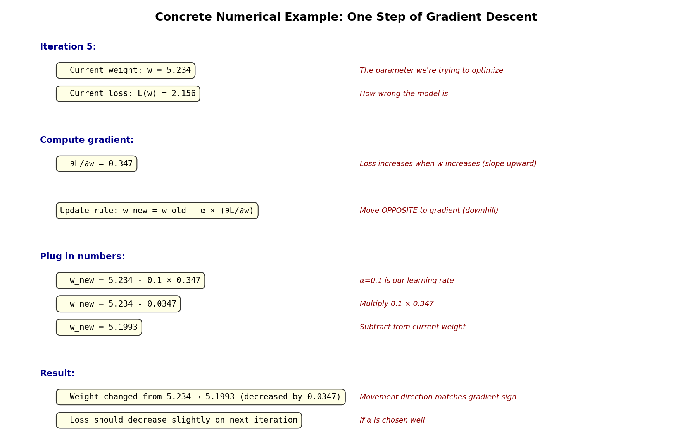

# Gradient Descent Fundamentals

Gradient descent is the algorithm that trains neural networks. It works by repeatedly adjusting parameters to reduce loss. This note explains what it does, why it works, and how to use it.

## The Core Problem

When training a model, we have:
- **Parameters $\mathbf{w}$:** the weights we're trying to find (could be thousands, millions, or billions of them)
- **Loss function $\mathcal{L}(\mathbf{w})$:** measures how wrong the model is (lower is better)
- **Goal:** find weights that minimize loss

Example: a neural network with 1 million parameters. We need values for all 1 million that make predictions as accurate as possible.

## The Intuition: Following the Slope

Imagine you're on a hillside in fog, and you want to reach the lowest point:

1. Look around: "which direction slopes downward?"
2. Take a step in that direction
3. Look around again
4. Repeat until you reach the bottom

**Gradient descent works exactly like this:**
- The "slope" is the **gradient** (tells us which direction loss decreases)
- We take steps in that direction
- We repeat until loss stops improving

## The Gradient: What It Is

The gradient $\nabla \mathcal{L}(\mathbf{w})$ is a vector that points in the direction of **steepest increase** of loss.

**Concretely:** For each parameter $w_i$, the gradient tells us:
- "If I increase $w_i$ slightly, does loss go up or down?"
- The bigger the gradient value, the more loss changes with that parameter

**Notation:**
$$\nabla \mathcal{L}(\mathbf{w}) = \left[ \frac{\partial \mathcal{L}}{\partial w_1}, \frac{\partial \mathcal{L}}{\partial w_2}, \ldots, \frac{\partial \mathcal{L}}{\partial w_d} \right]^T$$

Each partial derivative $\frac{\partial \mathcal{L}}{\partial w_i}$ is the slope with respect to that parameter.

**Key insight:** To minimize loss, we move **opposite** to the gradient (downhill, not uphill).

## The Update Rule: One Step

At each iteration, we update parameters by moving opposite to the gradient:

$$\mathbf{w}_{\text{new}} = \mathbf{w}_{\text{old}} - \alpha \cdot \nabla \mathcal{L}(\mathbf{w}_{\text{old}})$$

Breaking this down:
- $\mathbf{w}_{\text{old}}$: current parameter values
- $\nabla \mathcal{L}(\mathbf{w}_{\text{old}})$: gradient at current location (tells us the direction to move)
- $\alpha$ (alpha): [[Learning Rate and Step Size|learning rate]] (controls step size—how big a step to take)
- Negative sign: move **opposite** to gradient (downhill)
- $\mathbf{w}_{\text{new}}$: updated parameters

### Concrete Numerical Example

Let's follow one parameter through one update:

**Starting point:**
- Current weight: w = 5.234
- Current loss: L(w) = 2.156
- Gradient: ∂L/∂w = 0.347 (loss increases if we increase w)
- Learning rate: α = 0.1

**Update calculation:**
```
w_new = w_old - α × (∂L/∂w)
w_new = 5.234 - 0.1 × 0.347
w_new = 5.234 - 0.0347
w_new = 5.1993
```

**Interpretation:**
- Weight decreased from 5.234 → 5.1993 (moved opposite to gradient)
- Step size = 0.0347 (not too big, not too small)
- On next iteration, loss should decrease because we moved downhill

### Another Example: Different Gradient

If gradient were larger (∂L/∂w = 0.8, steeper slope):
```
w_new = 5.234 - 0.1 × 0.8
w_new = 5.234 - 0.08
w_new = 5.154
```
Larger step (0.08 vs 0.0347) because slope is steeper. This makes sense!

If gradient were tiny (∂L/∂w = 0.01, almost flat):
```
w_new = 5.234 - 0.1 × 0.01
w_new = 5.234 - 0.001
w_new = 5.233
```
Tiny step (0.001) because we're almost at a minimum. Gradient descent automatically slows down.



## Full Training Loop

Repeat the update many times:

```python
1. Start with random weights w
2. For each batch of data:
   a. Compute loss L(w) on that batch
   b. Compute gradient ∇L(w) (which direction does loss increase?)
   c. Update: w = w - α * ∇L(w) (move opposite)
3. Repeat step 2 until loss stops improving
```

Each repetition of step 2 is called an **iteration** or **step**. One pass through all data is called an **epoch**.

## Why This Works: Intuition

**The gradient points uphill.** If we move opposite (downhill), loss decreases (at least a little bit).

Mathematical insight: For very small step sizes, moving opposite to the gradient **always** reduces loss (unless gradient is zero, meaning we're at a stationary point).

## Two Versions: Batch vs. Stochastic

### Batch Gradient Descent

Compute gradient on **all training data**, then update:

$$\text{gradient} = \text{average of gradients from all samples}$$

$$\mathbf{w} = \mathbf{w} - \alpha \cdot \text{gradient}$$

**Pros:**
- Very accurate gradient (averaged over all data)
- Stable, predictable updates
- Converges smoothly

**Cons:**
- Very slow (must process all data before each update)
- Requires lots of memory
- Impractical for large datasets

**When to use:** Theory, small datasets (< 10,000 samples)

### Stochastic Gradient Descent (SGD)

Compute gradient on **one small batch** at a time, update:

$$\text{gradient} = \text{gradient from this batch of 32 samples}$$

$$\mathbf{w} = \mathbf{w} - \alpha \cdot \text{gradient}$$

**Pros:**
- Fast (update after every batch, not after all data)
- Uses less memory
- Often generalizes better (noise helps)
- Practical for large datasets

**Cons:**
- Noisier gradient (based on subset of data)
- Updates are less consistent
- Need to tune learning rate more carefully

**When to use:** All practical deep learning

**Key insight:** SGD uses noisy gradient estimates, but this is actually **beneficial**—the noise helps find better solutions.

See [[Stochastic Gradient Descent (SGD)]] for details.

## Convergence: Do We Always Reach the Bottom?

**Short answer:** Not exactly, but close enough.

**What happens in practice:**

1. **Early training:** Loss drops rapidly (moving downhill fast)
2. **Middle training:** Loss decreases slowly (approaching a valley)
3. **Late training:** Loss plateaus (reached a local minimum)

![[loss_vs_iteration.png]]

The lowest point we reach is called a **local minimum** (or just "minimum" when training works well).

## Why Gradient Descent Works (The Real Reason)

**Taylor expansion** (a math tool) says: for small step size $\alpha$,

$$\text{new loss} \approx \text{old loss} - \alpha \cdot \|\nabla \mathcal{L}\|^2$$

The "$- \alpha \cdot \|\nabla \mathcal{L}\|^2$" part is **always negative** (it's a squared number, always ≥ 0, with a minus sign).

**Translation:** When step size is small enough, loss **always decreases**.

This is why gradient descent works—it's guaranteed to reduce loss (until gradient becomes very small).

## PyTorch: How It Actually Works

```python
import torch
import torch.nn as nn

# 1. Create model
model = nn.Linear(10, 5)  # simple model: 10 inputs → 5 outputs

# 2. Create optimizer (we'll use SGD, but could be Adam, etc.)
optimizer = torch.optim.SGD(model.parameters(), lr=0.01)

# 3. Create loss function
loss_fn = nn.MSELoss()

# 4. Training loop
for epoch in range(10):
    for batch in data_loader:  # iterate over batches
        x, y = batch
        
        # Forward: compute loss
        output = model(x)
        loss = loss_fn(output, y)
        
        # Backward: compute gradient ∇L
        # This populates model.parameters()[i].grad
        loss.backward()
        
        # Step: update w = w - α * ∇L
        optimizer.step()
        
        # Zero grad: reset ∇L = 0 for next iteration
        optimizer.zero_grad()
        
        print(f"Epoch {epoch}, Loss: {loss.item()}")
```

**What's happening:**

1. `loss.backward()` computes the gradient (using backpropagation)
2. `optimizer.step()` updates parameters using the gradient
3. `optimizer.zero_grad()` resets gradients for the next batch

That's it. Gradient descent in 3 lines.

## What Gets Computed: The Gradient

When you call `loss.backward()`, PyTorch computes:

$$\frac{\partial \text{loss}}{\partial w_1}, \frac{\partial \text{loss}}{\partial w_2}, \ldots, \frac{\partial \text{loss}}{\partial w_d}$$

These values are stored in `param.grad` for each parameter `param`.

**You can inspect them:**

```python
loss.backward()

for name, param in model.named_parameters():
    print(f"{name}: {param.grad}")  # gradient for this parameter
```

## Common Issues and Fixes

| Problem | What Happens | Fix |
|---------|------------|-----|
| Learning rate too large | Loss becomes NaN or shoots up | Reduce `lr` (e.g., 0.01 → 0.001) |
| Learning rate too small | Loss decreases very slowly | Increase `lr` (e.g., 0.001 → 0.01) |
| Forgot `optimizer.zero_grad()` | Gradients accumulate, model breaks | Add the line |
| No `loss.backward()` | Parameters don't update | Add the line |
| Wrong loss function | Model trains but gives wrong predictions | Check loss matches your task |

## Key Takeaways

1. **Gradient descent is simple:** move opposite to the gradient
2. **The gradient tells you:** which direction makes loss bigger/smaller
3. **Learning rate controls:** how big a step to take
4. **SGD uses batches:** faster than batch GD, still works well
5. **PyTorch automates everything:** you just call `backward()` and `step()`

The rest of optimization (momentum, Adam, etc.) is just **smarter ways** to move using the gradient.

## Prerequisite Concepts

Before proceeding to variants, understand:
- [[Learning Rate and Step Size]]: critical hyperparameter
- [[Convergence Criteria]]: how to detect when training is done
- How [[Gradient Flow and Backpropagation|backpropagation computes gradients]]

## See Also

- [[Stochastic Gradient Descent (SGD)]]: SGD details and best practices
- [[SGD Variants]]: Momentum and Nesterov (faster variants)
- [[Adam]]: Adaptive alternative to SGD
- [[Learning Rate and Step Size]]: Choosing learning rate
- [[Convergence Criteria]]: Detecting convergence
