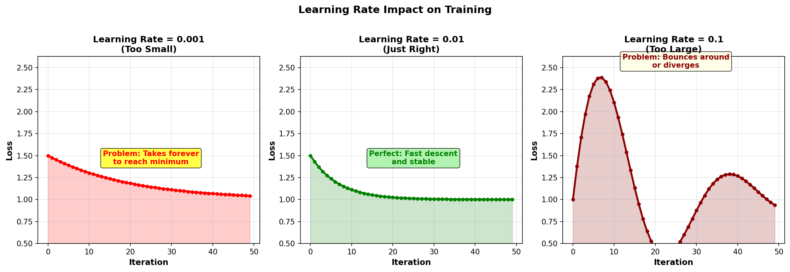

# Learning Rate and Step Size

The learning rate (called `lr` in code) controls **how big a step to take** when updating parameters. It's the most important hyperparameter—get it wrong and training fails.

## What Is Learning Rate?

The update rule from [[Gradient Descent Fundamentals]] is:

$$\text{new weight} = \text{old weight} - \text{learning rate} \times \text{gradient}$$

The **learning rate** is the multiplier. It controls step size.

**Example:**
- Gradient = 0.5
- Learning rate = 0.01
- Update = 0.01 × 0.5 = 0.005 (small step)

vs.

- Gradient = 0.5
- Learning rate = 0.1
- Update = 0.1 × 0.5 = 0.05 (bigger step)

## Three Learning Rate Problems

Learning rates affect your training in three main ways:



### Too Small Learning Rate (α = 0.001)

- Training is **glacially slow**
- Loss decreases but takes forever (thousands of iterations)
- Eventually works, but impractical
- Each step moves by: 0.001 × gradient (tiny!)

**Numerical example:** If gradient = 0.5, step = 0.001 × 0.5 = 0.0005 (barely moves)

**Fix:** Increase learning rate (e.g., 0.001 → 0.01)

### Just Right Learning Rate (α = 0.01)

- Loss decreases **steadily and smoothly**
- Reaches minimum in reasonable time
- Convergence is stable

**Numerical example:** If gradient = 0.5, step = 0.01 × 0.5 = 0.005 (good balance)

**This is what you want.**

### Too Large Learning Rate (α = 0.1)

- **Loss explodes** or becomes NaN
- Parameters jump wildly past the minimum
- Training becomes unstable or crashes

**Numerical example:** If gradient = 0.5, step = 0.1 × 0.5 = 0.05 (too big a jump!)

With momentum, this gets even worse: effective step = 0.1 × 0.5 × (1 + 0.9 + 0.9² + ...) → can diverge

**Fix:** Decrease learning rate (e.g., 0.1 → 0.01)

## How to Choose Learning Rate

Start with a **default value** and adjust based on what you observe:

### Rule: Start Conservative

```python
# Start here
optimizer = torch.optim.SGD(model.parameters(), lr=0.01)

# Train for a few batches and check loss
# If loss is NaN or shoots up → reduce to 0.001
# If loss decreases very slowly → increase to 0.05 or 0.1
```

### Decision Tree

```
1. Train and watch loss

2. Loss becomes NaN?
   → Learning rate too high
   → Reduce by 10× (e.g., 0.1 → 0.01)

3. Loss barely decreases?
   → Learning rate too small
   → Increase (e.g., 0.001 → 0.01)

4. Loss decreases smoothly?
   → Good! Keep training
```

### Typical Values by Optimizer

| Optimizer | Typical LR |
|-----------|-----------|
| Vanilla SGD | 0.01 to 0.1 |
| SGD + Momentum | 0.001 to 0.01 |
| Adam | 0.0001 to 0.001 |

Adam is robust (works across wide range), SGD needs more tuning.

## Learning Rate Schedules: Decay Over Time

In practice, we often **decrease learning rate as training progresses**:

- Start with learning rate = 0.1
- After 50 epochs: learning rate = 0.01
- After 100 epochs: learning rate = 0.001

Why? Early training needs large steps (far from minimum). Late training needs small steps (fine-tuning near minimum).

```python
optimizer = torch.optim.SGD(model.parameters(), lr=0.1)

scheduler = torch.optim.lr_scheduler.StepLR(
    optimizer,
    step_size=50,      # decay every 50 epochs
    gamma=0.1          # multiply by 0.1
)

for epoch in range(100):
    train()
    scheduler.step()  # updates learning rate
```

See [[Learning Rate Schedules]] for decay options (step, exponential, cosine, etc.).

## Momentum Interacts with Learning Rate

When using [[SGD with Momentum|momentum]], the learning rate works differently.

Remember:
```
velocity = 0.9 * velocity + gradient
weight = weight - lr * velocity
```

The velocity **amplifies** the step. So you need a **smaller** learning rate with momentum.

```python
# Vanilla SGD: can use higher lr
optimizer = torch.optim.SGD(model.parameters(), lr=0.1)

# Momentum: use lower lr
optimizer = torch.optim.SGD(model.parameters(), lr=0.01, momentum=0.9)
```

Rule of thumb: **Divide learning rate by 10 when adding momentum.**

## Batch Size and Learning Rate

Larger batches produce less noisy gradients, so you can use **larger** learning rates:

```python
# Small batch (32): use lr=0.001
optimizer = torch.optim.SGD(model.parameters(), lr=0.001)

# Large batch (256): can use larger lr
optimizer = torch.optim.SGD(model.parameters(), lr=0.01)
```

Rough rule: **Learning rate scales with batch size** (bigger batch → bigger steps safe).

## PyTorch Implementation

```python
# Fixed learning rate
optimizer = torch.optim.SGD(model.parameters(), lr=0.01)

# Check current learning rate
print(optimizer.param_groups[0]['lr'])  # prints 0.01

# Change learning rate on the fly
optimizer.param_groups[0]['lr'] = 0.001
```

## Gradient Clipping: Safety for Large Gradients

If gradients explode, learning rate can effectively become huge. Safety mechanism:

```python
# Clip gradients before optimizer step
torch.nn.utils.clip_grad_norm_(model.parameters(), max_norm=1.0)

optimizer.step()
```

This prevents single outlier gradients from destroying training.

## Key Takeaways

1. **Learning rate is critical:** small difference → huge impact
2. **Start with 0.01:** reasonable default for most problems
3. **Adjust based on loss:** diverging → decrease, slow → increase
4. **Decay over time:** start large, end small
5. **Lower with momentum:** momentum amplifies, so use smaller lr
6. **Bigger batch → bigger lr:** noisier gradients need careful tuning

## See Also

- [[Stochastic Gradient Descent (SGD)]]: How learning rate is used
- [[SGD with Momentum]]: How momentum changes effective learning rate
- [[Adam]]: Robust to learning rate (adaptive)
- [[Learning Rate Schedules]]: Decay strategies
- [[Convergence Criteria]]: Signs that learning rate is wrong
