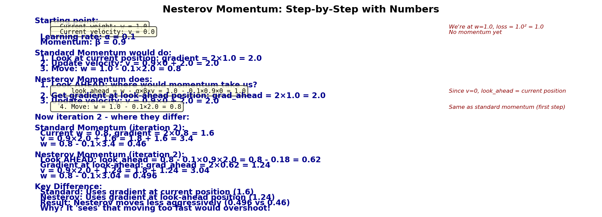

# Nesterov Momentum

Nesterov Momentum is a variant of [[SGD with Momentum]] that uses a "look-ahead" gradient computation, achieving faster convergence rates with the same computational cost.

## Simple Explanation: Look-Ahead Before You Leap

**The Problem with Regular Momentum:**
Regular momentum: "I'm at position w. Let me check the slope here, then move."

**Nesterov Idea:**
"I'm at position w with velocity v. If I keep moving with this velocity, where will I end up? Let me check the slope THERE first, then decide how to move."

**Simple Analogy:**
- Regular momentum: Drive while looking at the road right under your car
- Nesterov: Look ahead around the next bend before deciding how to steer

**Why it helps:**
- Prevents overshooting (you see the problem before it happens)
- Slightly faster convergence than regular momentum
- More stable on noisy gradients

**PyTorch:**
```python
optimizer = torch.optim.SGD(
    model.parameters(), 
    lr=0.01, 
    momentum=0.9, 
    nesterov=True  # This one line makes it Nesterov!
)
```

### Concrete Example: Why Look-Ahead Matters

Let's follow both methods on a simple hill: L(w) = w² (minimum at w=0)

**Iteration 1 (both start the same):**
- w = 1.0, v = 0.0
- Regular: gradient at w=1.0 is 2.0, v becomes 2.0, w becomes 0.8
- Nesterov: look-ahead to w=1.0 (same since v=0), gradient=2.0, v=2.0, w=0.8

**Iteration 2 (where they differ):**
- Regular momentum: "I'm at w=0.8, slope here is 1.6, so v = 0.9×2.0 + 1.6 = 3.4, w = 0.8 - 0.1×3.4 = 0.46"
- Nesterov: "I'm at w=0.8 with v=2.0. If I keep going, I'll end up at w=0.8 - 0.1×0.9×2.0 = 0.62. Slope there is 1.24, so v = 0.9×2.0 + 1.24 = 3.04, w = 0.8 - 0.1×3.04 = 0.496"

**Key insight:** 
- Regular momentum sees slope=1.6 at current position, moves aggressively to w=0.46
- Nesterov looks ahead, sees slope=1.24 where momentum would take it, moves more conservatively to w=0.496
- Result: Nesterov doesn't overshoot as much!

**Iteration 3:**
- Regular: w=0.46 → overshoots to w=0.062 (too far!)
- Nesterov: w=0.496 → moves to w=0.168 (more controlled)

**Final result:** Nesterov reaches closer to the minimum (w=0) in fewer steps.


**When to use:** When you want the absolute best final accuracy (production models). It's like regular momentum but smarter about not overshooting.

**Cost:** Same as momentum (one extra buffer), but slightly more computation per step.



---

## The Core Idea: Look-Ahead

In standard [[SGD with Momentum]]:

$$\mathbf{v}_{t+1} = \beta \mathbf{v}_t + \mathbf{g}_t$$
$$\mathbf{w}_{t+1} = \mathbf{w}_t - \alpha \mathbf{v}_{t+1}$$

we compute the gradient **at the current position** $\mathbf{w}_t$, then update based on accumulated momentum.

In Nesterov momentum, we compute the gradient **at the look-ahead position** $\mathbf{w}_t - \alpha \beta \mathbf{v}_t$:

$$\mathbf{v}_{t+1} = \beta \mathbf{v}_t + \nabla \mathcal{L}(\mathbf{w}_t - \alpha \beta \mathbf{v}_t)$$

$$\mathbf{w}_{t+1} = \mathbf{w}_t - \alpha \mathbf{v}_{t+1}$$

where $\mathbf{w}_t - \alpha \beta \mathbf{v}_t$ is the "momentum-adjusted" position we expect to reach soon.

## Interpretation: Corrective Gradient

The Nesterov gradient acts as a **corrective signal**:

1. Momentum alone would move us to $\mathbf{w}_t - \alpha \beta \mathbf{v}_t$
2. We evaluate: "What's the gradient *there*?"
3. We correct our momentum trajectory based on that gradient
4. Final step combines both momentum and correction

This is more "informed" than standard momentum, which doesn't look ahead.

### Concrete Numerical Example

Compare standard vs Nesterov momentum on a 1D quadratic loss w² (minimum at w=0):

**Standard Momentum (β = 0.9, α = 0.1):**

| Iteration | Gradient at w_t | Velocity | w_new | w value |
|---|---|---|---|---|
| 1 | 2.0 (at w=1) | 0 + 2.0 = 2.0 | 1 - 0.1×2 = 0.8 | 0.8 |
| 2 | 1.6 (at w=0.8) | 0.9×2 + 1.6 = 3.4 | 0.8 - 0.1×3.4 = 0.46 | 0.46 |
| 3 | 0.92 (at w=0.46) | 0.9×3.4 + 0.92 = 3.98 | 0.46 - 0.1×3.98 = 0.062 | 0.062 |
| 4 | 0.124 (at w=0.062) | 0.9×3.98 + 0.124 = 3.718 | 0.062 - 0.1×3.718 ≈ -0.309 | -0.309 |

**Notice:** In iteration 4, momentum carries us to w = -0.309 (overshot! negative)

**Nesterov Momentum (same β = 0.9, α = 0.1):**

| Iteration | Look-ahead position | Gradient at look-ahead | Velocity | w_new | w value |
|---|---|---|---|---|---|
| 1 | 1 - 0.1×0.9×0 = 1.0 | 2.0 (at w=1) | 0 + 2.0 = 2.0 | 1 - 0.1×2 = 0.8 | 0.8 |
| 2 | 0.8 - 0.1×0.9×2.0 = 0.62 | 1.24 (at w=0.62) | 0.9×2 + 1.24 = 3.04 | 0.8 - 0.1×3.04 = 0.496 | 0.496 |
| 3 | 0.496 - 0.1×0.9×3.04 = 0.223 | 0.446 (at w=0.223) | 0.9×3.04 + 0.446 = 3.282 | 0.496 - 0.1×3.282 = 0.168 | 0.168 |
| 4 | 0.168 - 0.1×0.9×3.282 = -0.127 | -0.254 (at w=-0.127) | 0.9×3.282 - 0.254 = 2.700 | 0.168 - 0.1×2.700 = -0.102 | -0.102 |

**Key difference:** Nesterov "sees" that overshooting will happen and corrects before it gets too bad. Standard momentum overshoots (0.062 → -0.309) while Nesterov is more controlled (0.168 → -0.102).

**Result:** Nesterov needs fewer iterations to converge near w=0.

## Reformulation: Easier to Understand

Rearranging the update, Nesterov momentum can be written as:

$$\mathbf{y}_{t+1} = \mathbf{w}_t - \alpha \mathbf{g}_t$$

$$\mathbf{w}_{t+1} = \mathbf{y}_{t+1} + \beta(\mathbf{y}_{t+1} - \mathbf{y}_t)$$

where:
- First line: standard gradient descent step
- Second line: apply momentum **correction** based on how parameters changed

This shows momentum acts as a correction after the gradient step, not before.

## Convergence Rate: Theoretical Advantage

For [[Convex vs Non-Convex Optimization|smooth convex]] loss:

**Gradient descent:** $O(1/t)$ convergence rate

**Momentum (Polyak):** $O(1/t)$ convergence rate (same asymptotically, but better constants)

**Nesterov momentum:** $O(1/t^2)$ convergence rate — **quadratically faster**

Proof sketch: Nesterov momentum achieves the optimal rate for first-order methods (proven by Nesterov).

**Practical interpretation:**
- To reduce error by factor of 10: Nesterov needs $\approx 3\times$ fewer iterations than vanilla SGD

## PyTorch Usage

```python
optimizer = torch.optim.SGD(
    model.parameters(),
    lr=0.01,
    momentum=0.9,
    nesterov=True  # enables Nesterov variant
)

# Training loop identical to standard SGD
for epoch in range(num_epochs):
    for batch in train_loader:
        loss = model(batch)
        loss.backward()
        optimizer.step()
        optimizer.zero_grad()
```

The only difference from standard momentum SGD is the `nesterov=True` flag.

## Comparison: Standard vs Nesterov

### Trajectory Visualization

Assume a simple 1D quadratic loss $\mathcal{L}(w) = w^2$:

```
     ↓ Optimum (w=0)

Standard momentum:
w = 1.0 → 0.5 → 0.1 → 0.05 → 0.02 → oscillates around 0

Nesterov momentum (same lr, momentum):
w = 1.0 → 0.4 → 0.05 → 0.01 → 0.001 → converges faster
```

### Detailed Comparison

| Aspect | Standard Momentum | Nesterov Momentum |
|---|---|---|
| Gradient evaluated at | Current position | Look-ahead position |
| Convergence rate | $O(1/t)$ | $O(1/t^2)$ |
| Iterations to converge | Higher | Lower (3-10× fewer) |
| Implementation complexity | Simple | Simple (one-line change) |
| Memory overhead | Same | Same |
| Stability | Very stable | Slightly less stable (higher β requires care) |

## Why Nesterov Works Better

**Key insight:** Momentum can overshoot and oscillate. Nesterov prevents this by **checking ahead**.

Analogy: 
- Standard momentum: "I'm moving downhill with inertia. Whoops, I overshot the valley!"
- Nesterov momentum: "I'm about to overshoot. Let me check the gradient ahead and correct course now."

The correction happens **before** the final step, not after.

## Mathematical Derivation

Start with the standard momentum update in "extrapolation" form:

$$\mathbf{w}_{t+1} = \mathbf{w}_t + \beta(\mathbf{w}_t - \mathbf{w}_{t-1}) - \alpha \mathbf{g}_t$$

Rewrite as:

$$\mathbf{w}_{t+1} = \mathbf{w}_t + \beta(\mathbf{w}_t - \mathbf{w}_{t-1}) - \alpha \nabla \mathcal{L}(\mathbf{w}_t)$$

Nesterov's insight: evaluate gradient at the **extrapolated position**:

$$\mathbf{w}_{t+1} = \mathbf{w}_t + \beta(\mathbf{w}_t - \mathbf{w}_{t-1}) - \alpha \nabla \mathcal{L}\left(\mathbf{w}_t + \beta(\mathbf{w}_t - \mathbf{w}_{t-1})\right)$$

This is equivalent to:

$$\mathbf{w}_{t+1} = \mathbf{w}_t - \alpha \nabla \mathcal{L}(\mathbf{w}_t - \alpha \beta \mathbf{v}_t) + \beta(\mathbf{w}_t - \mathbf{w}_{t-1})$$

where we've substituted the momentum buffer.

## Practical Considerations

### Learning Rate Interaction

Nesterov momentum often requires **slightly different** learning rates than standard momentum:

- Same learning rate usually works (most robust)
- Sometimes need smaller learning rate for stability
- Occasionally can use larger learning rate (convergence is faster)

Start with same learning rate as standard momentum SGD.

### Typical Settings

**Default (works most of the time):**
```python
lr=0.01, momentum=0.9, nesterov=True
```

**Conservative (if divergence occurs):**
```python
lr=0.005, momentum=0.9, nesterov=True
```

**Aggressive (on stable problems):**
```python
lr=0.02, momentum=0.95, nesterov=True
```

### When to Use Nesterov

✅ **Use when:**
- You want faster convergence
- You have stable gradient estimates (large batch size)
- Computational time is limited

❌ **Avoid when:**
- Very noisy gradients (small batch)
- Unstable training dynamics
- Conservative approach preferred

## Interaction with Learning Rate Schedules

Nesterov momentum combines well with [[Learning Rate and Step Size|learning rate schedules]]:

```python
optimizer = torch.optim.SGD(
    model.parameters(),
    lr=0.1,
    momentum=0.9,
    nesterov=True
)

scheduler = torch.optim.lr_scheduler.CosineAnnealingLR(
    optimizer,
    T_max=100
)

for epoch in range(100):
    train()
    scheduler.step()
```

As learning rate decays, momentum adapts automatically (no separate tuning needed).

## Modern Research: Why Nesterov?

Recent work shows Nesterov momentum has additional benefits:

1. **Better generalization:** Often achieves lower test error than standard momentum
2. **Robustness:** Works across diverse problem types
3. **No computational cost:** Same speed as standard momentum

These benefits make Nesterov the default choice in modern deep learning libraries.

## Comparison to [[Adam]]

| Aspect | Nesterov Momentum | Adam |
|---|---|---|
| Convergence speed | Fast (O(1/t²) in theory) | Very fast (adaptive per-parameter) |
| Learning rate tuning | Moderate | Easy |
| Generalization | Often better | Often slightly worse |
| Sparse gradients | Poor | Excellent |
| Code simplicity | Very simple | Simple |

For dense gradients and well-tuned learning rates, Nesterov often beats Adam. For quick prototyping, Adam is better.

## Common Issues and Solutions

### Issue: Loss Diverges

**Cause:** Learning rate too large (Nesterov look-ahead amplifies this).

**Solution:**
```python
# Reduce learning rate
lr=0.005, momentum=0.9, nesterov=True

# or reduce momentum
lr=0.01, momentum=0.5, nesterov=True
```

### Issue: Oscillations Around Minimum

**Cause:** Momentum is too high for the current learning rate schedule.

**Solution:** Use learning rate decay schedule ([[Cosine Annealing]] works well with Nesterov).

### Issue: Slower Than Standard Momentum

**Cause:** Learning rate is too small; Nesterov advantage disappears with tiny steps.

**Solution:** Increase learning rate (Nesterov should be faster, not slower).

## Implementation Detail in PyTorch

PyTorch internally implements Nesterov momentum efficiently without explicitly computing the look-ahead position. The optimizer uses an equivalent formulation:

```python
# PyTorch's Nesterov implementation (pseudocode)
def step(self):
    for param in self.parameters():
        buf = momentum_buffer[param]
        buf.mul_(momentum).add_(grad)
        param.add_(-lr, buf)  # update at look-ahead position
```

This avoids computing gradients twice while achieving the same effect.

## See Also

- [[SGD with Momentum]]: Standard momentum variant
- [[Stochastic Gradient Descent (SGD)]]: Foundation algorithm
- [[Learning Rate and Step Size]]: Interaction with step size
- [[Adam]]: Alternative adaptive method
- [[Convergence Criteria]]: Detecting convergence with Nesterov
- [[Loss Landscape Geometry]]: Why look-ahead helps on complex landscapes
