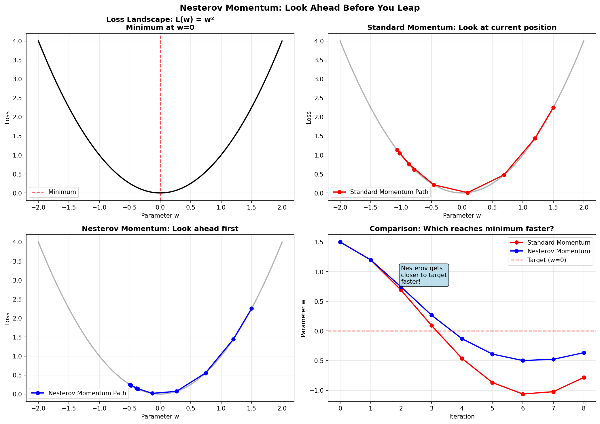
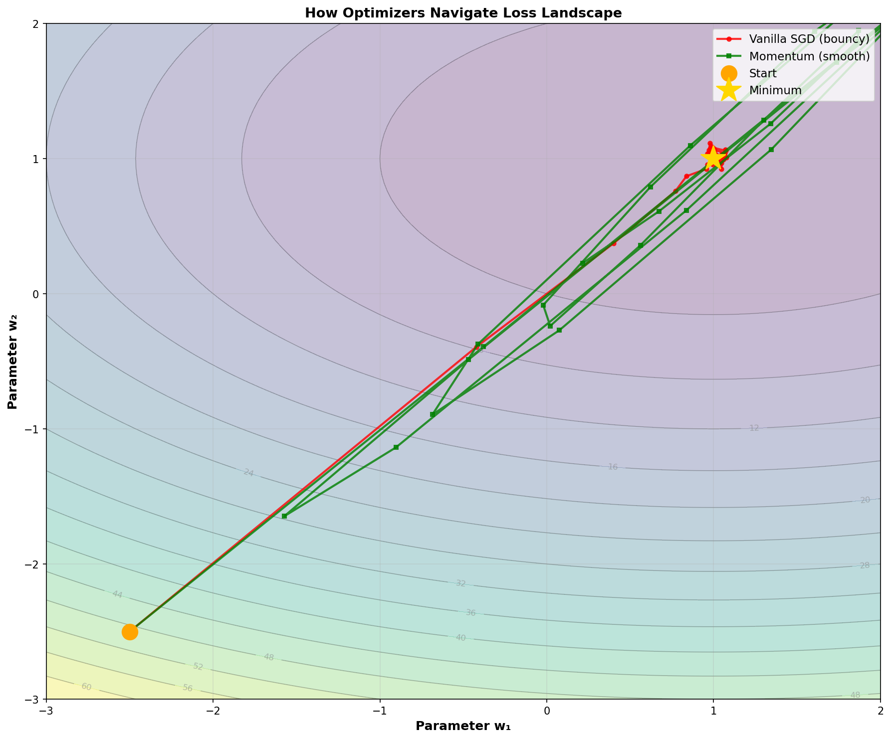
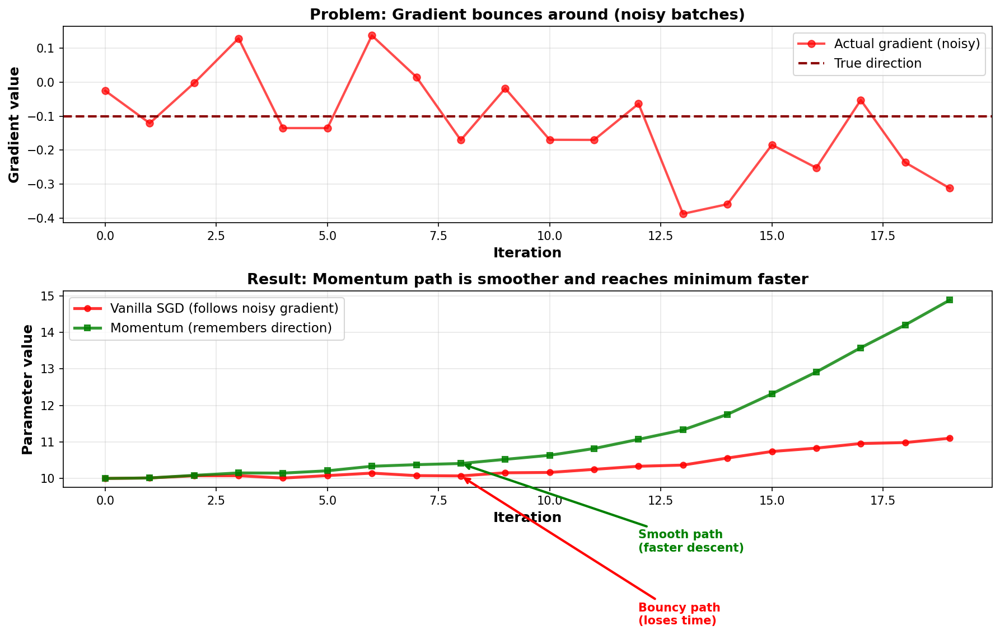

# SGD Variants: Momentum Extensions

This note explains different versions of [[Stochastic Gradient Descent (SGD)]] that make training faster and more stable.

## Why We Need Variants

Basic [[Stochastic Gradient Descent (SGD)|SGD]] has two problems:

1. **Slow:** Takes too many iterations to train
2. **Noisy:** The gradient bounces around because we use batches, not all data

Variants fix these by remembering past gradients. The key idea: **use history to make better decisions**.

## Three Main Variants (Simple Explanation)

### 1. Vanilla SGD (No Memory)

Just follow the current gradient. No memory of past steps.

```
w = w - α * gradient
```

- ✅ Simple
- ❌ Bounces around a lot (slow)
- ❌ Need very careful learning rate tuning

**When to use:** Almost never in practice. Only for understanding basics.

### 2. Momentum (Remember the Direction)

Remember which direction you've been moving, and keep moving that way.

**Analogy:** You're on a skateboard going downhill. You have momentum. Even if the ground gets bumpy, you keep rolling forward.

```
velocity = 0.9 * velocity + gradient
w = w - α * velocity
```

What this does:
- `0.9 * velocity`: remember past direction (90% of old direction)
- `+ gradient`: add today's information (10% of new gradient)
- Result: smoother, more consistent movement downhill

**Benefits:**
- 2-10× faster than vanilla SGD
- Smoother training (bounces less)
- Handles noise better

**Cost:**
- One extra buffer per parameter (not much)
- Need to tune momentum coefficient (usually 0.9)

**When to use:** Standard training (CNNs, ResNets, etc.)

**PyTorch:**
```python
optimizer = torch.optim.SGD(model.parameters(), lr=0.01, momentum=0.9)
```

### 3. [[Nesterov Momentum]] (Look-Ahead)

Like momentum, but we "look ahead" before deciding which way to move.

**The Problem with Regular Momentum:**
Regular momentum: "I'm at position w. Let me check the slope here, then move."

**Nesterov Idea:**
"I'm at position w with velocity v. If I keep moving with this velocity, where will I end up? Let me check the slope THERE first, then decide how to move."

**Simple Analogy:**
- Regular momentum: Drive while looking at the road right under your car
- Nesterov: Look ahead around the next bend before deciding how to steer

**Why it helps:**
- Prevents overshooting (you see the problem before it happens)
- Slightly faster convergence than regular momentum
- More stable on noisy gradients

**PyTorch:**
```python
optimizer = torch.optim.SGD(
    model.parameters(), 
    lr=0.01, 
    momentum=0.9, 
    nesterov=True  # This one line makes it Nesterov!
)
```

### Concrete Example: Why Look-Ahead Matters

Let's follow both methods on a simple hill: L(w) = w² (minimum at w=0)

**Iteration 1 (both start the same):**
- w = 1.0, v = 0.0
- Regular: gradient at w=1.0 is 2.0, v becomes 2.0, w becomes 0.8
- Nesterov: look-ahead to w=1.0 (same since v=0), gradient=2.0, v=2.0, w=0.8

**Iteration 2 (where they differ):**
- Regular momentum: "I'm at w=0.8, slope here is 1.6, so v = 0.9×2.0 + 1.6 = 3.4, w = 0.8 - 0.1×3.4 = 0.46"
- Nesterov: "I'm at w=0.8 with v=2.0. If I keep going, I'll end up at w=0.8 - 0.1×0.9×2.0 = 0.62. Slope there is 1.24, so v = 0.9×2.0 + 1.24 = 3.04, w = 0.8 - 0.1×3.04 = 0.496"

**Key insight:** 
- Regular momentum sees slope=1.6 at current position, moves aggressively to w=0.46
- Nesterov looks ahead, sees slope=1.24 where momentum would take it, moves more conservatively to w=0.496
- Result: Nesterov doesn't overshoot as much!

**Iteration 3:**
- Regular: w=0.46 → overshoots to w=0.062 (too far!)
- Nesterov: w=0.496 → moves to w=0.168 (more controlled)

**Final result:** Nesterov reaches closer to the minimum (w=0) in fewer steps.



**When to use:** When you want the absolute best final accuracy (production models). It's like regular momentum but smarter about not overshooting.

**Cost:** Same as momentum (one extra buffer), but slightly more computation per step.


## Simple Comparison Table

| Variant | Update | Speed | Smoothness | Use When |
|---------|--------|-------|-----------|----------|
| Vanilla SGD | Follow gradient | Slow | Bouncy | Learning only |
| Momentum | Remember direction | Fast | Smooth | Standard training |
| Nesterov | Look ahead + remember | Fastest | Smoothest | Production |

## Visual Comparison: How They Move Downhill



## Momentum Coefficient (Beta): What It Controls

The momentum coefficient is usually called $\beta$ or `momentum`:

```
velocity = β * velocity + gradient
```

**What does $\beta$ do?**

- $\beta = 0$: No momentum (vanilla SGD)
- $\beta = 0.5$: Light momentum (remember 50% of past)
- $\beta = 0.9$: Standard momentum (remember 90% of past)
- $\beta = 0.99$: Heavy momentum (remember 99% of past)

### Concrete Numerical Example

Let's see how momentum accumulates step by step:

**Iteration 1:**
- gradient = 0.2 (slope tells us to move in direction 0.2)
- velocity = 0.9 × 0 + 0.2 = 0.2
- w = w - 0.1 × 0.2 = w - 0.02

**Iteration 2:**
- gradient = -0.15 (noise! points different direction)
- velocity = 0.9 × 0.2 + (-0.15) = 0.18 - 0.15 = 0.03 (still mostly downhill!)
- w = w - 0.1 × 0.03 = w - 0.003 (small adjustment because momentum remembered direction)

**Iteration 3:**
- gradient = 0.25 (noise again!)
- velocity = 0.9 × 0.03 + 0.25 = 0.027 + 0.25 = 0.277
- w = w - 0.1 × 0.277 = w - 0.0277 (building speed!)

**Key insight:** Even though gradients bounce (-0.15, 0.25), velocity stays consistent (0.2 → 0.03 → 0.277 all positive). Momentum filters out noise.

Compare to vanilla SGD (β=0):
- Iteration 2 would move opposite: w = w - 0.1 × (-0.15) = w + 0.015 (wrong direction!)
- Momentum prevents this by remembering the overall downhill trend.



**Higher $\beta$:**
- Smoother, more stable training
- But slower to change direction
- Can overshoot if learning rate is high

**Lower $\beta$:**
- Faster response to changes
- More bouncy
- More sensitive to learning rate

**Rule of thumb:** Start with $\beta = 0.9$. Increase if bouncy, decrease if stuck.

```python
# Standard
optimizer = torch.optim.SGD(model.parameters(), lr=0.01, momentum=0.9)

# More momentum (smoother, slower)
optimizer = torch.optim.SGD(model.parameters(), lr=0.01, momentum=0.95)

# Less momentum (faster response, noisier)
optimizer = torch.optim.SGD(model.parameters(), lr=0.01, momentum=0.8)
```

## Learning Rate with Momentum

**Important:** When you add momentum, you need to **reduce learning rate**.

Why? Momentum amplifies the step size. Let's see numerically:

**Without momentum (α = 0.1):**
- velocity = 0 (no history)
- Update = 0.1 × 0.5 = 0.05
- w changes by 0.05 each step

**With momentum (α = 0.1, β = 0.9):**
- Iteration 1: velocity = 0 + 0.5 = 0.5, Update = 0.1 × 0.5 = 0.05
- Iteration 2: velocity = 0.9 × 0.5 + 0.5 = 0.95, Update = 0.1 × 0.95 = 0.095 (almost 2×!)
- Iteration 3: velocity = 0.9 × 0.95 + 0.5 = 1.355, Update = 0.1 × 1.355 = 0.1355 (2.7×!)

**Effective learning rate with momentum:**
$$\alpha_{\text{eff}} = \frac{\alpha}{1 - \beta}$$

Example: $\alpha = 0.01$, $\beta = 0.9$ gives:
$$\alpha_{\text{eff}} = \frac{0.01}{1 - 0.9} = \frac{0.01}{0.1} = 0.1$$

Your effective step size is **10 times larger**! If you don't reduce α, training diverges.

**Fix:** Divide learning rate by ~10 when adding momentum:

```python
# Vanilla SGD: can use higher learning rate
optimizer = torch.optim.SGD(model.parameters(), lr=0.1)

# Momentum: use lower learning rate
optimizer = torch.optim.SGD(model.parameters(), lr=0.01, momentum=0.9)

# Nesterov: similar to momentum
optimizer = torch.optim.SGD(model.parameters(), lr=0.01, momentum=0.9, nesterov=True)
```


## Real Examples: What to Use

### Training a CNN on CIFAR-10

```python
optimizer = torch.optim.SGD(
    model.parameters(),
    lr=0.1,
    momentum=0.9,
    nesterov=True
)

# After training: ~95% accuracy
```

### Training ResNet on ImageNet (Large Scale)

```python
optimizer = torch.optim.SGD(
    model.parameters(),
    lr=0.1,       # scaled with batch size
    momentum=0.9,
    nesterov=True,
    weight_decay=1e-4  # helps prevent overfitting
)

# After training: ~76% top-1 accuracy
```

### Training Transformer (slower learning)

```python
optimizer = torch.optim.SGD(
    model.parameters(),
    lr=0.001,     # much lower!
    momentum=0.9,
    nesterov=True
)
```

## Comparison to Other Methods

See [[SGD vs Adam: When to Use Which]] for how momentum variants compare to [[Adam]] and other optimizers.

**Quick summary:**
- SGD with momentum: Best final accuracy, but slower iteration
- Adam: Faster convergence, but slightly worse final accuracy
- Choose based on whether speed or accuracy matters more

## Common Mistakes

| Mistake | What Goes Wrong | Fix |
|---------|-----------------|-----|
| Using vanilla SGD lr with momentum | Training diverges | Use lower lr with momentum |
| Momentum too high (0.99) | Gets stuck near minimum | Reduce momentum to 0.9 |
| Momentum but no learning rate schedule | Plateaus early | Add learning rate decay |
| Not adjusting lr when adding momentum | Divergence | Reduce lr (roughly divide by 10) |

## Key Takeaways

1. **Momentum remembers past gradients:** smoother, faster training
2. **Nesterov looks ahead:** slightly better than standard momentum
3. **Both are just SGD + history:** not fundamentally different, just smarter
4. **Learning rate must be lower with momentum:** the amplification requires this
5. **Standard momentum (β=0.9) works for most problems:** good default

## See Also

- [[Stochastic Gradient Descent (SGD)]]: The foundation (learn this first)
- [[SGD with Momentum]]: Deep dive into how momentum works mathematically
- [[Nesterov Momentum]]: The math behind look-ahead
- [[Adam]]: Adaptive alternative (different approach entirely)
- [[Learning Rate and Step Size]]: How learning rate scales with momentum
- [[SGD vs Adam: When to Use Which]]: Decision guide

Pure [[Stochastic Gradient Descent (SGD)|gradient descent]] without memory:

$$\mathbf{w}_{t+1} = \mathbf{w}_t - \alpha \mathbf{g}_t$$

### Characteristics

**Simplicity:**
- Minimal state (no buffers)
- Easy to understand and debug
- Deterministic trajectory from any initialization

**Convergence:**
- Sublinear rate: $O(1/\sqrt{t})$
- Many iterations needed
- Can get stuck oscillating in noisy directions

**Generalization:**
- Often finds flatter minima (good for test accuracy)
- Noise helps escape local minima
- Implicit regularization

**Hyperparameter sensitivity:**
- Learning rate must be chosen carefully
- Too small: glacially slow
- Too large: diverges immediately

### PyTorch

```python
optimizer = torch.optim.SGD(model.parameters(), lr=0.01)
# momentum=0 by default
```

### When to Use

✅ For theoretical analysis (simple)  
✅ When simplicity is paramount  
❌ For practical deep learning (too slow)

See [[Stochastic Gradient Descent (SGD)]].

---

## 2. Momentum (Heavy Ball Method)

### Definition

Accumulate gradient direction with exponential moving average:

$$\mathbf{v}_{t+1} = \beta \mathbf{v}_t + \mathbf{g}_t$$

$$\mathbf{w}_{t+1} = \mathbf{w}_t - \alpha \mathbf{v}_{t+1}$$

where $\beta \in [0, 1)$ is the momentum coefficient (typical: 0.9).

### Characteristics

**Acceleration:**
- Convergence rate improves to $O(1/t)$ (linear in theory)
- 2-10× fewer iterations than vanilla SGD
- Momentum term smooths oscillations

**Noise reduction:**
- Accumulating consistent directions reduces batch noise
- Perpendicular noise cancels out
- Stable convergence trajectory

**Hyperparameter tuning:**
- Still requires learning rate tuning
- Momentum coefficient adds complexity
- Interacts with learning rate (effective $\alpha$ scales with momentum)

### Memory Overhead

One exponential moving average per parameter (same as [[Adam|Adam's]] first moment).

### Effective Learning Rate

The momentum coefficient increases effective step size:

$$\alpha_{\text{eff}} = \frac{\alpha}{1 - \beta}$$

Example: $\alpha = 0.01$, $\beta = 0.9$ gives $\alpha_{\text{eff}} = 0.1$.

When using momentum, use **smaller** learning rates than vanilla SGD.

### PyTorch

```python
optimizer = torch.optim.SGD(
    model.parameters(),
    lr=0.01,
    momentum=0.9
)
```

### Typical Settings

```python
# Conservative (stable training)
lr=0.01, momentum=0.9

# Aggressive (faster convergence)
lr=0.05, momentum=0.95

# RNN/LSTM (lower lr needed)
lr=0.001, momentum=0.9
```

### When to Use

✅ Standard deep learning training  
✅ CNNs, ResNets, standard architectures  
✅ When stability is important  
❌ Very noisy/sparse gradients (use Adam)

See [[SGD with Momentum]].

---

## 3. Nesterov Momentum (Nesterov Accelerated Gradient, NAG)

### Definition

**Look ahead:** Evaluate gradient at a position ahead of current:

$$\mathbf{v}_{t+1} = \beta \mathbf{v}_t + \nabla \mathcal{L}(\mathbf{w}_t - \alpha \beta \mathbf{v}_t)$$

$$\mathbf{w}_{t+1} = \mathbf{w}_t - \alpha \mathbf{v}_{t+1}$$

Instead of gradient at $\mathbf{w}_t$, use gradient at the "momentum-adjusted" position.

### Characteristics

**Convergence rate:**
- Optimal rate for first-order methods: $O(1/t^2)$
- Theoretically better than standard momentum
- Empirically: 3-10% fewer iterations than standard momentum

**Lookahead benefit:**
- Prevents overshoot and oscillation
- Corrects momentum trajectory before updating
- Acts like a "second-order" correction

**Stability:**
- Slightly less stable than standard momentum on noisy data
- Requires careful learning rate tuning
- Often needs lower learning rates

### Implementation Difference

Nesterov is a one-line change in PyTorch:

```python
# Standard momentum
optimizer = torch.optim.SGD(model.parameters(), lr=0.01, momentum=0.9)

# Nesterov momentum
optimizer = torch.optim.SGD(
    model.parameters(),
    lr=0.01,
    momentum=0.9,
    nesterov=True  # only difference
)
```

### Typical Settings

```python
# Similar to standard momentum, maybe slightly lower lr
lr=0.01, momentum=0.9, nesterov=True

# On stable datasets, can use slightly higher momentum
lr=0.01, momentum=0.95, nesterov=True
```

### When to Use

✅ Production models (best final accuracy with SGD)  
✅ Large-scale distributed training  
✅ When you can tune learning rate carefully  
✅ Computer vision benchmarks  
❌ Very noisy gradients (use standard momentum or Adam)

See [[Nesterov Momentum]].

---

## 4. Polyak Averaging

A lighter variant that averages parameters instead of gradients:

$$\overline{\mathbf{w}}_t = \frac{1}{t} \sum_{i=1}^{t} \mathbf{w}_i$$

After training, use the averaged parameters instead of final parameters.

**Characteristics:**
- Sometimes improves generalization
- No overhead during training
- Only adds averaging computation at end
- Less commonly used in modern deep learning

**When to use:**
- As post-processing after any SGD training
- Can provide 1-2% accuracy boost on test set

---

## Comparison Table: Detailed

| Property | Vanilla | Momentum | Nesterov |
|---|---|---|---|
| **Update rule** | $w \leftarrow w - \alpha g$ | $v \leftarrow \beta v + g; w \leftarrow w - \alpha v$ | $v \leftarrow \beta v + \nabla L(w - \alpha \beta v); w \leftarrow w - \alpha v$ |
| **Convergence rate** | $O(1/\sqrt{t})$ | $O(1/t)$ | $O(1/t^2)$ |
| **Memory** | None | 1 buffer | 1 buffer |
| **Iterations needed** | 1000 | 100-200 | 50-150 |
| **Learning rate tuning** | Hard | Medium | Medium-Hard |
| **Generalization** | Good | Good | Excellent |
| **Stability** | Very stable | Stable | Stable* |
| **Best for** | Theory | Standard training | Production |
| **Worst for** | Speed | — | Noisy data |

*Nesterov less stable with very noisy or sparse gradients.

## Interaction with Learning Rate Schedules

All variants work with schedules:

```python
optimizer = torch.optim.SGD(
    model.parameters(),
    lr=0.1,
    momentum=0.9,
    nesterov=True
)

scheduler = torch.optim.lr_scheduler.CosineAnnealingLR(
    optimizer,
    T_max=100
)

for epoch in range(100):
    train()
    scheduler.step()  # updates learning rate
```

Learning rate decays over time; momentum buffer persists.

## Practical Training Recommendations

### For ResNet on CIFAR-10 (Baseline)

```python
optimizer = torch.optim.SGD(
    model.parameters(),
    lr=0.1,
    momentum=0.9,
    nesterov=True,
    weight_decay=1e-4
)

scheduler = torch.optim.lr_scheduler.MultiStepLR(
    optimizer,
    milestones=[100, 150],
    gamma=0.1
)

# Typical result: 95% accuracy
```

### For ResNet on ImageNet (Large Scale)

```python
# Distributed training across 8 GPUs, batch size 256 per GPU
optimizer = torch.optim.SGD(
    model.parameters(),
    lr=0.1,  # scales with batch size
    momentum=0.9,
    nesterov=True,
    weight_decay=1e-4
)

scheduler = torch.optim.lr_scheduler.StepLR(
    optimizer,
    step_size=30,
    gamma=0.1
)

# Typical result: 76% top-1 accuracy
```

### For Vision Transformer (ViT)

```python
# ViTs often use SGD despite being newer
optimizer = torch.optim.SGD(
    model.parameters(),
    lr=0.001,  # much lower for transformers
    momentum=0.9,
    nesterov=True,
    weight_decay=0.0001
)

scheduler = torch.optim.lr_scheduler.CosineAnnealingLR(
    optimizer,
    T_max=100,
    eta_min=1e-5
)
```

## Comparison to Adaptive Methods

| Feature | SGD Momentum | [[Adam]] |
|---|---|---|
| Momentum | Yes | Yes (first moment) |
| Adaptive per-param LR | No | Yes |
| Sparse gradient handling | Poor | Good |
| Generalization | Better | Slightly worse |
| Tuning required | More | Less |
| Default works | Rarely | Often |
| Production use | Very common | Common |

See [[SGD vs Adam: When to Use Which]].

## Evolution: Historical Context

1. **1950s:** Gradient descent (no momentum)
2. **1960s:** Polyak's heavy ball method (momentum)
3. **1983:** Nesterov's accelerated gradient (NAG)
4. **2011:** Adagrad (first adaptive method)
5. **2012:** RMSprop (adaptive momentum)
6. **2014:** Adam (adaptive + momentum)

SGD with momentum remains competitive and is preferred for final model accuracy.

## Hyperparameter Selection Guide

### Learning Rate

| Variant | Typical Range | Starting Point |
|---|---|---|
| Vanilla SGD | $10^{-3}$ to $10^{-1}$ | $0.01$ |
| Momentum | $10^{-3}$ to $0.1$ | $0.01$ |
| Nesterov | $10^{-3}$ to $0.1$ | $0.01$ |

Start conservative, increase if convergence is slow.

### Momentum Coefficient

| Variant | Typical Range | Starting Point |
|---|---|---|
| Standard | $0.5$ to $0.99$ | $0.9$ |
| Nesterov | $0.8$ to $0.99$ | $0.9$ |

Higher values = longer memory = smoother trajectory.

## Common Mistakes

| Mistake | Effect | Fix |
|---|---|---|
| Using SGD momentum lr with vanilla SGD | Training is slow | Increase lr for vanilla SGD |
| Momentum without schedule | Gets stuck near optimum | Add learning rate decay schedule |
| Very high momentum (0.99) with high lr | Divergence | Reduce lr or reduce momentum |
| Forgetting weight decay | Overfitting | Add `weight_decay=1e-4` |

## See Also

- [[Stochastic Gradient Descent (SGD)]]: Foundation
- [[SGD with Momentum]]: Detailed momentum analysis
- [[Nesterov Momentum]]: Detailed Nesterov analysis
- [[Adam]]: Adaptive alternative
- [[Learning Rate and Step Size]]: How to tune learning rates
- [[Learning Rate Schedules]]: Decay schedules
- [[SGD vs Adam: When to Use Which]]: Selection guide
- [[Convergence Criteria]]: Detecting convergence
