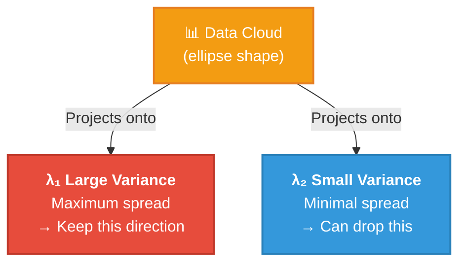

# PCA & EM Algorithm: Theory Notes

Comprehensive guide to concepts, math, and intuition.

---

## PART 1: PRINCIPAL COMPONENT ANALYSIS (PCA)

### Quick Overview

**PCA** is an *unsupervised dimensionality reduction* technique.

- **Goal:** Find new coordinate system where data has maximum variance
- **Result:** Project high-dimensional data onto lower-dimensional subspace while preserving information
- **Examples:** 
  - Images (pixel features) → 2D visualization
  - 1000 gene expressions → 50 principal components
  
**Key Insight:** Variance = Information. Maximize variance → keep important patterns.

---

### 1. The Problem: Why Dimensionality Reduction?

**Dataset structure:** `X` with shape `(n_samples, n_features)`
- `n_samples`: number of data points (rows)
- `n_features`: number of variables/dimensions (columns)

**Why reduce dimensions?**
1. **Visualization:** Can't plot 100D data. PCA → 2D scatter plot
2. **Noise reduction:** Many features might be noise. Keep only important ones
3. **Computation:** ML on 1000 features is slow. PCA → 50 features is faster
4. **Correlation handling:** If features are redundant (correlated), remove redundancy

**Challenge:** Which features matter? Which can we drop?  
**Answer:** PCA finds directions of maximum variance.

---

### 2. The Intuition: Directions of Maximum Variance

Imagine a cloud of 2D points that are slightly elongated (tilted ellipse).



- **λ₁ (principal component 1):** Direction where points spread the **most** (long axis)
- **λ₂ (principal component 2):** Direction of 2nd-most spread (short axis)

If we keep only λ₁ and project points onto this line:
- We lose little information (points already aligned along λ₁)
- Drop λ₂ because it adds little new info (λ₂ ≪ λ₁)

**Why variance matters:**
- High variance = data changes a lot in that direction = likely meaningful signal
- Low variance = little change = likely noise or redundant info

---

### 3. Covariance Matrix: Measuring Spread

Covariance matrix **Σ** (shape: `n_features × n_features`) tells us:
- **Diagonal:** variance of each feature (spread along each axis)
- **Off-diagonal:** covariance between feature pairs (correlation)

**Example with 2 features (Age, Income):**

```
         Age    Income
Age      10       40
Income   40      500
```

**Interpretation:**
- `Var(Age) = 10` — age values spread across range of 10
- `Var(Income) = 500` — income values spread across range of 500
- `Cov(Age, Income) = 40` — age and income tend to increase together

**In PCA context:**
- If `Cov(i, j)` is large → features i and j are redundant (correlated)
- If `Cov(i, j)` is small → features i and j are independent
- PCA works by diagonalizing this matrix (rotating to remove covariance)

**How to compute:**
```python
X_centered = X - X.mean(axis=0)  # Center data
Σ = (X_centered.T @ X_centered) / (n_samples - 1)
# OR
Σ = np.cov(X_centered.T)
```

---

### 4. Eigendecomposition: Finding Directions

**Goal:** Find directions where variance is maximized.  
**Tool:** Eigendecomposition of covariance matrix Σ

**Theory:**

For a covariance matrix Σ:
$$\Sigma \mathbf{v} = \lambda \mathbf{v}$$

Where:
- **v**: eigenvector (direction in feature space)
- **λ**: eigenvalue (variance explained in that direction)

**Interpretation:**
- **Eigenvector v:** the NEW AXIS (direction)
- **Eigenvalue λ:** variance along that axis (larger = more spread)

**Example in 2D:**
```
Σ = [[4, 1],
     [1, 2]]

After decomposition:
λ₁ ≈ 4.37,  v₁ ≈ [0.82, 0.58]    ← Direction of maximum variance
λ₂ ≈ 1.63,  v₂ ≈ [-0.58, 0.82]   ← Direction of 2nd most variance
```

**Geometric meaning:**
- Rotating data coordinates to align with eigenvectors
- Eigenvalues tell us how much variance we recover in each direction
- Keep top-k eigenvectors → keep top-k variance

---

### 5. Dimension Reduction: Selecting Top Components

**Steps:**
1. Compute eigenvalues and eigenvectors of covariance matrix
2. **SORT** by eigenvalue (largest to smallest)
3. **SELECT** top k eigenvectors
4. **PROJECT** data onto these k vectors

**Explained variance:**
- Total variance = sum of all eigenvalues
- Variance explained by component i = $\lambda_i / \sum(\text{all } \lambda)$
- Cumulative explained variance = $(\lambda_1 + \lambda_2 + ... + \lambda_k) / \sum(\text{all } \lambda)$

**Rule of thumb:**
- Keep components that explain ~90-95% of variance
- Example: 100 eigenvalues, keep first 20 if they explain 95% → reduced to 20D

**Why this works:**
- Directions with large λ = data spreads a lot = likely meaningful patterns
- Directions with small λ = little spread = likely noise or constant values
- Remove small-variance directions → noise reduction

---

### 6. Projection: Transforming Data

Once we have top k components (eigenvectors):
$$X_{\text{reduced}} = X_{\text{centered}} @ \text{Components}$$

Where:
- `X_centered`: shape `(n_samples, n_features)`
- `Components`: shape `(n_features, k)` — stacked eigenvectors as columns
- `X_reduced`: shape `(n_samples, k)` — projected data

**Example:**
```
X = [[1, 2],         Components = [[0.82],      X_reduced = [[x₁],
     [3, 4],                       [0.58]]                    [y₁],
     [5, 6]]                                                  [z₁]]
```

**Interpretation:**
- Each row in X_reduced = coordinate in NEW space (space of principal components)
- First column = coordinate along PC1 (direction of max variance)
- Second column = coordinate along PC2, etc.

**Reconstruction (inverse transform):**
$$X_{\text{reconstructed}} = X_{\text{reduced}} @ \text{Components}^T + X_{\text{mean}}$$

- Converts back to original feature space
- Information loss = variance from dropped components

---

### 7. Geometric Intuition: Rotation + Projection

PCA does **TWO things** geometrically:

**1. ROTATION:**
- Original axes: `[Feature A, Feature B]`
- New axes: `[PC1, PC2]`
- Rotation removes correlation (off-diagonal covariance → 0)

**2. PROJECTION:**
- After rotation, drop axes with small variance
- Keep only top k axes
- Result: lower-dimensional representation

**Visual: 3D data → 2D**
```
Original 3D cloud          After PCA (project to plane with 2 largest variances)
     /|
    / |          →         Largest variance diagonal
   /  |
  /   |___                 2nd largest variance
 /    /                   
/_____/
```

---

### 8. Why Covariance Matrix? (Not Correlation)

Both covariance and correlation capture relationships between features.  
PCA typically uses **COVARIANCE** because:

**1. Variance-based interpretation:**
- Eigenvalues of covariance = variance along principal components
- Clear meaning: $\lambda_i$ = total variance in direction $v_i$

**2. Standardization depends on context:**
- **Covariance PCA:** respects original feature scales
  - If one feature has huge range, it dominates
- **Correlation PCA:** all features treated equally
  - Use when features have different units (mm vs meters)

**Default:** Use covariance.  
**Switch to correlation** if features have different scales/units.

---

## PART 2: EXPECTATION-MAXIMIZATION (EM) ALGORITHM

### Quick Overview

**EM** is an iterative algorithm for learning parameters of statistical models when data has **hidden/latent variables**.

**Applied to Gaussian Mixture Model (GMM):**
- **Observed:** Data X (n samples, d features)
- **Hidden:** Which Gaussian component each sample belongs to?
- **Learn:** Means, covariances, mixing weights of K Gaussians

**Key Insight:** Alternate between:
- **E-step:** Guess which component each point belongs to (responsibilities)
- **M-step:** Update component parameters based on guesses
- **Repeat** until convergence

---

### 1. The Problem: Clustering with Unknown Distributions

**Hard clustering (K-means):** Assign each point to exactly one cluster.
- Problem: Real data is fuzzy. Points near cluster boundary are ambiguous.

**Soft clustering (EM/GMM):** Assign each point with **PROBABILITY**.
- Point near center of cluster 1 → 90% cluster 1, 10% cluster 2
- Point on boundary → 50% cluster 1, 50% cluster 2

**EM benefits:**
1. **Probabilistic:** Get confidence, not just assignments
2. **Generative:** Can generate new samples from learned model
3. **Handles uncertainty:** Don't force hard boundaries

---

### 2. Gaussian Mixture Model (GMM): The Model

A **GMM** says: Data is generated by K Gaussian distributions mixed together.

**Parameters to learn:**
- **μₖ:** Mean of cluster k (shape: d features)
- **Σₖ:** Covariance of cluster k (shape: d × d matrix)
- **πₖ:** Mixing weight (probability of picking cluster k)
- **Constraint:** $\pi_1 + \pi_2 + ... + \pi_k = 1$

**Generative process for one sample:**
1. Pick cluster z ∈ {1, ..., K} with probability πz
2. Sample x ~ N(μz, Σz)
3. Observe x (we see this)
4. z is **HIDDEN** (we don't see which cluster it came from)

**Our job:** Observe X, infer z for each point, and estimate μ, Σ, π

---

### 3. Likelihood and the Goal

**Likelihood** of observing data X given parameters θ = (μ, Σ, π):

$$P(X|\theta) = \prod_i P(x_i|\theta) = \prod_i \sum_k \pi_k \cdot N(x_i | \mu_k, \Sigma_k)$$

Where:
- $\prod_i$: Product over all n samples
- $\sum_k$: Sum over all K components (marginalize out hidden z)
- $N(x|\mu,\Sigma)$: Gaussian probability density

**Goal:** Find θ that maximizes this likelihood (Maximum Likelihood Estimation).

**Why EM?** Direct maximization is hard because of hidden z.  
**EM:** Clever alternating approach.

---

### 4. The EM Algorithm: Intuition

**Challenge:** We have hidden variables (cluster assignments z).
- If we knew z → ML estimation is easy (just compute sample means, covariances)
- But we don't know z → **chicken-and-egg problem**

**EM Solution:** Alternate between two steps:

**E-STEP (Expectation):**
- Assume current parameters θ are correct
- Estimate hidden z for each sample (responsibility: probability of belonging to each cluster)
- "Fill in" missing data with expectations

**M-STEP (Maximization):**
- Assume estimated z is correct
- Compute new parameters θ that maximize likelihood given these z values
- Update μ, Σ, π

**Repeat** until convergence (likelihood stabilizes).

**Guarantee:** Likelihood never decreases (monotonic improvement).

---

### 5. E-Step: Computing Responsibilities

**Responsibility:** $r_{ik}$ = probability that sample i belongs to cluster k

**Formula:**
$$r_{ik} = \frac{\pi_k \cdot N(x_i | \mu_k, \Sigma_k)}{\sum_j(\pi_j \cdot N(x_i | \mu_j, \Sigma_j))}$$

**Interpretation:**
- **Numerator:** probability of observing xᵢ from cluster k = mixing weight πₖ × Gaussian likelihood
- **Denominator:** total probability (marginalizing over all clusters)
- **Result:** normalized probability (sum over k = 1 for each i)

**Algorithm:**
1. Compute likelihoods: $L_{ik} = N(x_i | \mu_k, \Sigma_k)$ for all i, k
2. Weight by mixing: $L_{ik} = \pi_k \cdot L_{ik}$
3. Normalize: $r_{ik} = L_{ik} / \sum_j L_{ij}$

**Shapes:**
- **Likelihoods:** `(n_samples, n_components)`
- **Responsibilities:** `(n_samples, n_components)` — each row sums to 1

**Intuition:**
- High responsibility (e.g., 0.95) = sample firmly in this cluster
- Low responsibility (e.g., 0.05) = sample unlikely from this cluster
- Sum to 1 = soft assignment (probabilistic)

---

### 6. M-Step: Updating Parameters

Given responsibilities $r_{ik}$, update parameters to maximize likelihood.

**Effective count** (how many samples "assigned" to cluster k):
$$N_k = \sum_i r_{ik}$$
(soft count, since responsibilities are fractional)

**Update mean μₖ:**
$$\mu_k = \frac{\sum_i r_{ik} \cdot x_i}{N_k}$$

- **Interpretation:** Weighted average of samples, weighted by responsibility
- **Intuition:** Samples with high responsibility to cluster k pull μₖ toward them

**Update covariance Σₖ:**
$$\Sigma_k = \frac{\sum_i r_{ik} \cdot (x_i - \mu_k)(x_i - \mu_k)^T}{N_k}$$

- **Interpretation:** Weighted covariance matrix
- **Intuition:** Points far from μₖ but with high responsibility increase Σₖ

**Update mixing weight πₖ:**
$$\pi_k = \frac{N_k}{n\_samples}$$

- **Interpretation:** Fraction of data (soft) in cluster k
- **Intuition:** If many points assigned (softly) to cluster k, increase πₖ

---

### 7. Convergence: When to Stop

EM is iterative. How do we know when to stop?

**Option 1: Fixed iterations**
- Run E-step and M-step for fixed `max_iter` (e.g., 100)

**Option 2: Monitor log-likelihood**
- Compute log P(X|θ) after each M-step
- Stop if change < tolerance (e.g., 1e-4)

**Log-likelihood:**
$$LL = \sum_i \log\left(\sum_k \pi_k \cdot N(x_i | \mu_k, \Sigma_k)\right)$$

**Why log?**
- Numerically stable (products become sums)
- Monotonically non-decreasing (EM always improves it)
- Easy threshold check: $|LL_{\text{new}} - LL_{\text{old}}| < tol$

**Typical stopping:**
```python
for iteration in range(max_iter):
    responsibilities = e_step()
    m_step(responsibilities)
    
    ll_new = compute_log_likelihood()
    if abs(ll_new - ll_old) < tol:
        break
    ll_old = ll_new
```

---

### 8. EM vs K-Means

Both find cluster centers, but differently:

**K-MEANS (hard clustering):**
- **E-step:** Assign each point to nearest center (hard assignment)
- **M-step:** Update center as mean of assigned points
- No probabilities, no mixing weights
- Faster, simpler, but less interpretable

**EM/GMM (soft clustering):**
- **E-step:** Compute responsibility (probability of belonging to each cluster)
- **M-step:** Update parameters considering all clusters (weighted)
- Probabilistic interpretation: can compute confidence
- Slower, but more principled and flexible

**Trade-off:**
- **K-means:** Fast, interpretable (crisp clusters)
- **EM/GMM:** Probabilistic, handles uncertainty, more flexible

---

### 9. The Key Difference: Hard vs Soft

**Example:** 3 clusters (K=3), 100 points

**K-MEANS:**
- Cluster assignment = {0, 1, 2}
- Point i → cluster zᵢ ∈ {0, 1, 2} (one choice)
- Example: zᵢ = 1 (point is in cluster 1, period)

**EM/GMM:**
- Cluster responsibilities = probabilities
- Point i → responsibility vector `[rᵢ₁, rᵢ₂, rᵢ₃]`
- Example: `[0.05, 0.90, 0.05]` (90% cluster 1, 5% each other cluster)

**When computing new means:**
- **K-means:** μ_new = mean of points assigned to cluster k
- **EM:** μ_new = weighted mean, weighted by responsibility

This matters when points are near cluster boundaries!

---

### 10. Degeneracies and Issues

EM can fail or get stuck:

**1. Singular covariance matrix:**
- If all points assigned to one cluster, Σ might be singular (non-invertible)
- Fix: Add regularization (small λ*I to diagonal), or re-initialize

**2. Local optima:**
- EM converges to local max, not global max
- Fix: Try multiple random initializations, pick best likelihood

**3. Empty clusters:**
- A cluster might get no responsibility (Nₖ → 0)
- μₖ, Σₖ become degenerate
- Fix: Re-initialize, or merge empty clusters

**4. Poor initialization:**
- Starting from bad means → bad convergence
- Fix: Use k-means++ or careful random sampling

**5. Overfitting:**
- K too large → model explains noise
- Fix: Use information criteria (AIC, BIC) to select K

---

## COMPARISON & DECISION TREE

**When to use PCA vs EM/GMM?**

| Task | Method |
|------|--------|
| Visualize high-dimensional data | PCA (reduce to 2D/3D for plotting) |
| Find clusters / soft assignments | EM/GMM (unsupervised clustering) |
| Reduce dimensionality for ML | PCA (reduce features before regression) |
| Density estimation | EM/GMM (learn generative model) |
| Remove correlated features | PCA (rotate to uncorrelated coordinates) |
| Anomaly detection | EM/GMM (identify low-likelihood points) |

---

## Key Formulas Summary

### PCA

$$\Sigma = \frac{1}{n-1} X_{\text{centered}}^T @ X_{\text{centered}}$$

$$\Sigma = V \cdot \Lambda \cdot V^T$$

$$X_{\text{new}} = X_{\text{centered}} @ V_{:, :k}$$

$$\text{Explained variance ratio} = \frac{\lambda_k}{\sum(\text{all } \lambda)}$$

### EM/GMM

$$P(x_i | \mu_k, \Sigma_k) = N(x_i | \mu_k, \Sigma_k)$$

$$r_{ik} = \frac{\pi_k \cdot P(x_i|\mu_k,\Sigma_k)}{\sum_j(\pi_j \cdot P(x_i|\mu_j,\Sigma_j))}$$

$$N_k = \sum_i r_{ik}$$

$$\mu_k = \frac{\sum_i(r_{ik} \cdot x_i)}{N_k}$$

$$\Sigma_k = \frac{\sum_i(r_{ik} \cdot (x_i-\mu_k)(x_i-\mu_k)^T)}{N_k}$$

$$\pi_k = \frac{N_k}{n\_samples}$$

$$LL = \sum_i \log\left(\sum_k \pi_k \cdot N(x_i|\mu_k,\Sigma_k)\right)$$

---

## Intuitive Mental Models

**PCA in one sentence:**  
"Find the directions where data stretches the most, and keep only those."

**EM/GMM in one sentence:**  
"Guess which cluster each point belongs to, then update clusters based on guesses."

**PCA analogy:**  
Imagine a cloud of dust particles. PCA asks: "What's the main direction this cloud is elongated?" That's your principal component.

**EM/GMM analogy:**  
You have a bag of marbles with hidden color labels. You see only the marbles, not their colors. EM asks: "What color distribution would best explain the marble arrangements I see?" It iteratively updates color probabilities.
