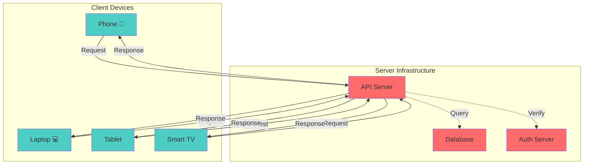
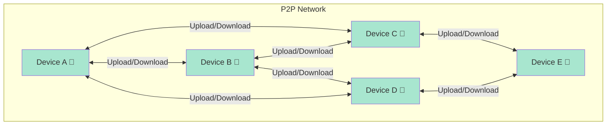
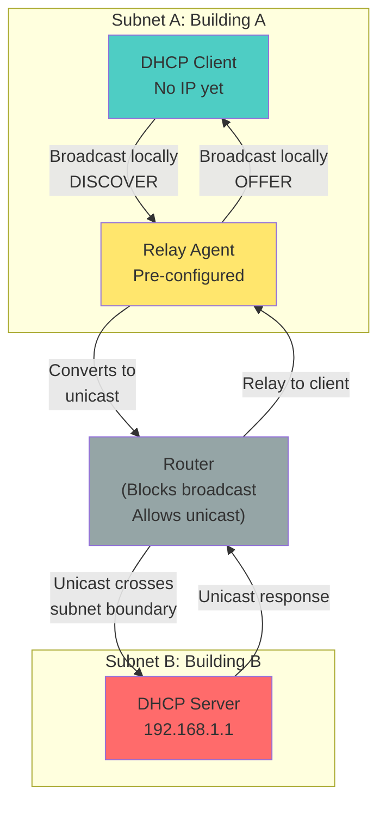
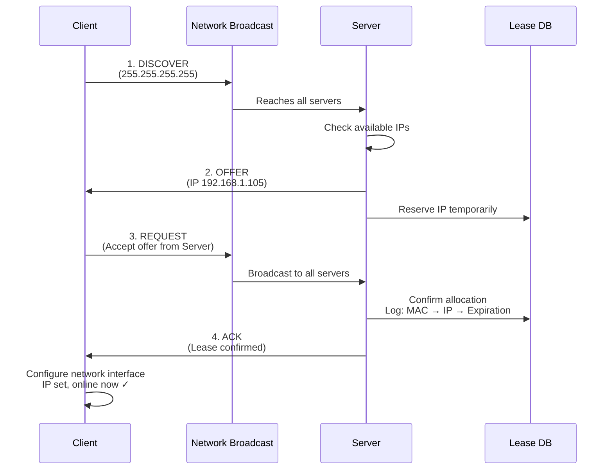

# CSE 321: Application Layer & DHCP

---

# PART 1: APPLICATION LAYER BASICS

## What Is Layer 7?

The topmost OSI layer where applications interact with the network directly.

**Examples**:
- Browser → HTTP/HTTPS
- Email → SMTP/IMAP  
- File transfer → FTP

**Key**: Application Layer doesn't care *how* data travels. TCP handles reliability. Layer 7 just sends/receives.

---

## Two Core Architectures

### Client-Server

**Model**: Centralized. Clients request from servers. No client-to-client communication.

**Rule**: Client ↔ Server (NOT Client ↔ Client)

**Example**: Facebook
- Your phone talks to Facebook servers
- Friend's phone talks to Facebook servers
- Your phone never talks to friend's phone directly
- Servers coordinate everything

**Hub-and-Spoke Pattern**: All clients form a "spoke", servers are the central "hub".

**Pros**: Centralized control, single source of truth, secure, consistent

**Cons**: Server bottleneck, single point of failure, expensive, high latency

**Use**: Gmail, banking, DoorDash, services needing central control

---

### Peer-to-Peer (P2P)

**Model**: Decentralized. Any device talks to any other directly. No central server.

**Rule**: Peer ↔ Peer (everyone is equal)

**Example**: BitTorrent
- Download Linux ISO from 10 peers simultaneously
- Each peer uploads to you and others
- Download speed = sum of peer speeds
- No central server needed (after tracker introduces peers)

**Mesh Network**: Organic, bidirectional connections. More peers = more bandwidth available.

**Bandwidth Magic**:
- Client-Server: Server bandwidth = sum of all user bandwidth (bottleneck)
- P2P: Server bandwidth = one initial upload, then peers amplify it (scales up)

**More peers = faster network** (opposite of client-server)

**Pros**: Infinite scalability, no single point of failure, cost-effective, resilient

**Cons**: Harder to coordinate, security harder, inconsistent data, unpredictable performance

**Use**: BitTorrent, Bitcoin, decentralized systems

---

## Comparison

| Aspect | Client-Server | P2P |
|--------|---------------|-----|
| Central authority | Yes | No |
| Scalability | Limited | Unlimited |
| Server failure | Total system down | System continues |
| Security | Centralized | Distributed |
| Cost | High | Low |
| Data consistency | Guaranteed | Not guaranteed |

---

## Common Protocols

- **HTTP/HTTPS**: Web browsing
- **DNS**: Domain name translation
- **SMTP/IMAP**: Email
- **DHCP**: Automatic IP configuration

---

# PART 2: DHCP

## Problem DHCP Solves

When you connect phone to WiFi, how does it know:
- What IP address to use?
- Where the gateway is?
- What DNS servers to use?

**Before DHCP**: Network admin manually typed this into every device. Nightmare at scale.

**DHCP Solution**: Automatic configuration. Plug in device → gets IP/gateway/DNS instantly → works.

---

## Static vs Dynamic

### Static (Manual)

Admin assigns permanent IP: `192.168.1.50`

**Use for**:
- Servers (need stable, predictable IP)
- Routers (must be at known address)
- Printers (network needs to find them)

**Why NOT for user devices**: They move between networks, connect/disconnect constantly.

### Dynamic (DHCP)

Device connects → server auto-assigns IP → instantly configured.

**Lease**: IP is temporary (typically 24 hours).

**Why leases?**
- Prevents IP waste (frees up when device leaves)
- Auto-cleanup (expired leases auto-freed)
- Example: Employee leaves company, admin forgets to free IP. With leases, automatically freed after 7 days.

---

## Three DHCP Players

### 1. Client
Device needing IP: phone, laptop, printer, smart TV, etc.

**Initial state**: No IP, no network config.

### 2. Server
Central device managing IP allocation.

**Jobs**:
- Maintains pool of available IPs (e.g., 192.168.1.100-254)
- Assigns IPs from pool (never duplicates)
- Tracks leases (MAC → IP → expiration)
- Frees IPs when leases expire

**Location**: In your WiFi router or corporate data center.

### 3. Relay Agent (Optional)

Used in large networks where client and server are on **different subnets**.

**Problem**: Broadcast packets don't cross subnet boundaries (routers block them).

**Solution**: Relay agent converts broadcast to unicast, sends to server across subnets, relays response back.

**How Relay Works**:

1. **Client broadcasts locally** — DISCOVER message only reaches devices on Subnet A
2. **Relay agent receives broadcast** — Relay agent on Subnet A hears it (same subnet)
3. **Relay converts to unicast** — Takes broadcast DISCOVER, adds client MAC address, sends unicast to DHCP server
4. **Unicast crosses router** — Unicast allowed across subnets, reaches DHCP server on Subnet B
5. **Server responds to relay** — Server sends unicast back to relay agent (contains client MAC)
6. **Relay broadcasts response locally** — Relay receives response, broadcasts or unicasts back to client

**Why This Works**:
- Broadcast packets inherently blocked (prevent flooding)
- Unicast packets allowed (routed normally)
- Relay agent exploits this difference
- Enables multi-subnet DHCP without multiple servers

**Real-World Scale**:
Large university with 100 buildings, each separate subnet. One central DHCP server in main building. Relay agents deployed in each building automatically handle all DHCP requests for that building's devices. Central server never directly sees broadcast traffic.

---

## DORA Process

**DORA = Discover, Offer, Request, Acknowledgement**

Four-step handshake when device connects to network:

### 1. DISCOVER

**Client broadcasts**: "Does anyone provide DHCP?"

- **Destination**: 255.255.255.255 (broadcast address — everyone on local network)
- **Message**: Client has no IP, needs automatic configuration
- **Response**: Only DHCP servers respond (other devices ignore)

**Technical Details**:
- MAC address included (hardware identifier)
- Transaction ID generated (unique per session)
- Optional: Hostname, requested options (DNS, NTP, etc.)

### 2. OFFER

**Each DHCP server responds**: "I offer IP 192.168.1.105, lease 24 hours"

**Contains**:
- **IP address** (e.g., 192.168.1.105)
- **Subnet mask** (e.g., 255.255.255.0 — defines network boundaries)
- **Default gateway** (e.g., 192.168.1.1 — how to reach other networks)
- **DNS servers** (e.g., 8.8.8.8, 8.8.4.4 — domain resolution)
- **Lease duration** (e.g., 86400 seconds = 24 hours)
- **Server's own IP** (so client knows which server this is)

**Multiple Servers Scenario**:
- If 2+ DHCP servers on network, multiple OFFERs received
- Each server reserves its offered IP for ~60 seconds
- Client typically accepts first OFFER
- Other servers release reservations if client doesn't pick them

### 3. REQUEST

**Client chooses one offer** and broadcasts:
- "I accept the offer from Server-A (IP 192.168.1.105)"

**Why broadcast (not unicast)?**
- **Chosen server** needs confirmation: "Yes, I accept your offer"
- **Other servers** need notification: "I didn't choose you, release your reservation"

**Prevents IP waste**: Without this, other servers keep IPs reserved for 60 seconds unnecessarily.

**Technical Details**:
- Includes requested IP address
- Includes DHCP server identifier (which server's offer is accepted)
- Same transaction ID as DISCOVER

### 4. ACKNOWLEDGEMENT (ACK)

**Chosen server confirms** and commits:

**Server Action**:
- Confirms: "IP 192.168.1.105 is yours, lease expires in 24 hours"
- Logs in persistent database: MAC address → IP address → expiration time
- Marks IP as "in use" (prevents duplicate assignment)

**Client Action**:
- Receives ACK with all configuration parameters
- Configures network interface: Sets IP, subnet mask, gateway, DNS
- Starts lease timer (for future renewals)

**Result**: **Client now online and connected**

---

## Lease Renewal

Leases are temporary. Before expiration, device must renew to keep IP.

### Timeline (24-hour lease)

- **T1 (12 hours)**: Try to renew with original server (unicast)
- **T2 (21 hours)**: If T1 failed, try any server (broadcast)
- **100% (24 hours)**: If both failed, do full DORA cycle

### T1: Primary Renewal

Client sends unicast REQUEST to original server:
- "Can you renew my lease for IP 192.168.1.105?"
- Server responds: ACK (success) or NACK (denied)
- If ACK: Lease renewed, client keeps IP
- If NACK or timeout: Proceed to T2

**Result**: 95%+ of renewals succeed at T1 (most efficient)

### T2: Fallback Renewal

If T1 failed, client broadcasts REQUEST to any server:
- "Any DHCP server, renew my lease"
- Any available server can respond with ACK
- Ensures renewal even if original server is down

### 100%: Hard Expiration

If T1 and T2 both failed: Lease fully expired.

Client acts like brand-new device:
- Sends full DORA cycle
- Gets potentially different IP
- Disruption: Few seconds offline

### Why Three Stages?

- **T1 (unicast)**: Efficient, keeps same server
- **T2 (broadcast)**: Fallback, resilient
- **100% (new DORA)**: Emergency, ensures connectivity

**Philosophy**: Graceful degradation. Optimize for common case (T1 works), but fallbacks for reliability.

**Deep Dive: T1 Success**:
T1 succeeds 95%+ of time because most DHCP servers are stable. Client attempts renewal well before expiration, giving server plenty of time to confirm. Server typically grants renewal immediately if IP hasn't been reassigned.

**Deep Dive: T2 Fallback**:
T2 broadcast is resilience mechanism. When original server fails, T2 broadcasts to reach ANY server on subnet. Different server can handle renewal using shared network pool data. Network stays online even with single-server outage.

**Deep Dive: 100% Emergency**:
Hard expiration (24h) is safety net for extreme failures (days-long outage, power loss, complete network failure). Forces full DORA cycle, which takes longer but guarantees device gets new IP. Rare in practice (<0.1% of leases).

---

## Key Takeaways

1. **DHCP automates configuration**: No manual setup needed. Device connects → instantly gets IP, gateway, DNS, subnet mask. Transparency is key: users never see DHCP in action.

2. **Leases prevent waste**: Temporary assignments (typically 24h) auto-free unused IPs. Expired lease → IP returned to pool. Enables networks to scale to millions with fixed pool. Without leases, abandoned IPs accumulate.

3. **Three-stage renewal = resilience**: T1 (unicast, 50%) optimizes for primary server. T2 (broadcast, 87.5%) fallback if T1 fails. 100% (full DORA) recovery from extended outages. Philosophy: graceful degradation.

4. **Broadcast local, unicast remote**: Broadcasts don't cross subnets (prevent flooding). Unicast routable. Relay agents exploit this by converting broadcasts to unicasts for multi-subnet DHCP.

5. **Transaction ID tracks sessions**: Each DISCOVER/OFFER/REQUEST/ACK uses unique ID. If client sends DISCOVER with ID 12345, server's OFFER echoes back 12345. Prevents confusion with multiple simultaneous clients.

6. **MAC address is device identity**: Hardware identifier used by server to recognize returning device. Server records MAC→IP mapping. Enables lease extension, prevents duplicates.

7. **Server database critical**: Persistent storage of MAC→IP→expiration prevents duplicates, tracks usage for audits, survives server restarts. Essential for compliance and troubleshooting.

---

## Static vs Dynamic: When to Use

**Static**: Servers, routers, printers, anything that needs stable IP

**Dynamic (DHCP)**: Laptops, phones, guest devices, temporary devices, consumer devices

**Typical Hybrid**:
- Infrastructure (routers, servers): Static IPs
- User devices: DHCP pool
- Home example: Router at 192.168.1.1 (static), your phone at 192.168.1.105 (DHCP)

---

## Conclusion

DHCP solved: **How do billions of devices automatically configure themselves without manual intervention?**

Result: Seamless connectivity at scale. From home WiFi to enterprise networks to public WiFi, DHCP is invisible infrastructure enabling modern networking.
