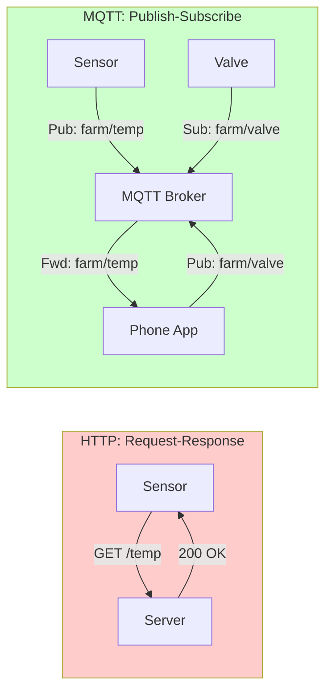
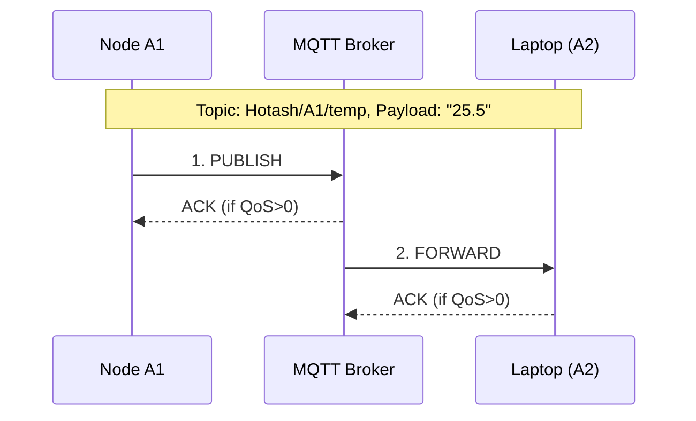
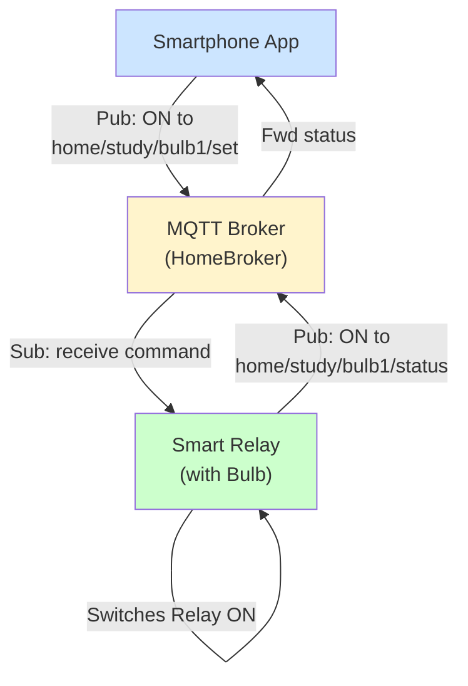
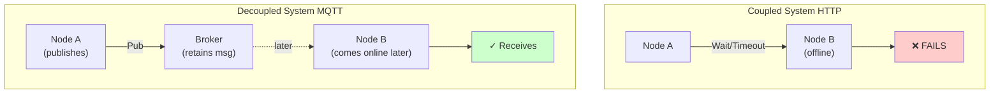
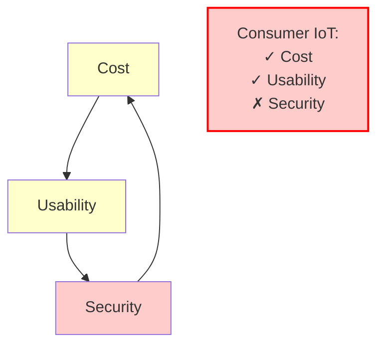
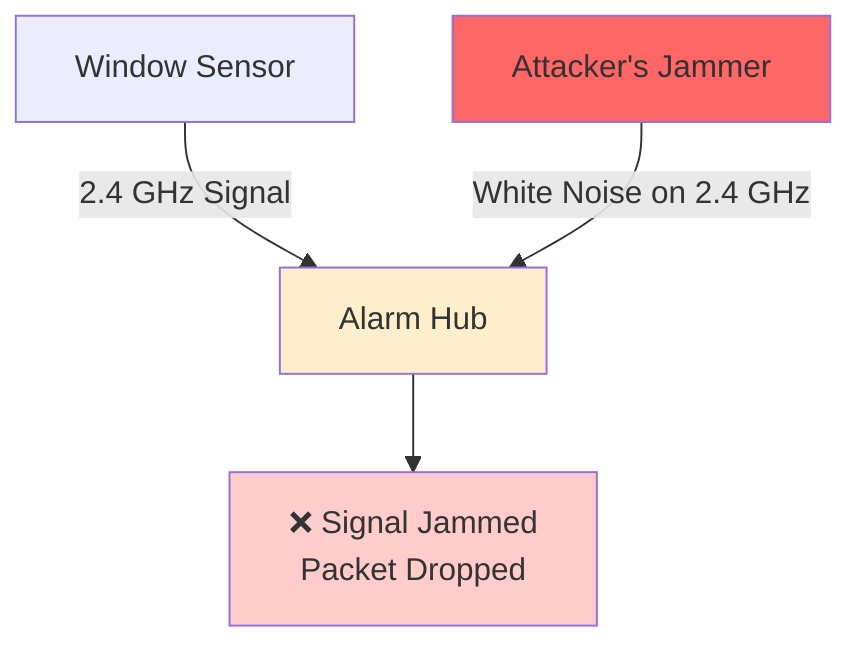
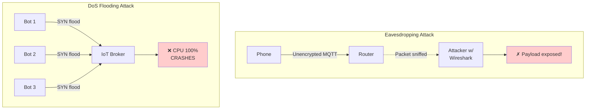
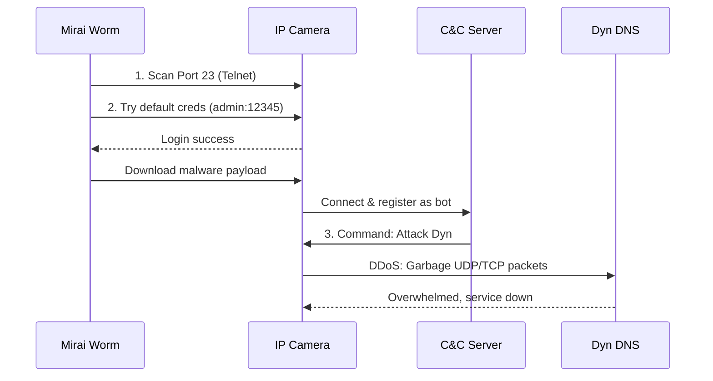
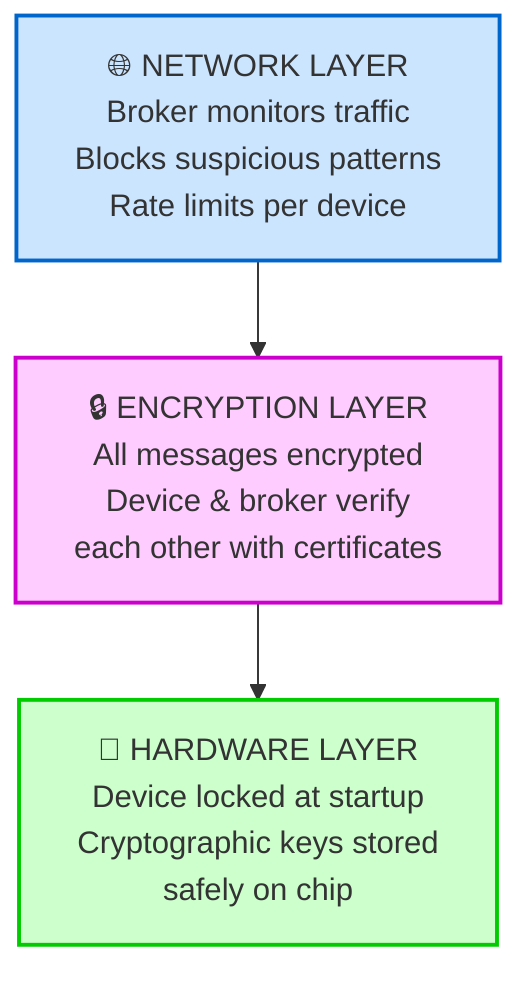

# CSE 321: MQTT and IoT Security

> [!NOTE] 
> This guide is designed for intuition first. We explore *why* protocols and security measures exist before diving into their formal mechanisms. 

---

## Part 1: The MQTT Protocol

### Slides 1-3: Introduction & Motivation

**1. Simple Explanation**
**MQTT (Message Queuing Telemetry Transport)** is a lightweight, rule-based messaging protocol designed specifically for devices with limited power and networks with low bandwidth. Think of it as a highly efficient group chat where devices can "speak" (publish) or "listen" (subscribe) without needing to know who else is in the room.

**2. Detailed Mechanism**
Traditional web traffic uses HTTP, which is built on a request-response model. A client asks for data, the server responds. This is heavy. MQTT uses a **Publish-Subscribe (Pub-Sub)** model. It operates over TCP/IP but strips away the heavy HTTP headers. Clients connect to a central **Broker**. Clients don't communicate directly; they publish messages to a specific "Topic", and the broker instantly forwards that message to any client subscribed to that topic.

**3. Examples & Scenarios**
Imagine a smart agriculture setup. You have soil moisture sensors (publishers) deep in a field with poor cellular reception. They publish data like `20% moisture` to the broker. A central irrigation server (subscriber) listens to this data and decides when to turn on the water.

**4. Mathematical Details**
HTTP introduces massive overhead compared to MQTT. Let's look at the header sizes:
- $Header_{HTTP} \approx 400 \text{ to } 800 \text{ bytes}$
- $Header_{MQTT} = 2 \text{ bytes}$ (Fixed Header)

If a sensor sends a 2-byte payload (e.g., `25` for temperature) every minute:
- Over HTTP: $802 \text{ bytes} \times 60 \text{ mins} = 48.12 \text{ KB/hr}$
- Over MQTT: $4 \text{ bytes} \times 60 \text{ mins} = 240 \text{ bytes/hr}$
MQTT is exponentially more bandwidth-efficient.

**5. Visual Descriptions**

**6. Defense/Best Practices**
By default, MQTT sends data in plaintext. **Mitigation:** Never expose an unauthenticated MQTT broker to the public internet (port 1883). Always use MQTTS (port 8883) wrapped in TLS.

---

### Slides 4-9: MQTT Architecture & Example

**1. Simple Explanation**
The architecture consists of clients (devices/apps) and one broker (the post office). Data is sorted by **Topics**, which act like file directory paths (e.g., `house/kitchen/fridge/temp`).

**2. Detailed Mechanism**
- **Topic Hierarchy:** Topics use slashes `/` to create levels. `+` acts as a single-level wildcard, and `#` acts as a multi-level wildcard.
- **Client Roles:** A client can be a Publisher, a Subscriber, or both simultaneously.
- **Message Flow:** 
  1. Subscriber connects to Broker and subscribes to `Hotash/A1/temp`.
  2. Publisher A1 connects and publishes `{"temp": 24}` to `Hotash/A1/temp`.
  3. Broker identifies the subscriber and pushes the payload to them.

**3. Examples & Scenarios**
- **Publisher:** NodeMCU (ESP8266) attached to a thermistor (A1).
- **Broker:** Mosquitto running on a Raspberry Pi (`192.168.1.100`).
- **Subscriber:** A student's laptop running a Python script.
If A1 publishes `25.5` to `Hotash/A1/temp`, the laptop receives it instantly.

**4. Mathematical Details**

MQTT supports 3 Quality of Service (QoS) levels, which are agreements between publisher and broker about message delivery guarantees:

**QoS 0 — "Fire and Forget"**
- **Guarantee:** Message sent once, no confirmation. Publisher doesn't care if it arrives.
- **Network trips:** 1 (publisher → broker only)
- **Example:** A weather station publishing "humidity: 65%" doesn't need confirmation because it will publish again in 5 seconds anyway.
- **Overhead:** Minimal ($T_{total} = T_{tx}$ only)
- **Risk:** Message might be lost if network hiccups occur.

**QoS 1 — "At Least Once"**
- **Guarantee:** Broker acknowledges receipt. If no ACK is received, publisher retransmits indefinitely.
- **Network trips:** 2 (publisher → broker, then broker → publisher with ACK)
- **Example:** A door lock command "unlock door" must be received, but duplicate unlock commands are okay.
- **Overhead:** Broker must store message ID and track acknowledgment ($T_{total} = T_{tx} + T_{ack}$)
- **Caveat:** Subscriber might receive the same message twice if publisher retransmits.

**QoS 2 — "Exactly Once"**
- **Guarantee:** Four-way handshake ensures the message is delivered exactly once, never duplicated or lost.
- **Network trips:** 4 (PUBLISH → PUBREC → PUBREL → PUBCOMP)
- **Example:** A bank transaction "transfer $100" must happen exactly once, no duplicates, no losses.
- **Overhead:** Most expensive ($T_{total} = T_{tx} + T_{rec} + T_{rel} + T_{comp}$); broker tracks state across all 4 steps.
- **Trade-off:** Highest reliability but slowest and most battery/bandwidth intensive.

**When to Use Each:**
- **QoS 0:** Sensor readings (temperature, humidity) where one lost reading isn't critical.
- **QoS 1:** Commands and alerts where duplicates are acceptable (e.g., notifications).
- **QoS 2:** Critical operations where duplicates would cause harm (e.g., financial transactions, safety shutdowns).

**5. Visual Descriptions**

**6. Defense/Best Practices**
Implement **Topic-based Access Control Lists (ACLs)**. A temperature sensor should only have permission to *write* to `Hotash/A1/temp`, and no permission to *read* from admin topics.

---

### Slides 10-14: MQTT Real-World Use Cases

**1. Simple Explanation**
MQTT isn't just for reading data; it's also for taking action. A smartphone can act as an MQTT client to remotely switch on devices.

**2. Detailed Mechanism**
In a home automation setup, control flow is handled via subscribing to command topics. An actuator (like a smart relay connected to a bulb) subscribes to `home/study/bulb1/set`. When it receives a message (`"ON"`), the microcontroller changes the GPIO pin state to HIGH, turning on the bulb. It then publishes to `home/study/bulb1/status` to confirm it is on.

**3. Examples & Scenarios**
- **Scenario:** You leave home but forgot to turn off the study light. 
- **Action:** Open your smart home app, tap the bulb icon.
- **Flow:** App publishes `"OFF"` to `home/study/bulb1/set`. The broker routes it to the smart bulb. Bulb turns off.

**4. Mathematical Details**
In a practical IoT topology, the **Broker Capacity** ($C_{broker}$) limits scalability. If a broker can handle $M$ messages per second, and each device publishes at rate $R$ messages/second, the maximum number of devices $N_{max}$ is:
$$N_{max} = \frac{C_{broker}}{R}$$
If $C_{broker} = 10,000$ msgs/sec, and each bulb reports status every 1 second, the broker can support 10,000 bulbs.

**5. Visual Descriptions**

**6. Defense/Best Practices**
Use **Network Segmentation**. The IoT broker and devices should reside on an isolated VLAN. If a smart bulb is compromised, it cannot access your main computer network.

---

### Slides 15-18: Advantages of MQTT

**1. Simple Explanation**
MQTT is popular because it does a lot with very little. It saves battery, uses tiny amounts of data, scales to massive numbers, and keeps devices completely independent of each other.

**2. Detailed Mechanism**
- **Lightweight:** Binary protocol headers minimize footprint.
- **Low Power:** Uses a `KEEP_ALIVE` timer. Devices don't need to constantly ping the server; they can sleep and wake up only when necessary.
- **Decoupled:** The publisher doesn't care if the subscriber is online, offline, or if there are 100 subscribers. The broker handles the state.

**3. Examples & Scenarios**
A pipeline pressure monitor in the desert runs on a small solar panel and a battery. It sleeps for 59 minutes, wakes up for 1 minute to establish a TCP connection, publishes via MQTT, and goes back to sleep. It operates for years without intervention.

**4. Mathematical Details**
Energy consumption formula for an IoT node:
$$E_{total} = P_{tx} t_{tx} + P_{rx} t_{rx} + P_{sleep} t_{sleep}$$
Because MQTT reduces the transmission time ($t_{tx}$) due to small packet sizes, $E_{total}$ is drastically lower compared to HTTP.

**5. Visual Descriptions**

**6. Defense/Best Practices**
To prevent a compromised device from exploiting MQTT's scalability to launch a DoS against the broker, implement **Rate Limiting** per client ID at the broker level.

---

## Part 2: IoT Security Challenges

### Slides 2-5: Unique Security Challenges in IoT

**1. Simple Explanation**
Securing a laptop is easy (antivirus, firewalls, regular updates). Securing a smart lightbulb is hard because it has almost no memory, uses weird protocols, and is sitting physically outside your house.

**2. Detailed Mechanism**
- **Resource Constraints:** Microcontrollers (like ESP32/ATmega) lack the CPU power to run complex cryptographic algorithms (like AES-256 or RSA-4096) quickly.
- **Heterogeneity:** A network might have Zigbee, BLE, LoRaWAN, and Wi-Fi devices, creating a fractured security landscape.
- **Physical Accessibility:** Unlike cloud servers locked in data centers, IoT devices (like smart meters or security cameras) are mounted in public.

**3. Examples & Scenarios**
An attacker uncrews a smart doorbell from a porch, connects a USB cable to its debugging port, and extracts the home's Wi-Fi password stored in plaintext on the device's cheap memory chip.

**4. Mathematical Details**
The **Attack Surface Area** ($A$) of an IoT network scales linearly or exponentially with the number of nodes ($N$). 
$$A \propto N \times \text{Vulnerabilities per node}$$
If $N = 10,000$ sensors, even a 0.01% compromise rate means an attacker controls 1 viable entry point.

**5. Visual Descriptions**

**6. Defense/Best Practices**
**Defense in Depth:** Assume the edge device *will* be compromised. Segregate the network, use zero-trust architectures, and ensure device credentials cannot access central infrastructure.

---

### Slides 6-9: Physical Layer Attacks

**1. Simple Explanation**
These are hardware-level attacks. The attacker literally touches the device, breaks it open, or uses radio waves to jam its signals.

**2. Detailed Mechanism**
- **Node Tampering/Capturing:** Attackers open the casing and use logic analyzers on exposed UART/JTAG pins to read memory (EEPROM) and extract firmware.
- **RF Jamming:** Broadcasting loud radio noise on the exact frequency the IoT device uses (e.g., 2.4 GHz for Wi-Fi/Zigbee), causing legitimate packets to be dropped due to interference.

**3. Examples & Scenarios**
A burglar brings a $30 radio jammer to a house. The smart security system's wireless window sensors are jammed and cannot send the "window opened" MQTT message to the alarm hub. 

**4. Mathematical Details**
For a successful RF Jamming attack, the Signal to Interference plus Noise Ratio (SINR) must fall below the receiver's threshold ($\gamma_{th}$):
$$\text{SINR} = \frac{P_{signal}}{P_{noise} + P_{jammer}} < \gamma_{th}$$
By increasing $P_{jammer}$ (jammer power), the attacker forces the SINR to zero, blinding the receiver.

**5. Visual Descriptions**

**6. Defense/Best Practices**
- **Physical:** Epoxy resin over debug pins, tamper switches (if case is opened, zero-out cryptographic keys).
- **Environmental:** Frequency hopping spread spectrum (FHSS) so the device constantly changes radio channels to evade jammers.

---

### Slides 10-12: Network Layer Attacks

**1. Simple Explanation**
Attacking the data while it is traveling through the air or cables. The attacker tries to block the data (DoS) or secretly read it (Eavesdropping).

**2. Detailed Mechanism**
- **DoS (Denial of Service):** Overwhelming a target with garbage traffic so it can't process legitimate requests. In IoT, this can mean exhausting a sensor's battery by forcing it to constantly wake up and process fake packets.
- **Eavesdropping:** Passive interception. Because many IoT devices skip encryption to save power, an attacker can capture the Wi-Fi or Zigbee packets and read the payloads.

**3. Examples & Scenarios**
An attacker sits in a coffee shop running Wireshark. A user on the same network opens their smart home app to unlock their front door. The MQTT packet `"topic: frontdoor/lock, payload: unlock"` is sent without TLS. The attacker captures it and replays it later to break into the house.

**4. Mathematical Details**
In a resource exhaustion DoS attack against a battery-powered node, if normal active time is $1\%$ and the attacker forces it to $100\%$ active time:
$$t_{battery} = \frac{\text{Battery Capacity (mAh)}}{\text{Average Current (mA)}}$$
The battery life drops from 2 years to 3 days.

**5. Visual Descriptions**

**6. Defense/Best Practices**
- Always encrypt traffic: **MQTT over TLS (Port 8883)**. 
- Implement **Replay Attack Protection** using timestamps or nonces (number used once) in the payload, so old captured packets are ignored by the receiver.

---

### Slides 13-17: Case Study - Mirai Botnet

**1. Simple Explanation**
In 2016, hackers created a virus called Mirai. It infected hundreds of thousands of weak IoT devices (like cheap security cameras) and used them to form a massive zombie army. They used this army to attack major internet servers, taking down Twitter, Netflix, and Reddit for a day.

**2. Detailed Mechanism**

Let's break down the key components first:

- **Mirai Worm:** A malicious software program that hunts for vulnerable IoT devices on the internet.
- **IP Camera (Victim Device):** A cheap security camera connected to the internet. Like most IoT devices, it has weak default passwords that manufacturers hardcode (e.g., `admin:admin`).
- **C&C Server ("Command & Control"):** The attacker's computer. Think of it as a headquarters that controls all infected devices. It sends orders to every infected device.
- **Dyn (Target):** A company that provides DNS services. When you type `netflix.com`, Dyn's servers translate it to an IP address. If Dyn goes down, all websites it hosts become unreachable.

**How the attack unfolds:**
1. **Scanning Phase:** Mirai scans millions of random IP addresses, looking for devices with Telnet port (Port 23) open.
2. **Exploitation Phase:** When it finds an open Telnet port, it tries to log in using a list of 61 common default passwords (`admin:12345`, `root:root`, etc.). Most IoT devices have never had their passwords changed, so the login succeeds.
3. **Infection Phase:** Once inside the device, Mirai downloads its malware code into the camera's memory and runs it. The camera is now "infected" and part of the botnet.
4. **Registration Phase:** The infected camera connects to the attacker's C&C server and registers itself: "I'm online and under your control."
5. **Attack Phase:** The attacker sends a command through the C&C server to all infected cameras: "Attack Dyn's DNS servers with garbage traffic." Hundreds of thousands of infected cameras now flood Dyn with fake requests, overwhelming its servers. Legitimate requests get lost in the noise. Dyn's service crashes.
6. **Cascading Failure:** Netflix, Twitter, Reddit, and other websites that relied on Dyn's DNS service become unavailable to users.

**3. Examples & Scenarios**
You buy a cheap IP camera from a generic brand, plug it in, and never change the password. Ten minutes later, Mirai scans your IP, logs in via Telnet with `admin:12345`, and your camera silently starts attacking a DNS provider (Dyn).

**4. Mathematical Details**
The sheer scale of Mirai generated record-breaking attack volumes:
$$\text{Total Attack Bandwidth} = \sum_{i=1}^{N_{bots}} B_{bot_i}$$
With $N_{bots} > 300,000$ and each bot sending even modest traffic (e.g., 3-4 Mbps), the aggregate attack reached **over 1.2 Terabits per second (Tbps)**, completely overwhelming Dyn's network capacity.

**5. Visual Descriptions**

**6. Defense/Best Practices**
**Lessons Learned:** 
1. Never hardcode default passwords in firmware. Force the user to change the password on first boot.
2. Disable legacy protocols like Telnet. Use SSH with key-based authentication.
3. Keep firmware patchable over-the-air (OTA) to close future vulnerabilities.

---

### Slides 18-22: Defense Mechanisms

**1. Simple Explanation**
Securing IoT requires multiple layers: locking the physical device, encrypting the messages, making sure only approved devices can talk, and constantly monitoring for weird behavior.

**2. Detailed Mechanism**
- **Cryptographic Solutions:** Using ECC (Elliptic Curve Cryptography) instead of RSA, because ECC provides strong encryption with much smaller key sizes (better for weak microcontrollers).
- **Authentication:** Moving from passwords to **Mutual TLS (mTLS)**, where both the client and the broker verify each other's cryptographic certificates before talking.
- **IDPS (Intrusion Detection/Prevention):** Network appliances that monitor traffic patterns using machine learning to detect anomalies (e.g., a thermostat suddenly trying to scan the local subnet).

**3. Examples & Scenarios**
AWS IoT Core enforces mTLS. When you provision an ESP32 for AWS, you must burn a unique private key and X.509 certificate onto the device. If the device tries to connect to AWS IoT without these certificates, the broker instantly drops the TCP connection.

**4. Mathematical Details**
Why ECC over RSA for IoT? 
To achieve 128-bit security (AES-128 equivalent):
- **RSA Key Size:** 3072 bits
- **ECC Key Size:** 256 bits
Smaller keys mean faster math ($\approx O(n^2)$ vs $O(n^3)$ for processing), less RAM usage, and less battery consumed during the TLS handshake.

**5. Visual Descriptions**

**6. Defense/Best Practices**
Adopt a **Zero Trust Architecture**. Assume the local network is compromised. Every device must authenticate every request, regardless of whether it is communicating over the local LAN or the open internet.
