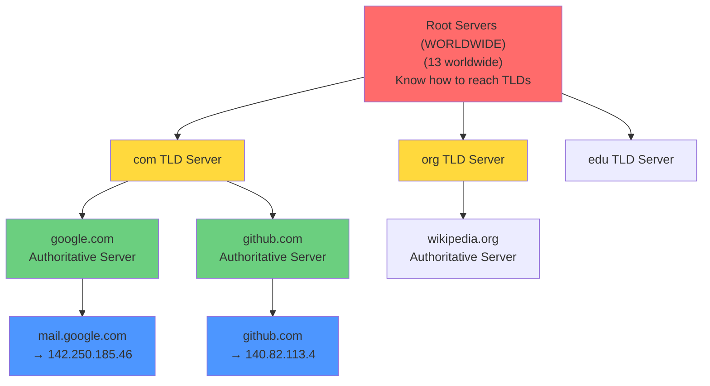
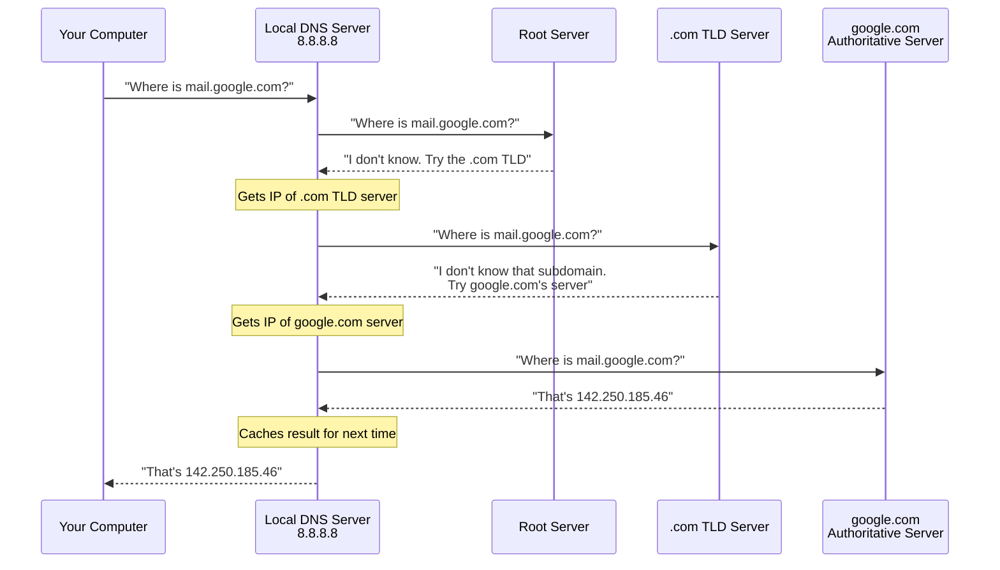
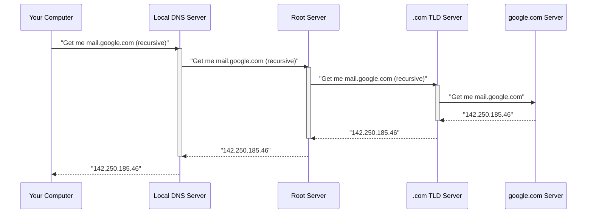
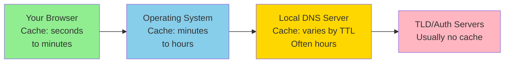
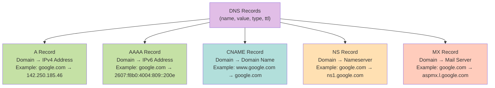
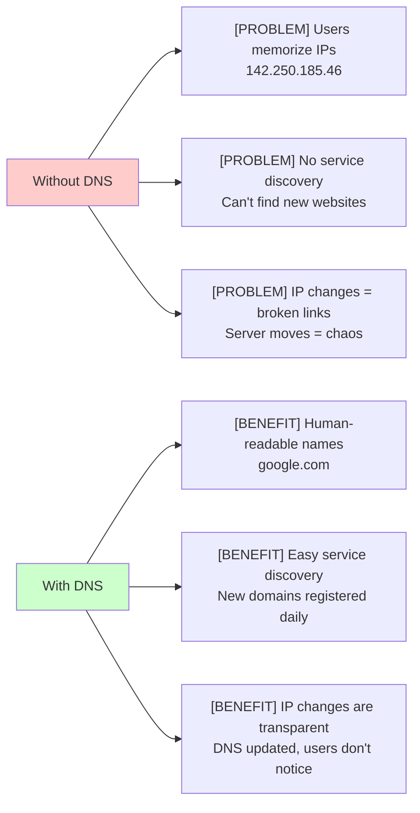

# DNS from First Principles: A Complete Teaching Guide

## Part 1: The Problem DNS Solves

### The Core Challenge

Your computer needs to reach Google's server. Routing requires **IP addresses** like `142.250.185.46`, but humans use names like `google.com`. 

**The mapping problem:** How do we translate human-readable domain names into IP addresses reliably and globally?

### Why Simple Solutions Don't Work

#### [NO] Why not memorize IPs?
- **IPv4**: 4.3 billion possible addresses
- **IPv6**: 340 undecillion addresses (128 bits)
- **Reality**: Hundreds of millions of registered domains
- **Problem**: IPs change constantly (servers move, load balancing, failover)
- **Conclusion**: Human memorization scales only to a few dozen addresses

#### [NO] Why not centralize everything on one server?
- **Single point of failure**: Server crashes = entire internet broken
- **Traffic concentration**: Every DNS query on Earth hits one machine
- **Latency**: Geographically centralized server serves everyone globally
- **Scalability**: Cannot handle billions of queries per second
- **Conclusion**: Centralization fails for planetary-scale systems

### What We Actually Need

[YES] **Fault tolerance** — Multiple servers, so one failure doesn't break everything  
[YES] **Load distribution** — Spread queries across many machines  
[YES] **Low latency** — Servers geographically distributed worldwide  
[YES] **Scalability** — Handle billions of domains and billions of queries/second  

---

## Part 2: The DNS Hierarchy

### The Insight

Instead of one giant phonebook, create a **hierarchical directory system**—like how phone directories are organized by region, then city, then neighborhood.



### The Four Layers

#### 1. **Root Servers** (13 worldwide)
- **NOT** a storage system for domains
- **Actually do:** Direct queries to appropriate TLD servers
- **Answer:** "I don't know google.com, but here's the server for .com domains"
- **Analogy:** "Directory assistance that knows which city you're looking for"

#### 2. **TLD Servers** (.com, .org, .net, .edu, .io, etc.)
- **Purpose:** Know which authoritative server owns each domain
- **Answer:** "I don't know mail.google.com, but ask google.com's server"
- **Note:** For `.com`, there are multiple TLD servers (load balancing)
- **Analogy:** "City phonebook that knows which neighborhood to check"

#### 3. **Authoritative DNS Servers** (run by domain owner)
- **PURPOSE:** Actually store DNS records for a domain
- **Answer:** "mail.google.com resolves to 142.250.185.46"
- **Owned by:** Google (for google.com), GitHub (for github.com), etc.
- **Analogy:** "The actual phonebook entry"

#### 4. **Local DNS Servers** (caching resolvers—usually your ISP)
- **Not part of the official hierarchy**
- **Purpose:** Cache recent translations to avoid repeated upstream queries
- **Who runs it:** Your ISP or a public resolver (8.8.8.8, 1.1.1.1)
- **Analogy:** "Your personal phonebook where you write down numbers you call often"

### Why This Hierarchy Works

| Property | How It's Achieved |
|----------|------------------|
| **Fault tolerance** | Multiple servers at each level; if one fails, others respond |
| **Load distribution** | Queries spread across root servers, TLD servers, and local servers worldwide |
| **Geographic distribution** | Can place servers where needed (close to users) |
| **Scalability** | Each domain only needs to register with one TLD, not globally |

---

## Part 3: The Query Process

### Model 1: Iterated Query (How DNS Actually Works)

In an **iterated query**, each server says **"I don't know, try this server instead"**—and the local DNS server drives the entire process.

#### Step-by-Step Example: Query for `mail.google.com`



#### Key Points
- **Local DNS does the work**: It queries root, then TLD, then auth (3 separate queries)
- **Each response includes**: IP address of the next server to try
- **Final answer bubbles back**: Result goes from auth → TLD → local → your computer
- **Local server caches**: So next query for this domain is instant

#### Why Use Iterated Queries?
- [YES] **Lower load on upstream servers** — Root/TLD only answer "pointer" queries
- [YES] **More efficient** — Root servers handle millions of queries/second
- [NO] **More work for local server** — But it's designed for this

---

### Model 2: Recursive Query (Why We Don't Use This at Scale)

In a **recursive query**, each server says **"I'll find this for you"**—servers do all the work.



#### Why We Don't Use Recursive at Scale
- [NO] **Massive load on root servers** — Every query becomes their problem
- [NO] **Connection management** — Servers must maintain connections while recursing
- [NO] **Timeout issues** — If one step fails, whole chain breaks
- [YES] **Good for**: Internal corporate DNS, where you control the servers

---

## Part 4: Caching—The Secret Performance Multiplier

### The Critical Insight

**99% of DNS queries never reach the root servers** because of caching. This is why DNS remains fast despite the multi-level hierarchy.

### Caching at Multiple Levels



### DNS TTL (Time To Live)

**Format:** `(name, value, type, ttl)`

```
Example:
google.com    A    142.250.185.46    3600
```

- **TTL = 3600**: Answer is "fresh" for 3600 seconds (1 hour)
- **After 3600 seconds**: Cache entry is discarded
- **Why TTL?** Domain owner controls how fast IP changes propagate

#### TTL Tradeoffs

| TTL Value | Pros | Cons |
|-----------|------|------|
| **Short** (60 sec) | Changes propagate fast | More queries to upstream |
| **Long** (86400 sec) | Fewer queries, faster responses | Old IPs cached for 1 day after change |

#### Real-World Impact

**Scenario:** Google changes mail.google.com's IP at 2:00 PM

| Cache Level | Gets Updated |
|-----------|---|
| Your browser cache (30 sec TTL) | ~2:01 PM |
| OS cache (5 min TTL) | ~2:05 PM |
| Local DNS (3600 sec = 1 hour) | ~3:00 PM |
| Unlucky user with 86400 TTL | ~2:00 PM **tomorrow** |

---

## Part 5: DNS Record Types

**General Format:** `(name, value, type, ttl)`

### Common Record Types



#### Record Type Details

| Type | Purpose | Example |
|------|---------|---------|
| **A** | Maps domain to IPv4 | `google.com → 142.250.185.46` |
| **AAAA** | Maps domain to IPv6 | `google.com → 2607:f8b0:4004:809::200e` |
| **CNAME** | Maps domain to domain | `www.example.com → example.com` (redirects to main site) |
| **NS** | Points to nameservers | `example.com → ns1.example.com` (TLD uses this) |
| **MX** | Specifies mail server | `example.com → mail.example.com` (mail routing) |

---

## Part 6: Complete Example—Walking Through a Real Query

### Scenario: You type `mail.google.com` into your browser (no cache)

```mermaid
graph TD
    A["Step 1: Browser Query<br/>Your computer to Local DNS<br/>8.8.8.8: Where is mail.google.com?"]
    
    B["Step 2: Local to Root<br/>Local DNS to Root Server<br/>Where is mail.google.com?"]
    
    C["Root Response<br/>Don't know.<br/>Ask the .com TLD server<br/>IP: 192.33.14.30"]
    
    D["Step 3: Local to TLD<br/>Local DNS to .com TLD Server<br/>192.33.14.30<br/>Where is mail.google.com?"]
    
    E["TLD Response<br/>Don't know that subdomain.<br/>Ask google.com's nameserver<br/>IP: 216.239.34.10"]
    
    F["Step 4: Local to Auth<br/>Local DNS to google.com Auth Server<br/>216.239.34.10<br/>Where is mail.google.com?"]
    
    G["Auth Response<br/>mail.google.com<br/>A Record: 142.250.185.46<br/>TTL: 300"]
    
    H["Step 5: Local Caches & Returns<br/>Local DNS caches result<br/>Returns to your browser<br/>142.250.185.46"]
    
    I["Browser Connects<br/>Your browser opens connection<br/>to 142.250.185.46<br/>Gmail loads"]
    
    J["Next Query: Instant<br/>Browser asks local DNS again<br/>Result found in cache<br/>No upstream queries needed"]
    
    A --> B --> C --> D --> E --> F --> G --> H --> I
    
    I -.->|One hour later| J
    
    style A fill:#ffcccc
    style B fill:#ffddaa
    style C fill:#ffffcc
    style D fill:#ffddaa
    style E fill:#ffffcc
    style F fill:#ffddaa
    style G fill:#ffffcc
    style H fill:#ccffcc
    style I fill:#ccffff
    style J fill:#ccffff
```



### Key Timing Observations

**First query (no cache):**
- Step 1: Local DNS lookup query sent
- Steps 2-7: 6 network round trips (can be 100-500ms total)
- Your browser waits for the answer before connecting

**Second query (cache hit):**
- Step 1: Local DNS has the answer cached
- Time: <5ms
- Your browser gets instant response

**Why cache hit is so critical:** If every query required 6 hops, the internet would feel glacially slow.

---

## Part 7: Why DNS Matters (The "So What?")

### Impact on Internet Functionality



### DNS Teaches Distributed System Principles

| Principle | How DNS Uses It |
|-----------|-----------------|
| **Hierarchies reduce load** | Each level handles fewer queries than centralized system |
| **Caching improves performance** | 99% of queries answered locally, not upstream |
| **Geographic distribution** | Servers placed where queries originate |
| **Fault tolerance** | Multiple servers at each level; redundancy prevents total failure |
| **Stateless protocols** | Each DNS query is independent; servers don't maintain connections |

### Real-World Consequences

1. **DNS failures are catastrophic** — Many websites unreachable if DNS breaks
2. **DNS security is critical** — DNSSEC protects against spoofing attacks
3. **DNS caching can hide failures** — Old data persists if upstream server dies
4. **CDNs exploit DNS** — Route users to nearest server by changing DNS answers based on geography
5. **TTL tuning is an art** — Balance between change propagation and query volume

---

## Part 8: Common Misconceptions

| Misconception | Reality |
|---------------|---------|
| **"DNS is stored on my computer"** | Your computer *caches* recent lookups, but storage is distributed |
| **"Root server stores all domains"** | Root only knows how to reach TLD servers, not individual domains |
| **"DNS queries always go to the root"** | No—99% answered from local cache without hitting upstream |
| **"Single DNS failure breaks the internet"** | No—13 root servers, multiple TLDs, multiple local resolvers |
| **"TTL controls my browser cache"** | TTL is a suggestion; browsers may cache longer or shorter |
| **"Recursive queries are always bad"** | They're fine for internal networks; scale issues only apply publicly |
| **"All .com domains use the same TLD server"** | Multiple .com TLD servers exist; queries distributed among them |

---

## Part 9: Verification Questions (Test Understanding)

### Conceptual

1. **"Why can't we just have one big DNS server for the whole world?"**
   - Expected answer: Single point of failure, geographic latency, traffic bottleneck, doesn't scale

2. **"If I query for mail.google.com, does the root server ever know the final answer?"**
   - Expected answer: No—root only redirects to .com TLD; doesn't know subdomains

### Hierarchical Understanding

3. **"At what point in the query does my local DNS server get the IP address of google.com's authoritative server?"**
   - Expected answer: From the .com TLD server (step 3 in the example)

4. **"If TLD servers didn't exist, what would the root servers have to store?"**
   - Expected answer: Every domain's authoritative server address—massive scale problem

### Caching

5. **"If I change my website's IP address tomorrow, why might some people still reach the old IP for an hour?"**
   - Expected answer: Their local DNS has cached the old IP; TTL hasn't expired

6. **"When would a query definitely reach a root server?"**
   - Expected answer: Only when local DNS cache doesn't have an entry for that domain

### Practical

7. **"What's the difference between an A record and a CNAME record?"**
   - Expected answer: A record = domain to IP; CNAME = domain to domain

8. **"Why would a company use CNAME records?"**
   - Expected answer: Multiple domain names pointing to same service (www.example.com → example.com)

---

## Teaching Progression Roadmap

1. ✅ **Start:** The problem (why names instead of IPs?)
2. ✅ **Build:** The hierarchy (root → TLD → auth)
3. ✅ **Walk through:** Iterated query process step by step
4. ✅ **Compare:** Recursive queries and why we prefer iterated
5. ✅ **Explain:** Why caching is the performance multiplier
6. ✅ **Show:** Complete example end-to-end
7. ✅ **Introduce:** Record types and TTL mechanics
8. ✅ **Reflect:** Why this design matters in distributed systems
9. ✅ **Verify:** Ask questions to check understanding

---

## Quick Reference: DNS Query Timeline

```
Worst case (no cache):
  Browser → Local DNS (1-2ms)
    ↓
  Local → Root (10-50ms)
    ↓
  Local → TLD (10-50ms)
    ↓
  Local → Auth (10-50ms)
    ↓
  Local → Browser (1-2ms)
  ─────────────────────────
  Total: 50-200ms for first lookup
  
Best case (cache hit):
  Browser → Local DNS (already cached)
  ─────────────────────────
  Total: <5ms
```

---

## Key Takeaway

DNS solves the **fundamental naming problem** in networks through:

1. **Hierarchy** — Distributes knowledge and load
2. **Caching** — Makes queries fast through locality
3. **Redundancy** — Multiple servers prevent total failure
4. **Standardization** — Consistent protocol works globally

These principles appear throughout distributed systems. Understanding DNS means understanding how the internet actually works.
