# HTTP from First Principles: A Complete Teaching Guide

## Part 1: The Motivation & Problem

### Why We Need HTTP

The internet connects millions of computers. For these machines to share information reliably, they need a **common language**—a protocol that defines:
- How clients ask for data
- How servers respond to requests
- What happens when things go wrong
- How to handle different types of content

**Without HTTP, the internet is just a collection of disconnected machines.**

### The Core Problem HTTP Solves

**Scenario:** Your browser needs to retrieve a webpage from Google's server.

1. Your computer needs to know **where** the server is (IP address—handled by DNS)
2. Your computer needs to know **what** to ask for (which page, which resource?)
3. Your computer needs to know **how** to ask (in what format? what language?)
4. The server needs to understand the request and respond appropriately
5. Both need to agree on how to transfer the data

**HTTP solves problems 2-5: the standardized language for requesting and delivering web resources.**

---

## Part 2: Foundational Concepts

### URL: The Address of Resources

**Format:** `scheme://host:port/path?query#fragment`

**Example:** `https://www.google.com:443/search?q=http+protocol`

```
https://            - scheme (protocol to use)
www.google.com      - host (which server)
:443                - port (which service on that machine)
/search             - path (which resource on that server)
?q=http+protocol    - query (parameters for that resource)
#fragment           - fragment (part of document to display)
```

### Key Components

| Component | Purpose |
|-----------|---------|
| **Scheme** | Protocol (http, https, ftp, etc.) |
| **Host** | Domain name or IP address of server |
| **Port** | Which service on the host (80 for HTTP, 443 for HTTPS) |
| **Path** | Which resource/file to retrieve |
| **Query** | Parameters passed to the resource |
| **Fragment** | Client-side reference (not sent to server) |

### HTTP as Application Layer Protocol

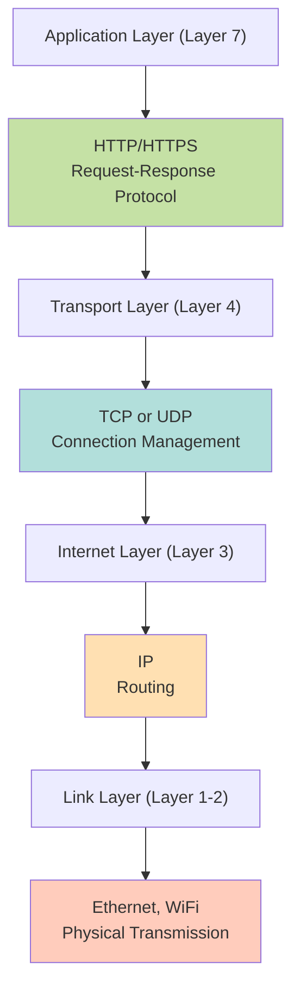

**Key insight:** HTTP defines WHAT to send. TCP ensures WHEN and HOW RELIABLY it gets there.

### Client-Server Model

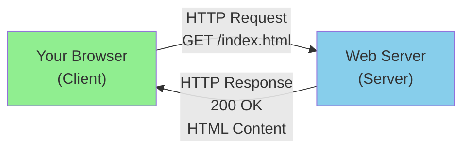

**Client:** Initiates requests (usually a browser, but could be any application)  
**Server:** Listens, processes requests, sends responses

---

## Part 3: HTTP Protocol Versions (Evolution)

### HTTP/0.9: The Minimalist (1991)

**Simplicity bordering on non-functional.**

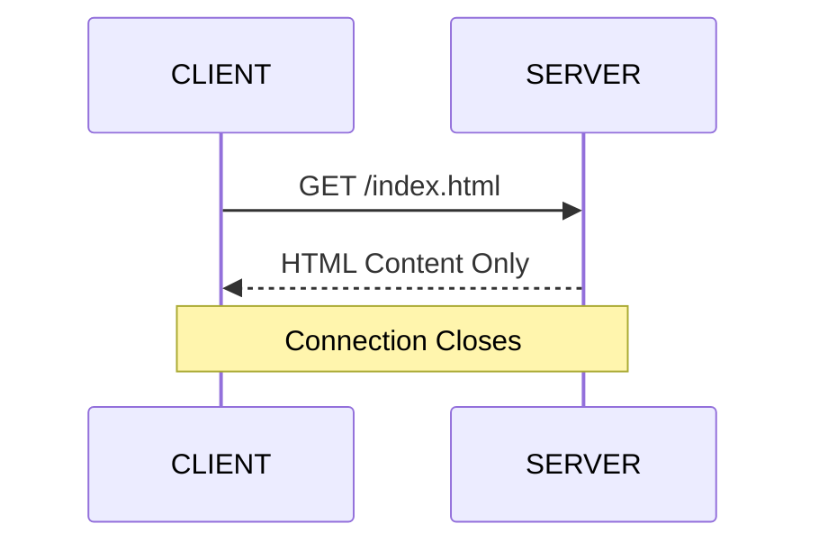

**Characteristics:**
- Only one request method: **GET**
- No headers (no metadata about the request)
- No status codes (just the HTML or nothing)
- No content types specified
- No way to request anything except HTML
- **Non-persistent:** Connection closes immediately after one request

**Why it existed:** HTTP/0.9 was a proof-of-concept. Extremely simple but practically useless for real web applications.

---

### HTTP/1.0: Adding Flexibility (1996)

**The first "usable" version.**

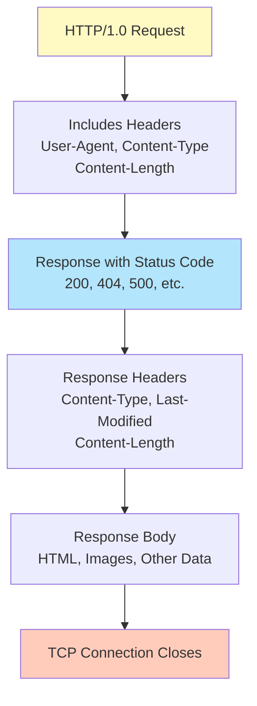

**Major additions:**
- **Multiple request methods:** GET, POST, HEAD, PUT, DELETE
- **Headers:** Metadata about request and response
- **Status codes:** 200 (success), 404 (not found), 500 (server error), etc.
- **Content types:** Specify what kind of data (HTML, image, JSON, etc.)
- **Non-persistent connections:** Still one request per connection

**The Response Time Problem:**

$$\text{Response Time} = 2 \cdot \text{RTT} + \text{File Transmission Time}$$

Where RTT = Round Trip Time (time for packet to go to server and back)

**Example breakdown for retrieving one HTML file:**
1. TCP handshake (SYN, SYN-ACK, ACK) = 1 RTT
2. Client sends HTTP request, server sends response = 1 RTT
3. Data transmission = transmission time

**If RTT = 50ms and file = 100KB at 10Mbps:**
- Overhead: 100ms
- Transmission: 80ms
- Total: ~180ms (overhead is significant!)

**Problem:** Websites need multiple resources (HTML, images, CSS, JavaScript). With HTTP/1.0, retrieving 10 resources requires 10 separate connections = 10 × (2 RTT + transmission time).

---

### HTTP/1.1: Persistent Connections (1997)

**Finally practical for real websites.**

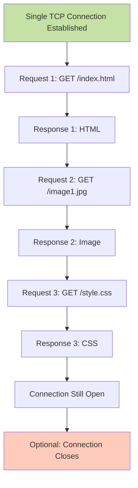

**Key innovation: Persistent Connections**

**Before HTTP/1.1:**
```
[Connection Open] → Request 1 → Response 1 → [Connection Close]
[Connection Open] → Request 2 → Response 2 → [Connection Close]
[Connection Open] → Request 3 → Response 3 → [Connection Close]
= 3 connections, 3 × 2 RTT overhead
```

**With HTTP/1.1:**
```
[Connection Open] → Request 1 → Response 1 → Request 2 → Response 2 → Request 3 → Response 3 → [Optional Close]
= 1 connection, 1 × 2 RTT overhead
```

**Massive improvement for multi-resource pages.**

#### HTTP Pipelining (Advanced Feature)

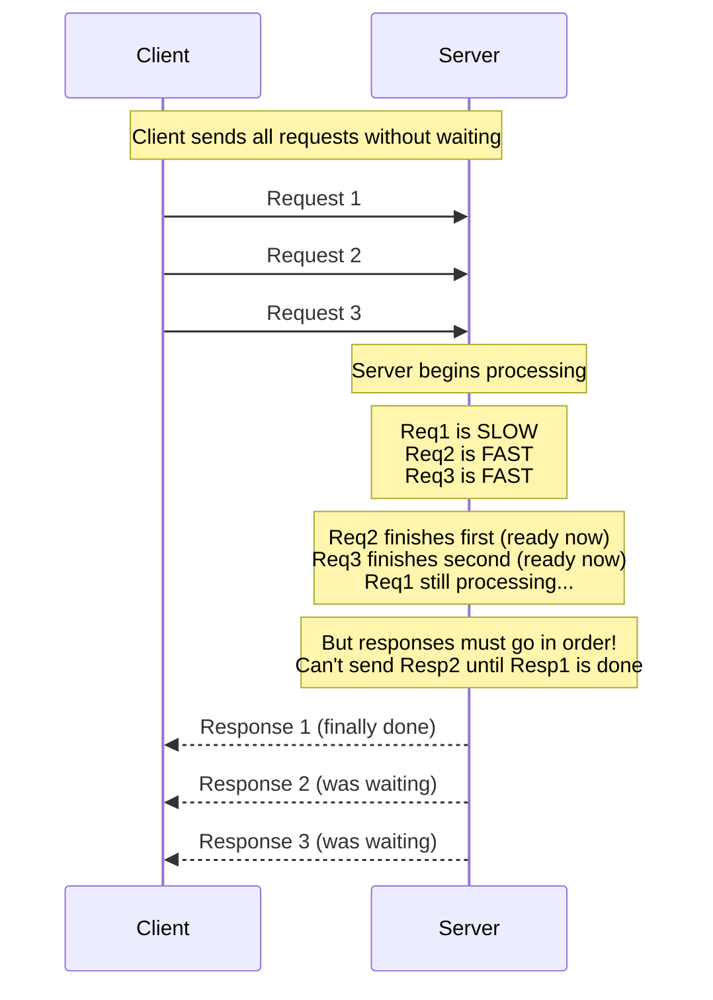

**Pipelining concept:** Client sends Request 1, Request 2, Request 3 without waiting for responses.

**The Problem: Head-of-Line (HOL) Blocking**

**Why can't the server just send Response 2 when it's ready?**
The key insight: **HTTP/1.1 responses are just anonymous bytes**. Without tags (like `Stream: 2`), the client reading sequentially from the connection can't tell which response belongs to which request.
HTTP/1.1 has no mechanism to tag responses with their request ID. The responses are just bytes flowing back:

```
Server sends to network:
[Response 1 bytes........................]
[Response 2 bytes............]
[Response 3 bytes.....]

Client reads from network sequentially:
Byte 1, Byte 2, Byte 3, ... (reading in order)
```

**The problem:** If Response 2 (small, fast) arrives before Response 1 (large, slow) finishes:

```
Without Response 1 finished:
Response 2 arrives: [Client reads it but says] "This doesn't match Request 1!"
Client is confused: Is this a response? To which request?
```

**Without tagging/framing, the client can't tell which response belongs to which request.**

The solution would be to say "Response 2 is for Request 2" but HTTP/1.1 has no syntax for that. Responses are just anonymous bytes in order.

**What should happen (ideal, but impossible in HTTP/1.1):**
```
Server:     Req1 [----slow----]
            Req2 [fast]
            Req3 [fast]
            
Responses:  Response 2 (ready at 20ms) → Send it!
            Response 3 (ready at 25ms) → Send it!
            Response 1 (ready at 50ms) → Send it!

But client reading sequentially gets:
[Response 2][Response 3][Response 1]
And has NO IDEA what order to match them to!
```

This is why **HTTP/2 invented stream IDs**: Tag each frame with `Stream: 1` or `Stream: 2` so responses can arrive in ANY order.

---

### HTTP/2: Multiplexing (2015)

**Solving HOL blocking at the application layer.**

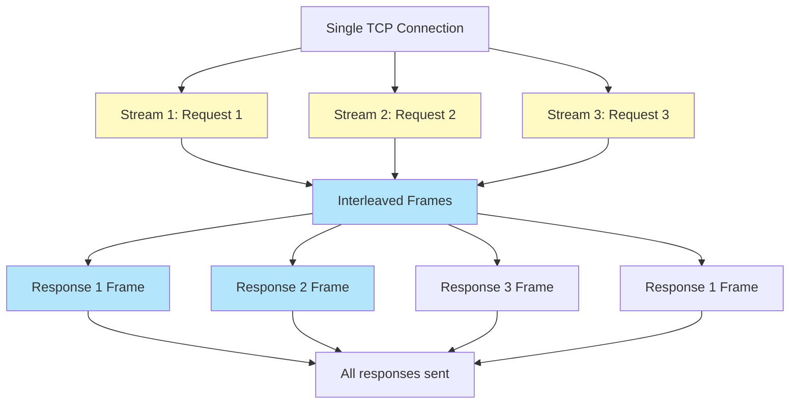

**Key innovation: Multiplexing with Frames and Stream IDs**

**The Problem HTTP/2 Solves:**

HTTP/1.1 responses are anonymous bytes. HTTP/2 adds **stream IDs** so responses can arrive in ANY order.

**HTTP/1.1 (What we learned):**
```
Server can't send Response 2 before Response 1 finishes
because the client won't know which response is which.
```

**HTTP/2 Solution: Tag each response with a stream ID**

Instead of anonymous bytes, HTTP/2 sends **frames** with headers:

```
Frame header: [Stream: 2, Type: DATA, Length: 1024]
Frame data:   [Response 2 content - 1024 bytes]

Frame header: [Stream: 1, Type: DATA, Length: 2048]
Frame data:   [Response 1 content - 2048 bytes]

Frame header: [Stream: 3, Type: DATA, Length: 512]
Frame data:   [Response 3 content - 512 bytes]

Frame header: [Stream: 1, Type: DATA, Length: 2048]
Frame data:   [Rest of Response 1]
```

**Now the client can read them in ANY order:**
- Frame arrives tagged `Stream: 2` → "This is for request 2"
- Frame arrives tagged `Stream: 1` → "This is for request 1"
- Frame arrives tagged `Stream: 3` → "This is for request 3"

**Real-world scenario:**

```
Request 1: GET /large-file.pdf (10MB, slow server processing)
Request 2: GET /style.css (50KB, fast server)
Request 3: GET /script.js (100KB, fast server)

Timeline:
Time 0ms:   Client sends all 3 requests
Time 5ms:   Server finishes Request 2, sends Frame[Stream:2, CSS data]
Time 10ms:  Server finishes Request 3, sends Frame[Stream:3, JS data]
Time 50ms:  Server finishes Request 1, sends Frame[Stream:1, PDF data...]

Client receives in this order:
[Stream:2, CSS] → Uses CSS immediately, doesn't wait for PDF
[Stream:3, JS]  → Uses JS immediately, doesn't wait for PDF
[Stream:1, PDF] → Uses PDF data

Result: Browser can start rendering CSS and loading JS while PDF is still downloading!
```

**Comparison with HTTP/1.1:**

```
HTTP/1.1:  [waits for Response 1] → [Response 2] → [Response 3]
           Time: 0ms --------------- 50ms -------- 60ms -------- 65ms

HTTP/2:    [Response 2] [Response 3] ... [Response 1]
           Time: 0ms ---- 5ms -------- 10ms ... 50ms
           (Reorder by stream ID and reassemble)
```

**How HTTP/2 eliminates Application-Layer HOL Blocking:**
- Streams are independent channels on one connection
- Each stream can transmit frames out of order
- Client reassembles based on Stream ID
- Server doesn't need to wait for one request to finish

**But TCP-level HOL blocking remains:**
- If one TCP packet is lost, all streams stall waiting for retransmission
- TCP doesn't know about streams; it only knows about byte order
- This is why HTTP/3 switches to UDP with QUIC

---

### HTTP/3: QUIC over UDP (2022)

**Eliminating TCP-level HOL blocking.**

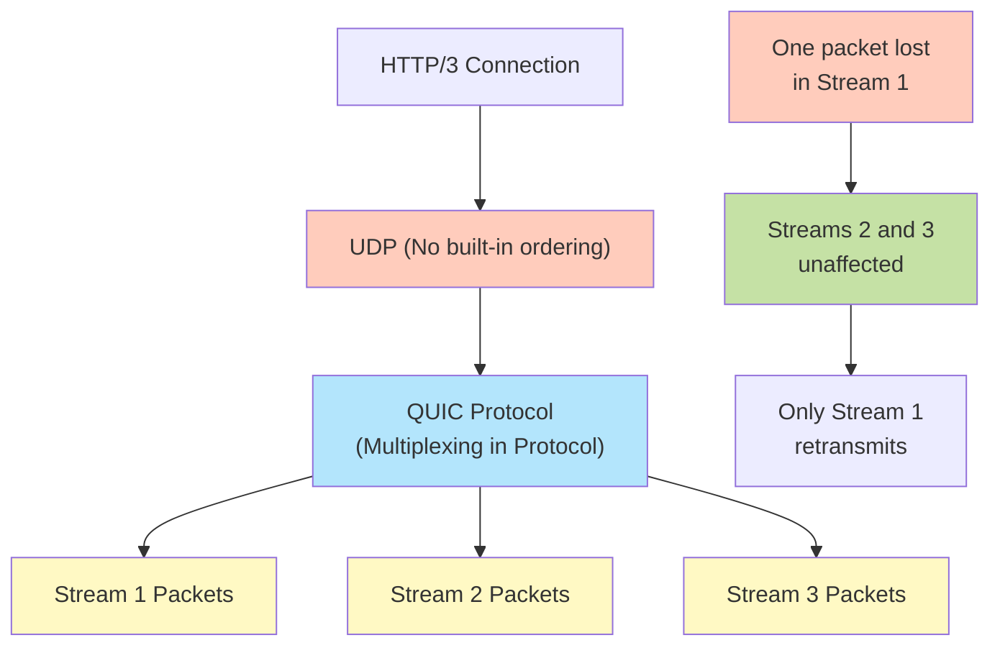

**The Problem with TCP (in HTTP/2):**
- TCP is connection-oriented and must maintain packet order
- One lost packet = all streams must wait for retransmission
- Example: You're downloading an image (Stream 1) and a webpage (Stream 2)
  - Packet 47 of image is lost
  - TCP must retransmit packet 47
  - Webpage cannot progress until packet 47 is received and processed

**HTTP/3 Solution: QUIC over UDP**
- UDP has no ordering requirement (connectionless)
- QUIC adds reliability **per-stream**, not globally
- Lost packet in Stream 1 only affects Stream 1
- Streams 2, 3, 4 continue uninterrupted

**Trade-offs:**
- [YES] Eliminates TCP HOL blocking
- [YES] Faster connection establishment (0-RTT resumption)
- [YES] Better for lossy networks (mobile)
- [NO] More complex protocol
- [NO] Not all networks support UDP QUIC yet

**Comparison of all versions:**

| Metric | HTTP/0.9 | HTTP/1.0 | HTTP/1.1 | HTTP/2 | HTTP/3 |
|--------|----------|----------|----------|--------|--------|
| Persistent connections | [NO] | [NO] | [YES] | [YES] | [YES] |
| Pipelining | [NO] | [NO] | [YES] | [NO] (solved by multiplexing) | [NO] (solved by multiplexing) |
| Multiplexing | N/A | N/A | N/A | [YES] (frames) | [YES] (QUIC streams) |
| TCP HOL blocking | N/A | N/A | [YES] | [YES] | [NO] |
| Connection type | TCP | TCP | TCP | TCP | UDP/QUIC |

---

## Part 4: Interaction Mechanics

### Request Methods (Verbs)

HTTP defines **methods** that describe what action the client wants to perform.

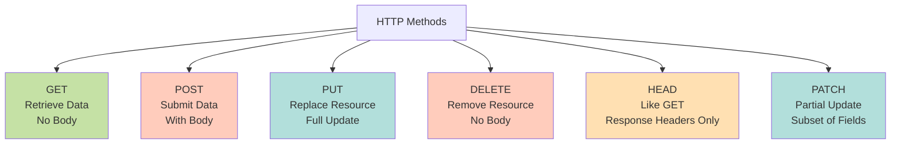

#### GET: Safe Read Operation

**Request:**
```http
GET /users/123 HTTP/1.1
Host: api.example.com
```

**Response:**
```http
HTTP/1.1 200 OK
Content-Type: application/json

{
  "id": 123,
  "name": "Alice",
  "email": "alice@example.com"
}
```

**Characteristics:**
- [YES] Should not modify server state (safe)
- [YES] Parameters in URL query string
- [NO] Request body typically empty
- [YES] Should be cacheable

#### POST: Submit Data for Processing

**Request:**
```http
POST /users HTTP/1.1
Host: api.example.com
Content-Type: application/json
Content-Length: 45

{
  "name": "Bob",
  "email": "bob@example.com"
}
```

**Response:**
```http
HTTP/1.1 201 Created
Location: /users/124
Content-Type: application/json

{
  "id": 124,
  "name": "Bob",
  "email": "bob@example.com"
}
```

**Characteristics:**
- [NO] Can modify server state
- [YES] Data in request body (not URL)
- [YES] Used for form submissions, file uploads, creating resources
- [NO] Not safe; not cacheable

#### PUT: Full Resource Replacement

**Request:**
```http
PUT /users/123 HTTP/1.1
Host: api.example.com
Content-Type: application/json

{
  "name": "Alice Updated",
  "email": "alice.new@example.com"
}
```

**Characteristics:**
- [NO] Modifies server state
- [YES] Idempotent (doing it twice = same result)
- [YES] Full replacement of resource
- [YES] Data in request body

#### DELETE: Remove Resource

**Request:**
```http
DELETE /users/123 HTTP/1.1
Host: api.example.com
```

**Response:**
```http
HTTP/1.1 204 No Content
```

**Characteristics:**
- [NO] Modifies server state
- [YES] Idempotent (deleting twice = deleted both times)
- [NO] No request body

#### HEAD: Get Headers Only

**Request:**
```http
HEAD /large-file.zip HTTP/1.1
Host: downloads.example.com
```

**Response:**
```http
HTTP/1.1 200 OK
Content-Type: application/zip
Content-Length: 1073741824
Last-Modified: Wed, 07 May 2026 10:00:00 GMT
```

[NO] No response body

**Use case:** Check if file exists, get file size before downloading, check if modified

---

### Status Codes (Feedback)

HTTP status codes tell the client what happened to their request.

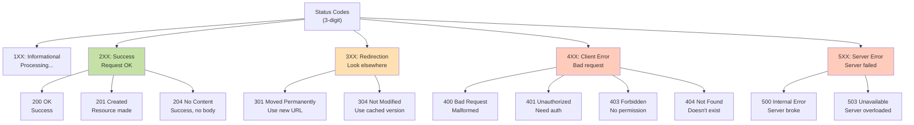

#### Common Status Codes

| Code | Meaning | Example |
|------|---------|---------|
| **200** | OK | GET request succeeded, returned data |
| **201** | Created | POST created new resource successfully |
| **204** | No Content | DELETE successful, nothing to return |
| **301** | Moved Permanently | Old URL no longer valid, use this new one |
| **304** | Not Modified | Resource hasn't changed since your last request |
| **400** | Bad Request | Client sent malformed request |
| **401** | Unauthorized | Need authentication (login) |
| **403** | Forbidden | Authenticated but not allowed |
| **404** | Not Found | Resource doesn't exist |
| **500** | Internal Server Error | Server code crashed |
| **503** | Service Unavailable | Server overloaded or down |

---

## Part 5: State, Performance & Security

### The Stateless Problem

**HTTP is fundamentally stateless:**

Each request is independent. The server doesn't remember previous requests.

```
Request 1: GET /login → Server processes → Response: "Login successful"
Request 2: GET /dashboard → Server has no memory → Response: "Who are you?"
```

**Problem:** How does a website know you're logged in across multiple pages?

**Solution: Cookies and Sessions**

### Cookies: Remembering Clients

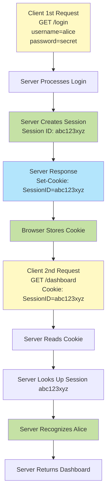

**How it works:**

1. **Login Request:** Client sends username and password
2. **Server Creates Session:** Server generates unique Session ID (e.g., `abc123xyz`)
3. **Set-Cookie Header:** Server sends `Set-Cookie: SessionID=abc123xyz` in response
4. **Browser Stores:** Browser automatically stores this cookie
5. **Future Requests:** Browser automatically includes `Cookie: SessionID=abc123xyz` with every request
6. **Server Validates:** Server looks up session ID, knows who the user is

**Token-based alternative (modern):**

Instead of session ID, server sends a signed **JWT (JSON Web Token)** that the client stores and includes with every request. Server doesn't store sessions, just validates the token signature.

**Why this works:**
- Stateless protocol becomes stateful through cookies
- Server doesn't memorize (stateless design)
- Client remembers (browser stores cookie)
- Security: cookies can be marked `HttpOnly` (JavaScript can't access), `Secure` (HTTPS only)

---

### Caching: Reducing Repeated Requests

**The Problem:** Websites have hundreds of resources. Downloading the same image, CSS, JavaScript repeatedly wastes bandwidth.

```
First visit to example.com: Download HTML + 50 images + CSS + JS = 5MB
Same browser, 1 hour later: Download same page = 5MB again [WASTEFUL]
```

**Solution: Browser Caching**

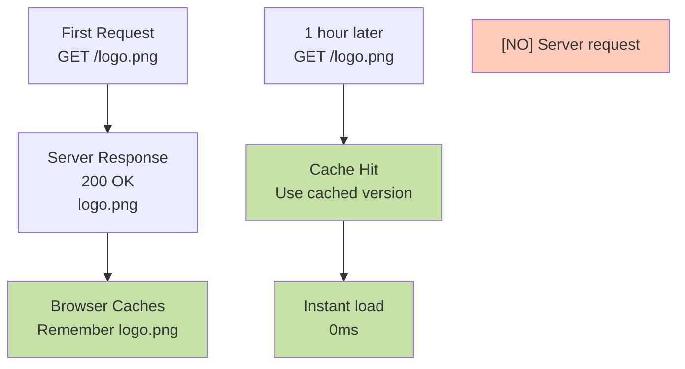

#### Cache Headers: How Server Controls Caching

**Server tells browser how long to cache:**

```http
GET /logo.png HTTP/1.1
```

**Response:**
```http
HTTP/1.1 200 OK
Cache-Control: max-age=3600
Last-Modified: Wed, 07 May 2026 10:00:00 GMT
ETag: "abc123"
```

**Meaning:**
- `max-age=3600`: Cache for 3600 seconds (1 hour)
- `Last-Modified`: When file was last changed
- `ETag`: Version identifier for the file

#### Conditional Requests: The Check Before Downloading

**After 1 hour, cache expires. Browser needs to check if file changed:**

```http
GET /logo.png HTTP/1.1
If-Modified-Since: Wed, 07 May 2026 10:00:00 GMT
```

**Scenario 1: File hasn't changed**

```http
HTTP/1.1 304 Not Modified
```

- [YES] No body sent
- [YES] File not re-downloaded
- [YES] Instant response

**Scenario 2: File has changed**

```http
HTTP/1.1 200 OK
Last-Modified: Wed, 07 May 2026 14:30:00 GMT

[new version of logo.png]
```

- [YES] New file sent (header + body)
- [YES] Browser updates cache

**Impact:**
- 304 responses save bandwidth (headers only, no body)
- 200 responses download new data only when changed
- Users get updated content while minimizing transfers

---

### HTTPS: Securing HTTP

**The Problem:** HTTP is unencrypted.

```
Plain HTTP traffic:
GET /bank/login
User-Agent: Firefox

Anyone listening on the network can read:
- Username you're sending
- Passwords
- Credit card numbers
- Private emails
```

**Solution: TLS/SSL Encryption**

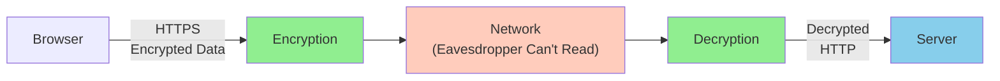

**HTTPS = HTTP + TLS (Transport Layer Security)**

**How TLS works (simplified):**

1. **Handshake:** Browser and server negotiate encryption method
2. **Certificate exchange:** Server proves its identity with a certificate
3. **Symmetric key:** Both generate shared secret key
4. **Encryption:** All data encrypted with shared key
5. **Decryption:** Both decrypt using shared key

**What TLS provides:**
- [YES] **Confidentiality:** No one can read data in transit
- [YES] **Authentication:** Server is actually google.com (not attacker)
- [YES] **Integrity:** Data can't be modified in transit

**Certificate:** Proves a domain is who they claim to be (issued by Certificate Authority like Let's Encrypt)

---

## Part 6: Complete Example—A Full HTTP Transaction

### Scenario: Logging Into Gmail

```
Step 1: Browser requests login page
─────────────────────────────────────

[CLIENT]
GET /accounts/login HTTP/1.1
Host: accounts.google.com
(HTTPS encrypted)

[SERVER]
HTTP/1.1 200 OK
Content-Type: text/html
Cache-Control: no-cache

[Login form HTML]
[Browser displays login page]

──────────────────────────────────────

Step 2: User enters credentials and submits form
──────────────────────────────────────

[CLIENT]
POST /accounts/authenticate HTTP/1.1
Host: accounts.google.com
Content-Type: application/x-www-form-urlencoded
Content-Length: 48

email=you@gmail.com&password=yoursecretpassword

(HTTPS encrypted)

──────────────────────────────────────

Step 3: Server validates and creates session
──────────────────────────────────────

[SERVER]
[Check password against database]
[Password matches!]
[Generate Session ID: sec_def_xyz_999]
[Store in session database]

HTTP/1.1 302 Found
Location: /mail/
Set-Cookie: SessionID=sec_def_xyz_999; HttpOnly; Secure; Max-Age=2592000

(Redirect to inbox)

──────────────────────────────────────

Step 4: Browser follows redirect
──────────────────────────────────────

[CLIENT sees 302 and Location header]
GET /mail/ HTTP/1.1
Host: mail.google.com
Cookie: SessionID=sec_def_xyz_999

(Note: Browser automatically includes cookie)

──────────────────────────────────────

Step 5: Server reads session, returns personalized page
──────────────────────────────────────

[SERVER]
[Read SessionID from request]
[Look up user: "You"]
[Fetch your emails]

HTTP/1.1 200 OK
Content-Type: text/html
Cache-Control: no-cache

[Your Gmail inbox HTML]

──────────────────────────────────────

Step 6: Browser loads images and resources
──────────────────────────────────────

[CLIENT]
GET /images/logo.png HTTP/1.1
Host: mail.google.com
Cookie: SessionID=sec_def_xyz_999
If-Modified-Since: Wed, 01 May 2026 10:00:00 GMT

[SERVER]
HTTP/1.1 304 Not Modified
Cache-Control: max-age=86400

[No body - use cached logo]

──────────────────────────────────────

Step 7: Gmail fully loaded
──────────────────────────────────────

[Browser has all resources, displays inbox with your emails]
```

**Key HTTP concepts visible in this example:**

1. **Persistent connection:** Multiple requests over one TCP connection
2. **Status codes:** 200 (success), 302 (redirect), 304 (not modified)
3. **Methods:** GET (fetch), POST (login)
4. **Cookies:** Browser maintains SessionID across requests
5. **Caching:** Logo uses cached version (304 response)
6. **Encryption:** All data is HTTPS encrypted
7. **Request/response cycle:** Each step = request → response

---

## Part 7: Why HTTP Matters (The "So What?")

### HTTP Enables the Modern Web

| Without HTTP | With HTTP |
|--------------|-----------|
| No standardized way to request resources | Anyone can request anything from anywhere |
| Each server uses different protocol | Servers and clients use same language |
| Can't browse websites | Browse and interact with websites |
| No security standard | HTTPS provides encryption |
| Impossible to cache or optimize | Browser caching reduces bandwidth |
| No way to remember users | Cookies enable stateful interactions |

### HTTP Teaches Protocol Design Principles

| Principle | How HTTP Uses It |
|-----------|-----------------|
| **Simplicity first** | HTTP/0.9 was incredibly simple; evolved complexity as needed |
| **Layering** | HTTP sits on top of TCP/IP; doesn't reinvent lower layers |
| **Stateless design** | Servers don't memorize; reduces server complexity |
| **Caching** | Local caching reduces upstream load dramatically |
| **Performance iteration** | HTTP versions show continuous optimization (HOL blocking fix) |
| **Security evolution** | HTTPS shows security built as protocol matured |

### Real-World Impact

1. **HTTP versions matter:** Mobile devices see dramatic improvements with HTTP/2 and HTTP/3
2. **Caching strategy is critical:** Websites tune Cache-Control headers to balance freshness and performance
3. **Status codes matter:** Search engines treat 404 differently from 410 (gone)
4. **Cookie security:** Cookies are major attack vector (session hijacking, CSRF attacks)
5. **HTTPS is now standard:** [YES] Even basic websites should use HTTPS
6. **API design:** Modern APIs are built on HTTP verbs (GET for read, POST for create, etc.)

---

## Part 8: Common Misconceptions

| Misconception | Reality |
|---------------|---------|
| **"HTTP is just for websites"** | HTTP is a general request-response protocol; APIs, mobile apps, IoT devices use it |
| **"HTTPS is for sensitive sites only"** | All sites should use HTTPS; browsers warn about non-HTTPS sites |
| **"Cookies are evil"** | Cookies are essential for authentication; problem is misuse (tracking) |
| **"HTTP/3 is faster than HTTP/2"** | HTTP/3 removes HOL blocking which helps in specific conditions; not always faster |
| **"Caching is always good"** | Caching can hide failures; requires careful TTL tuning |
| **"Status codes are optional"** | Correct status codes critical for SEO, debugging, and client behavior |
| **"GET and POST are interchangeable"** | [NO] GET should be safe (read-only); POST modifies state |
| **"Sessions and cookies are the same"** | Cookies are the transport mechanism; sessions are server-side data |
| **"404 means the server is broken"** | 404 means resource doesn't exist (correct response) |

---

## Part 9: Verification Questions (Test Understanding)

### Conceptual

1. **"Why is HTTP called stateless if my website remembers me after I log in?"**
   - Expected answer: Server doesn't memorize; browser stores cookie and sends it with every request

2. **"What problem did HTTP/2 solve that HTTP/1.1 couldn't?"**
   - Expected answer: Application-layer HOL blocking; HTTP/2 can interleave responses from multiple requests

3. **"Why does a 304 response save bandwidth?"**
   - Expected answer: No body is sent; browser uses cached version instead

### Mechanics

4. **"In the Gmail login example, why did the server send a 302 redirect instead of a 200 with content?"**
   - Expected answer: To redirect browser to /mail/ so the next request includes the session cookie

5. **"What happens if you use GET to submit a password?"**
   - Expected answer: Password appears in URL, query string, browser history, logs (security risk)

6. **"Why does HTTP/3 use UDP instead of TCP?"**
   - Expected answer: UDP doesn't enforce global packet ordering; streams managed independently by QUIC

### Practical

7. **"A website sets Cache-Control: max-age=0. What does this mean?"**
   - Expected answer: Don't cache; always check with server if resource is current

8. **"What does the `If-Modified-Since` header do?"**
   - Expected answer: Tells server to only send body if resource changed; otherwise 304 Not Modified

9. **"Why is HTTPS important even for sites without login?"**
   - Expected answer: Prevents eavesdropping, protects against man-in-the-middle attacks

10. **"In HTTP/1.1 with pipelining, why doesn't the client get faster response to Request 2 if server processes it quickly?"**
    - Expected answer: Server must respond in order; even if Request 2 is done, it waits for Response 1

---

## Teaching Progression Roadmap

1. ✅ **Start:** The problem (why standardized protocol?)
2. ✅ **Build:** URL structure (how to request specific resources)
3. ✅ **Introduce:** Client-server model (basic request-response)
4. ✅ **Evolve:** HTTP versions (0.9 → 1.0 → 1.1 → 2 → 3)
5. ✅ **Show:** Response time formula (why 2 RTT matters)
6. ✅ **Explain:** HOL blocking problem and solutions
7. ✅ **Mechanics:** Request methods (GET, POST, PUT, DELETE)
8. ✅ **Mechanics:** Status codes (200, 404, 500, etc.)
9. ✅ **Solve:** Statelessness with cookies and sessions
10. ✅ **Optimize:** Caching and conditional requests
11. ✅ **Secure:** HTTPS and TLS
12. ✅ **Verify:** Ask questions to check understanding

---

## Quick Reference: HTTP Request/Response Format

### Request Format

```http
GET /search?q=http HTTP/1.1
Host: www.google.com
User-Agent: Mozilla/5.0
Accept: text/html
Connection: keep-alive

[optional body for POST/PUT]
```

**Parts:**
- **Method:** GET, POST, PUT, DELETE, HEAD, etc.
- **Path:** /search?q=http
- **Version:** HTTP/1.1
- **Headers:** Metadata about request
- **Body:** Only for POST, PUT (optional)

### Response Format

```http
HTTP/1.1 200 OK
Content-Type: text/html
Content-Length: 1234
Cache-Control: max-age=3600
Set-Cookie: SessionID=abc123

<html>
...response body...
</html>
```

**Parts:**
- **Status line:** HTTP/1.1 200 OK
- **Status code:** 200 (success)
- **Headers:** Metadata about response
- **Body:** The actual content (HTML, JSON, image bytes, etc.)

---

## Key Takeaway

HTTP is the **standardized language** the web uses to request and deliver resources. Its evolution (0.9 → 1.0 → 1.1 → 2 → 3) shows how protocols improve through:

1. **Adding capabilities** (headers, status codes, methods)
2. **Fixing performance problems** (persistent connections, multiplexing, HOL blocking)
3. **Improving security** (HTTPS becomes standard)
4. **Maintaining simplicity** (still fundamentally request-response)

Understanding HTTP means understanding how browsers communicate with servers, why certain design choices matter, and how performance optimization actually works.
